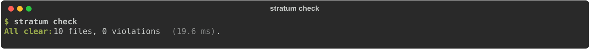

# :material-layers-triple: Introduction

Inwards is an architecture linter for Python. You write down how your codebase is layered, and `inwards check` fails the moment an import crosses a line it shouldn't. It's built to sit inside the edit loop of AI coding agents like Claude Code, Aider and Copilot, because an agent can write a week's worth of imports in an afternoon and nobody reads all of them.

This chapter covers the problem, what Inwards does about it, and how the rest of the docs are organised.

## The problem: agents write code faster than anyone can review its shape

Ask an agent to "add a discount to orders" and it will do it. It may also reach for the SQLAlchemy session from inside your domain model, because the session is right there and the tests pass. The usual toolchain doesn't object:

- Ruff checks style and bug patterns inside a file. Its `banned-api` setting can forbid a module everywhere, but it has no notion of "allowed from here, forbidden from there".
- ty and mypy check types. A domain entity that imports an ORM table type-checks fine.
- Tests check behaviour. The behaviour is correct.
- Human review would catch it, but the agent produced 40 files in ten minutes and the reviewer is skimming.

The result is a codebase whose diagrams say "hexagonal" while the imports say "big ball of mud", one small shortcut at a time.

Agents add two failure modes of their own. They hallucinate: `from shop.domain.pricing import DiscountPolicy` looks plausible even when `pricing` doesn't exist. And when a check complains, they route around it by moving the import into a function body or behind `if TYPE_CHECKING:`. A guardrail for agents has to catch both.

!!! abstract "The bet behind Inwards"
    Agents satisfy the constraints they can see and run, and they ignore the ones that only live in a wiki page. Architecture rules usually live in the wiki. Chapter 2 turns this into a testable hypothesis.

Python already has architecture checkers, import-linter and pytest-archon above all. [Chapter 2](02-Business-Context.md#other-tools-in-this-space) compares them in detail. In short, none of them was designed to run after every agent edit and tell the agent how to repair the damage.

## What Inwards does

Inwards turns those wiki rules into a check that runs in milliseconds and talks back in a format an agent can act on.

```toml title="pyproject.toml"
[tool.inwards]
root = "src"
required-version = "0.1.0"  # oldest Inwards allowed; `inwards init` sets it
ignore = ["tests", "scripts", "migrations", "conftest"]  # tooling outside the layers; `inwards init` sets it
generated = ["*_pb2", "*_pb2_grpc", "_version"]  # modules a build step writes; this list is the default (optional)
escalate-after = 3  # attempts at one violation before the agent is told to ask you (optional)
run-log = false  # local log of hook runs, see the Run log chapter (optional)
stop-gate = "changed"  # "project" makes the Claude Code Stop gate check the whole project (optional)
layers = [
  { name = "domain",         modules = ["shop.domain"] },
  { name = "application",    modules = ["shop.application"] },
  { name = "infrastructure", modules = ["shop.infrastructure"] },
  { name = "interface",      modules = ["shop.api"] },
]
```

Every key is described in the [configuration reference](guides/configuration.md), which also links a JSON Schema for completion and checking in the editor.

<figure markdown="span">
  { loading=lazy }
  <figcaption>The example app as shipped: every import points inward.</figcaption>
</figure>

Layers are listed innermost first. A module may import its own layer and anything listed before it. `required-version` makes an older binary (or a shim that isn't Inwards) fail with exit 2 instead of checking the project with rules it may not know. Code outside every layer isn't checked, so INW006 makes that gap visible: importing first-party code that belongs to no layer from a layer is an error (so is importing from the package above the layers, whose `__init__.py` no layer owns), a package outside every layer (unless `ignore` names it) gets a warning, and a prefix that matches no module is reported against `pyproject.toml`. `ignore` entries match whole name segments anywhere, so `migrations` covers `shop.orders.migrations`. Unknown keys and a prefix listed in two layers are config errors (exit 2). Warnings don't change the exit code. When the domain imports infrastructure, you get this (abridged, one diagnostic out of the `diagnostics` array):

```json
{
  "code": "INW001",
  "file": "clean-app/shop/domain/order.py",
  "line": 14,
  "message": "Layer \"domain\" imports \"shop.infrastructure.sql_orders.SqlOrderRepository\" from outer layer \"infrastructure\".",
  "fix": {
    "summary": "Depend on an abstraction owned by \"domain\" instead of ...",
    "steps": [
      "Delete `from shop.infrastructure.sql_orders import SqlOrderRepository`. Do not move the import into a function or behind TYPE_CHECKING; Inwards checks those too.",
      "Declare a typing.Protocol in `shop.domain` (for example `shop.domain.ports`) ...",
      "Type this module against that Protocol and receive the implementation through a constructor ...",
      "Make the class in \"infrastructure\" satisfy the Protocol, and wire it in the composition root."
    ]
  }
}
```

The diagnostic comes from the working scaffold in this repository, run on a copy of `examples/clean-app` with one bad import added. Long strings are cut with `...` here. The real output has them in full.

To phase rules in, a `[tool.inwards.rules]` table sets which rules report and how loudly:

<!-- config: fragment -->

```toml title="pyproject.toml"
[tool.inwards.rules]
ignore = ["INW007", "INW008"]      # these rules never report (optional)
severity = { INW005 = "warning" }  # reported, but doesn't fail a check or block the agent (optional)
# select = ["INW001", "INW011"]    # or: only these rules report (default: every rule)
```

Codes are exact, not prefixes, and an unknown code is a config error (exit 2). `ignore` wins over `select`. INW000 always reports as an error, because a file whose declared encoding can hide imports isn't checked at all, and the Stop gate's check that no layer was moved away during the session ignores the table too. `inwards check`, the hooks, the Stop gate and the VS Code extension all apply the table; the extension reads it again whenever `pyproject.toml` changes, and shows a config error (an unknown code, say) on `pyproject.toml`. It is part of `[tool.inwards]`, so the config guard stops an agent from changing it. [ADR-027](05-ADR.md#adr-027-per-rule-select-ignore-and-severity-in-a-toolinwardsrules-table) covers the baseline and SARIF.

`generated` lists modules that a build step writes, such as protoc's `orders_pb2` or the `_version` module setuptools-scm writes. A developer's checkout has them and a fresh CI checkout doesn't, so INW010 doesn't report an import of one that isn't on disk. Patterns match whole name segments anywhere, as `ignore` does, and a segment may use `*` and `?`: `*_pb2` covers `shop.api.orders_pb2`, and `shop.gen` covers everything under `shop/gen/`. Without the key the list is `["*_pb2", "*_pb2_grpc", "_version"]`; setting it replaces that list, and `generated = []` turns it off. A bracket set or a pattern made only of wildcards is a config error. [GitHub Actions](guides/ci.md#generated-modules) and [ADR-029](05-ADR.md#adr-029-generated-modules-pass-inw010-protoc-and-version-modules-by-default) have the details.

To accept one import for good, put a suppression on its line, with the rule's code and a reason:

```python title="shop/domain/order.py"
from shop.infrastructure.legacy import LegacyClient  # inwards: ignore[INW001] reason="old billing adapter, removed in #210"
```

The comment goes on the line the finding points at: for a parenthesised import, the imported name's line; for a dynamic import spread over several lines, the call's first line:

```python title="shop/domain/plugins.py"
importlib.import_module(  # inwards: ignore[INW011] reason="plugin loader, reviewed in #230"
    "shop.infrastructure.plugins",
)
```

A suppression with no reason, an unknown code or a malformed comment hides nothing and is reported as INW009, and so, as a warning, is one that matches no finding on its line. Every output format counts suppressed findings, and SARIF lists them as suppressed results. The Claude Code hooks ignore a suppression that wasn't in the file when the session started, so an agent can't silence a violation with a comment; `agent-suppressions = "allow"` in `[tool.inwards]` lets them count. [ADR-028](05-ADR.md#adr-028-inline-suppressions-need-a-reason-and-an-agent-cant-add-one-by-default) has the details.

<div class="grid cards" markdown>

-   :material-lightning-bolt:{ .lg .middle } __Fast enough for every edit__

    ---

    One file checks in under 50 ms at the median, process start included ([measured](06-Constraints-and-Quality.md#measurements)), so it can run after every agent edit.

-   :material-robot-outline:{ .lg .middle } __Written for agents__

    ---

    Every violation carries numbered repair steps. It also catches the usual dodges, like imports hidden in functions or `TYPE_CHECKING` blocks.

-   :material-package-variant-closed:{ .lg .middle } __One binary, no Python needed__

    ---

    A single executable compiled with Bun. Drop it in CI, a pre-commit hook or an agent hook, or add it with `uv add --dev` as a platform wheel with the binary inside.

-   :material-microsoft-visual-studio-code:{ .lg .middle } __Same rules in the editor__

    ---

    The VS Code extension runs the same engine through LSP, so the squiggle and the CI failure never disagree.

</div>

## What Inwards is not

It is not a general linter, a type checker or a formatter. Keep Ruff and ty. By default Inwards only reasons about the dependency structure between your own modules (opt-in rule families such as [FastAPI](rules/index.md#fastapi) go further, [ADR-037](05-ADR.md#adr-037-framework-rule-families-opt-in-with-their-own-prefix)), and it assumes you already know what architecture you want. It won't invent one for you.

## How these docs are organised

The structure follows C4 for the architecture and plain ADRs for decisions.

| Chapter | Read it if you want to know |
|---|---|
| [Getting started](guides/install.md) | How to install Inwards and wire it into Claude Code, Aider or `AGENTS.md` |
| [2. Business context](02-Business-Context.md) | Who else is in this space, why Inwards should exist, and the hypothesis we're testing |
| [3. Architecture (C4)](03-Architecture-C4.md) | Context, containers and components, with diagrams |
| [4. AI integration](04-AI-Integration.md) | How Inwards plugs into Claude Code, Aider, Copilot and friends |
| [5. Decisions (ADR)](05-ADR.md) | Why TypeScript, why WASM tree-sitter, why Bun, and what we gave up |
| [6. Constraints and quality](06-Constraints-and-Quality.md) | Performance budgets, measurements, risks |
| [7. Glossary](07-Glossary.md) | The vocabulary, from "port" to "import skeleton" |
| [8. Run log](08-Run-Log.md) | The opt-in local log design partners use to measure the hypothesis |

!!! info "Status"
    Pre-alpha.
    Eight rules work end to end in the CLI, the engine and the VS Code server: INW001 (layer direction), INW011 (dynamic imports), INW005 ([libraries per layer](guides/libraries.md): no frameworks or I/O in the domain by default), INW006 (code outside every layer, dead prefixes), INW010 (imports of first-party modules that don't exist), INW007 and INW008 ([package shape](guides/package-shape.md): allowed, forbidden and required members) and INW000 (a declared source encoding that could hide imports).
    `inwards init --agent claude` installs the Claude Code hooks: a check after each edit, a Stop gate over what the session changed, a config guard, and escalation to the user. For Aider, `init` prints the `lint-cmd` line to add; for other agents it writes an `AGENTS.md` section. On a new project, `inwards init --style layered|clean|hexagonal` writes the layers, and `--scaffold` adds an example package that passes the check.
    Each release is a GitHub Release with binaries for six platforms, five platform wheels and a `.vsix`. The only one so far is the pre-release v0.1.0-rc.1.
    Everything marked :material-progress-clock: in these docs is planned, not built.
