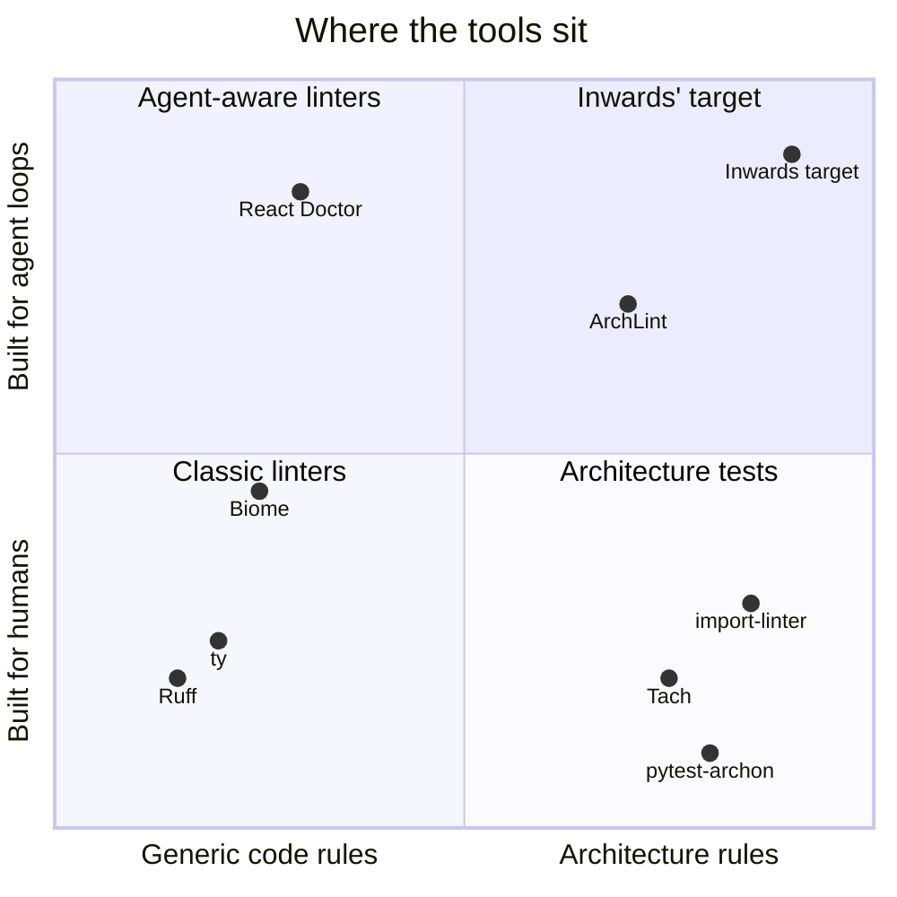
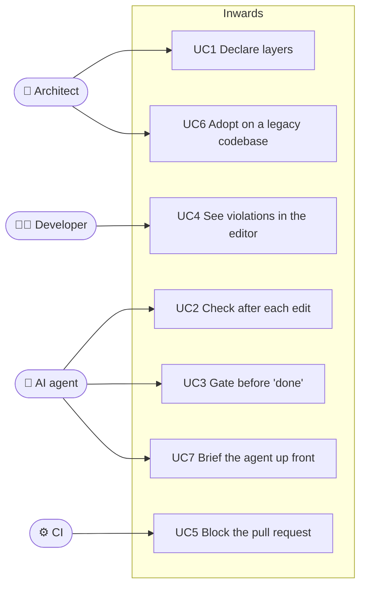

# :material-chart-timeline-variant: Business context

This chapter looks at who else is in this space, what their designs teach us, and where the gap is. It ends with the hypothesis Inwards has to prove, plus the actors and use cases that follow from it.

All facts about other tools were checked against their docs, changelogs and registries on 2026-09-25. Links are at the bottom.

## Other tools in this space

Two groups of tools matter here. Fast general linters set the performance bar and the distribution model users expect. Architecture checkers are the direct competition.

### Fast linters and checkers

=== ":simple-ruff: Ruff"

    Astral's Rust linter and formatter: 900+ rules, 413 on by default since v0.16. Since v0.4 it has used a hand-written recursive-descent parser, which is over 2x faster than the LALRPOP one it replaced. The rest of the speed comes from Rust, a per-file cache (`.ruff_cache`) and parallel file processing. It ships as PyPI wheels that contain the Rust binary, which is why `uv add --dev ruff` just works.

    **Architecture support:** `flake8-tidy-imports` offers `banned-api` with custom messages and `banned-module-level-imports`. `ruff analyze graph` prints a JSON file-to-dependencies map built on ty's module resolver, but nothing checks rules against that graph.

    **AI angle:** no agent-specific features. It supports many output formats, SARIF included, though an open issue (#19962) notes that the SARIF leaves out autofix data. OpenAI announced on 2026-03-19 that it will acquire Astral to integrate its tools with Codex. We could not confirm whether the deal has closed.

=== ":material-check-decagram: ty"

    Astral's type checker and language server, in beta since 2025-12-16 and still at 0.0.x. It is built for incremental re-checks. Astral quotes 4.7 ms to re-check after an edit in PyTorch against Pyright's 386 ms, and a cold run on home-assistant of 2.19 s against Pyright's 19.62 s.

    **Architecture support:** none. But ty already has the two hard ingredients, a module resolver and an incremental dependency graph. It is the most likely future home for architecture rules in the Astral stack.

=== ":material-language-typescript: Biome"

    Rust toolchain for JS, TS, CSS, GraphQL and HTML, with an internal design borrowed from rust-analyzer. Version 2 added a project scanner for multi-file rules, type inference without `tsc`, and GritQL plugins. Version 2.5 (2026-06) added plugin code fixes, `--watch`, and a `concise` reporter pitched as token-efficient for coding agents.

    **Architecture support:** `noImportCycles`, `noPrivateImports` and `noRestrictedImports`. Its own docs call `noImportCycles` "computationally expensive". There is no layer model.

    **Lesson for us:** Biome is the first mainstream linter to design an output format for agents. Its token-efficiency argument applies directly to Inwards.

=== ":material-stethoscope: React Doctor"

    A TypeScript CLI from Million (`millionco/react-doctor`), about 14.9k GitHub stars. It runs 100+ React rules through an oxlint plugin and rolls lint, maintainability and supply-chain findings into a 0 to 100 score. Its tagline is "Your agent writes bad React. This catches it."

    **AI angle:** the most agent-native tool on this list. `npx react-doctor install` detects Claude Code, Cursor, Codex and OpenCode and installs a skill that teaches the rules. An opt-in `--agent-hooks` flag adds native hooks that run after the agent edits files, so the agent corrects itself mid-session. It also has a diff mode, a staged-files pre-commit hook and JSON/JSONL output.

    **Lesson for us:** React Doctor is the go-to-market template to copy: one install command, skill plus hook, diff-only mode. It has no dependency or architecture model.

### Architecture checkers

=== ":material-link-lock: import-linter + grimp"

    The Python incumbent. Contracts come in several types: `forbidden`, `protected`, `layers`, `independence`, `acyclic-siblings` and custom. Its graph library, grimp, has moved its hot paths to Rust step by step: the graph (3.6), import parsing (3.9) and multithreaded scanning with an on-disk cache (3.11). Version 2.14 (2026-08) added `broken_contract_guidance`, a per-contract "how to fix" text.

    **Gap:** it's a Python package that runs inside your project's environment. There's no SARIF or JSON output, no editor integration and no agent hooks in the release notes. The fix guidance is a static string per contract, written by a human, not generated per violation.

=== ":material-test-tube: pytest-archon"

    An ArchUnit-style fluent API used inside pytest: `archrule("x").match("app.domain*").should_not_import("app.infra*").check("app")`. Transitive checks are on by default. It can skip `TYPE_CHECKING` imports or look only at top-level ones.

    **How it works:** we read the source. It runs pure-Python `ast.parse` over `Path.glob("**/*.py")` on one thread. The only cache is an in-process `lru_cache`, and it locates packages with `importlib.util.find_spec`, so the code must be importable in the test environment.

    **Gap:** slow and serial, output is assertion text, no editor, no SARIF. Small project (about 91 stars, last release 2025-09).

=== ":material-source-branch: Tach"

    Rust core covering module boundaries, public interfaces, layers, acyclicity and deprecation. Gauge stopped maintaining it in 2025. The repo moved to `tach-org`, and the 2026 releases are maintenance only (0.35.1 was a GitPython security bump). `tach show` and `upload` depend on a closed API.

    **Gap:** it proved the demand and then lost its sponsor. Teams that adopted it need somewhere to go.

=== ":material-graph-outline: Others"

    dependency-cruiser (JS/TS), ArchUnit (Java) and eslint-plugin-boundaries show that "architecture as lint rules" is an established idea in other ecosystems. ArchLint (`npx archlint-ai`) checks import boundaries on git diffs for agents, but only for JS/TS. We found several prose-only "clean architecture" skills for Claude Code. They are advice the agent may or may not follow, with nothing enforcing it.

### Side by side

| | Python | Layer model | Needs your project's Python env | Repair guidance | Agent hooks | SARIF | Editor |
|---|:-:|:-:|:-:|---|:-:|:-:|:-:|
| Ruff | :white_check_mark: | :x: | no (binary in a wheel) | autofix for code rules | :x: | :white_check_mark: | :white_check_mark: |
| ty | :white_check_mark: | :x: | no (binary in a wheel) | n/a | :x: | :x: | :white_check_mark: |
| Biome | :x: | :x: | no (binary) | autofix, plugin fixes | :x: | :white_check_mark: | :white_check_mark: |
| React Doctor | :x: | :x: | Node via `npx` | rules taught through an agent skill | :white_check_mark: | :x: | :x: |
| import-linter | :white_check_mark: | :white_check_mark: | yes | static text per contract | :x: | :x: | :x: |
| pytest-archon | :white_check_mark: | :white_check_mark: | yes (code must import) | :x: | :x: | :x: | :x: |
| Tach | :white_check_mark: | :white_check_mark: | yes (pip package, Rust extension) | :x: | :x: | :x: | ? |
| **Inwards** (target) | :white_check_mark: | :white_check_mark: | no (binary in a wheel, or a single binary) | steps generated per violation | :white_check_mark: | :white_check_mark: | :white_check_mark: |

`?` means we couldn't verify it. "Repair guidance" is about telling the reader what to change. Autofix, where the tool rewrites the code itself, is a stronger form of it.

## What the competition teaches

1. Users now expect a linter to feel instant. Ruff and ty set that bar, and even import-linter moved its core to Rust to keep up.
2. How a tool installs matters as much as what it checks. A binary inside a wheel (Ruff, ty) is easier to adopt than a package that must live in your project's venv (import-linter, pytest-archon). You shouldn't have to make your app importable just to lint it.
3. For an agent loop, re-check time matters more than cold-run time. ty's 4.7 ms re-check is the number that counts there.
4. Agent integration is its own product surface. React Doctor ships an installer, a skill and hooks, and Biome ships a token-lean reporter. None of that is a lint rule. It's all about how the finding reaches the model.
5. Fix guidance is starting to appear. import-linter's `broken_contract_guidance` shows users asking "tell me how to fix it", but no tool builds the guidance from the specific import that failed.

## Positioning

The coordinates are our qualitative reading of the research above, not a measurement. Inwards' dot marks where it's aiming, not where it is today.

Inwards' position in one sentence: **import-linter's rules, React Doctor's agent integration, Ruff's distribution.**

### :material-target-account: Who it's for first

The beachhead is Python backend teams (FastAPI, Django, Flask services) that have an explicit layered, hexagonal or DDD design and let agents write a large share of their code. A second, smaller group: teams on Tach who need a maintained replacement. Libraries, notebooks and scripts-only repos are out of scope, because they rarely have layers worth enforcing.

## The hypothesis

Each part below has a number attached and a condition that would make us drop it. The thresholds are opening bets, and we'll recalibrate them after the first design partner.

### :material-briefcase-outline: Business hypothesis

> Teams that let AI agents write Python and care about a layered architecture will adopt a deterministic architecture guardrail if it installs with one command, adds no noticeable latency to the agent loop, and gives fix instructions the agent resolves on its own.

| We believe | We'll know it's true when | We'll drop or rethink it if |
|---|---|---|
| Agents break layering often enough to hurt | In 5 design-partner repos, Inwards finds at least one real violation per 1,000 agent-written lines | Violations are rare after the first cleanup |
| The fix steps work for models | ≥ 80 % of violations are fixed by the agent within one retry, without a human | < 50 % fixed on the first retry |
| Hooks are the channel that matters | ≥ 60 % of active installs have an agent hook enabled | People only run it in CI, where import-linter already serves them |
| Speed is the moat against import-linter | Median hook run < 100 ms on design-partner repos | grimp's Rust core closes the gap and import-linter ships JSON and hooks |
| There's room next to Astral | Inwards is adopted alongside Ruff and ty, not instead of them | ty or Ruff ships layer contracts. It already has the resolver and the graph, and the OpenAI deal gives it a Codex channel |

**First data.** The M0 agent eval (`eval/README.md`) ran 5 fixtures once each on Sonnet and Haiku. Both violations an agent introduced were fixed after exactly one hook block, and in both the agent's first attempt hid the import inside a function, which Inwards reads anyway. That is far too small a sample to settle the ≥ 80 % bet. It also showed that agents leave violations that were already in a file alone (0 of 6 fixed, 5 of 6 reported as pre-existing). That is why the Stop gate added in M1 checks only the files a session changed, so old violations elsewhere don't block the agent. Inside a file the agent edits, old and new violations are still reported alike; the baseline (UC6, [#33](https://github.com/SirCypkowskyy/inwards/issues/33)) is meant to separate them.

**How we'll measure.** With the [run log](08-Run-Log.md) on, every hook run and `inwards check --log` appends one JSON line to `.inwards/runs.jsonl`: the files checked, the lines each edit added and removed, a fingerprint per violation, the exit code and the duration. The log stays local and is off by default. Design partners share it by choice. "Fixed within one retry" means a fingerprint reported for a file is gone on the next hook run for that file. "Agent-written lines" come from the hook's own edit events, so we never guess authorship from git. Hook adoption (the share of active installs with an agent hook) can't be measured from inside one project, so it is partner-reported, not measured.

**Business model: open question.** The CLI, engine and editor extension are meant to be open source. Whether anything is ever paid for (a hosted drift dashboard, curated rule packs for common architectures) isn't decided. It depends on the adoption numbers above, so it stays out of scope for now.

### :material-cog-outline: Technical hypothesis

> A TypeScript engine on WASM tree-sitter, shipped as a Bun single-file binary, can meet the agent-loop budget (< 100 ms p95 per edited file, process start included) without Rust. The reason: architecture rules need only the **import skeleton** of a file, not its full syntax tree.

Our own measurements (details in [chapter 6](06-Constraints-and-Quality.md#measurements)) already support part of this:

- Parsing whole files with WASM tree-sitter costs about 1.3 MB/s on one core. On a synthetic 496k-line repo a naive full run took **7.5 s**. That kills the naive design.
- Parsing only the import skeleton brought the same run down to **0.63 to 1.17 s**, still on one core.
- A single-file check, which is what an agent hook runs, takes **under 50 ms** at the median and 80 ms at p95, process start included. About 20 ms of that is the engine.

The hypothesis fails if real-world repos (not synthetic ones) push the single-file p95 over 100 ms, or if the cross-file rules we need later (cycles, bounded-context independence) can't reuse a cached graph and force full-repo parses on every edit.

## Actors

| | Actor | What they want from Inwards |
|---|---|---|
| :material-account-hard-hat: | **Architect / tech lead** | Write the architecture once, as config, and trust that it holds |
| :material-account: | **Developer** | Hear about a violation while typing, not in code review |
| :material-robot: | **AI coding agent** (Claude Code, Aider, Copilot, Codex, Cursor) | A fast, unambiguous signal after each edit, with steps it can follow |
| :material-account-eye: | **Reviewer** | Spend review time on logic, not on spotting a stray import |
| :material-cog-sync: | **CI system** (GitHub Actions) | A deterministic pass/fail and a SARIF file for code scanning |

## Use cases

| ID | Use case | Trigger | Outcome | Status |
|---|---|---|---|---|
| UC1 | Declare layers | Architect edits `[tool.inwards]` | Config validates, and errors name the offending key | :white_check_mark: |
| UC2 | Check after each edit | Agent writes a `.py` file; the PostToolUse hook `inwards init --agent claude` installed checks that file | Violations go back to the agent with fix steps within 100 ms | :white_check_mark: |
| UC3 | Gate before "done" | Agent tries to finish; the Stop gate checks every file the session changed, however it changed | The agent can't declare victory with a violation it introduced, and a legacy repo's old violations don't block it | :white_check_mark: |
| UC4 | See violations in the editor | Developer types | Squiggle with the same message and code as the CLI | :white_check_mark: `.vsix` on each release, :material-progress-clock: Marketplace |
| UC5 | Block the pull request | CI runs `inwards check --format sarif` | Failing check plus annotations in GitHub code scanning | :white_check_mark: output, :material-progress-clock: workflow template ([#38](https://github.com/SirCypkowskyy/inwards/issues/38)) |
| UC6 | Adopt on a legacy codebase | Architect runs `inwards baseline` | Existing violations are recorded and only new ones fail | :white_check_mark: |
| UC7 | Brief the agent up front | `inwards context` writes a summary into `AGENTS.md` / `CLAUDE.md` | The agent knows the layers before it writes the first import | :material-progress-clock: [#58](https://github.com/SirCypkowskyy/inwards/issues/58). Today `init --agent agents-md` only tells the agent to run the check |

## Sources

- Ruff: [docs](https://docs.astral.sh/ruff/), [v0.4 parser post](https://astral.sh/blog/ruff-v0.4.0), [v0.16 release](https://astral.sh/blog/ruff-v0.16.0), [`analyze graph` PR](https://github.com/astral-sh/ruff/pull/13402), [OpenAI announcement](https://openai.com/index/openai-to-acquire-astral/)
- ty: [announcement](https://astral.sh/blog/ty), [releases](https://github.com/astral-sh/ty/releases)
- Biome: [v2](https://biomejs.dev/blog/biome-v2/), [v2.5](https://biomejs.dev/blog/biome-v2-5/), [noImportCycles](https://biomejs.dev/linter/rules/no-import-cycles/), [reporters](https://biomejs.dev/reference/reporters/)
- React Doctor: [repo](https://github.com/millionco/react-doctor), [agent install docs](https://www.react.doctor/docs/getting-started/install-for-coding-agents)
- import-linter: [release notes](https://import-linter.readthedocs.io/en/stable/release_notes/), grimp [changelog](https://grimp.readthedocs.io/en/stable/changelog.html)
- pytest-archon: [repo](https://github.com/jwbargsten/pytest-archon)
- Tach: [repo](https://github.com/tach-org/tach), [maintenance issue](https://github.com/tach-org/tach/issues/850)
- ArchLint: [repo](https://github.com/errrt/archlint); Factory.ai, [Using linters to direct agents](https://factory.ai/news/using-linters-to-direct-agents)
