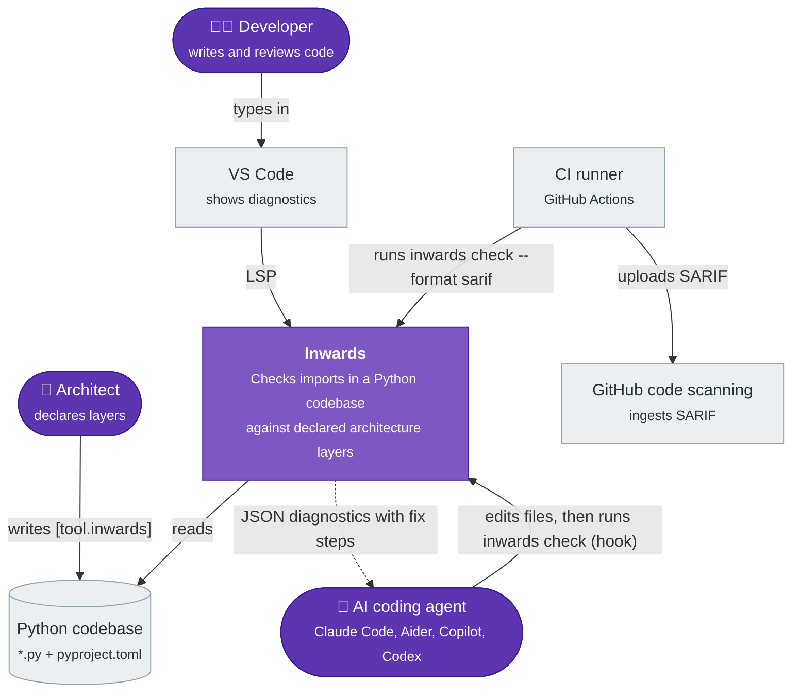
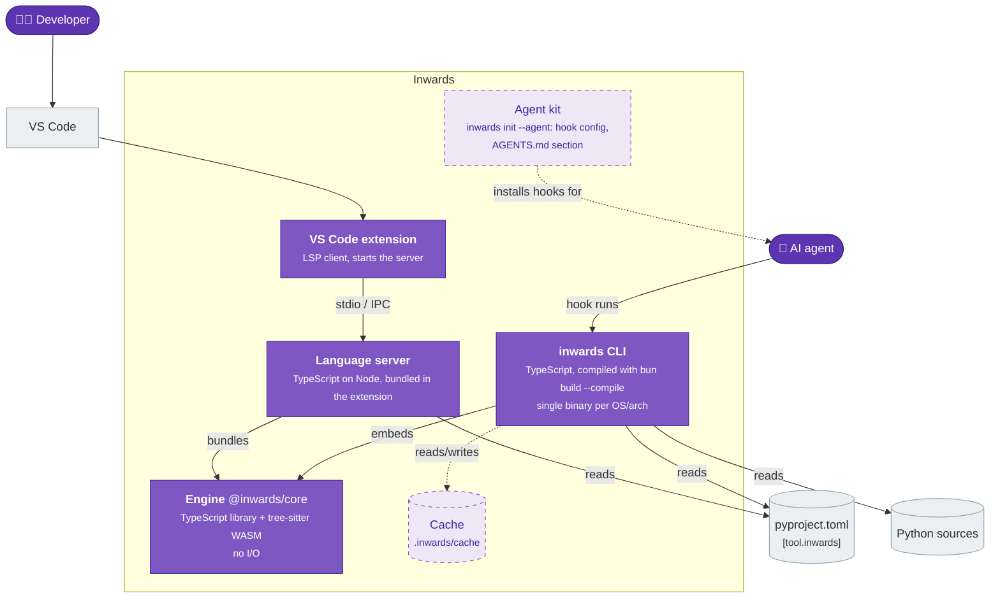
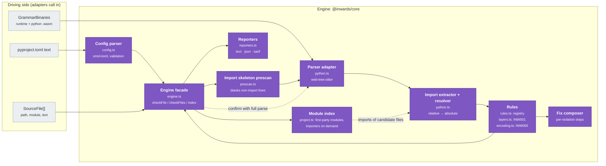
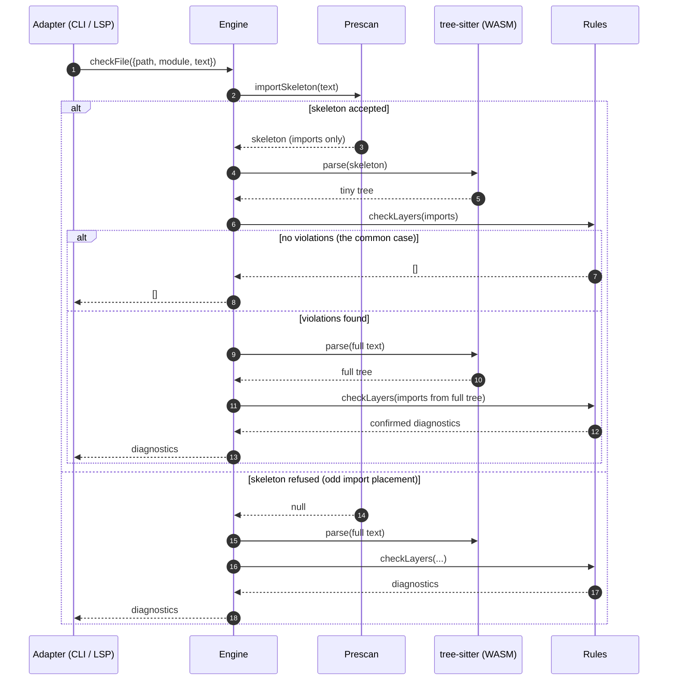
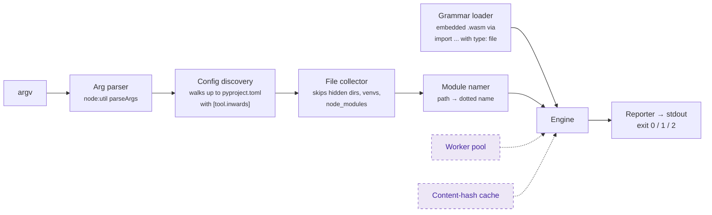
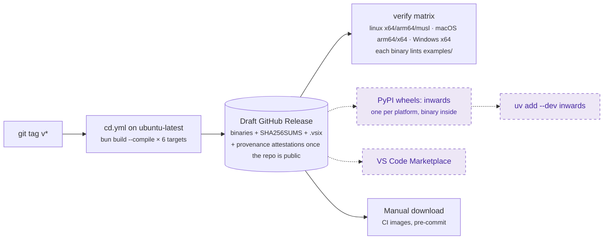

# :material-sitemap-outline: Architecture (C4)

This chapter describes Inwards with the [C4 model](https://c4model.com): system context (C1), containers (C2) and components (C3). The diagrams use Mermaid flowcharts in C4 notation, because Mermaid's native C4 syntax is still experimental and renders poorly.

!!! tip "Legend used in every diagram"
    :material-account: rounded nodes are people · purple boxes are parts of Inwards · grey boxes are external systems · dashed boxes are planned.

## C1: System context

Who uses Inwards, and what does it talk to?



A few things this picture commits us to:

- Inwards only **reads** the codebase. It never edits code. Autofix is left to the agent, which has the context to do it well.
- It needs no network, no Python interpreter and no import of user code. That rules out the `find_spec` approach pytest-archon uses and keeps runs deterministic.
- The agent is a first-class user, on par with the developer. The output format is designed for it first (see [chapter 4](04-AI-Integration.md)).

## C2: Containers

What gets deployed or installed, and where does each piece run?



| Container | Tech | Lives in | Status |
|---|---|---|---|
| **Engine** | TypeScript, `web-tree-sitter` 0.27 + `tree-sitter-python` 0.25 (WASM) | `src/core` | :white_check_mark: INW001 |
| **CLI** | Bun 1.4 single-file executable, 6 targets | `src/cli` | :white_check_mark: `check`, text/json/sarif |
| **Language server** | `vscode-languageserver` 10 on Node | `src/vscode-extension/src/server.ts` | :white_check_mark: scaffold |
| **VS Code extension** | `vscode-languageclient` 10 | `src/vscode-extension/src/extension.ts` | :white_check_mark: scaffold |
| **Agent kit** | Generated hook config and markdown | `src/cli` (future `init` command) | :material-progress-clock: |
| **Cache** | Content-hash keyed import lists | `.inwards/cache` | :material-progress-clock: |

The engine is the only place rules live. The CLI and the language server are adapters: they find files, read them, load the grammars and pick an output format. That split is why an editor squiggle and a CI failure can't disagree. They run the same function on the same text.

!!! warning "One engine, two runtimes"
    The CLI runs the engine on Bun. The language server runs it on Node inside the VS Code extension host. A single call to a Bun-only API inside `src/core/src` would pass every test (tests run on Bun) and then break the extension at runtime. The rule is enforced by lint, not by memory: `biome.json` turns on `noRestrictedGlobals` for `src/core/src/**` and rejects `Bun` and `Deno` with a message pointing at the `GrammarBinaries` port. CI also bundles the extension for the `node` target on every push.

## C3: Components of the engine

The engine is a hexagon in miniature. It gets bytes and text in and returns plain data, and it never touches the disk. The grammars come in as a port (`GrammarBinaries`), so the Bun binary can hand over embedded blobs while the VS Code server reads them from its install folder.



| Component | Responsibility | Notes |
|---|---|---|
| Config parser | Reads `[tool.inwards]`, validates it, and names the exact key that's wrong | Throws `ConfigError`. The CLI maps that to exit code 2 |
| Import skeleton prescan | Keeps only import lines, dedents them, blanks the rest so line numbers stay put | Refuses the file when `import` shows up somewhere it can't account for, which forces a full parse. See [ADR-004](05-ADR.md#adr-004-parse-the-import-skeleton-confirm-with-a-full-parse) |
| Parser adapter | Initialises web-tree-sitter from bytes and parses | Frees every tree explicitly, because WASM memory isn't garbage collected |
| Import extractor | Finds `import` / `from ... import` nodes anywhere in the tree, resolves relative imports | `from shop import infrastructure` is recorded as `shop.infrastructure`, so it can't slip past |
| Rules | Pure functions from `(file, imports, config)` to `Diagnostic[]`. Code, name, default severity, summary and docs link of every rule live in one registry (`rules.ts`); SARIF `rules[]` is built from it | INW001, plus INW000 for files whose encoding could hide imports. Planned rules are listed below |
| Fix composer | Builds numbered repair steps from the actual import and layer names | The steps name real modules, not placeholders |
| Reporters | Text for humans, `inwards/diagnostics@1` JSON for agents, SARIF 2.1.0 for GitHub | JSON fields may be added but never removed or renamed |
| Engine facade | Orchestrates prescan, rules and the confirming full parse | The only thing the adapters call |
| Module index | `Engine.index(files)` returns every first-party module and answers "who imports module X" on demand, parsing only files whose text mentions X's last name segment | Used by the Stop gate (#20) and INW006 (#21). Cycles are not detected yet |

### How one check flows



The prescan may report false positives, such as an import-shaped line inside a docstring, but it can never hide a real import, because it refuses any file it can't fully account for. The full parse is the source of truth, and it only runs when a violation needs confirming.

The cost model has one bad case. On a legacy codebase where most files already violate, nearly every file pays for the skeleton parse and then the full parse, which is a little slower than parsing everything once. The planned baseline (UC6) fixes this: once a violation is recorded in the baseline, the engine doesn't need to confirm it on every run.

## C3: Components of the CLI



Exit codes follow Ruff: `0` clean, `1` violations found, `2` usage or config error. Agents and CI scripts can branch on that without parsing output.

## Deployment and distribution



Cross-compiling from one Linux runner is possible because the grammars are WASM, with no native addon to build per platform (see [ADR-002](05-ADR.md#adr-002-web-tree-sitter-wasm-not-native-bindings)). The verify matrix then runs each binary on its real OS, since cross-compiled output that was never executed hasn't been tested.

## Known limitations

- One `root` per config. Monorepos with several Python packages each need their own `pyproject.toml` and their own run.
- The language server reads only the first workspace folder's `pyproject.toml`.
- Implicit namespace packages (no `__init__.py`) work for naming, but relative imports inside them resolve as if the directory were a regular package.
- Layer membership is by module prefix only. Glob patterns (`shop.*.domain`) for vertical slices are planned together with INW002.
- Dynamic imports (`importlib.import_module("shop.infrastructure")`) are invisible today. INW011 will flag them in inner layers.
- Modules that belong to no layer are unchecked, and so are imports into them. A new `shop/persistence/` package escapes every rule, and a mistyped prefix silently matches nothing. INW006 and stricter config validation close this in 0.1.

## Rule catalogue

| Code | Name | What it catches | Status |
|---|---|---|---|
| INW000 | `unsupported-encoding` | A file in a layer declares an encoding (PEP 263) such as `unicode_escape` or `utf-7`, under which text Inwards reads as a comment can be a real import to CPython. The file is reported, not skipped | :white_check_mark: |
| INW001 | `layer-dependency` | An inner layer importing an outer one | :white_check_mark: |
| INW002 | `context-independence` | One bounded context or vertical slice importing another's internals | :material-progress-clock: |
| INW003 | `public-api-only` | Importing past a context's public module (`__init__` or `api.py`) | :material-progress-clock: |
| INW004 | `no-cycles` | Import cycles between modules or contexts | :material-progress-clock: needs the graph |
| INW006 | `unassigned-module` | A first-party package that belongs to no layer, or an import into one; also dead or overlapping layer prefixes | :material-progress-clock: 0.1 |
| INW005 | `pure-domain` | The domain layer importing frameworks or I/O libraries (`sqlalchemy`, `fastapi`, `requests`...) | :material-progress-clock: |
| INW010 | `unknown-first-party` | Importing a first-party module that doesn't exist, the typical agent hallucination | :material-progress-clock: needs the module index |
| INW011 | `dynamic-import` | `importlib.import_module` / `__import__` in inner layers, a common way to dodge INW001 | :material-progress-clock: |

## Code map

```text
src/
├── core/                  # engine, no I/O
│   ├── src/
│   │   ├── config.ts      # [tool.inwards] parsing and validation
│   │   ├── prescan.ts     # import skeleton fast path
│   │   ├── python.ts      # tree-sitter adapter, import extraction, module names
│   │   ├── rules.ts       # rule registry: code, name, severity, docs
│   │   ├── layers.ts      # INW001 + fix composer
│   │   ├── encoding.ts    # INW000: declared encodings that can hide imports
│   │   ├── reporters.ts   # text / json / sarif
│   │   ├── engine.ts      # facade
│   │   ├── project.ts     # module index, importers on demand
│   │   └── meta.ts        # VERSION, DOCS_BASE
│   └── test/              # bun test
├── cli/src/               # main (commands), hook, session + state-files (session state),
│                          # project (load sources), paths, files, grammars
└── vscode-extension/src/  # extension.ts (client), server.ts (LSP)
```
