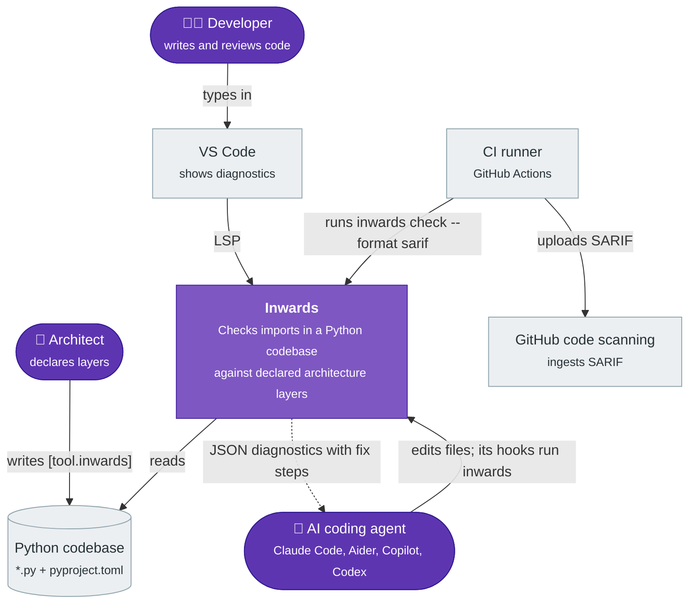
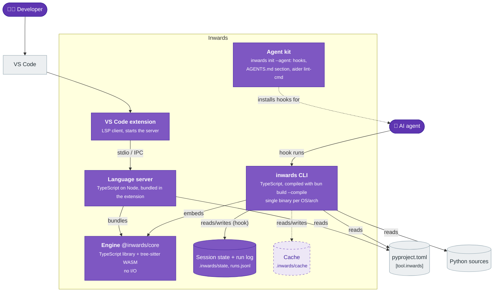
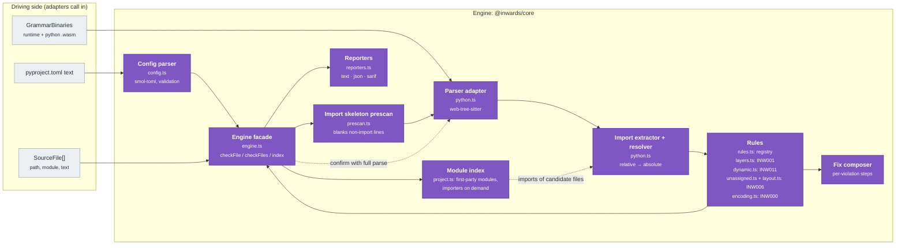
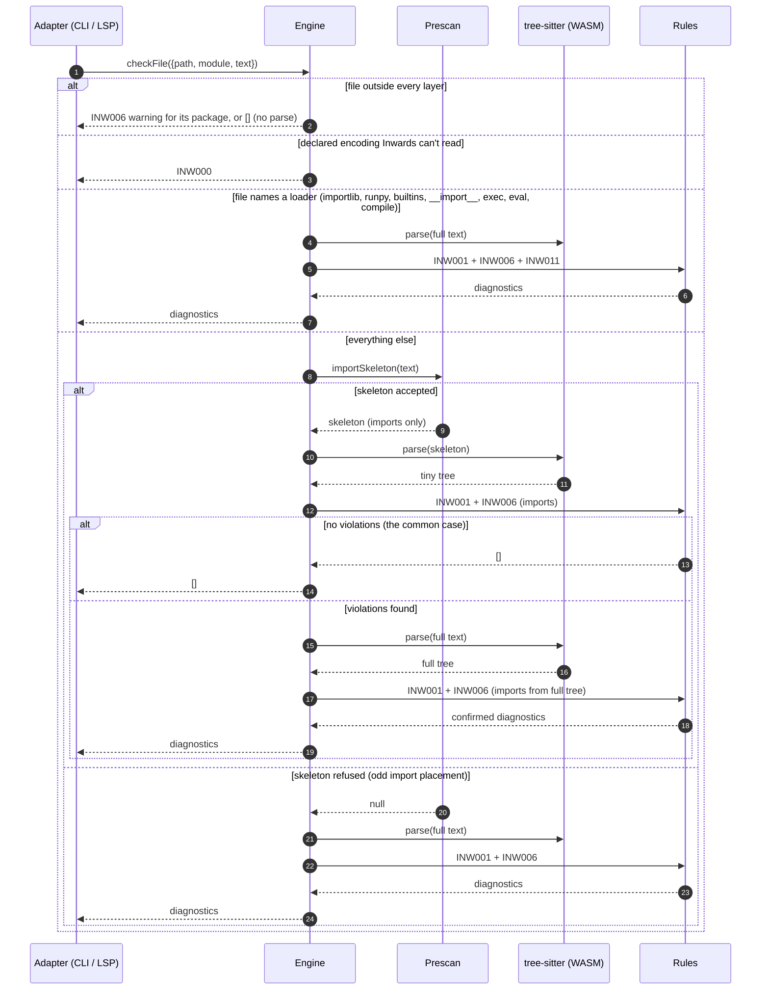
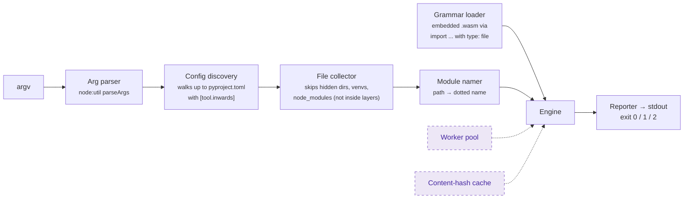
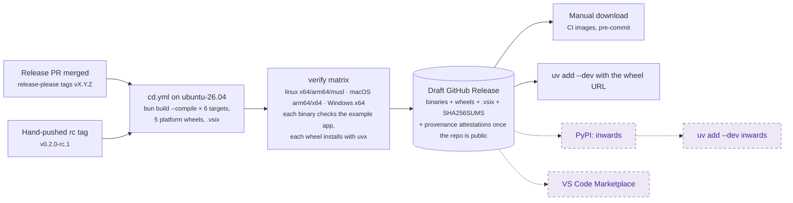

# :material-sitemap-outline: Architecture (C4)

This chapter describes Inwards with the [C4 model](https://c4model.com): system context (C1), containers (C2) and components (C3). The diagrams use Mermaid flowcharts in C4 notation, because Mermaid's native C4 syntax is still experimental and renders poorly.

!!! tip "Legend used in every diagram"
    :material-account: rounded nodes are people · purple boxes are parts of Inwards · grey boxes are external systems · dashed boxes are planned.

## C1: System context

Who uses Inwards, and what does it talk to?



A few things this picture commits us to:

- Inwards only **reads** the codebase. It never edits code. Autofix is left to the agent, which has the context to do it well.
- It needs no network, no Python interpreter and no import of user code. That rules out the `find_spec` approach pytest-archon uses and keeps runs deterministic.
- The agent is a first-class user, on par with the developer. The output format is designed for it first (see [chapter 4](04-AI-Integration.md)).

## C2: Containers

What gets deployed or installed, and where does each piece run?



| Container | Tech | Lives in | Status |
|---|---|---|---|
| **Engine** | TypeScript, `web-tree-sitter` 0.27 + `tree-sitter-python` 0.25 (WASM) | `src/core` | :white_check_mark: INW000, INW001, INW006, INW011 |
| **CLI** | Bun 1.4 single-file executable, 6 targets, also wrapped in 5 platform wheels | `src/cli` | :white_check_mark: `check` (text/json/sarif), `init`, `hook claude-code` |
| **Language server** | `vscode-languageserver` 10 on Node | `src/vscode-extension/src/server.ts` | :white_check_mark: every per-file rule, on each change to an open file |
| **VS Code extension** | `vscode-languageclient` 10 | `src/vscode-extension/src/extension.ts` | :white_check_mark: `.vsix` on each release, :material-progress-clock: Marketplace ([#64](https://github.com/SirCypkowskyy/inwards/issues/64)) |
| **Agent kit** | Generated hook config and markdown | `src/cli/src/init.ts` | :white_check_mark: `init --agent` for `claude`, `aider` and `agents-md` |
| **Session state and run log** | JSON and JSON Lines files, local only | `.inwards/state/`, `.inwards/runs.jsonl` | :white_check_mark: (run log opt-in, [chapter 8](08-Run-Log.md)) |
| **Cache** | Content-hash keyed import lists | `.inwards/cache` | :material-progress-clock: [#56](https://github.com/SirCypkowskyy/inwards/issues/56) |

The engine is the only place rules live. The CLI and the language server are adapters: they find files, read them, load the grammars and pick an output format. That split is why an editor squiggle and a CI failure can't disagree. They run the same function on the same text.

!!! warning "One engine, two runtimes"
    The CLI runs the engine on Bun. The language server runs it on Node inside the VS Code extension host. A single call to a Bun-only API inside `src/core/src` would pass every test (tests run on Bun) and then break the extension at runtime. The rule is enforced by lint, not by memory: `biome.jsonc` turns on `noRestrictedGlobals` for `src/core/src/**` and rejects `Bun` and `Deno` with a message pointing at the `GrammarBinaries` port. CI also bundles the extension for the `node` target on every push.

## C3: Components of the engine

The engine is a hexagon in miniature. It gets bytes and text in and returns plain data, and it never touches the disk. The grammars come in as a port (`GrammarBinaries`), so the Bun binary can hand over embedded blobs while the VS Code server reads them from its install folder.



| Component | Responsibility | Notes |
|---|---|---|
| Config parser | Reads `[tool.inwards]`, validates it, and names the exact key that's wrong | Throws `ConfigError`. The CLI maps that to exit code 2 |
| Import skeleton prescan | Keeps only import lines, dedents them, blanks the rest so line numbers stay put | Refuses the file when `import` shows up somewhere it can't account for, which forces a full parse. See [ADR-004](05-ADR.md#adr-004-parse-the-import-skeleton-confirm-with-a-full-parse) |
| Parser adapter | Initialises web-tree-sitter from bytes and parses | Frees every tree explicitly, because WASM memory isn't garbage collected |
| Import extractor | Finds `import` / `from ... import` nodes anywhere in the tree, resolves relative imports | `from shop import infrastructure` is recorded as `shop.infrastructure`, so it can't slip past |
| Rules | Pure functions from `(file, imports, config)` to `Diagnostic[]`. Code, name, default severity, summary and docs link of every rule live in one registry (`rules.ts`); SARIF `rules[]` is built from it | INW001, INW006 for code outside every layer, INW011 for dynamic imports with literal targets, and INW000 for files whose encoding could hide imports. Planned rules are listed below |
| Fix composer | Builds numbered repair steps from the actual import and layer names | The steps name real modules, not placeholders |
| Reporters | Text for humans, `inwards/diagnostics@1` JSON for agents, SARIF 2.1.0 for GitHub | JSON fields may be added but never removed or renamed |
| Engine facade | Orchestrates prescan, rules and the confirming full parse | The only thing the adapters call. A file outside every layer isn't parsed (it gets at most an INW006 warning). A layered file whose text names a module loader skips the prescan (see below) |
| Module index | `Engine.index(files)` returns every first-party module and answers "who imports module X" on demand, parsing only files whose text mentions X's last name segment | Not used by a rule or a command yet (INW006 probes the file system for first-party modules instead); INW010 and cycle detection will use it ([#44](https://github.com/SirCypkowskyy/inwards/issues/44)) |

### How one check flows



The prescan may report false positives, such as an import-shaped line inside a docstring, but it can never hide a real import, because it refuses any file it can't fully account for. The full parse is the source of truth, and it only runs when a violation needs confirming.

The skeleton keeps import statements only, so a file whose only outward dependency is `importlib.import_module("shop.infrastructure.db")` would pass it. Before the prescan runs, a text check looks for the names every loading call has to spell (`importlib`, `runpy`, `builtins`, `__import__`, or a bare `exec`, `eval` or `compile`, after NFKC). A file in a layer that matches goes straight to the full parse, which also looks for dynamic imports. `re.compile` does not match. On the CPython 3.14 standard library, 209 of 1,921 files match. See [ADR-015](05-ADR.md#adr-015-check-literal-dynamic-imports-as-inw011).

The cost model has one bad case. On a legacy codebase where most files already violate, nearly every file pays for the skeleton parse and then the full parse, which is a little slower than parsing everything once. The baseline (UC6) keeps those violations from failing, but the engine still confirms each one on every run. Skipping the confirming parse for a violation the baseline already accepts is planned ([#108](https://github.com/SirCypkowskyy/inwards/issues/108)).

## C3: Components of the CLI



Exit codes follow Ruff: `0` clean (warnings allowed), `1` errors found, `2` usage or config error. Agents and CI scripts can branch on that without parsing output. In the JSON report, `summary.violations` counts errors and `summary.warnings` counts warnings. A whole-project run (no path arguments) also checks every layer prefix against the modules it found (INW006).

The other two commands reuse the same pieces:

- `inwards hook claude-code` reads a Claude Code hook payload from stdin and dispatches on the event: SessionStart records the session state, PreToolUse runs the config guard, PostToolUse checks the edited file, and Stop runs the Stop gate over what the session changed. [Chapter 4](04-AI-Integration.md) describes each one.
- `inwards init --agent claude|aider|agents-md` computes every file change first, so `--dry-run` can print it as a diff and a second run changes nothing.

## Deployment and distribution



Releases follow [ADR-016](05-ADR.md#adr-016-versions-and-releases-come-from-commit-types-via-a-release-pr): release-please keeps a release PR open, merging it tags the version and starts `cd.yml`, and the owner publishes the draft by hand. Publishing to PyPI is [#32](https://github.com/SirCypkowskyy/inwards/issues/32) and the Marketplace is [#64](https://github.com/SirCypkowskyy/inwards/issues/64).

Cross-compiling from one Linux runner is possible because the grammars are WASM, with no native addon to build per platform (see [ADR-002](05-ADR.md#adr-002-web-tree-sitter-wasm-not-native-bindings)). The verify matrix then runs each binary on its real OS, since cross-compiled output that was never executed hasn't been tested.

## Known limitations

- One `root` per config. Monorepos with several Python packages each need their own `pyproject.toml` and their own run; the hook and the Stop gate pick the nearest config per file. Following uv workspaces is [#57](https://github.com/SirCypkowskyy/inwards/issues/57) ([ADR-018](05-ADR.md#adr-018-package-selectors-take-globs-from-the-start-monorepos-follow-uv-workspaces)).
- The language server reads only the `pyproject.toml` at the root of the first workspace folder, and it checks one open file at a time, so it doesn't report dead layer prefixes. Neither does `inwards check` with path arguments; only a whole-project run does.
- Implicit namespace packages (no `__init__.py`) work for naming, but relative imports inside them resolve as if the directory were a regular package.
- Layer membership is by module prefix only. Glob patterns (`shop.*.domain`) for vertical slices come with the config schema v2 ([#51](https://github.com/SirCypkowskyy/inwards/issues/51), [ADR-018](05-ADR.md#adr-018-package-selectors-take-globs-from-the-start-monorepos-follow-uv-workspaces)).
- Symlinks: a symlinked directory inside a layer that points outside the project isn't checked ([#83](https://github.com/SirCypkowskyy/inwards/issues/83)), and a symlinked alias inside one layer that points into another can hide an outward import ([#84](https://github.com/SirCypkowskyy/inwards/issues/84)).
- Dynamic imports are checked only when the target is a constant string (INW011). Known gaps:
    - computed targets (`importlib.import_module(name)`, a module-level `TARGET = "..."` constant, `str.format`), a relative `import_module` without a literal `package`, `__package__` or `__name__`, and literals that use a `\N{...}` escape. Flagging those as unverifiable is [#46](https://github.com/SirCypkowskyy/inwards/issues/46);
    - loaders reached through a walrus, tuple assignment, class or instance attributes, `functools.partial`, a name bound inside `exec`, or an object (`print.__self__.exec`): [#79](https://github.com/SirCypkowskyy/inwards/issues/79);
    - other loading APIs: `pkgutil.resolve_name`, `importlib.util.find_spec` with `exec_module`, and `SourceFileLoader(...).load_module()`: [#79](https://github.com/SirCypkowskyy/inwards/issues/79);
    - a false positive, accepted over a miss: `exec`, `eval`, `compile` and `__import__` always count as the builtins, so after `from re import compile`, `compile("from shop.infrastructure import x")` is reported.
- Modules that belong to no layer are not checked themselves. INW006 makes that visible (a warning per package, an error for an import into one from a layer, and dead prefixes), but the imports inside an unassigned package are still unchecked until the user assigns it. Sourceless modules, `ignore` depth, renamed top-level packages and path-scoped prefix checks are open in [#86](https://github.com/SirCypkowskyy/inwards/issues/86).

## Rule catalogue

| Code | Name | What it catches | Status |
|---|---|---|---|
| INW000 | `unsupported-encoding` | A file in a layer declares an encoding (PEP 263) such as `unicode_escape` or `utf-7`, under which text Inwards reads as a comment can be a real import to CPython. The file is reported, not skipped | :white_check_mark: |
| INW001 | `layer-dependency` | An inner layer importing an outer one | :white_check_mark: |
| INW002 | `context-independence` | One bounded context or vertical slice importing another's internals | :material-progress-clock: [#52](https://github.com/SirCypkowskyy/inwards/issues/52) |
| INW003 | `public-api-only` | Importing past a context's public module (`__init__` or `api.py`) | :material-progress-clock: [#53](https://github.com/SirCypkowskyy/inwards/issues/53) |
| INW004 | `no-cycles` | Import cycles between modules or contexts | :material-progress-clock: needs the graph, [#54](https://github.com/SirCypkowskyy/inwards/issues/54) |
| INW005 | `pure-domain` | The domain layer importing frameworks or I/O libraries (`sqlalchemy`, `fastapi`, `requests`...) | :material-progress-clock: [#47](https://github.com/SirCypkowskyy/inwards/issues/47) |
| INW006 | `unassigned-module` | An import from a layer into first-party code that belongs to no layer, including the package above the layers (`from shop import x` runs `shop/__init__.py`, which no layer owns), static or dynamic (error); layer code moved out of every layer during a session (error); a package outside every layer and `ignore` (warning); a layer prefix matching no module (warning), a layer with no live prefix, or a prefix emptied during the session (error). Unknown keys and overlapping prefixes are config errors | :white_check_mark: |
| INW007 | `package-shape` | A package member the configured shape doesn't allow or forbids, such as a new `helpers.py` next to `service.py` | :material-progress-clock: [#95](https://github.com/SirCypkowskyy/inwards/issues/95) |
| INW008 | `missing-member` | A member the configured shape requires is missing | :material-progress-clock: [#95](https://github.com/SirCypkowskyy/inwards/issues/95) |
| INW010 | `unknown-first-party` | Importing a first-party module that doesn't exist, the typical agent hallucination | :material-progress-clock: needs the module index, [#45](https://github.com/SirCypkowskyy/inwards/issues/45) |
| INW011 | `dynamic-import` | A dynamic import with a string-literal target that reaches an outer layer: `importlib.import_module`, `__import__` (also `builtins.` and `importlib.`), `runpy.run_module`, and import statements inside literal `exec` / `eval` / `compile` source (bytes whose declared encoding Inwards can't read are reported as unchecked). Import aliases, `name = loader` assignments, `getattr(m, "name")`, `m.__dict__["name"]` and `vars(m)["name"]` are followed; `+` between literals and f-strings with literal fields are folded. A common way to dodge INW001. Known gaps are listed above | :white_check_mark: literal targets |

## Code map

```text
src/
├── core/                  # engine, no I/O
│   ├── src/
│   │   ├── config.ts      # [tool.inwards] parsing and validation
│   │   ├── prescan.ts     # import skeleton fast path
│   │   ├── python.ts      # tree-sitter adapter, import extraction, module names
│   │   ├── rules.ts       # rule registry: code, name, severity, docs
│   │   ├── layers.ts      # INW001 + fix composer
│   │   ├── dynamic.ts     # INW011: literal dynamic imports, loader hint for the engine
│   │   ├── unassigned.ts  # INW006: code outside every layer, first-party probe
│   │   ├── layout.ts      # INW006: dead prefixes, layer code moved out of every layer
│   │   ├── callees.ts     # which calls are loaders, through aliases
│   │   ├── literals.ts    # string literals and call arguments, as Python reads them
│   │   ├── encoding.ts    # INW000: declared encodings that can hide imports
│   │   ├── reporters.ts   # text / json / sarif
│   │   ├── engine.ts      # facade
│   │   ├── project.ts     # module index, importers on demand
│   │   ├── types.ts       # SourceFile, Diagnostic, Fix, Span
│   │   ├── index.ts       # the public API adapters import
│   │   └── meta.ts        # VERSION, DOCS_BASE
│   ├── scripts/           # prescan-diff.ts: the differential test
│   └── test/              # bun test
├── cli/
│   ├── src/
│   │   ├── main.ts        # commands: check, baseline, stats, init, hook claude-code
│   │   ├── project.ts     # load the config and sources, run a check
│   │   ├── baseline.ts    # inwards-baseline.json: write, apply, hash for the Stop gate
│   │   ├── files.ts       # file walk: skips, symlinks, layer packages walked in full
│   │   ├── paths.ts       # real paths, containment, config discovery (ADR-013)
│   │   ├── grammars.ts    # .wasm files embedded in the binary
│   │   ├── output.ts      # stdout / stderr without console.*
│   │   ├── hook.ts        # hook entry: SessionStart, PostToolUse, dispatch
│   │   ├── guard.ts       # PreToolUse config guard
│   │   ├── shell.ts       # reads Bash commands for `inwards hook` / `inwards baseline`
│   │   ├── edit-sim.ts    # applies an Edit/Write/MultiEdit in memory for the guard
│   │   ├── stop.ts        # Stop gate
│   │   ├── prefixes.ts    # INW006 layout checks against the session start
│   │   ├── escalation.ts  # escalate-after, unresolved records
│   │   ├── session.ts     # session state: start record, edits, fingerprints
│   │   ├── snapshot.ts    # configs, content hashes and HEAD of the project now
│   │   ├── state-files.ts # .inwards/state writes, symlink checks, pruning
│   │   ├── runlog.ts      # opt-in .inwards/runs.jsonl
│   │   ├── runs.ts        # reads the run logs back for stats
│   │   ├── stats.ts       # the hypothesis numbers from the run log
│   │   ├── stats-command.ts  # inwards stats: finds the logs, prints the report
│   │   ├── init.ts        # inwards init --agent
│   │   ├── claude-settings.ts  # finds the Inwards hooks in Claude Code settings
│   │   └── diff.ts        # line diff for init --dry-run
│   └── test/              # CLI, hook, Stop gate and E2E tests, snapshots
└── vscode-extension/src/  # extension.ts (client), server.ts (LSP)
```

Outside `src/`: `scripts/` builds binaries and wheels and checks versions and the docs nav, `packaging/` holds the wheel README and the name placeholders, `eval/` is the agent eval harness, `bench/` generates the synthetic benchmark repo and compares two builds on it for the PR regression gate, and `examples/clean-app` is the app CI checks.
