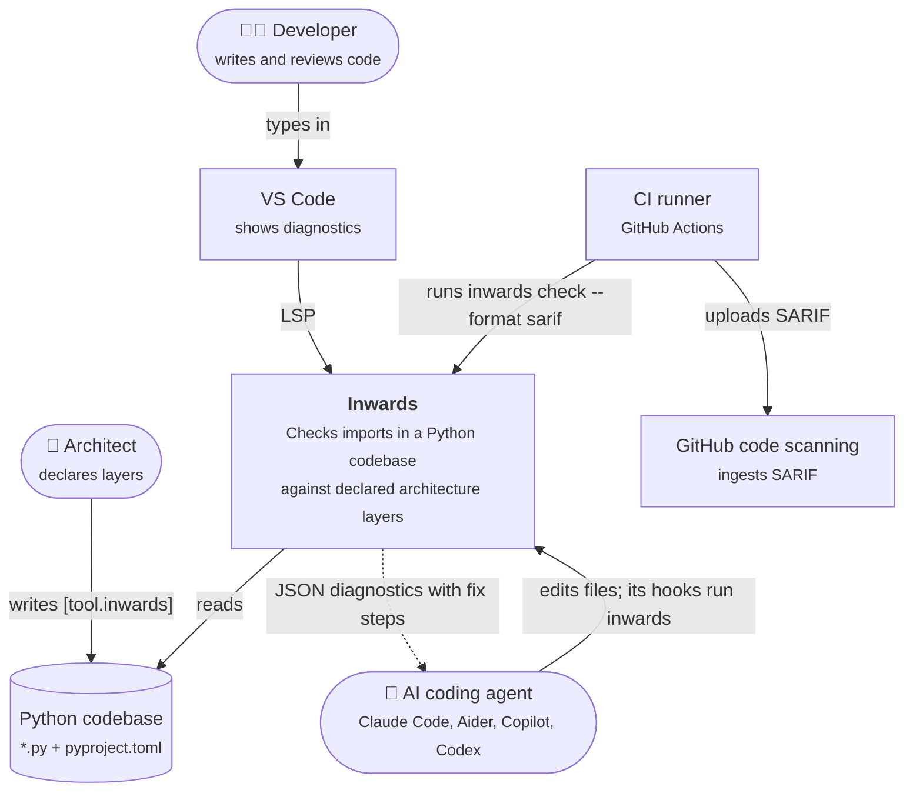
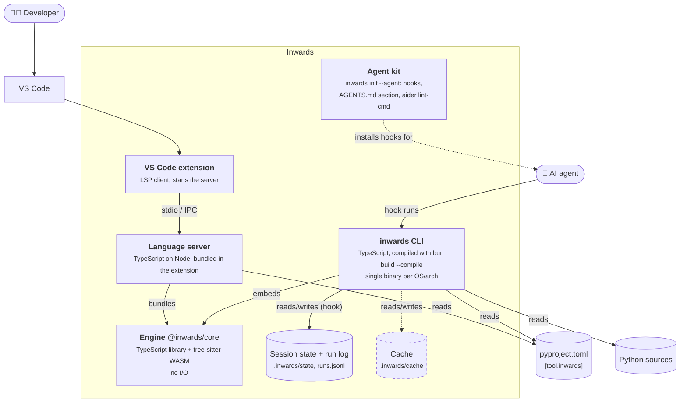
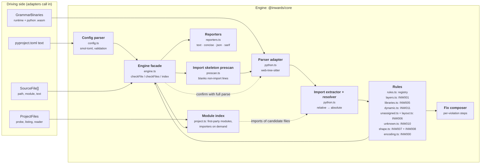
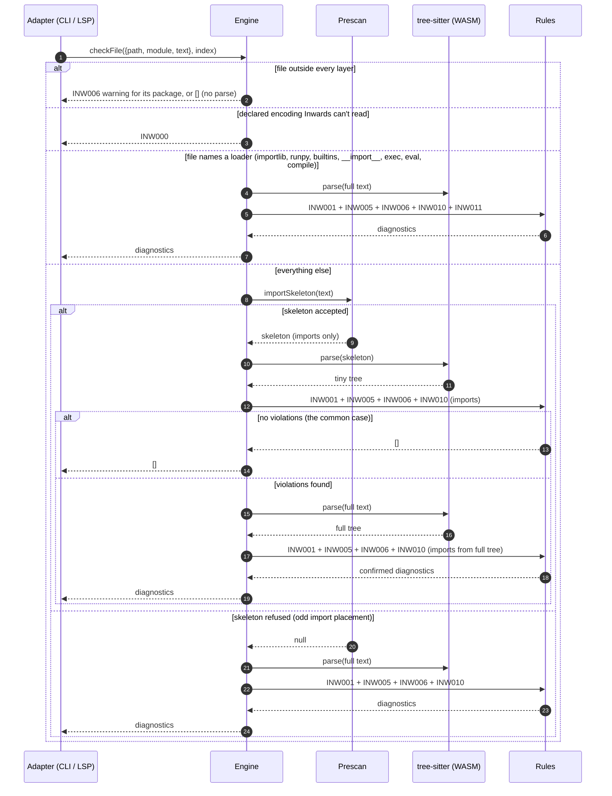
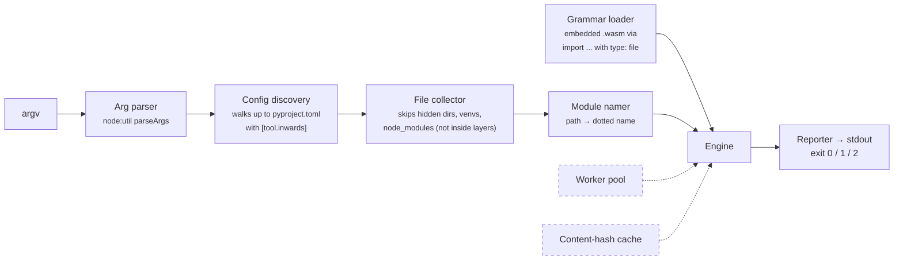
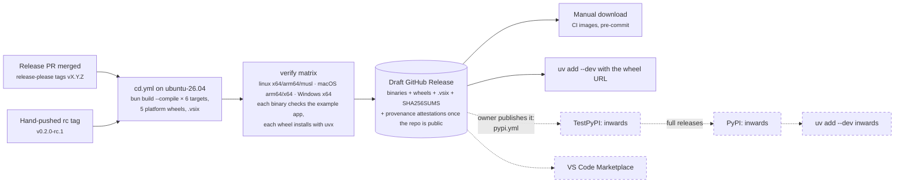

# :material-sitemap-outline: Architecture (C4)

This chapter describes Inwards with the [C4 model](https://c4model.com): system context (C1), containers (C2) and components (C3). The diagrams use Mermaid flowcharts in C4 notation, because Mermaid's native C4 syntax is still experimental and renders poorly.

!!! tip "Legend used in every diagram"
    :material-account: rounded nodes are people · cylinders are stored data · dashed boxes are planned.

## C1: System context

Who uses Inwards, and what does it talk to?



A few things this picture commits us to:

- Inwards only **reads** the codebase. It never edits code. Autofix is left to the agent, which has the context to do it well.
- It needs no network, no Python interpreter and no import of user code. That rules out the `find_spec` approach pytest-archon uses and keeps runs deterministic.
- The agent is a first-class user, on par with the developer. The output format is designed for it first (see [chapter 4](04-AI-Integration.md)).

## C2: Containers

What gets deployed or installed, and where does each piece run?



| Container | Tech | Lives in | Status |
|---|---|---|---|
| **Engine** | TypeScript, `web-tree-sitter` 0.27 + `tree-sitter-python` 0.25 (WASM) | `src/core` | :white_check_mark: INW000, INW001, INW005, INW006, INW007, INW008, INW010, INW011 |
| **CLI** | Bun 1.4 single-file executable, 6 targets, also wrapped in 5 platform wheels | `src/cli` | :white_check_mark: `check` (text/concise/json/sarif), `init` (agents, style presets, scaffold), `hook claude-code` |
| **Language server** | `vscode-languageserver` 10 on Node | `src/vscode-extension/src/server.ts` | :white_check_mark: every per-file rule, on each change to an open file and when a file or directory that could be a module is created or deleted; with a fresh engine when `pyproject.toml` changes; INW007 and INW008 for the whole workspace from a directory listing |
| **VS Code extension** | `vscode-languageclient` 10 | `src/vscode-extension/src/extension.ts` | :white_check_mark: `.vsix` on each release, :material-progress-clock: Marketplace ([#64](https://github.com/SirCypkowskyy/inwards/issues/64)) |
| **Agent kit** | Generated hook config and markdown | `src/cli/src/init.ts` | :white_check_mark: `init --agent` for `claude`, `aider` and `agents-md` |
| **Session state and run log** | JSON and JSON Lines files, local only | `.inwards/state/`, `.inwards/runs.jsonl` | :white_check_mark: (run log opt-in, [chapter 8](08-Run-Log.md)) |
| **Cache** | Content-hash keyed import lists | `.inwards/cache` | :material-progress-clock: [#56](https://github.com/SirCypkowskyy/inwards/issues/56) |

The engine is the only place rules live. The CLI and the language server are adapters: they find files, read them, load the grammars and pick an output format. That split is why an editor squiggle and a CI failure can't disagree. They run the same function on the same text.

!!! warning "One engine, two runtimes"
    The CLI runs the engine on Bun. The language server runs it on Node inside the VS Code extension host. A single call to a Bun-only API inside `src/core/src` would pass every test (tests run on Bun) and then break the extension at runtime. The rule is enforced by lint, not by memory: `biome.jsonc` turns on `noRestrictedGlobals` for `src/core/src/**` and rejects `Bun` and `Deno` with a message pointing at the `GrammarBinaries` port. CI also bundles the extension for the `node` target on every push.

## C3: Components of the engine

The engine is a hexagon in miniature. It gets bytes and text in and returns plain data, and it never touches the disk. The grammars come in as a port (`GrammarBinaries`), so the Bun binary can hand over embedded blobs while the VS Code server reads them from its install folder.



| Component | Responsibility | Notes |
|---|---|---|
| Config parser | Reads `[tool.inwards]`, validates it, and names the exact key that's wrong | Throws `ConfigError`. The CLI maps that to exit code 2 |
| Import skeleton prescan | Keeps only import lines, dedents them, blanks the rest so line numbers stay put | Refuses the file when `import` shows up somewhere it can't account for, which forces a full parse. See [ADR-004](05-ADR.md#adr-004-parse-the-import-skeleton-confirm-with-a-full-parse) |
| Parser adapter | Initialises web-tree-sitter from bytes and parses | Frees every tree explicitly, because WASM memory isn't garbage collected |
| Import extractor | Finds `import` / `from ... import` nodes anywhere in the tree, resolves relative imports | `from shop import infrastructure` is recorded as `shop.infrastructure`, so it can't slip past |
| Rules | Pure functions from `(file, imports, config)` to `Diagnostic[]`. Code, name, default severity, summary and docs link of every rule live in one registry (`rules.ts`); SARIF `rules[]` is built from it | INW001, INW005 for the libraries a layer may import, INW006 for code outside every layer, INW010 for first-party modules that don't exist, INW007/INW008 for package shape, INW011 for dynamic imports (literal targets, and unverifiable ones in inner layers), and INW000 for files whose encoding could hide imports. Planned rules are listed below |
| Fix composer | Builds numbered repair steps from the actual import and layer names | The steps name real modules, not placeholders |
| Reporters | Text for humans, `inwards/diagnostics@1` JSON for agents, SARIF 2.1.0 for GitHub | JSON fields may be added but never removed or renamed |
| Engine facade | Orchestrates prescan, rules and the confirming full parse | The only thing the adapters call. The package shape (INW007) is checked first, from the path alone. A file outside every layer isn't parsed (it gets at most an INW006 warning). A layered file whose text names a module loader skips the prescan (see below) |
| Module index | `Engine.index(files)` wraps the adapter's `ProjectFiles` port: `ownerOf` finds the first-party module an import lands in, probing one path at a time, each once; `modules` lists every first-party module; `importersOf` answers "who imports module X", parsing only files whose text mentions X's last name segment | The engine's project input ([#44](https://github.com/SirCypkowskyy/inwards/issues/44)): every adapter builds one and passes it to `checkFile` and `checkFiles`. Building it touches nothing; each question does only its own I/O, so the hook pays nothing for questions no rule asks. INW006 asks `ownerOf`; INW010 asks `ownerOf` whether a module exists and `listDir` what the package it would live in holds (compiled extensions, the closest names); cycle detection will use `importersOf`. A long-lived adapter rebuilds it when a file or directory is created, deleted or renamed |

### How one check flows



The prescan may report false positives, such as an import-shaped line inside a docstring, but it can never hide a real import, because it refuses any file it can't fully account for. The full parse is the source of truth, and it only runs when a violation needs confirming.

The skeleton keeps import statements only, so a file whose only outward dependency is `importlib.import_module("shop.infrastructure.db")` would pass it. Before the prescan runs, a text check looks for the names every loading call has to spell (`importlib`, `runpy`, `builtins`, `__import__`, or a bare `exec`, `eval` or `compile`, after NFKC). A file in a layer that matches goes straight to the full parse, which also looks for dynamic imports. `re.compile` does not match. On the CPython 3.14 standard library, 209 of 1,921 files match. See [ADR-015](05-ADR.md#adr-015-check-literal-dynamic-imports-as-inw011).

The cost model has one bad case: a legacy codebase where most files already violate. Without a baseline, nearly every file pays for the skeleton parse and then the full parse, which is slower than parsing everything once. With one, the CLI hands the baseline's keys and counts (rule, module, message without the "Allowed direction" sentence) to the engine as data. The engine scans every file first. A module skips the confirming parse when every one of its files went through the skeleton, every skeleton finding is an error, and for each key the findings across the module's files (`order.py` and `order.pyi` are one module) are no more than the accepted copies. The skeleton never misses an import, and a finding depends only on the import's target, which both parses read alike. So the real findings are no more than the skeleton's, and the baseline would hide all of them after a full parse as well. The errors a check reports are the same with or without the skip; a test compares both on every pair of spellings (real import, docstring or string copy) in a `.py` and its `.pyi`. The counts can differ: a skipped module's false positives (an import-shaped line in a docstring) are hidden along with its real findings, so `baselined` can be higher and `resolved` lower than after a full parse, for example when a fixed violation's import still sits in a string. On the synthetic repo in legacy mode (`bench/generate.py --legacy`: 2,101 files, each of the 2,000 modules with one violation, all baselined), a cold `inwards check` took a median of 3.05 s before this change and 0.55 s after. A bare full parse of every file took 2.0 to 3.1 s, and the clean repo 0.47 s (Intel Core Ultra 7 155H, one core).

## C3: Components of the CLI



Exit codes follow Ruff: `0` clean (warnings allowed), `1` errors found, `2` usage or config error. Agents and CI scripts can branch on that without parsing output. In the JSON report, `summary.violations` counts errors and `summary.warnings` counts warnings. A whole-project run (no path arguments) also checks every layer prefix and shape selector against the modules it found (INW006, INW007) and the required members of every shaped package (INW008).

The other commands reuse the same pieces:

- `inwards hook claude-code` reads a Claude Code hook payload from stdin and dispatches on the event: SessionStart records the session state, PreToolUse runs the config guard, PostToolUse checks the edited file, and Stop runs the Stop gate over what the session changed. [Chapter 4](04-AI-Integration.md) describes each one.
- `inwards init --agent claude|aider|agents-md` computes every file change first, so `--dry-run` can print it as a diff and a second run changes nothing.
- `inwards init --style layered|clean|hexagonal [--scaffold]` writes a preset's `[tool.inwards]` (and an example package) only where nothing exists yet, then runs the check in process and prints the package as an annotated tree. On a terminal with no flags, a picker built on `@clack/prompts` asks instead; it is loaded with a dynamic import that the build puts in its own chunk ([ADR-020](05-ADR.md#adr-020-the-init-picker-uses-clackprompts-loaded-from-a-split-chunk)).

## Deployment and distribution



Releases follow [ADR-016](05-ADR.md#adr-016-versions-and-releases-come-from-commit-types-via-a-release-pr): release-please keeps a release PR open, merging it tags the version and starts `cd.yml`, and the owner publishes the draft by hand. Publishing the draft starts `pypi.yml` once it is switched on (below). The Marketplace is [#64](https://github.com/SirCypkowskyy/inwards/issues/64).

Cross-compiling from one Linux runner is possible because the grammars are WASM, with no native addon to build per platform (see [ADR-002](05-ADR.md#adr-002-web-tree-sitter-wasm-not-native-bindings)). The verify matrix then runs each binary on its real OS, since cross-compiled output that was never executed hasn't been tested.

### Publishing to PyPI

`.github/workflows/pypi.yml` uploads a published release's wheels with trusted publishing ([ADR-021](05-ADR.md#adr-021-publish-the-release-wheels-to-pypi-from-their-own-workflow-with-trusted-publishing)). It builds nothing: it downloads the five wheels that `cd.yml` built, ran on every platform and attached to the release, checks them against the release's `SHA256SUMS` (and their build provenance, once the repository is public), and uploads them. PyPI trusts that one workflow file in one GitHub environment per index, so no token is stored anywhere, and only the two upload jobs can mint an OIDC token.

| Started by | TestPyPI | PyPI |
|---|---|---|
| Publishing a pre-release (its checkbox, or a tag with a suffix such as `-rc.1`), with `PYPI_PUBLISH` set | yes | no |
| Publishing a full release, with `PYPI_PUBLISH` set | yes | yes, after it |
| Manual run, `index: testpypi` | yes | no |
| Manual run from the release tag (`--ref vX.Y.Z`, which the `pypi` environment requires), `index: pypi`, with `PYPI_PUBLISH` set | yes | yes, after it |

A draft never starts it, a manual run refuses a draft, and pull requests never start it. Nothing is on either index yet.

**What actually stops an upload.** Every agent works under the owner's GitHub account, so anything on the GitHub side is within an agent's reach: the `PYPI_PUBLISH` variable, the environments, tags (no ruleset protects them) and manual runs. PyPI checks the repository, workflow file and environment of a run, not its ref or commit. The one gate an agent can't reach is the owner's pypi.org account, so the PyPI publisher is registered last, at go-live, and deleting it there stops every PyPI upload at once. `PYPI_PUBLISH` and the `pypi` environment's `v*` tag rule guard against mistakes, not against an agent.

**One-time setup, by the owner,** in this order, so no environment exists without its rules when a run first names it:

1. **Create the two environments** (Settings → Environments → New environment):
    - `testpypi`: under "Deployment branches and tags", choose "Selected branches and tags", then add the branch `develop` (for manual runs) and the tag pattern `v*` (for releases).
    - `pypi`: the tag pattern `v*` only, so it deploys only from a release tag. Add yourself under "Required reviewers" and leave "Prevent self-review" off, since you both publish and approve. GitHub offers required reviewers on a private repository only with GitHub Enterprise; if the option is missing, add it the day the repository goes public.

    The same with the GitHub CLI (drop `reviewers` and `prevent_self_review` if GitHub refuses them while the repository is private):

    ```sh
    R=SirCypkowskyy/inwards
    gh api -X PUT repos/$R/environments/testpypi --input - <<'EOF'
    {"deployment_branch_policy": {"protected_branches": false, "custom_branch_policies": true}}
    EOF
    gh api repos/$R/environments/testpypi/deployment-branch-policies -f name=develop -f type=branch
    gh api repos/$R/environments/testpypi/deployment-branch-policies -f name='v*' -f type=tag
    gh api -X PUT repos/$R/environments/pypi --input - <<EOF
    {"reviewers": [{"type": "User", "id": $(gh api users/SirCypkowskyy -q .id)}], "prevent_self_review": false,
     "deployment_branch_policy": {"protected_branches": false, "custom_branch_policies": true}}
    EOF
    gh api repos/$R/environments/pypi/deployment-branch-policies -f name='v*' -f type=tag
    ```

2. **Register a pending publisher on TestPyPI.** TestPyPI has its own accounts: sign up at [test.pypi.org](https://test.pypi.org/account/register/), verify the email and turn on 2FA. Then, under [Your account → Publishing](https://test.pypi.org/manage/account/publishing/), add a pending GitHub publisher:

    | Field | Value |
    |---|---|
    | PyPI Project Name | `inwards` |
    | Owner | `SirCypkowskyy` |
    | Repository name | `inwards` |
    | Workflow name | `pypi.yml` |
    | Environment name | `testpypi` |

    A pending publisher doesn't reserve the name; the first upload creates the project. Run step 3 soon after.
3. **Dry run on TestPyPI** with the published pre-release v0.1.0-rc.1, once `pypi.yml` is on `develop`. That tag predates the workflow, so the run starts from `develop`, which only the `testpypi` environment accepts:

    ```sh
    gh workflow run pypi.yml --repo SirCypkowskyy/inwards --ref develop -f tag=v0.1.0-rc.1 -f index=testpypi
    gh run watch --repo SirCypkowskyy/inwards \
      "$(gh run list --repo SirCypkowskyy/inwards --workflow pypi.yml -L 1 --json databaseId -q '.[0].databaseId')"
    ```

    [test.pypi.org/project/inwards/0.1.0rc1](https://test.pypi.org/project/inwards/0.1.0rc1/) should then list five wheels and render the README. Install it in a fresh project, on as many platforms as you can:

    ```sh
    cd "$(mktemp -d)" && uv init --bare --name testpypi-check
    uv add --dev "inwards==0.1.0rc1" --default-index https://test.pypi.org/simple/
    uv run inwards --version   # 0.1.0
    ```

    This spends the file names of 0.1.0rc1 on TestPyPI only; PyPI is untouched.
4. **Go live,** when the first release meant for PyPI is near:
    - Add a publisher to the existing PyPI project. `inwards` already exists on pypi.org (the 0.0.0 placeholder), so this is not a pending publisher: open [Manage `inwards` → Publishing](https://pypi.org/manage/project/inwards/settings/publishing/) and add a GitHub publisher with owner `SirCypkowskyy`, repository `inwards`, workflow `pypi.yml` and environment `pypi`.
    - Switch on publishing: `gh variable set PYPI_PUBLISH --body true --repo SirCypkowskyy/inwards`. `gh variable delete PYPI_PUBLISH` switches it off again.

Optional hardening: turn on immutable releases (Settings → General → Releases → "Enable release immutability"; the API reports the setting available and off for this repository). A published release's assets and tag can then no longer change, so a later run uploads the bytes that were published. It applies only to releases published after it is turned on, and doesn't protect a draft.

**At each release,** wait until `cd.yml`'s "Draft the GitHub Release" job has succeeded and the draft lists five `.whl` files and `SHA256SUMS`. Only then publish the draft (step 4 of the release in `AGENTS.md`). `cd.yml` refuses to attach files to a published release, so publishing early spends the version. Publishing starts `pypi.yml`: a full release goes to TestPyPI, then waits for your approval under the run's "Review deployments" before PyPI (when the `pypi` environment has a reviewer). Afterwards, `uv add --dev inwards` in a fresh project should install it. After the first release on PyPI, yank the 0.0.0 placeholder there (Manage → Releases → 0.0.0 → Options → Yank).

To put a pre-release on PyPI as well, run the workflow from its tag, which the `pypi` environment requires: `gh workflow run pypi.yml --repo SirCypkowskyy/inwards --ref v0.2.0-rc.1 -f tag=v0.2.0-rc.1 -f index=pypi`. PyPI never takes the same file name twice, so a version uploaded there is final; a re-run only fills in files a failed run missed.

## Known limitations

- One `root` per config. Monorepos with several Python packages each need their own `pyproject.toml` and their own run; the hook and the Stop gate pick the nearest config per file. Following uv workspaces is [#57](https://github.com/SirCypkowskyy/inwards/issues/57) ([ADR-018](05-ADR.md#adr-018-package-selectors-take-globs-from-the-start-monorepos-follow-uv-workspaces)).
- The language server reads only the `pyproject.toml` at the root of the first workspace folder, and it checks one open file at a time, so it doesn't report dead layer prefixes. Neither does `inwards check` with path arguments; only a whole-project run does. It reads the config again when `pyproject.toml` changes ([#163](https://github.com/SirCypkowskyy/inwards/issues/163)); a client that can't watch files reads it again only when it saves `pyproject.toml` itself. A config error pops up once and stays on `pyproject.toml` until it is fixed, with checking off meanwhile. A `pyproject.toml` that can't be read is a config error too, as in the CLI; when it isn't a file at all, only the popup shows. That diagnostic sits on the right line only for invalid TOML; for any other error (an unknown rule code, say) it sits on the first line, because the config's own checks name the key, not its line.
- Implicit namespace packages (no `__init__.py`) work for naming, but relative imports inside them resolve as if the directory were a regular package.
- Layer membership is by module prefix only. Glob patterns (`shop.*.domain`) for vertical slices come with the config schema v2 ([#51](https://github.com/SirCypkowskyy/inwards/issues/51), [ADR-018](05-ADR.md#adr-018-package-selectors-take-globs-from-the-start-monorepos-follow-uv-workspaces)).
- Symlinks: a symlinked directory inside a layer that points outside the project isn't checked ([#83](https://github.com/SirCypkowskyy/inwards/issues/83)), and a symlinked alias inside one layer that points into another can hide an outward import ([#84](https://github.com/SirCypkowskyy/inwards/issues/84)).
- INW011 resolves a dynamic import only when its target is a constant string. Any other target is reported as unverifiable, and only in layers that have an outer layer ([ADR-026](05-ADR.md#adr-026-report-unreadable-dynamic-import-targets-in-inner-layers)). Known gaps:
    - constant targets that aren't literals (a module-level `TARGET = "..."`, `str.format`, `%`, f-string conversions) are reported as unverifiable instead of being read: [#79](https://github.com/SirCypkowskyy/inwards/issues/79);
    - `compile` with a non-literal source is not reported, since running its code object takes `exec` or `eval`, which are; a code object run another way (`types.FunctionType`) is missed;
    - in the outermost layer an unverifiable call is not reported, so it can reach first-party code outside every layer (INW006) unseen;
    - loaders reached through a walrus, tuple assignment, class or instance attributes, `functools.partial`, a name bound inside `exec`, or an object (`print.__self__.exec`): [#79](https://github.com/SirCypkowskyy/inwards/issues/79);
    - other loading APIs: `pkgutil.resolve_name`, `importlib.util.find_spec` with `exec_module`, and `SourceFileLoader(...).load_module()`: [#79](https://github.com/SirCypkowskyy/inwards/issues/79);
    - a false positive, accepted over a miss: for a literal source, `exec`, `eval`, `compile` and `__import__` always count as the builtins, so after `from re import compile`, `compile("from shop.infrastructure import x")` is reported;
    - a false negative, accepted over noise: a bare `exec` or `eval` with a computed source is skipped only when the code surely rebinds that name at the call. The binding must be a `def`, `class`, plain assignment or import placed directly in the module body (before the top-level statement holding the call) or in the body of a function that encloses the call, a parameter of a function or lambda whose body holds the call, or a `for` target inside its loop. The exemption is off for the whole file when any binding of the name could be the builtin: an assignment, walrus, `for`, `with` or `except` target, or parameter default that mentions a loader; a `def` or `class` whose decorators or class arguments (bases, `metaclass=`) mention one; an import from `builtins`, `importlib`, `runpy`, a relative module or a first-party module (any of which may re-export the builtin). It is also off when the name has a `global`, `nonlocal` or `del`, or when the file has a wildcard import or names `globals`, `vars`, `locals`, `setattr`, `delattr`, `__dict__`, `__builtins__` or `sys.modules`. So `def eval(model, loader)` in training code isn't reported. It still misses the builtin passed in as an argument (`def run(exec, c): return exec(c)` called as `run(exec, code)`) and the builtin reached through an object without naming a loader or a namespace writer, such as `exec = operator.attrgetter("exec")(print.__self__)` ([#79](https://github.com/SirCypkowskyy/inwards/issues/79)). The same check guards `exec(compile("<literal>", ...))`, which is trusted only while `compile` isn't rebound;
    - accepted false positives of that conservative check: a comprehension variable (`[eval(m) for eval in evaluators]`), a method name used inside its own class body, and a `match` capture named `eval` or `exec` are still reported.
- INW010 checks only the module part of a static import ([ADR-025](05-ADR.md#adr-025-inw010-probes-the-disk-for-existence-and-checks-only-the-module-part-of-an-import)): `from shop.domain import pricing` passes when `shop/domain` is a package, since `pricing` could be a name its `__init__.py` defines, and dynamic imports aren't checked. A module generated at build time (`_version.py`, `*_pb2.py`) is reported until it exists in the checkout ([#160](https://github.com/SirCypkowskyy/inwards/issues/160)), and so is an optional import behind `try/except ImportError`. A namespace package shared with an installed distribution is reported as missing ([#161](https://github.com/SirCypkowskyy/inwards/issues/161)). The language server doesn't notice an `__init__.py` that starts extending its `__path__` until a file is created or deleted.
- Modules that belong to no layer are not checked themselves. INW006 makes that visible (a warning per package, an error for an import into one from a layer, and dead prefixes), but the imports inside an unassigned package are still unchecked until the user assigns it. Sourceless modules, `ignore` depth, renamed top-level packages and path-scoped prefix checks are open in [#86](https://github.com/SirCypkowskyy/inwards/issues/86).

## Rule catalogue

| Code | Name | What it catches | Status |
|---|---|---|---|
| INW000 | `unsupported-encoding` | A file in a layer declares an encoding (PEP 263) such as `unicode_escape` or `utf-7`, under which text Inwards reads as a comment can be a real import to CPython. The file is reported, not skipped | :white_check_mark: |
| INW001 | `layer-dependency` | An inner layer importing an outer one | :white_check_mark: |
| INW002 | `context-independence` | One bounded context or vertical slice importing another's internals | :material-progress-clock: [#52](https://github.com/SirCypkowskyy/inwards/issues/52) |
| INW003 | `public-api-only` | Importing past a context's public module (`__init__` or `api.py`) | :material-progress-clock: [#53](https://github.com/SirCypkowskyy/inwards/issues/53) |
| INW004 | `no-cycles` | Import cycles between modules or contexts | :material-progress-clock: needs the graph, [#54](https://github.com/SirCypkowskyy/inwards/issues/54) |
| INW005 | `pure-domain` | A layer importing a third-party or standard-library module its `allow-libraries` / `deny-libraries` / `extend-deny-libraries` don't let it use, static or dynamic, in functions and behind `TYPE_CHECKING` too. The innermost of two or more layers denies frameworks, database and network clients and stdlib I/O (`sqlalchemy`, `fastapi`, `requests`, `subprocess`...) by default; `extend-deny-libraries` adds to that list, `deny-libraries` replaces it. First-party code is left to INW001 and INW006. See [Libraries per layer](guides/libraries.md) | :white_check_mark: |
| INW006 | `unassigned-module` | An import from a layer into first-party code that belongs to no layer, including the package above the layers (`from shop import x` runs `shop/__init__.py`, which no layer owns), static or dynamic (error); layer code moved out of every layer during a session (error); a package outside every layer and `ignore` (warning); a layer prefix matching no module (warning), a layer with no live prefix, or a prefix emptied during the session (error). Unknown keys and overlapping prefixes are config errors | :white_check_mark: |
| INW007 | `package-shape` | A package member its `[[tool.inwards.shape]]` doesn't allow (error, or a warning with `extra = "warning"`) or forbids, such as a new `helpers.py` next to `service.py`; a member name outside its `[[tool.inwards.names]]` `only-in` packages, such as `test_x.py` in the app (error); a shape selector that matches no package (warning, in pyproject.toml). The message never lists the allowed members; the fix names the likely target. See [Package shape](guides/package-shape.md) | :white_check_mark: |
| INW008 | `missing-member` | A member the package's shape requires is missing, reported on its `__init__.py`. Whole-project runs report every one; the Stop gate blocks only those new since the session started | :white_check_mark: |
| INW010 | `unknown-first-party` | A static import, in a layer, of a first-party module that doesn't exist, the typical agent hallucination (`from shop.domain.pricing import X` with no `pricing`), and a relative import that climbs above the top-level package, which Python always refuses. The module part is checked: `X` of `from X import name`, the whole name otherwise. Existence is probed on disk, so namespace packages, stubs and compiled extensions (`.so`, `.pyd`, `.pyx`) count; the fix lists the three closest modules in the same package. Such an import gets no INW006 as well, and an outward import INW001 reports gets no INW010. Packages that extend their `__path__` are skipped. See [ADR-025](05-ADR.md#adr-025-inw010-probes-the-disk-for-existence-and-checks-only-the-module-part-of-an-import) | :white_check_mark: |
| INW011 | `dynamic-import` | A dynamic import with a string-literal target that reaches an outer layer: `importlib.import_module`, `__import__` (also `builtins.` and `importlib.`), `runpy.run_module`, and import statements inside literal `exec` / `eval` / `compile` source (bytes whose declared encoding Inwards can't read are reported as unchecked). Import aliases, `name = loader` assignments, `getattr(m, "name")`, `m.__dict__["name"]` and `vars(m)["name"]` are followed; `+` between literals and f-strings with literal fields are folded. In every layer but the outermost, a target Inwards can't read is reported as unverifiable: a variable, an f-string field, a `\N{...}` escape, an argument hidden behind `*args` or `**kwargs`, a relative `import_module` whose `package` isn't known, `exec` or `eval` of a non-literal source ([ADR-026](05-ADR.md#adr-026-report-unreadable-dynamic-import-targets-in-inner-layers)). A common way to dodge INW001. Known gaps are listed above | :white_check_mark: |

## Code map

```text
src/
├── core/                  # engine, no I/O
│   ├── src/
│   │   ├── config.ts      # [tool.inwards] parsing and validation
│   │   ├── toml.ts        # ConfigError and the checks shared by the config parsers
│   │   ├── prescan.ts     # import skeleton fast path
│   │   ├── python.ts      # tree-sitter adapter, import extraction, module names
│   │   ├── rules.ts       # rule registry: code, name, severity, docs
│   │   ├── rule-config.ts # [tool.inwards.rules]: select, ignore, severity
│   │   ├── layers.ts      # INW001 + fix composer
│   │   ├── libraries.ts   # INW005: libraries per layer, default deny list
│   │   ├── stdlib.ts      # standard-library module names (INW005)
│   │   ├── dynamic.ts     # INW011: dynamic imports, loader hint for the engine
│   │   ├── loader-targets.ts  # what import_module, __import__ and run_module load
│   │   ├── computed-source.ts  # which exec / eval calls with a computed source count
│   │   ├── unassigned.ts  # INW006: code outside every layer, first-party probe
│   │   ├── unknown.ts     # INW010: first-party modules that don't exist, closest names
│   │   ├── layout.ts      # INW006: dead prefixes, layer code moved out of every layer
│   │   ├── shape.ts       # INW007 + INW008: package shape, ListMembers port
│   │   ├── shape-config.ts  # [[tool.inwards.shape]] / [[tool.inwards.names]], selectors, patterns
│   │   ├── shape-fix.ts   # INW007/INW008 wording, likely target
│   │   ├── callees.ts     # which calls are loaders, through aliases
│   │   ├── literals.ts    # string literals and call arguments, as Python reads them
│   │   ├── encoding.ts    # INW000: declared encodings that can hide imports
│   │   ├── reporters.ts   # text / concise / json / sarif
│   │   ├── engine.ts      # facade
│   │   ├── baseline.ts    # baseline keys, which findings a baseline accepts
│   │   ├── project.ts     # module index (the engine's project input), importers on demand
│   │   ├── types.ts       # SourceFile, Diagnostic, Fix, Span
│   │   ├── index.ts       # the public API adapters import
│   │   └── meta.ts        # VERSION, DOCS_BASE
│   ├── scripts/           # prescan-diff.ts: the differential test
│   └── test/              # bun test
├── cli/
│   ├── src/
│   │   ├── main.ts        # commands: check, baseline, stats, init, hook claude-code
│   │   ├── project.ts     # load the config and sources, run a check
│   │   ├── baseline.ts    # inwards-baseline.json: write, apply, hash for the Stop gate
│   │   ├── files.ts       # file walk: skips, symlinks, layer packages walked in full
│   │   ├── paths.ts       # real paths, containment, config discovery (ADR-013)
│   │   ├── grammars.ts    # .wasm files embedded in the binary
│   │   ├── output.ts      # stdout / stderr without console.*
│   │   ├── hook.ts        # hook entry: SessionStart, PostToolUse, dispatch
│   │   ├── guard.ts       # PreToolUse config guard
│   │   ├── shell.ts       # reads Bash commands for `inwards hook` / `inwards baseline`
│   │   ├── edit-sim.ts    # applies an Edit/Write/MultiEdit in memory for the guard
│   │   ├── stop.ts        # Stop gate
│   │   ├── prefixes.ts    # INW006 and INW008 layout checks against the session start
│   │   ├── escalation.ts  # escalate-after, unresolved records
│   │   ├── session.ts     # session state: start record, edits, fingerprints
│   │   ├── snapshot.ts    # configs, content hashes and HEAD of the project now
│   │   ├── state-files.ts # .inwards/state writes, symlink checks, pruning
│   │   ├── runlog.ts      # opt-in .inwards/runs.jsonl
│   │   ├── runs.ts        # reads the run logs back for stats
│   │   ├── stats.ts       # the hypothesis numbers from the run log
│   │   ├── stats-command.ts  # inwards stats: finds the logs, prints the report
│   │   ├── log-export.ts  # stats --export [--redact]: one shareable log file
│   │   ├── init.ts        # inwards init --agent
│   │   ├── init-style.ts  # inwards init --style / --scaffold, the entry for every init
│   │   ├── init-report.ts # the annotated tree and check after init --style
│   │   ├── init-target.ts # the pyproject.toml, package and src layout init --style uses
│   │   ├── init-write.ts  # scaffold writes: no symlinks, nothing outside, all or nothing
│   │   ├── styles.ts      # the presets and the scaffold's Python templates
│   │   ├── picker.ts      # the interactive init (@clack/prompts, loaded lazily)
│   │   ├── claude-settings.ts  # finds the Inwards hooks in Claude Code settings
│   │   └── diff.ts        # line diff for init --dry-run
│   └── test/              # CLI, hook, Stop gate and E2E tests, snapshots
└── vscode-extension/src/  # extension.ts + selector.ts (client), server.ts + config-file.ts (LSP), workspace.ts (INW007/INW008 pass)
```

Outside `src/`: `scripts/` builds binaries and wheels and checks versions and the docs nav, `packaging/` holds the wheel README and the name placeholders, `eval/` is the agent eval harness, `bench/` generates the synthetic benchmark repo and compares two builds on it for the PR regression gate, and `examples/clean-app` is the app CI checks.
