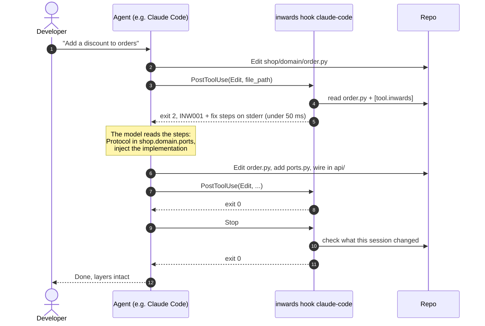
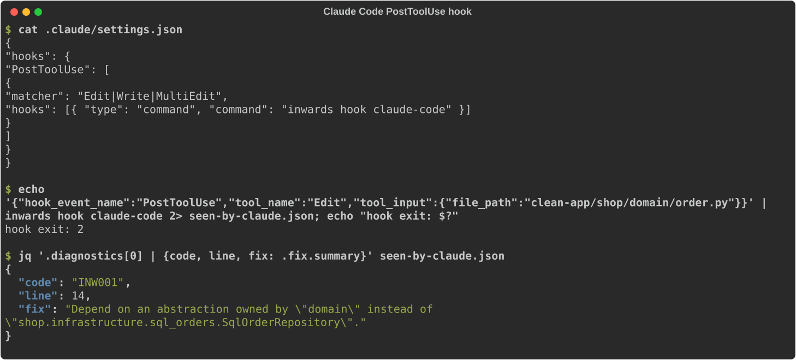
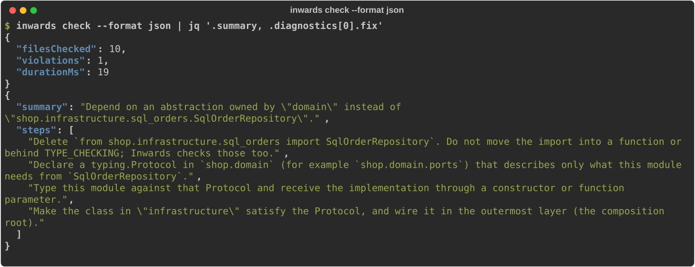
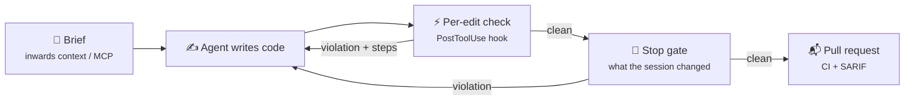

# :material-robot-happy-outline: AI integration

Inwards' main user is an AI coding agent. This chapter explains how it reaches agents, what it tells them, and how it handles an agent that would rather silence the check than fix the code.

## Where Inwards sits in the agent loop

An agent works in a loop: read, plan, edit, check, repeat. Architecture rules usually enter that loop only at the very end, when a human reviews the pull request. Inwards moves them into the "check" step and runs them on every edit.



Two hooks do the checking. A **per-edit hook** gives fast feedback on the file that just changed. A **stop gate** checks everything the session changed before the agent may report success, including edits the per-edit hook never saw (Bash, commits). It checks only what changed, and in a changed file only what is new since the session started, so a legacy repo's old violations never block a clean turn. The per-edit hook alone misses those edits, and the gate alone gives feedback too late for cheap fixes, so we use both. Two more keep them honest: a `SessionStart` hook records what the session started from, and a `PreToolUse` hook, the config guard, refuses edits to the rules. The same `PreToolUse` hook also runs the shape guard, which denies a `Write` that would create a Python file the package shape forbids ([INW007](rules/INW007.md)).

## Integrations by agent

=== ":simple-anthropic: Claude Code"

    Set it up with one command, run in the project:

    ```sh
    inwards init --agent claude            # --dry-run shows the diff first
    ```

    On a project with no `[tool.inwards]` yet, `inwards init --style hexagonal --agent claude` writes a preset's layers and the hooks in one run (see [Install](guides/install.md#a-new-project-start-from-a-preset)).

    It writes the hooks into `.claude/settings.local.json`, which holds settings for this machine only (`init` adds it to `.gitignore`), and keeps any hooks and settings already there. Each hook uses exec form (`"command"`: the absolute path of the binary, `"args"`: `["hook", "claude-code"]`), so Claude Code starts it with no shell: `PATH`, an activated virtualenv, spaces or `$` in the path, and Git Bash versus PowerShell on Windows make no difference. With `--launcher "uv run"` (for Inwards as a uv dev dependency), each hook is instead the shell command `cd "$CLAUDE_PROJECT_DIR" && uv run inwards hook claude-code`, which holds no path, and `init` warns when the path it would record is in uv's or bunx's cache. `init` also adds `.inwards/` to `.gitignore`, pins `required-version` and a default `ignore` list (`tests`, `scripts`, `migrations`, `conftest`) in `[tool.inwards]`, and adds three `permissions.deny` rules, `Edit(/.claude/settings*.json)`, `Edit(/.inwards/**)` and `Edit(/**/inwards-baseline.json)`, so Claude Code itself refuses those edits even if a hook is gone. Running it again changes nothing. It installs every hook event Inwards implements: SessionStart, PreToolUse (the config guard and the shape guard), PostToolUse and Stop.

    Claude Code runs [hooks](https://code.claude.com/docs/en/hooks) around tool calls. For `PostToolUse`, exit code 2 doesn't undo the edit (it already happened), but Claude sees the hook's stderr and reacts to it. For `Stop`, exit code 2 keeps Claude working instead of ending the turn. The hook input includes `stop_hook_active`, and Claude Code ends the turn anyway after several consecutive blocks, so a broken stop hook can't trap the session.

    To share the setup through the committed `.claude/settings.json` instead, write it by hand. This version relies on `inwards` being on `PATH`:

    ```json title=".claude/settings.json"
    {
      "hooks": {
        "SessionStart": [
          { "hooks": [{ "type": "command", "command": "inwards hook claude-code" }] }
        ],
        "PreToolUse": [
          {
            "matcher": "Edit|Write|MultiEdit|Bash",
            "hooks": [{ "type": "command", "command": "inwards hook claude-code" }]
          }
        ],
        "PostToolUse": [
          {
            "matcher": "Edit|Write|MultiEdit",
            "hooks": [
              {
                "type": "command",
                "command": "inwards hook claude-code"
              }
            ]
          }
        ],
        "Stop": [
          { "hooks": [{ "type": "command", "command": "inwards hook claude-code" }] }
        ]
      }
    }
    ```

    `inwards hook claude-code` reads the hook JSON from stdin, so it needs no `jq` and no POSIX shell and runs the same on Windows. After a `PostToolUse`, it checks the one Python file the agent just wrote:

    - **Violation:** compact JSON diagnostics on stderr, exit code 2.
    - **Warnings only** (INW006: the file belongs to no layer): exit 0, and the same JSON goes back to the model as `additionalContext`, so the edit stands but the agent hears about it.
    - **A violation the file already had at session start:** context, not a block (exit 0, a note that lists it as already there and tells the agent to leave it unless the task needs that code). A violation the edit adds still blocks, a second copy of an old import included. How the gate knows what was there is described under the stop gate below.
    - **Package shape** ([guide](guides/package-shape.md)): INW007 blocks when the file is new this session, and is context only for a file that existed at session start under the same path, with no symlink on that path (the start identity in [ADR-028](05-ADR.md#adr-028-inline-suppressions-need-a-reason-and-an-agent-cant-add-one-by-default)), so an alias the agent creates or a start file swapped for a link still blocks, here and at Stop. INW008 for the edited file's package (a required member still missing) is always context; the Stop gate enforces it.
    - **Clean file, non-Python file, or any other hook event:** exit 0, no output.
    - **Broken `[tool.inwards]`:** the message goes to stderr with exit code 2, so an agent that broke the config hears about it. With no `[tool.inwards]` at all the hook stays silent, because it may be installed for every project; the config guard stops an agent from deleting the table.
    - **Unreadable payload or an internal error:** exit 1. Claude Code shows that to the user, not the model.
    - **File outside the project** (`CLAUDE_PROJECT_DIR`, or the directory Claude Code runs the hook in; never the payload's own `cwd`): skipped, even when the path reaches it through `..` or a symlink. The payload comes from the agent, so Inwards doesn't trust it to pick what gets checked.
    - **Monorepos:** the nearest `pyproject.toml` with `[tool.inwards]` above the edited file applies, as long as it lies inside the project. A config above `CLAUDE_PROJECT_DIR` is ignored, so open the session at the directory that holds the config.
    - **Symlinks:** a file reached through a symlinked alias is checked under every name Python could import it by, so an alias can't move it out of its layer.

    The hook also keeps per-session state in `.inwards/state/`, always on and never sent anywhere. At `SessionStart` (startup or `/clear`) it writes `<session_id>.start.json`: the HEAD commit, every `[tool.inwards]` table in the project, a hash of every Python file, a hash of each `inwards-baseline.json` and the symlinks in layer packages with their real targets. Next to it goes `<session_id>.content.json`, copies of the Python files git can't give back as they were at start (see the Stop gate below). It writes each to a temporary file and renames it, so neither is ever half-written. After each edit it appends one line to `<session_id>.jsonl`: the file and a fingerprint of each reported violation (rule, module, message). Hooks run in parallel, so the log is only ever appended to. The Stop gate and escalation below read this state to tell violations the session introduced from ones that were already there. A session without its start file counts as unknown, and the Stop gate treats unknown as not clean. A resume or compact never writes a new start, so deleting `.inwards/` mid-session can't be undone by the next `SessionStart`. The hook refuses to follow a symlinked `.inwards` or `state`, so state can't be written outside the project. Other sessions older than a week, or beyond the newest 50, are pruned when a session starts.

    <figure markdown="span">
      { loading=lazy }
      <figcaption>Exit code 2 tells Claude Code to show the hook's stderr to the model. <code>seen-by-claude.json</code> is exactly what Claude reads.</figcaption>
    </figure>

    At `Stop`, the same command runs the **stop gate**. It checks every Python file the session changed: the edits the per-edit hook saw, plus every file whose content hash differs from the session start. The hash comparison doesn't depend on git, so a commit made mid-session, `git update-index --assume-unchanged`, gitignored and untracked files all count as changes. Inside a top-level package that holds a layer (`shop/` for `shop.domain`), nothing is skipped, so a `pyvenv.cfg`, a `node_modules` directory or a symlink into one can't hide a module there (`inwards check` walks the same way). A layer module that disappears while a module with the same name or content appears outside every layer counts as moved out of the layer, and fails the gate. So does a symlink made in a layer during the session that points out of the config root or into another layer ([INW006](rules/INW006.md)): the hashes can't see a link out of the project, so the start record lists the links. Other files aren't checked. An INW001 verdict depends only on module names, so an edit can't make a file that imports it newly violate. INW006 is the exception: a module created outside every layer makes an untouched file that already imported that name fail. For that, or for a stricter gate, set `stop-gate = "project"` in `[tool.inwards]`: the gate then checks the whole project against its baseline on every Stop, so any violation the baseline doesn't accept blocks, wherever it is. It costs a whole-project check per Stop, about 0.5 s on the 2,100-file synthetic repo with every violation baselined, and without a baseline every legacy violation blocks. The mode is read from the session-start snapshot, so turning it off mid-session only fails the config comparison. If a baseline changed during the session, the gate can't trust it and falls back to the changed files, so it doesn't dump every legacy violation. A symlinked `pyproject.toml` is checked over the tree it sits in, not its target's.

    In a changed file, only violations the file didn't have at session start block. An agent asked to add a property to a file with an old violation used to be kept working until that violation was gone, and in the 2026-09-26 eval it deleted or changed functions to get there ([#134](https://github.com/SirCypkowskyy/inwards/issues/134)). Now the old violations go along as context when the gate blocks for something else, and a clean turn ends. To know what a file had, the gate reads the file's raw blob from git at the commit the session started on (`git cat-file blob`), uses it, or the same text with CRLF line endings for `core.autocrlf`, only if its SHA-256 matches the start manifest, and checks it. It never applies filters: a filter driver comes from `.gitattributes` and `.git/config`, which the agent can write, so running one would run the agent's command outside Claude Code's permissions. For the same reason it passes `--no-lazy-fetch`: in a repo the agent turned into a partial clone, a missing blob would otherwise be fetched through a remote whose `ext::` URL or `core.sshCommand` the agent chose. Git older than 2.44 rejects that flag, so there the gate never reads a blob, and every file's start content comes from the copies described below. Old violations don't reach the run log either, so `inwards stats` doesn't count them as introduced. Errors match by rule, module and message, not by line, counted like the baseline: one old import, moved or not, stays old, and a second copy of it is new. The check runs only for a changed file that has errors, once per Stop and once per edit in the PostToolUse hook; on the eval's example app it adds about 20 ms to a hook run that finds an old violation. A file that was modified, untracked or outside git at session start has no blob to read, so `SessionStart` keeps a copy of it in `.inwards/state/<session_id>.content.json` ([#157](https://github.com/SirCypkowskyy/inwards/issues/157)). It finds those files with `git ls-tree` on the start commit, which runs no filters either: a file whose bytes are the blob's, or the blob's with CRLF line endings, gets no copy. The gate trusts a copy the same way as a blob, only if its SHA-256 matches the start manifest, so a copy edited through Bash is ignored. Only a file that is its own start identity gets a copy, so a symlink alias can't borrow one. Copies are capped at 512 KiB per file and 4 MiB per session; a file past a cap has no provable start content, so every violation in it counts as new and blocks, and a baseline covers that case. The copies are written like the start record, atomically and without following a symlink, and pruned with it. On the 2,100-file synthetic repo they add about 30 ms to `SessionStart` with a clean or slightly dirty tree (the `ls-tree` call and hashing each file as a git blob), and about 50 ms with 500 dirty files or on git before 2.44, which copies every file up to the cap. Two alternatives were rejected: checking every file at `SessionStart` costs a whole-project check per session, and the first PostToolUse report of a file already includes the agent's first edit. `stop-gate = "project"` doesn't use this: there, every violation the baseline doesn't accept blocks, wherever it is.

    It also refuses to let the turn end when it can't trust the session:

    - **No start record**, because `.inwards/` was deleted or the hooks were installed mid-session. When Claude Code sets `stop_hook_active` after a block, the gate lets that turn end.
    - **`[tool.inwards]` differs from the start snapshot**, for example after a `sed -i` through Bash, or **a changed file falls under a `pyproject.toml` that had no valid `[tool.inwards]` at the start** (a new, permissive config nested in a layer). After a changed `[tool.inwards]`, the gate checks the changed files with the start snapshot, so the block also lists what the change would hide: with `ignore = ["INW001"]` or `severity = { INW001 = "warning" }` added through Bash, an INW001 violation still shows up as an error ([#164](https://github.com/SirCypkowskyy/inwards/issues/164)).
    - **The Inwards `SessionStart`, `PreToolUse` or `PostToolUse` hook is gone from every settings layer** (user, project, local), including a matcher that no longer covers the tools it must see, or **`disableAllHooks`** is set. The check reads the settings, not the programs they run, so it proves the configuration, not that the real Inwards runs. Claude Code reloads hooks when settings change, so removing the Stop hook itself switches the gate off at once; the config guard (below) is what blocks those edits.

    It blocks a turn at most `escalate-after` times (default 3). The Stop after the last block lets the turn end and shows the user what is still unresolved, and escalation (below) turns the repeated failure into a question for the user. The count starts again with each new turn. If the gate itself fails (an unreadable file, say), it blocks once with the error and lets the turn end on the next try, so a broken gate can't keep a session going forever.

=== ":material-code-braces: OpenCode"

    `inwards init --agent opencode` writes the project plugin `.opencode/plugins/inwards.js` (also added to `.gitignore`, since it holds the binary's absolute path). The plugin turns OpenCode's events into the payloads above and runs `inwards hook claude-code`, so the per-edit check, the config guard, the Stop gate and escalation are the same code. OpenCode can't refuse the end of a turn: when the session goes idle, a blocking Stop gate sends its reasons back as a new message, which starts another turn. `apply_patch` can't be read by the guard, so the plugin refuses patches that touch `pyproject.toml` or Inwards' files. The [OpenCode guide](guides/opencode.md#what-holds-on-opencode) lists every difference, and [ADR-033](05-ADR.md#adr-033-opencode-through-a-plugin-that-runs-the-claude-code-hook) the design.

=== ":material-console: Aider"

    Aider lints the files it edits and, when the linter fails, shows the output to the model and asks it to fix the problems. Inwards plugs in as the Python lint command. `inwards init --agent aider` prints the exact line, with the absolute binary path, for `.aider.conf.yml`:

    ```yaml title=".aider.conf.yml"
    lint-cmd: "python: '/home/you/.local/bin/inwards' check --format text"
    ```

    Aider runs the command from the git root, once per edited file, with that file's path appended. Text output is enough here, because Aider forwards it to the model as is. Aider has no Stop hook or config guard; the [Aider guide](guides/aider.md) covers what to do instead.

=== ":material-microsoft-visual-studio-code: Copilot (VS Code)"

    In agent mode, Copilot can read the workspace diagnostics that extensions publish. With the Inwards extension installed, a layer violation shows up in the Problems panel like any other error, and the agent sees it without a hook.

    For the Copilot coding agent that works on GitHub pull requests, enforcement happens in CI. Add `inwards check --format sarif` to the workflow and install the binary in `.github/workflows/copilot-setup-steps.yml` so the agent can run it before pushing.

=== ":material-file-document-edit-outline: Codex, Cursor and others"

    Every agent that reads `AGENTS.md` can be told to run the check. `inwards init --agent agents-md` adds (or updates) this section between `<!-- inwards:begin -->` and `<!-- inwards:end -->` markers:

    ```markdown title="AGENTS.md"
    ## Architecture check (Inwards)

    The layers in `[tool.inwards]` (pyproject.toml) are enforced. Before you finish a task, run:

        inwards check --format json

    Exit code 1 means an import breaks a layer: follow the numbered `fix.steps` in the output.
    Don't edit `[tool.inwards]` to make the check pass; ask the user instead.
    ```

    An instruction is weaker than a hook, because the agent can skip it. Where the agent has a hook system, install the hook as well (`inwards init --agent claude`).

## What Inwards says, and why it's shaped that way

### Formats

| Format | For | Shape |
|---|---|---|
| `text` | Humans, Aider | `file:line:col: CODE message`, then numbered fix steps |
| `json` | Agents, scripts | `inwards/diagnostics@1`: `summary` + `diagnostics[]`, each with `fix.summary` and `fix.steps[]` |
| `sarif` | GitHub code scanning ([workflow](guides/ci.md)), IDE viewers | SARIF 2.1.0. Fix steps go in `message.text` and `properties.fix` |
| `concise` | Agents on a token budget | One line per diagnostic: location, code, the message (it names the import, where the rule has one), and the first fix step. Line breaks, such as a wrapped `from x import (…)` quoted in the fix, are folded into spaces. Then the summary line. Never coloured |

<figure markdown="span">
  { loading=lazy }
  <figcaption>The JSON an agent receives: a versioned summary and ordered fix steps. Piped output is compact; <code>jq</code> only pretty-prints it here.</figcaption>
</figure>

`--max-diagnostics N` prints at most N diagnostics, errors before warnings, and says what it left out. Text and `concise` add a line such as `Not shown: 3 violations, 1 warning.`; JSON adds `summary.omitted`. The summary counts and the exit code still cover every diagnostic. SARIF refuses the flag, because code scanning should see every finding.

`inwards check PATHS...` checks only the Python files under `root`. A named path that gives no file to check, because it lies outside `root` or holds no Python file, gets a line such as `warning: tools/x.py is outside root "src" and was not checked.` JSON lists these in a top-level `notChecked` array of `path` and `message`, and SARIF puts them in `invocations[0].toolExecutionNotifications` at level `warning`. The other paths are still checked. If none of the named paths gave a file, the summary line reads `Nothing checked: 0 files` instead of `All clear` and the exit code is 2.

### Writing diagnostics for a model

Every diagnostic follows the same five rules. They're design assumptions about what makes an agent fix the problem rather than hide it, and the "fixed within one retry" metric in [chapter 2](02-Business-Context.md#business-hypothesis) is how we'll find out whether they hold.

1. The fix names real things: `shop.domain.ports` and `SqlOrderRepository`, never "the appropriate layer". A concrete target leaves the agent less room to improvise.
2. It gives steps in order: delete the import, declare a Protocol, type against it, wire it in the composition root. When an agent gets only a principle, the easiest move is whatever makes the error disappear.
3. It closes the escape hatches up front. Step 1 of INW001 (and of INW005) says *don't move the import into a function or behind `TYPE_CHECKING`; Inwards checks those too*, because moving the import is the cheapest way to quiet a naive import checker.
4. The output is stable. The same input gives the same diagnostics in the same order, and JSON fields are only ever added, so agents and scripts can rely on it.
5. The output is short. When stdout isn't a terminal, the CLI prints compact JSON, because indentation is wasted tokens for a model. `--format concise` and `--max-diagnostics` keep a legacy repo with hundreds of findings from flooding the agent's context. The table below gives the tokens per diagnostic for each format.

    | Format | INW001 | Mean of 6 on a sample project (3 INW001, 1 INW011, 2 INW006) |
    |---|---|---|
    | `json` (compact) | 1,005 chars, 223 tokens | 923 chars, 214 tokens |
    | `text` | 838 chars, 192 tokens | 759 chars, 182 tokens |
    | `concise` | 304 chars, 66 tokens | 301 chars, 69 tokens |

    Counted with the `o200k_base` tokenizer from `js-tiktoken` 1.0.21. `cl100k_base` stays within 5 tokens of it per diagnostic, and characters divided by 4 comes out 4 to 9% high on the means. Claude's tokenizer isn't public, so its counts will differ somewhat. Each count covers one diagnostic: a JSON object in `diagnostics[]`, a text block, or a concise line, without the summary. `concise` costs under a third of JSON because it drops the docs link, `fix.summary` and fix steps 2 to 4. The hooks still send full JSON: they check one file per edit, so there are only a few diagnostics, and steps 2 to 4 are the part that tells the agent how to fix the import rather than hide it (rule 2).

### Exit codes

`0` clean · `1` violations · `2` usage or config error. For `inwards check PATHS...`, a path that doesn't exist, or paths that all lie outside `root`, are usage errors. For Claude Code, the hook turns violations into exit 2, the "please fix" signal, and uses exit 1 for what only the user should see: an unreadable payload, an internal error, or a Stop gate that fails again after blocking once with its own error. A config error also goes to the model with exit 2, because an agent that broke the config needs to hear about it.

### When the agent can't fix it

Sometimes the right fix needs a decision the agent shouldn't make alone, such as a new port that changes a public API. Without a limit, the hooks would keep blocking until the host gives up on its own, and an agent that is only ever blocked learns to game the check. So Inwards escalates after `escalate-after` attempts (default 3, set in `[tool.inwards]`):

- **Per edit:** the session state counts how often each violation (same rule, module and message) has been reported, once per edit. The limit comes from the config as it was when the session started, so editing it mid-session changes nothing. When every error in an edit has just reached the limit, the edit exits 0 and its report goes to the model as `additionalContext`, headed *stop editing, summarise the violation, and ask the user how to proceed*. If the edit also has a violation below the limit, it still blocks, with the same instruction added. Escalation isn't sticky: the next edit with the same violation blocks again.
- **At Stop:** the gate blocks a turn up to the limit of the configs the changed files fall under. The last block, or the first one once a violation has already escalated, adds the same instruction. The Stop after it (with `stop_hook_active` set) lets the turn end and puts the unresolved problems in a `systemMessage` that the user sees. It also records them in `.inwards/state/<session>.unresolved.json`. The next session's `SessionStart` hands that list to the model once, unless every file in it has changed since, which means someone worked on it. Old records are pruned with the rest of the session state.

## Stopping the agent from gaming the check

A model under pressure to finish will try the cheapest thing that turns the check green. Inwards treats that as part of the threat model.

| Evasion | Example | Inwards' answer | Status |
|---|---|---|---|
| Hide the import in a function | `def save(): from shop.infrastructure import db` | Imports are found anywhere in the tree | :white_check_mark: |
| Hide it behind `TYPE_CHECKING` | `if TYPE_CHECKING: from shop.infrastructure...` | Checked too. If a domain signature mentions an infrastructure type, the domain can't be understood or reused without it, whether or not the import runs | :white_check_mark: |
| Import the package, not the module | `from shop import infrastructure` | Resolved to `shop.infrastructure` | :white_check_mark: |
| Use a relative import | `from ..infrastructure import db` | Resolved against the file's package | :white_check_mark: |
| Put new code outside every layer | Create `shop/persistence/` and import it from the domain | INW006: the import is an error; the new package gets a warning | :white_check_mark: |
| Move a layer away | `git mv shop/domain shop/core`, so the prefix matches nothing | INW006: a prefix that matched modules at session start and matches none now fails the Stop gate | :white_check_mark: |
| Put code where it doesn't belong | A new `helpers.py` next to `service.py`, a `services/` package, `test_x.py` in the app, or `rm service.py` through Bash | A `Write` that would create the file is denied before it exists, and INW007 blocks a file created any other way; INW008 new since session start fails the Stop gate ([Package shape](guides/package-shape.md)) | :white_check_mark: |
| Use a library instead of the layer | `from sqlalchemy.orm import Session` in the domain, instead of importing `shop.infrastructure` | INW005: the innermost layer may not import frameworks, database or network clients, or stdlib I/O by default, and each layer can allow or deny libraries ([Libraries per layer](guides/libraries.md)) | :white_check_mark: |
| Import dynamically | `importlib.import_module("shop.infrastructure.db")`, `exec("from shop.infrastructure import db")` | INW011 reports a literal target that reaches an outer layer, through aliases such as `from importlib import import_module as im`. A computed target (`import_module(f"shop.{name}.db")`, `exec(code)`) is reported as unverifiable in every layer but the outermost; the fix says to use a literal or move the loader to the outermost layer | :white_check_mark: |
| Suppress it | `# inwards: ignore[INW001] reason="legacy"` on the import | A suppression needs a code and a reason (INW009 otherwise) and is counted in every report. With `agent-suppressions = "deny"`, the default, the hooks ignore one that wasn't in the file at session start, so its violation still blocks the edit and the Stop gate; copying, moving or widening an existing one counts as new too ([ADR-028](05-ADR.md#adr-028-inline-suppressions-need-a-reason-and-an-agent-cant-add-one-by-default)) | :white_check_mark: |
| Loosen the config | Move `shop.infrastructure` into the domain layer | The `PreToolUse` config guard denies the edit; a `sed -i` through Bash fails the Stop gate; CODEOWNERS covers humans | :white_check_mark: |
| Turn the rule off | `ignore = ["INW001"]` or `severity = { INW001 = "warning" }` in `[tool.inwards.rules]` | Part of `[tool.inwards]`, so the same guard and Stop gate apply. INW000 and the session check against moving a layer away ignore the table, so even a user's `ignore = ["INW006"]` doesn't open that door | :white_check_mark: |
| Call the missing module generated | `generated = ["*"]`, or a pattern that covers the hallucinated name, in `[tool.inwards]` | Part of `[tool.inwards]`, so the same guard and Stop gate apply, and a pattern made only of wildcards is a config error. The default list (`*_pb2`, `*_pb2_grpc`, `_version`) does let a hallucinated name of that form pass INW010 ([ADR-029](05-ADR.md#adr-029-generated-modules-pass-inw010-protoc-and-version-modules-by-default)) | :white_check_mark: |
| Baseline the violation | Add its own violation to `inwards-baseline.json`, or run `inwards baseline` | The config guard denies edits to the file and the command, also behind `uvx` or `env`; a baseline changed through Bash fails the Stop gate, which then applies no baseline at all | :white_check_mark: |
| Turn Inwards off | Delete `.inwards/`, remove the hooks, set `disableAllHooks` | The config guard denies edits to `.inwards/` and to settings files that hold the hooks or would disable them; `permissions.deny` backs it up | :white_check_mark: |
| Copy the code over | Paste the SQL class into `shop/domain/` | Out of scope. Duplication is for review and other tools | :x: |

The config guard matters most. An agent that can edit the rules isn't constrained by them. On `PreToolUse`, `inwards hook claude-code` looks at the tool call before it runs:

- **Edit, Write or MultiEdit of a `pyproject.toml`** (or the file it links to) in a project that uses Inwards: the edit is applied in memory, matched as Claude Code matches it (BOM dropped, CRLF read as LF), and denied when the parsed `[tool.inwards]` table would change, appear, disappear or stop parsing. A dependency bump or reordered keys pass. An edit Inwards can't reproduce exactly, such as an `old_string` Claude Code would only find after straightening curly quotes, is denied with a request to use the file's exact text.
- **Any file tool on `.inwards/` or `inwards-baseline.json`**, or on a Claude Code settings file (user, project, local) that holds the Inwards hooks, in exec or shell form, or would get `disableAllHooks`. Paths are checked as written and through symlinks, dangling ones included.
- **Bash** that names `.inwards` (or `.inw*`), `inwards-baseline.json` or the Claude Code settings files, unless it only reads them, or that runs `inwards hook` or `inwards baseline`. A command only reads when every command in its chain or pipeline (`&&`, `||`, `;`, `|`) is `cat`, `head`, `tail`, `grep`, `rg`, `wc`, `ls`, `stat`, `file`, `diff`, `find` or `git status|diff|log|show`, with none of their writing options (`find -delete`, `-exec`, `-ok`, `-fprint`; `rg --pre`; `file -C`; `git --output`), and the line has no redirection (`2>/dev/null` included), command or process substitution, subshell or `{ }` group. So `ls -la .inwards && find . -path ./.inwards -prune -o -type f -print` passes, and `rm`, `mv`, `cp`, `sed -i`, `tee` or `xargs` on those files is denied. The command is read word by word, as bash splits it, in time linear in its length.

A denial reaches the model as the reason for the refused call and tells it to ask the user. Bash can reach the same files in ways no pattern sees (`python -c ...`, a variable holding the path), so those rules are a speed bump. The Stop gate backs up the config and the baseline: a `[tool.inwards]` or an `inwards-baseline.json` changed through Bash still fails it. It does not back up everything. An agent that deletes the session record through Bash and replays `SessionStart` by hand gets a fresh baseline, and one that edits the settings through Bash can remove the Stop hook itself ([#88](https://github.com/SirCypkowskyy/inwards/issues/88)). The `permissions.deny` rules `init` adds and CODEOWNERS are the other layers there. After upgrading Inwards, run `inwards init --agent claude` again: the Stop gate expects the PreToolUse hook. Config discovery is pinned too: once a session has started, a `pyproject.toml` that wasn't in the start snapshot is passed over when the per-edit hook picks a config, so a permissive table created through Bash can't take over the files below it. CODEOWNERS on `pyproject.toml` still covers humans.

## Catching hallucinated modules

Agents invent plausible modules: `from shop.domain.pricing import DiscountPolicy`, where `pricing` doesn't exist. Without a check, that surfaces as an `ImportError` at test time, if a test covers the file. INW010 flags it in the same hook run, before any test is written: the engine asks the file system whether `shop.domain.pricing` exists, and the fix steps list the three closest modules in `shop.domain`, so a near miss such as `shop.domain.prices` is one edit away. `from shop.domain import pricing` passes, because `pricing` could be a name defined in `shop/domain/__init__.py` ([ADR-025](05-ADR.md#adr-025-inw010-probes-the-disk-for-existence-and-checks-only-the-module-part-of-an-import)). On the real-repo corpus the rule found four broken imports in saleor, among them a `TYPE_CHECKING` import of `saleor.translation.models`, which doesn't exist (the class lives in `saleor.core.utils.translations`), and two relative imports that climb above the top-level package.

## Briefing the agent before it writes

Fixing a violation costs a retry. Avoiding it costs nothing. Two features move Inwards earlier in the loop:

- **`inwards context`** ([#58](https://github.com/SirCypkowskyy/inwards/issues/58)) prints a map of the layers, what each one may import, where ports live, and the library and context rules, in under 300 tokens. `inwards context --write` or `inwards init --brief` keeps it in a marked section of `AGENTS.md`. It is opt-in, so design partners can compare runs with and without it ([the brief](guides/agents-md.md#the-architecture-brief-opt-in)).
- **`inwards mcp`** (planned, [#65](https://github.com/SirCypkowskyy/inwards/issues/65)) exposes Inwards as an MCP server with tools such as `check_files`, `explain_rule` and `where_should_this_go`. That last one takes a description ("SQL repository for orders") and answers with a layer and module path from the config.



Each stage catches what the stage before it missed, and each one costs more than the one before.
