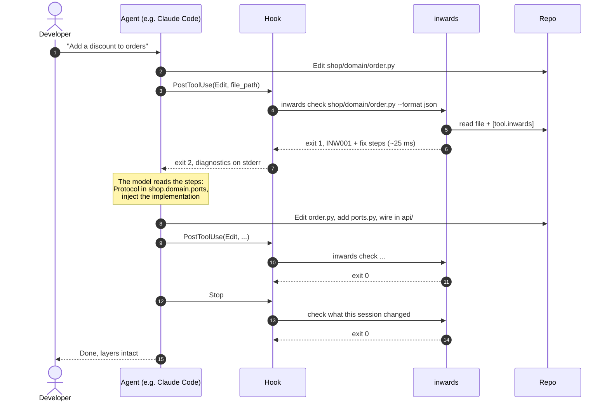
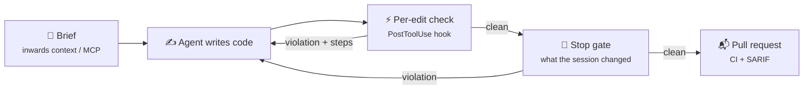

# :material-robot-happy-outline: AI integration

Inwards' main user is an AI coding agent. This chapter explains how it reaches agents, what it tells them, and how it handles an agent that would rather silence the check than fix the code.

## Where Inwards sits in the agent loop

An agent works in a loop: read, plan, edit, check, repeat. Architecture rules usually enter that loop only at the very end, when a human reviews the pull request. Inwards moves them into the "check" step and runs them on every edit.



Two hooks do the work. A **per-edit hook** gives fast feedback on the file that just changed. A **stop gate** checks everything the session changed before the agent may report success, including edits the per-edit hook never saw (Bash, commits). It checks only what changed, so a legacy repo's old violations never block a clean turn. The per-edit hook alone misses those edits, and the gate alone gives feedback too late for cheap fixes, so we use both.

## Integrations by agent

=== ":simple-anthropic: Claude Code"

    Set it up with one command, run in the project:

    ```sh
    inwards init --agent claude            # --dry-run shows the diff first
    ```

    It writes the hooks into `.claude/settings.local.json`, which holds settings for this machine only and is not committed, and keeps any hooks and settings already there. Each hook uses exec form (`"command"`: the absolute path of the binary, `"args"`: `["hook", "claude-code"]`), so Claude Code starts it with no shell: `PATH`, an activated virtualenv, spaces or `$` in the path, and Git Bash versus PowerShell on Windows make no difference. `init` also adds `.inwards/` to `.gitignore` and pins `required-version` in `[tool.inwards]`. Running it again changes nothing. It installs the hook events Inwards implements (SessionStart, PostToolUse, Stop); the config guard will add its own once it ships.

    To share the setup through the committed `.claude/settings.json` instead, write it by hand. This version relies on `inwards` being on `PATH`:

    Claude Code runs [hooks](https://code.claude.com/docs/en/hooks) around tool calls. For `PostToolUse`, exit code 2 doesn't undo the edit (it already happened), but Claude sees the hook's stderr and reacts to it. For `Stop`, exit code 2 keeps Claude working instead of ending the turn. The hook input includes `stop_hook_active`, and Claude Code ends the turn anyway after several consecutive blocks, so a broken stop hook can't trap the session.

    ```json title=".claude/settings.json"
    {
      "hooks": {
        "SessionStart": [
          { "hooks": [{ "type": "command", "command": "inwards hook claude-code" }] }
        ],
        "PostToolUse": [
          {
            "matcher": "Edit|Write|MultiEdit",
            "hooks": [
              {
                "type": "command",
                "command": "inwards hook claude-code"
              }
            ]
          }
        ],
        "Stop": [
          { "hooks": [{ "type": "command", "command": "inwards hook claude-code" }] }
        ]
      }
    }
    ```

    `inwards hook claude-code` reads the hook JSON from stdin, so it needs no `jq` and no POSIX shell and runs the same on Windows. After a `PostToolUse`, it checks the one Python file the agent just wrote:

    - **Violation:** compact JSON diagnostics on stderr, exit code 2.
    - **Warnings only** (INW006: the file belongs to no layer): exit 0, and the same JSON goes back to the model as `additionalContext`, so the edit stands but the agent hears about it.
    - **Clean file, non-Python file, or any other hook event:** exit 0, no output.
    - **Broken `[tool.inwards]`:** the message goes to stderr with exit code 2, so an agent that broke the config hears about it. With no `[tool.inwards]` at all the hook stays silent, because it may be installed for every project; the planned config guard stops an agent from deleting the table.
    - **Unreadable payload or an internal error:** exit 1. Claude Code shows that to the user, not the model.
    - **File outside the project** (`CLAUDE_PROJECT_DIR`, or the directory Claude Code runs the hook in; never the payload's own `cwd`): skipped, even when the path reaches it through `..` or a symlink. The payload comes from the agent, so Inwards doesn't trust it to pick what gets checked.
    - **Monorepos:** the nearest `pyproject.toml` with `[tool.inwards]` above the edited file applies, as long as it lies inside the project. A config above `CLAUDE_PROJECT_DIR` is ignored, so open the session at the directory that holds the config.
    - **Symlinks:** a file reached through a symlinked alias is checked under every name Python could import it by, so an alias can't move it out of its layer.

    The hook also keeps per-session state in `.inwards/state/`, always on and never sent anywhere. At `SessionStart` (startup or `/clear`) it writes `<session_id>.start.json`: the HEAD commit, every `[tool.inwards]` table in the project and a hash of every Python file. It writes to a temporary file and renames it, so the file is never half-written. After each edit it appends one line to `<session_id>.jsonl`: the file and a fingerprint of each reported violation (rule, module, message). Hooks run in parallel, so the log is only ever appended to. The Stop gate and escalation below read this state to tell violations the session introduced from ones that were already there. A session without its start file counts as unknown, and the Stop gate treats unknown as not clean. A resume or compact never writes a new start, so deleting `.inwards/` mid-session can't be undone by the next `SessionStart`. The hook refuses to follow a symlinked `.inwards` or `state`, so state can't be written outside the project. Other sessions older than a week, or beyond the newest 50, are pruned when a session starts.

    <figure markdown="span">
      { loading=lazy }
      <figcaption>Exit code 2 tells Claude Code to show the hook's stderr to the model. <code>seen-by-claude.json</code> is exactly what Claude reads.</figcaption>
    </figure>

    At `Stop`, the same command runs the **stop gate**. It checks every Python file the session changed: the edits the per-edit hook saw, plus every file whose content hash differs from the session start. The hash comparison doesn't depend on git, so a commit made mid-session, `git update-index --assume-unchanged`, gitignored and untracked files all count as changes. Inside a top-level package that holds a layer (`shop/` for `shop.domain`), nothing is skipped, so a `pyvenv.cfg`, a `node_modules` directory or a symlink into one can't hide a module there (`inwards check` walks the same way). A layer module that disappears while a module with the same name or content appears outside every layer counts as moved out of the layer, and fails the gate. Other files aren't checked: an import's verdict depends only on module names, so an edit can't make a file that imports it newly violate. It also refuses to let the turn end when it can't trust the session:

    - **No start record**, because `.inwards/` was deleted or the hooks were installed mid-session. When Claude Code sets `stop_hook_active` after a block, the gate lets that turn end.
    - **`[tool.inwards]` differs from the start snapshot**, for example after a `sed -i` through Bash, or **a changed file falls under a `pyproject.toml` that had no valid `[tool.inwards]` at the start** (a new, permissive config nested in a layer).
    - **The Inwards `SessionStart` or `PostToolUse` hook is gone from every settings layer** (user, project, local), including a `PostToolUse` matcher that no longer covers `Edit`, `Write` and `MultiEdit`, or **`disableAllHooks`** is set. The check reads the settings, not the programs they run, so it proves the configuration, not that the real Inwards runs. Claude Code reloads hooks when settings change, so removing the Stop hook itself switches the gate off at once; the config guard (below) is what blocks those edits.

    It blocks a turn at most three times. The fourth time it lets the turn end and tells the user (exit 1), and escalation (below) turns the repeated failure into a question for the user. The count starts again with each new turn. If the gate itself fails (an unreadable file, say), it blocks once with the error and lets the turn end on the next try, so a broken gate can't keep a session going forever.

=== ":material-console: Aider"

    Aider lints the files it edits and, when the linter fails, shows the output to the model and asks it to fix the problems. Inwards plugs in as the Python lint command. `inwards init --agent aider` prints the exact line, with the absolute binary path, for `.aider.conf.yml`:

    ```sh
    aider --lint-cmd "python: inwards check" --auto-lint
    ```

    Aider passes the edited file names to the command. Text output is enough here, because Aider forwards it to the model as is.

=== ":material-microsoft-visual-studio-code: Copilot (VS Code)"

    In agent mode, Copilot can read the workspace diagnostics that extensions publish. With the Inwards extension installed, a layer violation shows up in the Problems panel like any other error, and the agent sees it without a hook.

    For the Copilot coding agent that works on GitHub pull requests, enforcement happens in CI. Add `inwards check --format sarif` to the workflow and install the binary in `.github/workflows/copilot-setup-steps.yml` so the agent can run it before pushing.

=== ":material-file-document-edit-outline: Codex, Cursor and others"

    Every agent that reads `AGENTS.md` can be told to run the check. `inwards init --agent agents-md` adds (or updates) a marked section like this one:

    ```markdown title="AGENTS.md"
    ## Architecture
    This repo enforces layers with Inwards. After editing any .py file, run
    `inwards check <file> --format json` and fix every diagnostic before continuing.
    Never edit [tool.inwards] in pyproject.toml. Ask the user instead.
    ```

    An instruction is weaker than a hook, because the agent can skip it. Where the agent has a hook system, install the hook as well (`inwards init --agent claude`).

## What Inwards says, and why it's shaped that way

### Formats

| Format | For | Shape |
|---|---|---|
| `text` | Humans, Aider | `file:line:col: CODE message`, then numbered fix steps |
| `json` | Agents, scripts | `inwards/diagnostics@1`: `summary` + `diagnostics[]`, each with `fix.summary` and `fix.steps[]` |
| `sarif` | GitHub code scanning, IDE viewers | SARIF 2.1.0. Fix steps go in `message.text` and `properties.fix` |
| `concise` :material-progress-clock: | Agents on a token budget | One line per violation, like Biome's agent reporter |

<figure markdown="span">
  { loading=lazy }
  <figcaption>The JSON an agent receives: a versioned summary and ordered fix steps. Piped output is compact; <code>jq</code> only pretty-prints it here.</figcaption>
</figure>

### Writing diagnostics for a model

Every diagnostic follows the same five rules. They're design assumptions about what makes an agent fix the problem rather than hide it, and the "fixed within one retry" metric in [chapter 2](02-Business-Context.md#business-hypothesis) is how we'll find out whether they hold.

1. The fix names real things: `shop.domain.ports` and `SqlOrderRepository`, never "the appropriate layer". A concrete target leaves the agent less room to improvise.
2. It gives steps in order: delete the import, declare a Protocol, type against it, wire it in the composition root. When an agent gets only a principle, the easiest move is whatever makes the error disappear.
3. It closes the escape hatches up front. Step 1 of INW001 says *don't move the import into a function or behind `TYPE_CHECKING`; Inwards checks those too*, because moving the import is the cheapest way to quiet a naive import checker.
4. The output is stable. The same input gives the same diagnostics in the same order, and JSON fields are only ever added, so agents and scripts can rely on it.
5. The output is short. One INW001 diagnostic is about 1,100 characters of JSON, roughly 280 tokens at the usual 4 characters per token. When stdout isn't a terminal, the CLI prints compact JSON, because indentation is wasted tokens for a model. A planned `--max-diagnostics` cap with a summary line will stop a legacy repo from flooding the agent's context with hundreds of findings.

### Exit codes

`0` clean · `1` violations · `2` usage or config error. The hook turns `1` into the host's "please fix" signal (exit 2 for Claude Code). A config error is also surfaced, because an agent that broke the config needs to hear about it.

### When the agent can't fix it

Sometimes the right fix needs a decision the agent shouldn't make alone, such as a new port that changes a public API. Without a limit, the stop hook keeps blocking until the host gives up on its own. The planned `inwards hook` command reads the run log, and when the same violation (same code, file and target) survives three attempts, it switches its message: *stop editing, summarise the violation, and ask the user how to proceed*. It then exits 0 so the turn can end cleanly with a question instead of a loop.

## Stopping the agent from gaming the check

A model under pressure to finish will try the cheapest thing that turns the check green. Inwards treats that as part of the threat model.

| Evasion | Example | Inwards' answer | Status |
|---|---|---|---|
| Hide the import in a function | `def save(): from shop.infrastructure import db` | Imports are found anywhere in the tree | :white_check_mark: |
| Hide it behind `TYPE_CHECKING` | `if TYPE_CHECKING: from shop.infrastructure...` | Checked too. If a domain signature mentions an infrastructure type, the domain can't be understood or reused without it, whether or not the import runs | :white_check_mark: |
| Import the package, not the module | `from shop import infrastructure` | Resolved to `shop.infrastructure` | :white_check_mark: |
| Use a relative import | `from ..infrastructure import db` | Resolved against the file's package | :white_check_mark: |
| Put new code outside every layer | Create `shop/persistence/` and import it from the domain | INW006: the import is an error; the new package gets a warning | :white_check_mark: |
| Move a layer away | `git mv shop/domain shop/core`, so the prefix matches nothing | INW006: a prefix that matched modules at session start and matches none now fails the Stop gate | :white_check_mark: |
| Import dynamically | `importlib.import_module("shop.infrastructure.db")`, `exec("from shop.infrastructure import db")` | INW011 reports a literal target that reaches an outer layer, through aliases such as `from importlib import import_module as im`. A computed target is not read yet | :white_check_mark: literal targets |
| Suppress it | `# inwards: ignore` | Suppressions will need a code and a reason, show up in the summary, and can be rejected in hooks | :material-progress-clock: |
| Loosen the config | Move `shop.infrastructure` into the domain layer | A `PreToolUse` guard denies agent edits to `[tool.inwards]`; CODEOWNERS covers humans | :material-progress-clock: |
| Copy the code over | Paste the SQL class into `shop/domain/` | Out of scope. Duplication is for review and other tools | :x: |

The config guard matters most. An agent that can edit the rules isn't constrained by them. Until the guard ships, put `pyproject.toml` under CODEOWNERS and deny edits to it in the agent's permission settings.

## Catching hallucinated modules

Agents invent plausible modules: `from shop.domain.pricing import DiscountPolicy`, where `pricing` doesn't exist. Today that surfaces as an `ImportError` at test time, if a test covers the file. Inwards already knows every first-party module, because it walks the tree to name them. So it can flag an import of a first-party module that doesn't exist (INW010, planned) within the same 25 ms hook run, before any test is written. The fix steps will list the closest real modules by name.

## Briefing the agent before it writes (planned)

Fixing a violation costs a retry. Avoiding it costs nothing. Two planned features move Inwards earlier in the loop:

- **`inwards context`** prints a compact map of the layers, what each one may import, and where ports live. It's meant to be pasted or generated into `CLAUDE.md` / `AGENTS.md`.
- **`inwards mcp`** exposes Inwards as an MCP server with tools such as `check_files`, `explain_rule` and `where_should_this_go`. That last one takes a description ("SQL repository for orders") and answers with a layer and module path from the config.



Each stage catches what the stage before it missed, and each one costs more than the one before.
