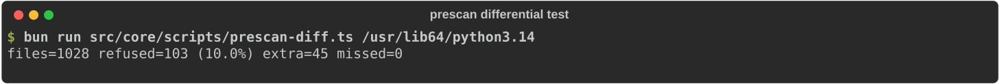

# :material-scale-balance: Architecture decisions (ADR)

Each record states the decision, the context it was made in, what it costs us, and what we turned down. Records are never edited after acceptance. A changed mind gets a new ADR that supersedes the old one.

| ADR | Decision | Status |
|---|---|---|
| [001](#adr-001-typescript-for-the-engine) | TypeScript for the engine | :white_check_mark: Accepted |
| [002](#adr-002-web-tree-sitter-wasm-not-native-bindings) | web-tree-sitter (WASM), not native bindings | :white_check_mark: Accepted |
| [003](#adr-003-ship-a-bun-single-file-executable) | Ship a Bun single-file executable | :white_check_mark: Accepted |
| [004](#adr-004-parse-the-import-skeleton-confirm-with-a-full-parse) | Parse the import skeleton, confirm with a full parse | :white_check_mark: Accepted |
| [005](#adr-005-configuration-lives-in-pyprojecttoml) | Configuration lives in `pyproject.toml` | :white_check_mark: Accepted |
| [006](#adr-006-the-engine-does-no-io) | The engine does no I/O | :white_check_mark: Accepted |
| [007](#adr-007-a-versioned-output-contract-with-fix-steps-as-data) | A versioned output contract with fix steps as data | :white_check_mark: Accepted |
| [008](#adr-008-language-server-on-node-inside-the-extension-for-now) | Language server on Node inside the extension, for now | :material-progress-clock: Accepted, revisit in M6 (v0.6) |
| [009](#adr-009-check-imports-wherever-they-appear) | Check imports wherever they appear | :white_check_mark: Accepted |
| [010](#adr-010-docs-built-with-zensical-served-by-cloudflare-workers) | Docs built with Zensical, served by Cloudflare Workers | :material-swap-horizontal: Hosting superseded by 012 |
| [011](#adr-011-rename-stratum-to-inwards) | Rename Stratum to Inwards | :white_check_mark: Accepted |
| [012](#adr-012-publish-the-docs-on-github-pages-for-now) | Publish the docs on GitHub Pages, for now | :white_check_mark: Accepted, deployed from `develop` since 019 |
| [013](#adr-013-real-paths-for-the-boundary-import-paths-for-module-names) | Real paths for the boundary, import paths for module names | :white_check_mark: Accepted |
| [014](#adr-014-report-files-whose-declared-encoding-can-hide-imports) | Report files whose declared encoding can hide imports | :white_check_mark: Accepted |
| [015](#adr-015-check-literal-dynamic-imports-as-inw011) | Check literal dynamic imports as INW011 | :white_check_mark: Accepted |
| [016](#adr-016-versions-and-releases-come-from-commit-types-via-a-release-pr) | Versions and releases come from commit types, via a release PR | :material-swap-horizontal: Branching model superseded by 019 |
| [017](#adr-017-squash-merges-with-conventional-commit-pr-titles) | Squash merges with Conventional Commit PR titles | :white_check_mark: Accepted, squashed into `develop` since 019 |
| [018](#adr-018-package-selectors-take-globs-from-the-start-monorepos-follow-uv-workspaces) | Package selectors take globs from the start; monorepos follow uv workspaces | :white_check_mark: Accepted |
| [019](#adr-019-a-develop-integration-branch-main-moves-only-at-releases) | A `develop` integration branch; `main` moves only at releases | :white_check_mark: Accepted |

## ADR-001: TypeScript for the engine

**Status:** Accepted · 2026-09-25

**Context.** Every fast linter we studied (Ruff, ty, Biome, grimp's new core, Tach) is written in Rust. Rust gives the best raw speed and the smallest binaries. But Inwards' hard problem isn't parsing speed. It's the product surface: rule semantics, fix text, agent integrations and an editor extension. That surface needs fast iteration. The VS Code extension host runs JavaScript, so a TypeScript engine runs there in-process with no second build.

**Decision.** Write the engine in TypeScript, and treat speed as an architecture problem (what we parse and when) rather than a language problem.

**Consequences.**

- :material-plus-circle-outline: One language across the engine, CLI, language server and extension. A contributor who fixes a rule sees the effect in all three.
- :material-plus-circle-outline: The large TypeScript contributor pool, and quick prototyping of agent-facing features.
- :material-minus-circle-outline: A Bun binary is large (82 MB for Linux x64, measured) compared with a Rust one.
- :material-minus-circle-outline: Parsing is slower. WASM tree-sitter manages about 1.3 MB/s per core in our benchmark. [ADR-004](#adr-004-parse-the-import-skeleton-confirm-with-a-full-parse) exists because of this.
- :material-alert-outline: If the technical hypothesis fails on real repos, the fallback is to move the prescan and graph into a Rust or Zig WASM module that the TypeScript engine calls. The rest stays.

**Alternatives.** *Rust*: best performance, but the agent kit, the rules and the extension would move slower, and we'd compete with Astral on Astral's ground. *Python*: this is what import-linter and pytest-archon do. It needs the user's environment, and grimp had to move to Rust anyway for speed.

## ADR-002: web-tree-sitter (WASM), not native bindings

**Status:** Accepted · 2026-09-25

**Context.** tree-sitter has two JavaScript bindings. The native Node addon (`tree-sitter` 0.25.1) is faster, but tree-sitter issue #5939 documents that it fails under `bun run` and `bun build --compile` ("To load Node-API modules, use require()…"). It also can't resolve its prebuild paths inside a compiled binary. Cross-compiling would mean shipping one `.node` prebuild per target, and `tree-sitter-python` publishes none for musl. The WASM binding (`web-tree-sitter` 0.27.0) is portable, and `tree-sitter-python` ships a `.wasm` grammar in its npm package.

**Decision.** Use `web-tree-sitter` with `tree-sitter-python.wasm`. The CLI embeds both `.wasm` files in the binary through `import … with { type: "file" }`. The engine receives the bytes through the `GrammarBinaries` port and never looks them up on disk. That also sidesteps the known pitfall of web-tree-sitter searching for its `.wasm` next to its JS file.

**Consequences.**

- :material-plus-circle-outline: One Linux runner cross-compiles all six targets. The CD pipeline proves it on every tag by running each binary on its native OS.
- :material-plus-circle-outline: The same bytes run in Bun, Node and, later, a browser playground.
- :material-minus-circle-outline: WASM parsing is slower than native. We haven't measured the gap ourselves yet.
- :material-minus-circle-outline: Trees live in WASM memory and must be freed by hand (`tree.delete()`). The engine does this in a `finally` block.

**Alternatives.** *Native addon*: blocked by the Bun issue and by cross-compilation. *Hand-written import lexer*: fast, but it would have to reimplement Python's string, bracket and continuation rules. The prescan in ADR-004 takes the cheap part of that idea and hands everything hard back to tree-sitter.

## ADR-003: Ship a Bun single-file executable

**Status:** Accepted · 2026-09-25

**Context.** Users expect `uv add --dev <linter>` and a binary that starts instantly, the way Ruff and ty work. Asking Python teams to install Node is a non-starter. Bun's `--compile` targets Linux (glibc and musl), macOS and Windows on x64 and arm64, and embeds assets.

**Decision.** Distribute `inwards` as one executable per target, built with `bun build --compile` (see `scripts/build-binaries.ts`). Later, wrap each binary in a platform wheel published as `inwards` on PyPI (see [ADR-011](#adr-011-rename-stratum-to-inwards) for the name).

**Consequences.**

- :material-plus-circle-outline: No runtime prerequisites. Measured: about 25 ms wall time for a one-file check including process start.
- :material-plus-circle-outline: Tags produce verified binaries automatically (`cd.yml`).
- :material-minus-circle-outline: 85 MB per binary, and each platform wheel will carry one. Over 80 MB of it is the Bun runtime, so build flags can't shrink it: minification saves 0.1 MB, and `--bytecode`, adopted after [#39](https://github.com/SirCypkowskyy/inwards/issues/39), adds 2.5 MB but halves start-up ([chapter 6](06-Constraints-and-Quality.md#spike-bytecode-and-minification)).
- :material-minus-circle-outline: We depend on Bun's release cadence and on its compile feature staying stable.

**Alternatives.** *npm package*: needs Node on the user's machine. *Node SEA (single executable applications)*: workable, but Bun gives us cross-compilation, asset embedding, the bundler and the test runner in one tool. *Deno compile*: viable, but Bun's test runner, bundler and package manager in one tool keep the monorepo simpler.

## ADR-004: Parse the import skeleton, confirm with a full parse

**Status:** Accepted · 2026-09-25

**Context.** Our first implementation parsed every file fully. On a synthetic repo of 2,100 files and 496k lines (8 MB), a cold run took **7.5 s**, and 6.1 s of that was tree-sitter parsing. Architecture rules only need imports, and in real code imports sit on their own logical lines. Parsing only the import lines of the same repo took 0.27 s.

**Decision.** Before parsing, build an *import skeleton*: keep lines that start an import statement (including parenthesised and backslash continuations), dedent them, and blank every other line so line numbers stay correct. Parse the skeleton and run the rules. If the prescan meets the word `import` anywhere it can't account for (`x = 1; import os`, `if a: import b`, a docstring line), it refuses the file and the engine parses it in full. Comment lines are skipped, since a comment can't hide an import. If the skeleton produces a violation, the engine confirms it with a full parse before reporting, which removes false positives from import-shaped text inside strings.

**Consequences.**

- :material-plus-circle-outline: Cold full run on the same repo: **0.63 to 0.96 s**, about 8 to 12 times faster, still on one core.
- :material-plus-circle-outline: Correctness is anchored to the full parse, and we test that instead of assuming it. `src/core/scripts/prescan-diff.ts` extracts imports from every file of a corpus both ways and fails if the skeleton misses one. On the CPython 3.14 standard library (1,921 files) it misses **none**, finds 33 extra that the confirming parse throws away, and refuses 8.3 % of files, which then get the full parse. CI runs it on every push against a full CPython 3.14 stdlib (2,273 files) and fails if that corpus has fewer than 1,500 files. Unit tests cover nested, parenthesised, semicolon and docstring cases.

<figure markdown="span">
  { loading=lazy }
  <figcaption>The differential test on the CPython 3.14 standard library. CI runs the same script on every push.</figcaption>
</figure>

- :material-alert-outline: Review found a real gap the corpus never showed: `from shop.infrastructure \` with `import sql_orders` on the next line was read as `import sql_orders`, and the violation went unreported. The prescan now refuses any file where a line mentioning `import` follows a backslash continuation. The stdlib has no such spellings, so `prescan-diff` now also generates its own corpus: 58 import spellings (continuations, semicolons, one-line `if`/`try`, strings and comments around imports, spaces inside dotted names, tabs, CRLF, BOM), combined in pairs and in string-context triples: 52,338 files in under 1 s. Its first run found a second gap: a string holding `from a import (` glued the real code after it onto a bogus import. The engine now discards any skeleton that doesn't parse cleanly and falls back to the full parse. A review then found the same trick with a clean parse: `import a; t = '''` inside one string opens a new string in the skeleton, which swallows the real import below it. So a skeleton is also discarded unless it holds nothing but import statements and comments. Both spellings are in the generator now (972 misses without the second guard, none with it), and the stdlib refusal rate did not change.
- :material-alert-outline: A lone `\r` ends a line in Python but not in tree-sitter, so `# note\rimport x` hid a real import inside a comment even from the full parse. The engine turns lone `\r` into `\n` before parsing. The differential test can't see this class of bug, because both sides share the parser, so a unit test pins it.
- :material-minus-circle-outline: Files with violations pay for two parses. On a legacy repo with many violations that approaches the naive cost, until the baseline (UC6) lets the engine skip re-confirming known violations.
- :material-minus-circle-outline: Future rules that need more than imports (for example "no framework decorators in the domain") can't use the skeleton and will need their own fast path or the full parse.

**Alternatives.** *Full parse with a content-hash cache*: we'll add the cache anyway, but it doesn't help cold CI runs or the first run. *tree-sitter incremental parsing*: useful in the editor, where we hold the old tree, and no help to a fresh CLI process. *`ruff analyze graph` as the import source*: fast and Rust-backed, but it makes Ruff a hard dependency, reports file-to-file edges without line and column (so no precise diagnostics), and started life as a preview command.

## ADR-005: Configuration lives in `pyproject.toml`

**Status:** Accepted · 2026-09-25

**Context.** Python tools have converged on `[tool.<name>]` in `pyproject.toml` (Ruff, pytest, mypy, uv). import-linter uses `.importlinter` or `setup.cfg` as well.

**Decision.** Read `[tool.inwards]` from the nearest `pyproject.toml` walking up from the working directory, or from `--config`. Layers are an ordered list, innermost first. A module may import its own layer and any layer listed before it.

**Consequences.**

- :material-plus-circle-outline: No new file, and one obvious place to look.
- :material-plus-circle-outline: Ordered layers make the common case (a strict onion) a four-line config.
- :material-minus-circle-outline: The config sits in a file agents edit often, for dependencies. Protecting it needs a hook or CODEOWNERS rather than a separate file with separate permissions. [Chapter 4](04-AI-Integration.md#stopping-the-agent-from-gaming-the-check) covers the guard.
- :material-minus-circle-outline: Non-linear rules (slices that may not see each other, "only via `api.py`") need more syntax later. They'll be separate tables, so the simple case stays simple.

**Alternatives.** *`inwards.toml`*: easier to lock down, but one more file. We may still support it as an option. *Python config (like pytest-archon)*: would require executing user code, which conflicts with ADR-006.

## ADR-006: The engine does no I/O

**Status:** Accepted · 2026-09-25

**Context.** The engine runs in two hosts with different I/O: a Bun binary with embedded files, and a Node language server with files on disk and unsaved buffers in memory. It will later run in tests, an MCP server, and maybe a browser.

**Decision.** `@inwards/core` takes plain data (`SourceFile[]`, the config text, `GrammarBinaries`) and returns plain data. Finding files, reading them, embedding grammars and choosing where output goes all belong to the adapters. `biome.json` enforces the runtime side of this by banning the `Bun` and `Deno` globals in `src/core/src`.

**Consequences.**

- :material-plus-circle-outline: The editor checks the unsaved buffer, and the CLI checks the file on disk, with the same function.
- :material-plus-circle-outline: Tests need no temp directories. They pass strings.
- :material-minus-circle-outline: Cross-file rules (cycles, unknown modules) need the adapter to supply the module index. The engine's API grows a "project" input when those rules arrive.

**Alternatives.** *Engine reads files itself*: simpler at first, but it would lock the engine to one runtime's file API and make the editor case awkward.

## ADR-007: A versioned output contract with fix steps as data

**Status:** Accepted · 2026-09-25

**Context.** Agents and scripts parse our output. Any unannounced change breaks someone's hook. SARIF is the standard for code-scanning UIs, and GitHub ingests it through `github/codeql-action/upload-sarif`.

**Decision.** JSON output carries `"schema": "inwards/diagnostics@1"`. Within a major version, fields may be added but never renamed or removed. Every diagnostic has `fix.summary` and `fix.steps[]`, built from the actual import and layer names. SARIF 2.1.0 carries the same steps in `message.text` and `properties.fix`. When stdout isn't a terminal, output is compact.

**Consequences.**

- :material-plus-circle-outline: Hooks and agents can depend on the shape.
- :material-plus-circle-outline: Fix quality becomes testable: tests assert on the steps.
- :material-minus-circle-outline: Fix text is now an API. Rewording it is harmless for models, but it can break snapshot tests people write against us.

**Alternatives.** *Unversioned JSON*: the common choice (Biome marks its JSON reporter experimental), but it pushes risk onto the integrations we care about most.

## ADR-008: Language server on Node inside the extension, for now

**Status:** Accepted, revisit in M6 (v0.6) · 2026-09-25

**Context.** Ruff and ty ship their language server inside the same binary (`ruff server`). That gives every LSP-capable editor (Neovim, Zed, Helix) the server for free. Inwards' scaffold instead bundles a Node LSP server into the VS Code extension, next to the grammar files.

**Decision.** Keep the Node server in the extension until the CLI has a stable `inwards server` subcommand. Then the extension becomes a thin client that starts the binary, and the Node server is deleted.

**Consequences.**

- :material-plus-circle-outline: Works today with no binary download in the extension.
- :material-minus-circle-outline: Two ways the engine is packaged. The runtime guard (ADR-006) and the extension build in CI keep them honest.
- :material-minus-circle-outline: Other editors wait for `inwards server`.

**Alternatives.** *`inwards server` now*: the better end state, but it needs stdio LSP plumbing in the binary and a download step in the extension. That's more than a scaffold should carry.

## ADR-009: Check imports wherever they appear

**Status:** Accepted · 2026-09-25

**Context.** pytest-archon lets users skip `TYPE_CHECKING` imports and look only at top-level imports. For humans those are reasonable options. For agents they're escape hatches: moving an import into a function body or a `TYPE_CHECKING` block is the cheapest way to silence a checker that ignores them.

**Decision.** INW001 checks every import in the file: top level, nested in functions or classes, and under `if TYPE_CHECKING:`. Relative imports and `from package import submodule` are resolved first.

**Consequences.**

- :material-plus-circle-outline: The common dodges don't work, and the fix text says so up front.
- :material-minus-circle-outline: Teams that deliberately allow type-only references to outer layers will want an opt-out. If we add one, it will be per layer pair and off by default.

**Alternatives.** *Top-level imports only*: faster to explain and easy to evade.

## ADR-010: Docs built with Zensical, served by Cloudflare Workers

**Status:** Accepted · 2026-09-25 · hosting part superseded by [ADR-012](#adr-012-publish-the-docs-on-github-pages-for-now)

**Context.** The docs are Markdown with Mermaid diagrams and icons. Zensical, from the Material for MkDocs team, reads `zensical.toml`, renders Mermaid natively and bundles the Material icon sets. For hosting, Cloudflare's current docs lead new static sites to Workers static assets, configured with an `assets` block in `wrangler.jsonc`.

**Decision.** `docs/zensical.toml` builds `docs/chapters/` into `docs/site/`. `docs/wrangler.jsonc` declares an assets-only Worker (`inwards-docs`). `.github/workflows/docs.yml` builds with `--clean --strict` and deploys with `cloudflare/wrangler-action@v4` on pushes to `main`. CI builds the docs on every pull request, so a broken page fails before merge.

**Consequences.**

- :material-plus-circle-outline: No Worker code to maintain. Cloudflare serves the files directly, with a real 404 page.
- :material-minus-circle-outline: Zensical is young (0.0.x). Its docs advise against build caches on CI for now, hence `--clean`.
- :material-minus-circle-outline: Needs two repository secrets: `CLOUDFLARE_API_TOKEN` and `CLOUDFLARE_ACCOUNT_ID`.

**Alternatives.** *GitHub Pages*: simpler auth, but no edge features if we later want redirects or a rules-search API. *Cloudflare Pages*: still works. We chose Workers to follow Cloudflare's current guidance and to leave room for a small Worker later (redirects, a rules search endpoint).

## ADR-011: Rename Stratum to Inwards

**Status:** Accepted · 2026-09-25

**Context.** The working name "Stratum" was taken on PyPI, npm and crates.io. Worse, in the Python world it names the Bitcoin mining pool protocol: the `stratum` package on PyPI is a Twisted mining server, and the top Python repositories called "stratum" on GitHub are mining servers and proxies. A developer searching for the linter would land on mining software. We checked a dozen alternatives against PyPI and npm on 2026-09-25.

**Decision.** The project, the command and the config table are called **Inwards**: `inwards check`, `[tool.inwards]`, the `inwards` package on PyPI and npm (both free on that date), and rule codes `INW001` and up. The name states the rule the tool enforces: dependencies point inwards.

**Consequences.**

- :material-plus-circle-outline: One name everywhere: the repository, the binary, the PyPI wheel, the config table and the rule prefix.
- :material-plus-circle-outline: No collision in our space. A GitHub search on 2026-09-25 found only small unrelated projects named Inwards (a water-data dashboard, a Flutter widget, a game), none of them Python tooling.
- :material-minus-circle-outline: "Inwards" is an ordinary English word, so searches need the "linter" or "python" qualifier.
- :material-minus-circle-outline: The JSON schema id changed to `inwards/diagnostics@1` before any release, so nothing outside this repository depended on the old one.

**Alternatives.** *Keep Stratum and publish as `stratum-lint`*: no rename work, but the mining-protocol collision stays forever. *`strataguard`, `layerly`, `onion-lint`, `tierlint`*: all free, none says what the tool does as directly.

## ADR-012: Publish the docs on GitHub Pages, for now

**Status:** Accepted · 2026-09-25 · supersedes the hosting part of [ADR-010](#adr-010-docs-built-with-zensical-served-by-cloudflare-workers)

**Context.** The first Cloudflare deploy failed: the only API token available was scoped to Cloudflare Tunnel, and the Workers API answered "No access to the specified resource". The docs shouldn't wait for a new token.

**Decision.** `.github/workflows/docs.yml` builds with Zensical and publishes `docs/site/` with `actions/upload-pages-artifact` and `actions/deploy-pages`. The Cloudflare path stays ready but dormant: `docs/wrangler.jsonc` is unchanged, and `.github/workflows/docs-cloudflare.yml` deploys it on manual dispatch once a token with *Workers Scripts: Edit* exists.

**Consequences.**

- :material-plus-circle-outline: No third-party credentials. Pages uses the workflow's own OIDC token.
- :material-plus-circle-outline: Switching back is one secret and one workflow run. Nothing in the site depends on the host.
- :material-minus-circle-outline: The site lives under a path (`/inwards/`), so `site_url` in `zensical.toml` and `DOCS_BASE` in the engine must change together if the host changes.
- :material-minus-circle-outline: GitHub Pages for a private repository needs a paid GitHub plan.

**Alternatives.** *Wait for a Cloudflare token*: leaves the docs offline for no technical reason. *Deploy from a local machine*: not reproducible, and it skips the strict build in CI.

## ADR-013: Real paths for the boundary, import paths for module names

**Status:** Accepted · 2026-09-25

**Context.** The hook's payload comes from the agent, so any path in it is untrusted. Two reviews in M0 showed that one kind of path can't serve both jobs. Checking containment and naming modules on lexical paths lets a symlink reach outside the project. Doing both on real paths (the first fix) renamed a symlinked `shop/domain/order.py` to `shared.order`, which is in no layer. A later version skipped a real package once a symlinked alias of it had been walked, so `ln -s shop/domain aaa` hid the whole domain layer. Two platform details made it worse. On macOS `/var` is a link to `/private/var`. And Bun's `realpath` folds `dlink/..` away as text, while the OS resolves `dlink` first.

**Decision.**

- **Containment** is decided on real paths. The boundary is `CLAUDE_PROJECT_DIR`, or the directory the host runs the hook in, never the payload's `cwd`. `..` is resolved the way the OS resolves it, one real path at a time.
- **Module names** follow Python: a module is named after the path it is imported through. A file reachable under several names (an alias and its real path) is checked under each name that falls under the config root, once per file.
- **The walker** follows symlinks only while their target stays inside the directory being walked. It stops only on a real cycle, found on the chain of parent directories.
- **Config discovery** decides on parsed TOML, and in the hook it ignores any `pyproject.toml` whose real path is outside the project.

**Consequences.**

- :material-plus-circle-outline: An alias can't move a file out of its layer, and a link can't pull files from outside the project into a check or into the hook's output.
- :material-minus-circle-outline: Code shared through a symlink to a directory outside the project isn't checked. Checking it would mean reading outside the project.
- :material-minus-circle-outline: A file that really has two module names can be reported twice, once per name. Both are real import paths, so both reports are true.

**Alternatives.** *Real paths only*: renames symlinked files and hides layers. *Lexical paths only*: lets a symlink reach outside the project. *No symlink support*: packages linked into a project would go unchecked without any warning.

## ADR-014: Report files whose declared encoding can hide imports

**Status:** Accepted · 2026-09-25

**Context.** CPython honours a PEP 263 declaration such as `# coding: unicode_escape` on line 1 or 2. Under that codec, the text `#\u000aimport shop.infrastructure.db` is a comment to any reader that treats the file as UTF-8, and a real import to CPython. Adapters read files as UTF-8, and the engine does no I/O and ships no codec tables.

**Decision.** The engine finds the declaration with CPython's tokenizer rules: line 1, or line 2 when line 1 is blank or a comment, with CRLF and U+2028 handled. UTF-8 variants and ASCII-compatible single-byte codecs (ASCII, Latin-1, ISO-8859-*, cp125x) are read as usual, because none of their bytes can turn into a line break or a quote. Any other declared codec gets one INW000 diagnostic on line 1 for a file in a layer, and that file's imports are not checked.

**Consequences.**

- :material-plus-circle-outline: A file whose encoding can hide an import is reported instead of being passed.
- :material-minus-circle-outline: Legitimate files in codecs such as Shift_JIS or EUC-JP get INW000 too. That is conservative, because a Shift_JIS lead byte can swallow a backslash. The fix is to save the file as UTF-8.

**Alternatives.** *Decode every codec Python supports*: needs codec tables in the engine and still has to match CPython byte for byte. *Ignore the declaration*: a silent bypass.

## ADR-015: Check literal dynamic imports as INW011

**Status:** Accepted · 2026-09-25

**Context.** Once INW001 catches imports in functions and behind `TYPE_CHECKING` ([ADR-009](#adr-009-check-imports-wherever-they-appear)), the next cheapest dodge is a call: `importlib.import_module("shop.infrastructure.db")`, `__import__(...)`, `runpy.run_module(...)`, or `exec("from shop.infrastructure import db")`. Inwards never runs user code (C4), so it can only read targets that are written down. The import skeleton ([ADR-004](#adr-004-parse-the-import-skeleton-confirm-with-a-full-parse)) keeps import statements only: a file whose only outward dependency is a call would pass the fast path with no imports at all.

**Decision.**

- A string-literal target of `importlib.import_module`, `__import__` (also as `builtins.__import__` and `importlib.__import__`) or `runpy.run_module`, and every import inside literal `exec`, `eval` or `compile` source, is checked like an import. The literal source is parsed with the same grammar, and its imports (dynamic ones too) are reported at the call.
- It is reported as its own rule, INW011 `dynamic-import`, not as INW001. The fix names the loader as the problem: delete the call and use a port, because rebuilding the name at runtime or moving it to another loader only hides the dependency.
- Loaders are recognised through import aliases (`from importlib import import_module as im`, `import builtins as b`, `from importlib import *`), plain assignments (`load = importlib.import_module`), `getattr(m, "name")`, `m["name"]`, `m.__dict__["name"]`, `vars(m)["name"]` and `__import__("importlib")`. Scopes are ignored, and `exec`, `eval`, `compile` and `__import__` always count as the builtins, so resolution can add findings but not drop one. The accepted cost is a false positive: after `from re import compile`, `compile("from shop.infrastructure import x")` is reported.
- Bindings not listed above are not followed, so a loader reached through them is missed: walrus, tuple assignment, class and instance attributes, `functools.partial`, names bound inside `exec`, and builtins reached through objects (`print.__self__`). Other loading APIs (`pkgutil.resolve_name`, `importlib.util.find_spec` with `exec_module`, `SourceFileLoader`) are not read either. [#79](https://github.com/SirCypkowskyy/inwards/issues/79) tracks all of them.
- A target is a constant string: literals, implicit concatenation, `+` between constants, and f-strings whose fields are constant strings.
- Bytes passed to `exec` or `compile` are decoded as CPython does. A PEP 263 declaration counts, and a codec Inwards can't read (the INW000 rules, [ADR-014](#adr-014-report-files-whose-declared-encoding-can-hide-imports)) gets an INW011 diagnostic saying the source can't be checked, in any layer. A `str` source ignores the declaration, as in CPython.
- Relative targets resolve as at runtime: `import_module(".x", package=...)` with a literal package, `__package__` or `__name__`, and `__import__` with a literal `level` against the file's package.
- Before the prescan, a text check looks for the names every loading call must spell: `importlib`, `runpy`, `builtins`, `__import__`, or `exec`, `eval` or `compile` not preceded by a dot, on NFKC-normalised text. A file in a layer that matches skips the skeleton and gets the full parse. `prescan-diff` checks the hint on both corpora: a dynamic import in a file the hint rejects is a miss.

**Consequences.**

- :material-plus-circle-outline: The common dynamic dodges are reported with a fix aimed at them. Tests cover each call form and alias.
- :material-minus-circle-outline: INW011 is not complete. The unfollowed bindings and loading APIs above, and computed targets, are false negatives until [#79](https://github.com/SirCypkowskyy/inwards/issues/79) and [#46](https://github.com/SirCypkowskyy/inwards/issues/46) land.
- :material-plus-circle-outline: The hint sends 209 of 1,921 CPython 3.14 stdlib files to the full parse, and only files in a layer pay for it. `re.compile` does not trigger it.
- :material-minus-circle-outline: Computed targets (`import_module(name)`, f-strings with fields), a relative `import_module` without a readable package, and literals with a `\N{...}` escape are not read. Computed targets need a separate decision, flagging every non-literal loader call in an inner layer ([#46](https://github.com/SirCypkowskyy/inwards/issues/46)).
- :material-minus-circle-outline: `prescan-diff` now parses every file it can't rule out, so the generated corpus (65,262 files) takes about 4 s instead of 1 s.
- :material-minus-circle-outline: The module index (`importersOf`) still reads static imports only, so a dynamic importer of a module is not listed as one.

**Alternatives.** *Report as INW001*: the agent would read "delete the import" and look for an import statement that isn't there. *Scan call names inside the skeleton*: the skeleton would have to keep arbitrary expression lines, which is the full parse by another name. *Flag every loader call in an inner layer*: catches computed targets too, but reports `importlib.import_module("json")`; left for a later issue.

## ADR-016: Versions and releases come from commit types, via a release PR

**Status:** Accepted · 2026-09-26

**Context.** Up to v0.1.0-rc.1, releases meant bumping `VERSION` by hand in five files (`meta.ts`, three `package.json` files, `pyproject.toml`), pushing a `v*` tag, and writing release notes by hand. Tags typed by hand are tedious and easy to get wrong, and a wrong tag is expensive: `cd.yml` refuses a tag that doesn't match `VERSION`, and PyPI never accepts the same version twice. The owner asked for versions that set themselves and a changelog nobody writes. Inwards is pre-1.0 and pre-alpha. `required-version` (pinned by `inwards init`) has to mean "the oldest release with the features this config uses".

**Decision.**

- **[release-please](https://github.com/googleapis/release-please) keeps a release PR open** (`chore: release X.Y.Z`) with the next version, the version stamped into every file, and the new `CHANGELOG.md` section. Merging it is the release: it tags `vX.Y.Z`, drafts the GitHub Release and starts `cd.yml`. Nobody types a tag or a changelog entry.
- **The version comes from the commit type** of each squash-merged PR ([ADR-017](#adr-017-squash-merges-with-conventional-commit-pr-titles)). Before 1.0, `feat` and `fix` bump the patch and a breaking change (`feat!`, `BREAKING CHANGE:`) bumps the minor, as in Cargo. After 1.0 the usual SemVer rules apply.
- **Milestone versions are set on purpose.** Closing milestone N sets `Release-As: 0.N.0` as the last paragraph of a PR description, so releases line up with the milestone names (M2 is v0.2).
- **There is one version source:** `.release-please-manifest.json`. CI fails on any PR where another version field disagrees with it.
- **The branching model is trunk-based.** There is only `main`, with short-lived branches, and no `develop` branch.
- **A release candidate is an optional hand-pushed tag** (`v0.2.0-rc.1`) on the release PR's branch, `release-please--branches--main--components--inwards`. `main` still holds the old version until the release PR merges, so a tag there fails the version check. This is the same flow as v0.1.0-rc.1.
- **Development builds from `main`** (`0.2.1-dev.N+g<sha>` for binaries, `0.2.1.devN` for wheels) are left for later, until design partners need nightlies.
- **There is no v0.1.0 release yet.** v0.1.0-rc.1 stays the published pre-release, and the release PR waits until a milestone is worth presenting.
- **Compatibility before 1.0:**
  - A patch release adds or fixes; it never breaks a config that worked.
  - A minor release may break the config or the CLI, and says so under a breaking-changes note in the CHANGELOG.
  - The `inwards/diagnostics@1` output only ever gains fields ([ADR-007](#adr-007-a-versioned-output-contract-with-fix-steps-as-data)).
  - `required-version` means "the oldest release with the features this config uses".

**Consequences.**

- :material-plus-circle-outline: A release is one merge, and the release PR shows exactly what will ship before it does.
- :material-plus-circle-outline: Version numbers stay meaningful for users and for `required-version`.
- :material-minus-circle-outline: The changelog is only as good as the PR titles ([ADR-017](#adr-017-squash-merges-with-conventional-commit-pr-titles)).
- :material-minus-circle-outline: While the repository is private and on the default `GITHUB_TOKEN`, the release PR gets no CI run of its own. Its diff is only version stamps and the changelog, and `cd.yml` reruns the tests on the tag. A GitHub App token fixes this when the repository goes public.
- :material-minus-circle-outline: A release-please release starts `cd.yml` through `workflow_dispatch`, because a tag pushed with `GITHUB_TOKEN` starts no workflow. Moving to an App token later means removing that dispatch step, or every release is built twice.
- :material-minus-circle-outline: The first release will be v0.1.1 or later (`Release-As` picks it), never v0.1.0. Its changelog compare link points at a v0.1.0 tag that doesn't exist.

**Alternatives.**

- *Bump by branch: minor on every merge to `main`, major on every release, and a `develop` branch publishing `dev+sha` builds.* This was the owner's first idea, and its goal (no manual tagging) is kept. Minor on every merge would reach 0.40 within weeks, burn a version number per PR that nobody installs, and break `required-version`: a teammate one merge behind would get "requires Inwards X or newer" all the time. Major on every release breaks SemVer, since major means incompatible. A `develop` branch adds back-merges and double CI for one maintainer merging one PR at a time.
- *semantic-release:* releases on every push with no review step, and doesn't support 0.x versions.
- *python-semantic-release:* commits and tags straight to `main` on each push, and puts a Python tool in charge of a Bun repository.
- *git-cliff plus our own tag job:* the best changelog renderer, but the bumping, stamping and tagging would all be home-made.
- *changesets:* needs a hand-written changeset file in every PR, which is exactly what the owner wanted to avoid.

## ADR-017: Squash merges with Conventional Commit PR titles

**Status:** Accepted · 2026-09-26

**Context.** Automatic versions and changelogs ([ADR-016](#adr-016-versions-and-releases-come-from-commit-types-via-a-release-pr)) read commit messages on `main`. Up to 2026-09-25 PRs were merged with merge commits, which carried every branch commit into `main`: "review fixes" rounds, work-in-progress commits, and `fix:` commits that fixed work never released. Only 19% of those commits followed Conventional Commits.

**Decision.**

- **The repository allows squash merges only.** The squash commit's title is the PR title and its message is the PR description. Merged branches are deleted automatically.
- **Every PR title is a Conventional Commit**, `type(scope): summary`, checked in CI by `pr-title.yml`.
  - `feat`, `fix`, `perf`, `deps`, `revert` and `docs` appear in the changelog.
  - `refactor`, `test`, `build`, `ci` and `chore` are hidden.
- **A breaking change is marked in the title and explained in the description:** `feat!:` in the title, plus a `BREAKING CHANGE: <what to do>` paragraph in the PR description.
- **Commits inside a branch can say anything.** They never reach `main`.

**Consequences.**

- :material-plus-circle-outline: One PR is one commit and one changelog line.
- :material-plus-circle-outline: A changelog line can be fixed after merging by editing the PR description, with a `BEGIN_COMMIT_OVERRIDE` block.
- :material-minus-circle-outline: `git bisect` on `main` stops at a whole PR, not at a single commit inside it.
- :material-minus-circle-outline: A squash-merged branch isn't an ancestor of `main`, so worktrees are cleaned up with `git branch -D` after checking that the PR is merged.

**Alternatives.**

- *Keep merge commits and lint every commit:* every review-fix commit would need a type, and branch-internal fixes would still reach the changelog.
- *Rebase merges:* the same problem, with one commit per line.
- *Hand-written changelog entries:* rejected in [ADR-016](#adr-016-versions-and-releases-come-from-commit-types-via-a-release-pr).

## ADR-018: Package selectors take globs from the start; monorepos follow uv workspaces

**Status:** Accepted · 2026-09-26

**Context.** Package shape ([#95](https://github.com/SirCypkowskyy/inwards/issues/95)) and its successors (templates [#97](https://github.com/SirCypkowskyy/inwards/issues/97), role rules [#98](https://github.com/SirCypkowskyy/inwards/issues/98)) pick packages by name. Layouts like [fastapi-best-practices](https://github.com/zhanymkanov/fastapi-best-practices) add a package per business domain, and Inwards has to serve a single-package monolith and a monorepo with several projects alike.

**Decision.**

- **Selectors accept globs from v1**, in import-linter's grammar: `a.b` is exact, `a.*` is one segment, and `a.**` is any depth below `a`. The first matching entry wins, and an exact entry hidden by an earlier glob is a config error. The config schema v2 ([#51](https://github.com/SirCypkowskyy/inwards/issues/51)) reuses the same grammar.
- **Monorepos follow uv workspaces** (`[tool.uv.workspace] members = [...]`).
  - Each member keeps its own `[tool.inwards]`, and the nearest config applies to each file, as today.
  - A later workspace-level config may apply one shape or template to every member by reusing uv's `members` globs, so the list of projects isn't repeated in the Inwards config ([#57](https://github.com/SirCypkowskyy/inwards/issues/57)).

**Consequences.**

- :material-plus-circle-outline: A new domain (`src/payments/`) is covered by `src.*` the moment it exists. The agent can't dodge the shape by adding a package the config doesn't name yet.
- :material-plus-circle-outline: Monorepo users describe their projects once, in the place uv already reads.
- :material-minus-circle-outline: Glob precedence has to be explained and tested. A glob can match packages the user didn't mean, so a selector that matches nothing is reported, and so is one hidden by an earlier entry.

**Alternatives.**

- *Explicit package names only in v1, globs later:* simpler at first, but every new domain would need a config change. The config guard ([#23](https://github.com/SirCypkowskyy/inwards/issues/23)) forbids agents from making that change, so every new domain would have to stop and wait for the user.
- *Our own workspace syntax:* would duplicate what uv already defines, and drift from it.

## ADR-019: A `develop` integration branch; `main` moves only at releases

**Status:** Accepted · 2026-09-26 · Supersedes the branching bullet of [ADR-016](#adr-016-versions-and-releases-come-from-commit-types-via-a-release-pr)

**Context.** ADR-016 chose trunk-based development because one maintainer merged one PR at a time. That changed: the owner wants agents from other harnesses (Codex, Cursor and others) to open their own PRs while the coordinating agent works. Several writers need one protected integration branch, and `main` should show only released code. Before this, neither branch had any protection.

**Decision.** The owner chose this model on 2026-09-26:

- **`develop` is the default branch.** Every PR, from any agent or person, targets it and is squash-merged with a Conventional Commit title ([ADR-017](#adr-017-squash-merges-with-conventional-commit-pr-titles)). GitHub has no separate "default base for PRs" setting, so the default branch is what makes a PR from any tool land on `develop` without extra setup.
- **`main` moves only at a release.** A promotion PR `develop` → `main` is merged with a **merge commit**, never squashed, so release-please on `main` still sees one commit per feature PR through the merge. Then the owner merges release-please's release PR into `main` (`target-branch: main` is set explicitly, because release-please would otherwise target the default branch).
- **A release happens in one sitting, with `develop` frozen:** promote, let release-please update its PR, merge it, then reopen `develop`. release-please reads `main`'s history in commit-date order and stops at the last release commit. A squash commit's date is its merge time, so a PR merged into `develop` before a release PR merges, but promoted after it, would come after the stop point and never reach a changelog. Promoting only when releasing, and releasing right after promoting, closes that window.
- **The release commit stays on `main`; nothing is merged back into `develop`.** release-please stamps versions only on lines agents never edit: `CHANGELOG.md`, the manifest, `meta.ts` (a marked line of its own), the `version` fields of the three `package.json` files, `pyproject.toml` and `uv.lock`. At the next promotion git takes those lines from `main` without a conflict. The README and the docs no longer carry a stamped version in their status paragraphs, because agents edit those sentences and every promotion would then conflict. On `develop` the version fields stay at `0.1.0` forever; they agree with each other, so the version check still passes.
- **Rulesets enforce the flow.**
  - Both branches: no direct pushes, no force pushes, no deletion, and the CI checks and the PR-title check must pass. Branches don't have to be up to date, because parallel agents would otherwise rebase each other forever. No approvals are required: every agent shares the owner's account and can't approve its own PR.
  - `develop` accepts squash merges only, and nobody can bypass its ruleset.
  - `main` accepts merge commits only, for the promotion and the release PR alike: a squashed promotion would hide every feature commit behind one `chore:` commit. The owner may bypass the checks on a PR, because release-please's PR is opened with `GITHUB_TOKEN` and gets no CI run. Every agent acts as the owner, so an agent could use that bypass too; AGENTS.md forbids it outside step 3 of a release.
- **CI runs on pushes to both branches. The docs site deploys from `develop`**, since the chapters describe the code as it is, and `main` may lag by a whole milestone.
- **Worktrees live in `~/Documents/GitHub/worktrees/<repo>/<worktree>`**, outside every checkout, so agents from different harnesses find them in one place and none is nested in another repository.

**Consequences.**

- :material-plus-circle-outline: Any number of agents can open PRs at once; the rulesets, not the agents' discipline, keep `develop` green and `main` release-only.
- :material-plus-circle-outline: `main` shows exactly what users can install. The repository page shows `develop`, the default branch.
- :material-minus-circle-outline: A release is now three steps (promote, merge the release PR, publish the draft) instead of two.
- :material-minus-circle-outline: `git log main` has merge commits again. The changelog is unaffected: the promotion's own title is `chore:` and hidden, and its description must not start a paragraph with a commit type.
- :material-minus-circle-outline: A binary built from `develop` always reports `0.1.0`, whatever the latest release is.
- :material-minus-circle-outline: A release freezes `develop` for a few minutes, and a release PR can't sit open for weeks as ADR-016 planned: release candidates are tagged in the same sitting, or on a branch cut for them.
- :material-minus-circle-outline: The docs site can describe features no release has yet. Chapters already mark planned work, and the install guide names the release it applies to.

**Alternatives.**

- *Stay trunk-based and protect `main`:* the simplest option, but then every agent's PR goes straight to the release branch, and the owner wanted a staging branch between agents and releases.
- *`main` as the default branch, plus a workflow that retargets PRs to `develop`:* the repository page would show released code. But every PR would first open against `main`, its first CI and benchmark run would compare with the wrong base, and it adds a workflow to maintain. The owner chose `develop` as the default.
- *release-please on `develop`:* releases would be cut from unpromoted code, and `main` would have no role left.
- *An automatic back-merge of `main` into `develop` after each release:* on a repository owned by a personal account, GitHub Actions can't be a ruleset bypass actor, so the push would need a PAT or a GitHub App secret. Doing it through a PR instead needs an admin bypass on `develop`, because a PR opened with `GITHUB_TOKEN` gets no CI, and that bypass would also let any agent on the owner's account merge a red PR. Since nothing conflicts without it, the owner chose not to back-merge.
