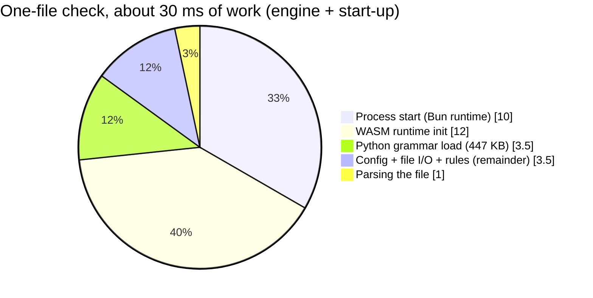

# :material-speedometer: Constraints and quality

This chapter covers the rules the design has to live within, the quality goals it's judged by, what we've measured so far, and the risks we know about.

## Constraints

| # | Constraint | Why | Where it bites |
|---|---|---|---|
| C1 | Engine in TypeScript | Shared by CLI, language server and extension ([ADR-001](05-ADR.md#adr-001-typescript-for-the-engine)) | Raw parse speed, binary size |
| C2 | Python parsed with tree-sitter, WASM build | Portable across Bun, Node and every target ([ADR-002](05-ADR.md#adr-002-web-tree-sitter-wasm-not-native-bindings)) | About 12 ms of WASM start-up per process |
| C3 | Distributed as a Bun single-file executable | No runtime prerequisites; installs as a dev dependency ([ADR-003](05-ADR.md#adr-003-ship-a-bun-single-file-executable)) | 82 MB per binary |
| C4 | Never import or execute user code | Deterministic, safe on untrusted repos, no venv needed | Dynamic imports stay invisible to static analysis |
| C5 | No network access at check time | Works offline, in sandboxes and in locked-down CI | Rule packs must ship inside the binary or the repo |
| C6 | Config in `pyproject.toml` under `[tool.inwards]` | Python convention ([ADR-005](05-ADR.md#adr-005-configuration-lives-in-pyprojecttoml)) | Protecting the config needs hooks or CODEOWNERS |
| C7 | Output contract `inwards/diagnostics@1` is additive only | Agents and scripts depend on it ([ADR-007](05-ADR.md#adr-007-a-versioned-output-contract-with-fix-steps-as-data)) | Renames need a new major schema |
| C8 | Linux, macOS and Windows on x64 and arm64 | Where agents and CI run | Path handling, CRLF, the release verify matrix |

## Quality goals

Ranked. When two goals conflict, the higher one wins.

| Rank | Goal | Scenario | Measure |
|---|---|---|---|
| 1 | :material-shield-check: **No false negatives** | An agent hides a forbidden import in a function, behind `TYPE_CHECKING`, via a relative path or a package import | Every form is reported, including `shop . infrastructure` with spaces, a backslash inside the name, NFKC identifiers and symlinked aliases of a layer. Unit tests plus the prescan differential test (0 misses on 52,338 generated and 1,921 stdlib files) |
| 2 | :material-lightning-bolt: **Agent-loop latency** | A hook checks one edited file | p95 < 100 ms wall time, process start included |
| 3 | :material-robot-outline: **Actionable for agents** | An agent gets INW001 | It fixes the violation within one retry in ≥ 80 % of cases (measured with design partners, see [chapter 2](02-Business-Context.md#the-hypothesis)) |
| 4 | :material-repeat: **Deterministic** | Same repo, same config, two runs | Identical diagnostics in identical order. Only the timing fields in the summary (`durationMs`) change |
| 5 | :material-timer-sand: **Full-repo throughput** | CI checks a 500k-line repo cold | About 1 s today on one core. Target < 300 ms with workers and cache |
| 6 | :material-package-variant: **Easy to adopt** | New team, existing codebase | One install command; the baseline keeps old violations from blocking |

Correctness sits above speed on purpose. A guardrail that sometimes stays silent teaches the agent that the wrong move is fine, and that's worse than no guardrail.

## Measurements

All numbers come from the scaffold in this repository. Nothing here is projected.

**Setup.** Intel Core Ultra 7 155H laptop, 30 GB RAM, Fedora Linux, Bun 1.4.2, `inwards-linux-x64` built by `scripts/build-binaries.ts`. Everything runs on one thread, since the engine has no worker pool yet. The laptop was in normal desktop use (load average around 2 to 3), so these are realistic numbers rather than best-case ones.

**Synthetic repo.** 2,100 Python files, 496,000 lines, 8.0 MB, four layers with eight first-party imports and forty small functions per module. `bench/generate.py` rebuilds it exactly (fixed random seed).

### Results

| Scenario | Result | Budget | Status |
|---|---|---|---|
| Cold full run, naive full parse (first design) | 7.5 s | < 1 s | :x: rejected, led to ADR-004 |
| Cold full run, import skeleton | 0.63 to 1.17 s (runs across two sessions) | < 1 s | :material-alert: at the edge |
| Single file, wall time incl. process start (30 runs) | p50 48.6 ms, p95 80.4 ms | p95 < 100 ms | :white_check_mark: with little headroom |
| Single file, engine time reported by the CLI | 16 to 30 ms | n/a | |
| `inwards --version` (process start only) | about 10 ms | n/a | |
| Prescan refusals on the CPython 3.14 stdlib | 8.2 % of 1,921 files | lower is faster | :white_check_mark: |
| Prescan missed imports on the same corpus | 0 | 0 | :white_check_mark: |
| Peak memory, full synthetic run | about 120 MB RSS | n/a | |
| Binary size, Linux x64 | 82 MB | n/a | :material-alert: large |

<figure markdown="span">
  { loading=lazy }
  <figcaption>One cold run on the synthetic repo, single core. Run-to-run spread is in the table above.</figcaption>
</figure>

### Where a single-file check spends its time

Process start and the two WASM figures were measured on their own (`inwards --version`, and a script timing `Parser.init` and `Language.load`). The parse figure was measured the same way. "Config + I/O + rules" is the remainder, not a measurement.



Parsing the file is the smallest slice. Two thirds of the cost is paying the same start-up price on every hook call. The wall-time p95 of 80 ms sits well above this 30 ms of work. The rest is scheduling noise on a busy laptop plus the harness spawning the process, and an agent's hook runner pays that too.

This changes the performance roadmap. For the agent loop, parse speed doesn't matter much. Start-up does.

### Performance roadmap

| Step | Expected effect | Targets |
|---|---|---|
| Resident process reused by hooks through a local socket, with fallback to a one-shot run (process model and command name to be settled in an ADR, since the LSP server may share it) | Removes ~25 ms of WASM and runtime start-up from every hook call | Single-file p95 |
| `bun build --bytecode` | Faster JS start-up. Bun's docs cite a large CLI going from 1.0 s to 0.53 s cold. Our bundle is small, so the gain will be smaller and needs measuring | Single-file p95 |
| Worker pool, one parser per core | Near-linear speed-up on the cold full run; this laptop has 22 logical CPUs | Cold full run |
| Content-hash cache of import lists (`.inwards/cache`) | Unchanged files skip parsing entirely | Warm full run, stop hook |
| Replace `descendantsOfType` with a tree cursor walk on the full-parse path | Profiling showed 1.2 s spent there on the naive design | Refused files and confirmations |

### Reproduce

```sh
bun install
bun test                                                    # 84 tests: unit, CLI, hook, E2E snapshots
bun run scripts/build-binaries.ts bun-linux-x64
python3 bench/generate.py /tmp/inwards-bench
(cd /tmp/inwards-bench && "$OLDPWD/dist/inwards-linux-x64" check)  # 2100 files, 0 violations, ms
bun run src/core/scripts/prescan-diff.ts "$(python3 -c 'import sysconfig; print(sysconfig.get_paths()["stdlib"])')"
```

<figure markdown="span">
  { loading=lazy }
  <figcaption>The engine's unit tests, including the prescan and colour-output cases.</figcaption>
</figure>

The screenshots in these docs come from `scripts/screenshots.py`, which runs each command for real and renders the terminal output with Rich.

## Risks

| Risk | Likelihood | Impact | Mitigation |
|---|:-:|:-:|---|
| Astral ships layer contracts in ty or Ruff | Medium | High | Compete on agent integration and fix quality, which aren't Astral's focus. Keep the rules format simple enough to export |
| import-linter adds JSON output and agent hooks | Medium | Medium | Stay ahead on latency, a standalone binary and per-violation fixes. Offer an import from `.importlinter` contracts |
| Real repos break the 100 ms p95 | Low to medium | High | Resident process first, then a Rust/Zig WASM prescan (the fallback in ADR-001) |
| The prescan misses an import on some unusual file | Low | High | Differential test in CI; grow the corpus with real repos from design partners |
| Agents edit `[tool.inwards]` to pass | High without a guard | High | PreToolUse guard, CODEOWNERS, deny rules in agent settings ([chapter 4](04-AI-Integration.md#stopping-the-agent-from-gaming-the-check)) |
| Bun `--compile` regressions or breaking changes | Low | Medium | Pinned via `.bun-version`; the CD verify matrix runs every binary |
| Zensical (0.0.x) changes its config format | Medium | Low | Docs build runs in CI on every PR; the config is small |
| Fix steps are wrong for unusual layouts (no obvious place for a port) | Medium | Medium | Measure fix-within-one-retry per rule; let the config name the ports module |
