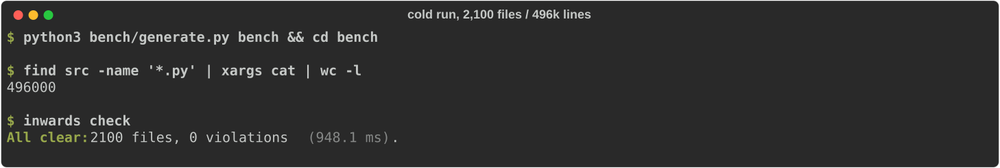
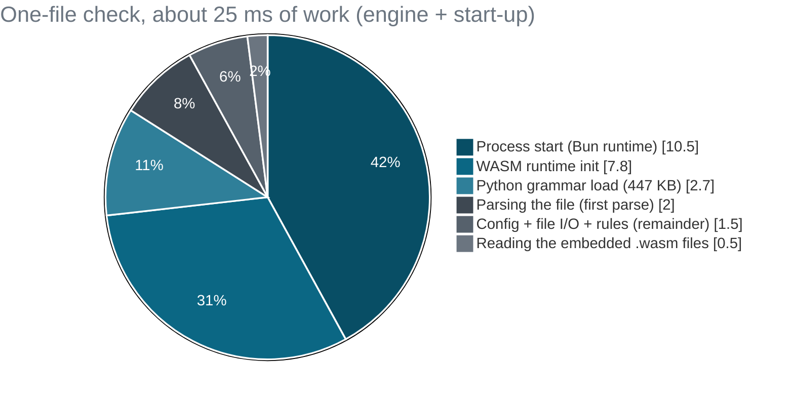
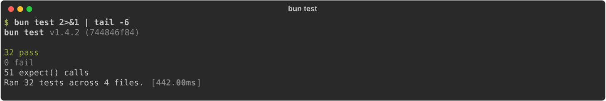

# :material-speedometer: Constraints and quality

This chapter covers the rules the design has to live within, the quality goals it's judged by, what we've measured so far, and the risks we know about.

## Constraints

| # | Constraint | Why | Where it bites |
|---|---|---|---|
| C1 | Engine in TypeScript | Shared by CLI, language server and extension ([ADR-001](05-ADR.md#adr-001-typescript-for-the-engine)) | Raw parse speed, binary size |
| C2 | Python parsed with tree-sitter, WASM build | Portable across Bun, Node and every target ([ADR-002](05-ADR.md#adr-002-web-tree-sitter-wasm-not-native-bindings)) | About 12 ms of WASM start-up per process |
| C3 | Distributed as a Bun single-file executable | No runtime prerequisites; installs as a dev dependency ([ADR-003](05-ADR.md#adr-003-ship-a-bun-single-file-executable)) | 66 to 90 MB per binary depending on the platform (85 MB for Linux x64), almost all of it the Bun runtime |
| C4 | Never import or execute user code | Deterministic, safe on untrusted repos, no venv needed | Only dynamic imports with a literal target can be checked (INW011); a computed target is reported as unverifiable in inner layers, not resolved |
| C5 | No network access at check time | Works offline, in sandboxes and in locked-down CI | Rule packs must ship inside the binary or the repo |
| C6 | Config in `pyproject.toml` under `[tool.inwards]` | Python convention ([ADR-005](05-ADR.md#adr-005-configuration-lives-in-pyprojecttoml)) | Protecting the config needs hooks or CODEOWNERS |
| C7 | Output contract `inwards/diagnostics@1` is additive only | Agents and scripts depend on it ([ADR-007](05-ADR.md#adr-007-a-versioned-output-contract-with-fix-steps-as-data)) | Renames need a new major schema |
| C8 | Linux, macOS and Windows on x64 and arm64 | Where agents and CI run | Path handling, CRLF, the release verify matrix |

## Quality goals

Ranked. When two goals conflict, the higher one wins.

| Rank | Goal | Scenario | Measure |
|---|---|---|---|
| 1 | :material-shield-check: **No false negatives** | An agent hides a forbidden import in a function, behind `TYPE_CHECKING`, via a relative path or a package import | Every form is reported, including `shop . infrastructure` with spaces, a backslash inside the name, NFKC identifiers and symlinked aliases of a layer. Dynamic imports with constant targets (`importlib.import_module`, `__import__`, `exec`) are reported as INW011, and computed targets in inner layers as unverifiable INW011. Loaders are followed through aliases, assignments, attributes, `functools.partial` and names bound inside `exec`, and constant targets are folded; chapter 3 lists the known gaps. Unit tests plus the prescan differential test (0 misses on 92,448 generated and 1,921 stdlib files, dynamic imports included, and nightly on 6,543 files from five open-source services) |
| 2 | :material-lightning-bolt: **Agent-loop latency** | A hook checks one edited file | p95 < 100 ms wall time, process start included |
| 3 | :material-robot-outline: **Actionable for agents** | An agent gets INW001 | It fixes the violation within one retry in ≥ 80 % of cases (measured with design partners, see [chapter 2](02-Business-Context.md#the-hypothesis)) |
| 4 | :material-repeat: **Deterministic** | Same repo, same config, two runs | Identical diagnostics in identical order. Only the timing fields in the summary (`durationMs`) change |
| 5 | :material-timer-sand: **Full-repo throughput** | CI checks a 500k-line repo cold | About 1 s today on one core. Target < 300 ms with workers and cache |
| 6 | :material-package-variant: **Easy to adopt** | New team, existing codebase | One command wires in the agent (`inwards init`). The Stop gate checks only what a session changed, and in a changed file only what is new since the session started, so old violations don't block; the baseline (UC6, [#33](https://github.com/SirCypkowskyy/inwards/issues/33)) will cover the rest |

Correctness sits above speed on purpose. A guardrail that sometimes stays silent teaches the agent that the wrong move is fine, and that's worse than no guardrail.

## Measurements

All numbers come from the scaffold in this repository. Nothing here is projected. They were measured during M0; the spot check below shows how they have moved since.

**Setup.** A laptop, Bun 1.4.2, `inwards-linux-x64` built by `scripts/build-binaries.ts`. Everything runs on one thread, since the engine has no worker pool yet. The laptop was in normal desktop use (load average around 2 to 3), so these are realistic numbers rather than best-case ones.

**Synthetic repo.** 2,100 Python files, 496,000 lines, 8.0 MB, four layers with eight first-party imports and forty small functions per module. `bench/generate.py` rebuilds it exactly (fixed random seed). With `--legacy` it adds an outer `legacy` layer that every module imports, so each of the 2,000 modules has one violation: the legacy codebase that [chapter 3](03-Architecture-C4.md)'s cost model times with a full baseline.

**Regression gate.** Every pull request runs `.github/workflows/bench.yml`. It builds the base branch and the PR, runs both on the synthetic repo in alternation (40 hook runs on one file, 12 full checks), and fails when the PR is more than 20% slower on either metric, or when either build fails a run (the synthetic repo is clean, so every run must exit 0). Each side is built with its own `.bun-version`, so a Bun upgrade is measured too. The change is the median of per-pair ratios, so load that drifts during the job cancels out within a pair. The full checks run with `INWARDS_NO_CACHE=1`, so the gate measures the work, not the [extraction cache](05-ADR.md#adr-031-a-content-keyed-extraction-cache-that-the-hooks-never-read). A second table, head only and not gated, times the full check with no cache, an empty cache (moved aside before each run) and a warm one. A third, head only and not gated either, times the PostToolUse hook one-shot and through [`inwards daemon`](#the-hook-daemon) in alternation and reports the daemon's p95 against [#60](https://github.com/SirCypkowskyy/inwards/issues/60)'s 50 ms target. Every other run sets `INWARDS_DAEMON=0`, so both builds run one-shot. The gate covers hook and full-check time only, not memory, start-up or binary size. The job summary shows p50/p95 for both builds (with 12 full runs, p95 is the slowest one) and the runner it ran on, and the raw samples are kept as an artifact. Locally, a build made 30% slower fails the gate, and ten runs of identical builds didn't fail it once (`bench/compare.ts`, `bench/test/compare.test.ts`).

**Real-repo corpus.** Stdlib and synthetic code don't look like a FastAPI or Django service, so `.github/workflows/corpus.yml` runs every night (and on any PR that changes the corpus or `prescan-diff.ts`) on five open-source repos pinned by commit in `bench/corpus.json`. `bench/corpus.ts` fetches each one shallow, only the pinned commit, and for three of them only the service directory (`backend/`, `server/`, `saleor/`; sparse cone mode also brings the files at the repo's top level), about 40 MB in all. It runs the prescan differential test on every `.py` file in the checkout and times the compiled binary: 5 full checks and 20 runs of `inwards check <file>` on one file per repo, after one warm-up each. None of these repos has a `[tool.inwards]` table, so the manifest gives each one a layering of ours (written to `inwards-corpus.toml` in the checkout and passed with `--config`). The violation counts come from that layering and say nothing about the projects. The job fails when the prescan misses an import, when a checkout's `.py` count differs from the manifest (a broken fetch would otherwise shrink the corpus), or when `inwards check` exits with anything but 0 or 1. A repo that still fails to fetch after three attempts, or whose run fails, is recorded in the results and fails the job; the other repos still run. The table goes to the job summary and the raw samples to the `corpus-result` artifact.

| Repo | License | Why it's in | Checked with |
|---|---|---|---|
| [fastapi/full-stack-fastapi-template](https://github.com/fastapi/full-stack-fastapi-template) `cb740b6`, `backend/` | MIT | FastAPI's official template, the layout many small services start from | core, services, api |
| [ivan-borovets/fastapi-clean-example](https://github.com/ivan-borovets/fastapi-clean-example) `9271723` | MIT | Clean architecture on FastAPI | core, outbound, inbound, main |
| [pgorecki/python-ddd](https://github.com/pgorecki/python-ddd) `429cd4b` | MIT | DDD modular monolith, three bounded contexts | domain, application, infrastructure, interface |
| [polarsource/polar](https://github.com/polarsource/polar) `cfae1ba`, `server/` | Apache-2.0 | A large FastAPI service in production, about 70 feature packages | kit, models, features, entrypoints |
| [saleor/saleor](https://github.com/saleor/saleor) `5ff5648`, `saleor/` | BSD-3-Clause | A large Django service, bigger than the synthetic repo | core, apps, api |

First run, on the laptop described under Setup (load average 3 to 4), `inwards` 0.1.0:

| Repo | `.py` files | Lines | Prescan refused | Prescan missed | Full check p50 / max | One file p50 / p95 | Violations |
|---|--:|--:|--:|--:|--:|--:|--:|
| full-stack-fastapi-template | 40 | 2,685 | 0 | 0 | 59 / 60 ms | 46 / 51 ms | 8 |
| fastapi-clean-example | 209 | 6,764 | 0 | 0 | 80 / 87 ms | 46 / 49 ms | 2 |
| python-ddd | 139 | 5,852 | 0 | 0 | 82 / 87 ms | 43 / 45 ms | 10 |
| polar | 1,831 | 435,688 | 22 (1.2 %) | 0 | 1.16 / 1.37 s | 124 / 142 ms | 494 |
| saleor | 4,324 | 847,875 | 13 (0.3 %) | 0 | 1.84 / 1.89 s | 59 / 62 ms | 758 |

The Violations column is from a later run (the INW010 review in [#45](https://github.com/SirCypkowskyy/inwards/issues/45)), after INW005 and INW010 landed; saleor's count includes INW010's four broken imports.

Two things the synthetic repo didn't show. `inwards check` on polar's `subscription/service.py` (4,482 lines, 175 KB, two violations) takes about 125 ms here and 280 ms on a GitHub runner (AMD EPYC 7763, 2 cores), over the 100 ms budget; a small file in the same repo takes about 55 ms. The budget is written for the Claude Code hook, which runs the same one-file check (`runCheck` on the edited file) after reading its payload, so the hook can only be slower. Tracked in [#122](https://github.com/SirCypkowskyy/inwards/issues/122). Rerun locally after bytecode compilation ([#118](https://github.com/SirCypkowskyy/inwards/pull/118)) cut every one-file check by 20 to 40 ms: polar's file now takes 83 / 90 ms (p50 / p95), saleor's 27 / 30 ms. And a cold full check of saleor's 848,000 lines takes 1.8 s on one core (2.5 s on the GitHub runner), where the 496,000-line synthetic repo takes 0.4 s.

### Results

| Scenario | Result | Budget | Status |
|---|---|---|---|
| Cold full run, naive full parse (first design) | 7.5 s | < 1 s | :material-close-circle: rejected, led to ADR-004 |
| Cold full run, import skeleton | 0.63 to 1.17 s (runs across two sessions) | < 1 s | :material-alert: at the edge |
| Warm full run, extraction cache ([#56](https://github.com/SirCypkowskyy/inwards/issues/56)) | p50 0.46 s, against 1.25 s uncached in the same run (3.0 times faster, machine under load) | n/a | |
| Cold whole-project check with the import cycle search ([#54](https://github.com/SirCypkowskyy/inwards/issues/54), `cycles = ["modules"]`), 8 alternating runs each with `INWARDS_NO_CACHE=1`, load average about 1.1 | median 1.51 s, against 1.35 s for the same check without it; most modules sit in cyclic groups, and every file in them is confirmed (a full parse of each would take about 7 s) | < 1 s | :material-alert: over budget on this machine with or without the search; the 0.40 to 0.44 s spot check below was on a quiet machine |
| Single file, wall time incl. process start (30 runs) | p50 48.6 ms, p95 80.4 ms | p95 < 100 ms | :material-check-circle: with little headroom |
| Single file, engine time reported by the CLI | 16 to 30 ms | n/a | |
| `inwards --version` (process start only) | about 10 ms | n/a | |
| Module index + importers of one module, cold, one core (2,100 files, fresh process) | 0.1 s index + 0.65 to 0.74 s for the importers (684 files mention `m0`: the synthetic names are the worst case for the text filter). Since #44 the index reads nothing up front: building it takes 17 to 21 ms, listing the 2,100 modules 25 to 32 ms, and the importers read the files they need, 0.53 to 0.71 s in total (0.58 to 0.66 s for the eager index it replaced) | < 1 s | :material-check-circle: |
| Prescan refusals on the CPython 3.14 stdlib | 8.3 % of 1,921 files | lower is faster | :material-check-circle: |
| Prescan missed imports on the same corpus | 0 | 0 | :material-check-circle: |
| Prescan missed imports on the real-repo corpus (6,543 files, five services) | 0 | 0 | :material-check-circle: |
| Peak memory, full synthetic run | about 120 MB RSS | n/a | |
| Binary size, Linux x64 | 82 MB | n/a | :material-alert: large |

<figure markdown="span">
  { loading=lazy }
  <figcaption>One cold run on the synthetic repo, single core. Run-to-run spread is in the table above.</figcaption>
</figure>

!!! note "Spot check on 0.1.0 (2026-09-26)"
    Same laptop, a fresh `inwards-linux-x64` build, load average about 1, measured twice independently with the same result. Single-file check on the example app, 30 runs: p50 37 ms, p95 40 ms wall time, 14 ms engine time. `inwards --version`: about 19 ms, up from about 10 ms. Cold full run on the synthetic repo, 5 runs: 0.40 to 0.44 s. Peak RSS about 207 MB, up from about 120 MB. Binary size is unchanged at 82 MB (79 MiB). The bytecode spike below halved start-up after this check, and the start-up breakdown was redone with it. The CI benchmark ([#29](https://github.com/SirCypkowskyy/inwards/issues/29)) now fails any PR that makes the hook or the full check more than 20% slower; it doesn't track memory, start-up or binary size.

### Spike: bytecode and minification

[#39](https://github.com/SirCypkowskyy/inwards/issues/39) asked whether `bun build --compile` flags cut start-up or binary size. Since then `scripts/build-binaries.ts` builds with `--bytecode --format=esm` on top of `--minify --sourcemap=linked`.

**Method.** Six variants of `inwards-linux-x64` from one commit, Bun 1.4.2, the same laptop as above. Start-up: 200 rounds of `inwards --version`, every variant once per round in rotating order. Hook and full check: `bench/compare.ts` with the current build as base, 100 hook runs and 20 full checks per side, change as the median of per-pair ratios. Peak RSS: `/usr/bin/time -f %M`, median of 5 runs. MB means 10^6 bytes throughout. The load average was 2 to 6 during the runs, so trust the ratios more than the absolute milliseconds; a base-against-base run moved 0.2% (hook) and 0.6% (full).

| Variant | Size (Linux x64) | `inwards --version` p50 / p95 | Hook, one file | Full check | Peak RSS, full / hook |
|---|---|---|---|---|---|
| Before: `--minify --sourcemap=linked` | 82.4 MB (37.1 MB gzipped) | 22.3 / 30.9 ms | base | base | 202 / 54 MB |
| Without `--minify` | 82.6 MB | +3.0% | +3.7% | +1.5% | 203 MB full |
| Without the sourcemap | 82.2 MB | -0.7% | not run | not run | |
| No `.env` or `bunfig.toml` autoload | 82.4 MB | -0.8% | -3.0% | +0.6% | 205 MB full |
| `--bytecode` (CJS, Bun's default with it) | 85.0 MB | 10.0 / 14.6 ms (-56%) | -45.6% | -5.6% | 205 / 55 MB |
| **`--bytecode --format=esm` (adopted)** | 84.9 MB (38.4 MB gzipped) | 10.5 / 14.3 ms (-53%) | -45.4% | -7.0% | 205 / 56 MB |

A repeat with the committed build and `bench/compare.ts` defaults (40 hook runs, 12 full checks) gave hook p50 / p95 64.4 / 73.6 ms before and 32.6 / 37.4 ms after (-48.0%), and full check -9.9%. A second start-up run gave 25.0 ms before and 10.8 ms after. On the example app, 60 alternating single-file checks: p50 58.7 → 30.3 ms and p95 77.7 → 39.5 ms wall time, and the engine's own time fell from 21.7 to 14.5 ms, because the engine and web-tree-sitter's JS glue no longer get parsed on first call either.

- **Bytecode is the win.** It moves JS parsing from every start to build time. It costs 2.5 MB per binary (1.3 MB gzipped) and 1 to 3 MB of RSS.
- **Size can't be fixed with flags.** Everything Inwards adds is under 1 MB (176 KB of minified JS, 0.67 MB of WASM); the rest is the Bun runtime. Minification was already on and saves 0.1 MB; the sourcemap costs 0.26 MB and keeps stack traces pointing at the TypeScript source, so it stays.
- **ESM, not CJS.** Head to head the two bytecode builds differ by +2.9% (hook) and +2.2% (full), within noise. ESM keeps the module semantics the binary had before.
- **Checked.** The 350 tests pass against the compiled binary (`INWARDS_BIN=dist/inwards-linux-x64 bun test`), so do `--version` and both embedded `.wasm` files (every check parses). A test program built the same way still reports the TypeScript line of a thrown error through the linked sourcemap. All six targets cross-compile, and the musl build checks the synthetic repo inside Alpine. CI's test matrix builds and tests the macOS and Windows binaries natively.
- **Not tried.** Bun's current docs list `--compile-jit-policy` and `--bytecode-order` (profile-guided bytecode layout); Bun 1.4.2's `bun build` has neither. `--bytecode-depth`, which 1.4.2 has, wasn't measured. Worth a look after a Bun upgrade.

### Where a single-file check spends its time

Redone in the bytecode spike, with the bytecode build. Process start is `inwards --version`. The grammar and parse figures come from a script compiled the same way that times reading the embedded `.wasm` files, `Parser.init`, `Language.load` and one parse of `shop/domain/order.py` from the example app, median of 30 runs. "Config + I/O + rules" is the engine time the CLI reports (14.5 ms) minus those, not a measurement.



In M0 the same check was about 30 ms of work: 10 ms process start, 12 ms WASM init, 3.5 ms grammar load, 1 ms parse and 3.5 ms remainder, all without bytecode. Parsing the file is still a small slice. About 85% of the cost is paying the same start-up price on every hook call. The wall-time p50 of 30 ms sits above this 25 ms of work because the harness spawns the process, and an agent's hook runner pays that too.

This changes the performance roadmap. For the agent loop, parse speed doesn't matter much. Start-up does.

### Spike: a resident process

[#59](https://github.com/SirCypkowskyy/inwards/issues/59) asked whether the hooks and the language server should share one resident process, and what the hooks would gain from one. The decision is [ADR-039](05-ADR.md#adr-039-a-hook-daemon-per-project-separate-from-the-language-server).

**Method.** One arm64 laptop on macOS, Bun 1.4.2, `inwards-darwin-arm64` built by `scripts/build-binaries.ts` from `aede2ab`. Other agents were working on the machine, so the load average was 5 to 7; trust the differences more than the absolute numbers. The project is `examples/broken-app` with a generated `shop/domain/big.py` added: 4,492 lines, 114 KB, two INW001 violations, close to polar's file in [#122](https://github.com/SirCypkowskyy/inwards/issues/122) (4,482 lines, two violations). The hook input is the Claude Code `PostToolUse` fixture pointed at each file, after a SessionStart, so both files' violations count as old. Each case ran 80 times (60 for PreToolUse and Stop), every case once per round in rotating order, after one warm-up; check runs set `INWARDS_NO_CACHE=1`. The resident process is a throwaway Bun script, run from source, that serves today's `hookClaudeCode` warm behind a Unix socket, with a per-request `Runtime` and buffered `Streams`; the client is a 10-line program compiled like the binary. "With caches" adds an in-memory extraction cache keyed by content and keeps `git cat-file blob` answers, which name a commit, for the life of the process.

| Scenario | p50 | p95 |
|---|--:|--:|
| An empty program compiled like the binary | 16.6 ms | 17.4 ms |
| `inwards --version` | 15.5 ms | 16.9 ms |
| The spike client with no daemon listening | 13.1 ms | 14.1 ms |
| `inwards check` on the 13-line `order.py` | 27.7 ms | 30.6 ms |
| `inwards check` on `big.py` | 70.8 ms | 77.3 ms |
| The same two checks warm, in one process (`runCheck`, 200 runs) | 0.8 / 29.8 ms | 1.4 / 31.3 ms |
| PreToolUse, one-shot | 16.8 ms | 17.6 ms |
| Stop over both files, one-shot | 141.1 ms | 149.6 ms |
| PostToolUse `order.py`: one-shot | 46.6 ms | 50.2 ms |
| PostToolUse `order.py`: resident | 32.3 ms | 35.2 ms |
| PostToolUse `order.py`: resident, with caches | 17.2 ms | 19.8 ms |
| PostToolUse `big.py`: one-shot | 119.9 ms | 151.6 ms |
| PostToolUse `big.py`: resident | 91.1 ms | 97.7 ms |
| PostToolUse `big.py`: resident, with caches | 18.2 ms | 19.7 ms |
| PostToolUse `big.py`, changed before every call (40 rounds): one-shot | 117.5 ms | 122.8 ms |
| PostToolUse `big.py`, changed before every call: resident, with caches | 47.6 ms | 50.1 ms |

- **The client's start is the floor.** Every hook call starts a process, about 15 ms here, before it can reach a daemon. Finding that no daemon listens costs nothing measurable.
- **One git call is half of a small file's hook.** PostToolUse reads the file's session-start text with `git cat-file blob` to split old violations from new ones: about 15 ms per call on this machine. A daemon reads it once per session.
- **PostToolUse checks a file twice,** as it is now and as it was at session start: 30 ms each for `big.py`, warm. With a cache keyed by content, the start text is parsed once per session; an edited file still costs one parse.
- **Warm JIT counts too.** A one-shot check costs 27 ms more than a warm one for `order.py` and 41 ms more for `big.py`. The extra 14 ms is parsing and walking code that a fresh process hasn't optimised yet.
- **PreToolUse can't gain,** at 16.8 ms against the 15.5 ms floor. Stop takes 141 ms but runs once per turn.
- **Memory.** The resident processes held 151 and 212 MB of RSS after the runs.
- **Not measured:** Windows named pipes, the compiled binary as the resident process, and Linux. The spike's scripts were throwaway and aren't in the repository; [#60](https://github.com/SirCypkowskyy/inwards/issues/60) adds the daemon to the benchmark job.

### The hook daemon

[#60](https://github.com/SirCypkowskyy/inwards/issues/60) built the resident process the spike above measured, as [ADR-039](05-ADR.md#adr-039-a-hook-daemon-per-project-separate-from-the-language-server) decided: `inwards daemon` serves PostToolUse through a Unix socket (a named pipe on Windows), keeps extractions by text hash and git's answers by commit id, and reads everything else again on each request. The hook command itself is unchanged, so every PostToolUse still starts one process.

**Method.** The same arm64 laptop on macOS as the spike, the compiled `inwards-darwin-arm64` with bytecode, load average 5 to 7 from other agents. `examples/broken-app` in a fresh git repository with a generated 4,492-line `shop/domain/big.py` holding two INW001 violations, after a SessionStart, so every finding is old and the hook reads each file's start text from git. One-shot (`INWARDS_DAEMON=0`) and through the daemon alternate in each round, with `INWARDS_NO_CACHE=1`; 80 rounds after 2 warm-ups, 40 when the file changes before every call.

| PostToolUse | One-shot p50 / p95 | Through the daemon p50 / p95 |
|---|--:|--:|
| `order.py`, 13 lines | 38.0 / 39.3 ms | 15.3 / 16.2 ms |
| `big.py`, 4,492 lines | 75.7 / 81.8 ms | 16.0 / 19.2 ms |
| `big.py`, changed before every call | 76.1 / 79.0 ms | 26.8 / 36.8 ms |

- **The target holds on this laptop.** p95 is under 50 ms in every case, also for the large file that changes before every call, where the spike's prototype was at 50.1 ms.
- **The bench job's synthetic repo**, on the same laptop: 23.8 / 25.3 ms one-shot, 14.9 / 16.5 ms through the daemon (40 runs; no session, so no git read).
- **Memory.** The daemon held 188 MB of RSS after 206 hook runs over both files.
- **Not measured here:** Windows named pipes. CI runs the daemon's tests on Linux for every PR; the Windows and macOS rows run them only in the manual full matrix before a release.

### Performance roadmap

| Step | Expected effect | Targets |
|---|---|---|
| :material-check-circle: `inwards daemon`: a resident process per project that PostToolUse reaches through a local socket, with fallback to a one-shot run; the language server stays a separate process, `inwards server` ([ADR-039](05-ADR.md#adr-039-a-hook-daemon-per-project-separate-from-the-language-server), [#60](https://github.com/SirCypkowskyy/inwards/issues/60)), done | Measured ([above](#the-hook-daemon)): PostToolUse p95 39.3 → 16.2 ms for a 13-line file, 79.0 → 36.8 ms for a 4,492-line file edited before every call | Single-file p95 |
| :material-check-circle: `bun build --bytecode` ([#39](https://github.com/SirCypkowskyy/inwards/issues/39)), done | Measured: start-up 22 → 10 ms, hook call about 45% faster, 2.5 MB more per binary (see the spike above) | Single-file p95 |
| Worker pool, one parser per core ([#61](https://github.com/SirCypkowskyy/inwards/issues/61)) | Near-linear speed-up on the cold full run on a multi-core machine | Cold full run |
| :material-check-circle: Content-hash cache of import lists (`.inwards/cache`, [#56](https://github.com/SirCypkowskyy/inwards/issues/56)), done for `inwards check` and `inwards baseline` | Measured: a warm full check 3.0 times faster (0.46 s against 1.25 s p50, 12 runs each on this laptop under load), 27% slower while it fills. The hooks don't use it ([ADR-031](05-ADR.md#adr-031-a-content-keyed-extraction-cache-that-the-hooks-never-read)) | Warm full run |
| :material-check-circle: Tree-cursor walk instead of `descendantsOfType` on the full-parse path ([#62](https://github.com/SirCypkowskyy/inwards/issues/62)), done | Measured on 2,100 synthetic files, cold, 10 alternating runs each: 13% faster when every file needs a confirmation (3.34 → 2.90 s p50), 10% faster when the prescan refuses every file (3.13 → 2.80 s). Reading the imports and suppression comments of the 1,059 stdlib files went from about 560 ms to 125 ms. The one-file hook and the clean full check don't change | Refused files and confirmations |

### Reproduce

```sh
bun install
bun test                                                    # 607 tests: unit, CLI, hook, Stop gate, baseline, stats, E2E snapshots, doc snippets, bench
bun run scripts/build-binaries.ts bun-linux-x64
python3 bench/generate.py /tmp/inwards-bench
(cd /tmp/inwards-bench && "$OLDPWD/dist/inwards-linux-x64" check)  # 2100 files, 0 violations, ms
bun run src/core/scripts/prescan-diff.ts "$(python3 -c 'import sysconfig; print(sysconfig.get_paths()["stdlib"])')"
bun run bench/corpus.ts --bin dist/inwards-linux-x64 --dir ~/.cache/inwards-corpus  # real-repo corpus, about 90 s
```

`bench/corpus.ts` reuses a checkout that is already at its pinned commit, so later runs download nothing. To add a repo, append it to `bench/corpus.json` with a full commit SHA, its `.py` count and a layering; the PR runs the corpus workflow.

<figure markdown="span">
  { loading=lazy }
  <figcaption>The engine's unit tests, including the prescan and colour-output cases.</figcaption>
</figure>

Two checks keep the agent-facing tests honest. A code fence in `docs/chapters/guides` or `docs/chapters/rules` that follows a `<!-- e2e -->` line and one blank line (without it, the comment breaks a list item) runs as an E2E case in a fresh project, against the compiled binary in CI (`src/cli/test/integration/docs.test.ts`); untagged fences are never run. The fences run in the system's bash, which on macOS is bash 3.2, so the harness never puts a heredoc inside `$(...)`: bash 3.2 matches quotes across it, and one apostrophe in a documented message breaks the script. Every night, `.github/workflows/nightly-e2e.yml` records the Claude Code hook payloads again with a headless `claude -p` session and opens an issue when a field is added, removed or changes type against the recorded fixtures.

The screenshots in these docs come from `scripts/screenshots.py`, which runs each command for real and renders the terminal output with Rich.

## Risks

| Risk | Likelihood | Impact | Mitigation |
|---|:-:|:-:|---|
| Astral ships layer contracts in ty or Ruff | Medium | High | Compete on agent integration and fix quality, which aren't Astral's focus. Keep the rules format simple enough to export |
| import-linter adds JSON output and agent hooks | Medium | Medium | Stay ahead on latency, a standalone binary and per-violation fixes. Keep switching one command: `inwards import-config` converts import-linter contracts ([guide](guides/import-linter.md)) |
| Real repos break the 100 ms p95 | Happened: a 4,482-line polar file with violations took 125 to 280 ms before bytecode compilation, 90 ms p95 locally after ([#122](https://github.com/SirCypkowskyy/inwards/issues/122)) | High | `inwards daemon` first ([ADR-039](05-ADR.md#adr-039-a-hook-daemon-per-project-separate-from-the-language-server)), then a Rust/Zig WASM prescan (the fallback in ADR-001) |
| The prescan misses an import on some unusual file | Low | High | Differential test in CI on the stdlib, nightly on five real services; grow that corpus with repos from design partners |
| Agents edit `[tool.inwards]` to pass | High without a guard | High | PreToolUse config guard, the Stop gate's config comparison, `permissions.deny` rules from `init`, CODEOWNERS ([chapter 4](04-AI-Integration.md#stopping-the-agent-from-gaming-the-check)). Bash can still get past the guard; a replayed session start is caught by the start record's copy outside the project, unless the agent deletes that too, and a Stop hook removed through Bash is only reported at the next session start ([#88](https://github.com/SirCypkowskyy/inwards/issues/88)) |
| Bun `--compile` regressions or breaking changes | Low | Medium | Pinned via `.bun-version`; the CD verify matrix runs every binary |
| A binary silently ignores its bytecode (Bun falls back to parsing the source) and start-up doubles | Low | Low | Tests still pass in that case; the PR benchmark catches it on Linux only. Bytecode is tied to the Bun version that built it, and every binary embeds that same version |
| The self-hosted part of CI is unavailable and the PR jobs that run there queue | Medium | Medium | To save GitHub Actions limits and costs, some automated CI jobs run on self-hosted infrastructure; when it is unavailable, those jobs can run on GitHub-hosted runners instead |
| Zensical (0.0.x) changes its config format | Medium | Low | Docs build runs in CI on every PR; the config is small |
| Fix steps are wrong for unusual layouts (no obvious place for a port) | Medium | Medium | Measure fix-within-one-retry per rule; let the config name the ports module |
