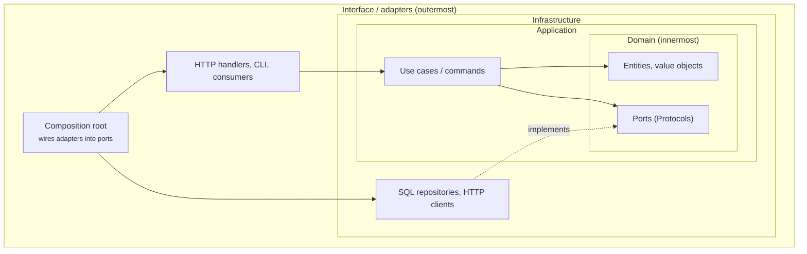

# :material-book-alphabet: Glossary

The vocabulary used across these docs. Architecture terms mean what they usually mean in the DDD and Clean Architecture literature. Where Inwards uses a word more narrowly, the entry says so.

## How the architecture terms fit together

Arrows point in the direction of imports. Every solid arrow points inward, and that's the rule INW001 enforces. The dashed arrow is "implements": the infrastructure class satisfies a Protocol that the domain owns.

## Architecture terms

Adapter
:   Code that connects a port to a real technology: a SQL repository, an HTTP client, a message consumer. Adapters live in outer layers.

Bounded context
:   A part of the system with its own model and language (DDD). In a Python codebase, usually a top-level package such as `billing` or `shipping`. [Contexts](guides/configuration.md#contexts) are declared in `[[tool.inwards.contexts]]`; [INW002](rules/INW002.md) lets one import another only when its `depends-on` declares it.

Clean Architecture
:   Robert C. Martin's layering: entities at the centre, then use cases, then interface adapters, then frameworks. Its dependency rule is that source code dependencies point only inward.

Composition root
:   The one place, in the outermost layer, where concrete adapters are created and handed to the code that needs them. Inwards' fix steps send wiring here.

Dependency rule
:   Inner layers must not know about outer ones. INW001 is this rule, applied to imports.

Domain layer
:   Business rules and the vocabulary of the problem, free of frameworks and I/O. In Inwards configs it's usually listed first.

Hexagonal architecture / Ports and adapters
:   Alistair Cockburn's style: the application core talks to the world only through ports, and adapters plug into them. Inwards treats it as a layered config whose inner layer owns the ports.

Layer
:   In Inwards, a named set of module prefixes in `[tool.inwards].layers`. The order of the list is the order from inside to outside.

Port
:   An interface the inner code owns and the outer code implements. In Python, usually a `typing.Protocol`.

Vertical slice
:   Organising code by feature (`orders/`, `invoices/`) rather than by technical layer, with each slice holding its own handlers and data access. Slices shouldn't reach into each other. Each slice can be declared as a [context](guides/configuration.md#contexts), and [INW002](rules/INW002.md) keeps slices apart unless `depends-on` says otherwise; a layer can cover every slice with one [selector](guides/configuration.md#selectors), such as `shop.*.domain`.

## Inwards terms

Agent hook
:   A command that an AI coding tool runs automatically around its own actions, for example Claude Code's `PostToolUse` and `Stop` hooks. Inwards' main integration point. `inwards init --agent claude` installs four of them. See [chapter 4](04-AI-Integration.md).

Baseline
:   The violations a project already had when it adopted Inwards, recorded by `inwards baseline` in `inwards-baseline.json` next to `pyproject.toml`. They don't fail the check; new ones do (UC6). Entries match by rule, module and message, not by line.

Config guard
:   The `PreToolUse` hook that denies an agent's edits to `[tool.inwards]`, to `.inwards/`, to `inwards-baseline.json` and to the Claude Code settings that hold the Inwards hooks, before they happen. See [chapter 4](04-AI-Integration.md#stopping-the-agent-from-gaming-the-check).

Confirming parse
:   The full tree-sitter parse the engine runs when the import skeleton reports a violation, so that only real imports are ever reported. See [ADR-004](05-ADR.md#adr-004-parse-the-import-skeleton-confirm-with-a-full-parse).

Diagnostic
:   One reported violation: code, location, message, fix and docs link. Serialised as part of `inwards/diagnostics@1`.

Differential test
:   `src/core/scripts/prescan-diff.ts`. It compares the imports found through the skeleton with those found by a full parse across a corpus, and fails if the skeleton misses any.

Engine
:   `@inwards/core`. Pure TypeScript that turns source text, config and grammars into diagnostics. It does no I/O ([ADR-006](05-ADR.md#adr-006-the-engine-does-no-io)).

Escalation
:   What the hooks do once the same violation survives `escalate-after` attempts (default 3): the edit that reaches the limit doesn't block, the Stop gate lets the turn end after its last block, the agent is told to ask the user, and what is unresolved goes to the user and to the next session. It isn't sticky: the next edit with the violation blocks again. See [chapter 4](04-AI-Integration.md#when-the-agent-cant-fix-it).

Evasion
:   An agent changing code so that a check goes quiet without fixing the design, for example moving an import into a function. Chapter 4 lists the evasions Inwards handles.

Extraction cache
:   `.inwards/cache`: what `inwards check` and `inwards baseline` read out of each file (its import skeleton, static imports and suppression comments), keyed by a hash of its content, module name and extraction rules. The hooks never read it; the language server keeps its own in memory. `--no-cache` or `INWARDS_NO_CACHE=1` turns it off. See [ADR-031](05-ADR.md#adr-031-a-content-keyed-extraction-cache-that-the-hooks-never-read).

Fingerprint
:   A 16-hex-digit hash of a violation's rule code, module and message. The session state and the run log use it to recognise the same violation across edits, independent of its line number.

Fix steps
:   The ordered, concrete repair instructions attached to every diagnostic, built from the actual module and layer names.

GrammarBinaries
:   The port through which adapters hand the engine the tree-sitter runtime and Python grammar as bytes.

Hallucinated module
:   An import of a first-party module that doesn't exist, such as `shop.domain.pricing` when there is no `pricing`. Agents produce these because the name looks plausible. INW010 catches them from the module index, before any test runs.

Import skeleton
:   A copy of a file where every non-import line is blank and import lines are dedented. Line numbers are preserved, and it parses far faster than the whole file.

Module index
:   The engine's view of a project's first-party modules (`Engine.index`), which every adapter passes to each check: the owner of an import, the list of modules, and the importers of any one module, each worked out on demand. INW006 uses the owner; INW010 uses the owner to tell whether a module exists, and a listing of the package it would live in to suggest the closest real ones.

Prescan refusal
:   The prescan declining a file because `import` appears somewhere it can't account for. The file then gets a full parse. 8.3 % of CPython's stdlib files are refused.

Rule code
:   `INW` or a family prefix such as `FAPI` (FastAPI rules), plus three digits. Codes are never reused, and a retired rule keeps its number.

Release PR
:   The pull request release-please keeps open with the next version and its changelog. Merging it cuts the release ([ADR-016](05-ADR.md#adr-016-versions-and-releases-come-from-commit-types-via-a-release-pr)).

Run log
:   `.inwards/runs.jsonl`: with the log on, one line per hook run or `inwards check`; `inwards check --log` adds a line even when it is off. Each line has time, event, files, lines added and removed, violation fingerprints, exit code and duration. Local and off by default. It feeds the design-partner metrics. See [chapter 8](08-Run-Log.md).

Session state
:   What the Claude Code hooks record per session in `.inwards/state/`: the start snapshot (HEAD, every `[tool.inwards]` table, a hash of every Python file) and one line per edit. Always on and local. The Stop gate and escalation read it.

Stop gate
:   The check run from the agent's `Stop` hook. It checks every Python file the session changed, plus whether the config and the hooks are still intact, and keeps the agent from ending the turn while they aren't.

Suppression
:   A comment on the line a finding points at, `# inwards: ignore[INW001] reason="why"`, that hides that finding. The reason is mandatory, every report counts suppressions, and by default the Claude Code hooks ignore one the agent added during the session. See [ADR-028](05-ADR.md#adr-028-inline-suppressions-need-a-reason-and-an-agent-cant-add-one-by-default).

## Tooling terms

C4 model
:   Simon Brown's four levels of architecture diagrams: context, containers, components, code. These docs use the first three.

LSP
:   Language Server Protocol. It's how the VS Code extension gets diagnostics from the Inwards language server.

MCP
:   Model Context Protocol. It lets an AI agent call external tools. `inwards mcp` is planned ([#65](https://github.com/SirCypkowskyy/inwards/issues/65)).

SARIF
:   Static Analysis Results Interchange Format 2.1.0, a JSON format for analysis results. GitHub code scanning ingests it.

tree-sitter
:   An incremental parser generator with grammars for many languages. Inwards uses its WASM build (`web-tree-sitter`) with `tree-sitter-python`.

Zensical
:   The static site generator that builds these docs, from the team behind Material for MkDocs.

*[ADR]: Architecture Decision Record
*[DDD]: Domain-Driven Design
*[LSP]: Language Server Protocol
*[MCP]: Model Context Protocol
*[SARIF]: Static Analysis Results Interchange Format
*[WASM]: WebAssembly
