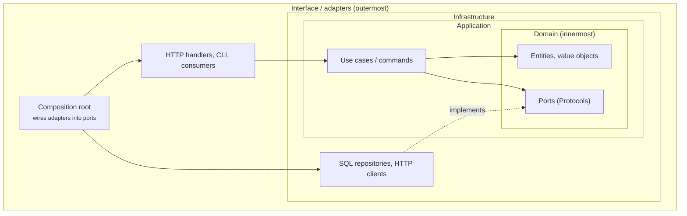

# :material-book-alphabet: Glossary

The vocabulary used across these docs. Architecture terms mean what they usually mean in the DDD and Clean Architecture literature. Where Inwards uses a word more narrowly, the entry says so.

## How the architecture terms fit together

Arrows point in the direction of imports. Every solid arrow points inward, and that's the rule INW001 enforces. The dashed arrow is "implements": the infrastructure class satisfies a Protocol that the domain owns.

## Architecture terms

Adapter
:   Code that connects a port to a real technology: a SQL repository, an HTTP client, a message consumer. Adapters live in outer layers.

Bounded context
:   A part of the system with its own model and language (DDD). In a Python codebase, usually a top-level package such as `billing` or `shipping`. INW002 (planned) keeps contexts from importing each other's internals.

Clean Architecture
:   Robert C. Martin's layering: entities at the centre, then use cases, then interface adapters, then frameworks. Its dependency rule is that source code dependencies point only inward.

Composition root
:   The one place, in the outermost layer, where concrete adapters are created and handed to the code that needs them. Inwards' fix steps send wiring here.

Dependency rule
:   Inner layers must not know about outer ones. INW001 is this rule, applied to imports.

Domain layer
:   Business rules and the vocabulary of the problem, free of frameworks and I/O. In Inwards configs it's usually listed first.

Hexagonal architecture / Ports and adapters
:   Alistair Cockburn's style: the application core talks to the world only through ports, and adapters plug into them. Inwards treats it as a layered config whose inner layer owns the ports.

Layer
:   In Inwards, a named set of module prefixes in `[tool.inwards].layers`. The order of the list is the order from inside to outside.

Port
:   An interface the inner code owns and the outer code implements. In Python, usually a `typing.Protocol`.

Vertical slice
:   Organising code by feature (`orders/`, `invoices/`) rather than by technical layer, with each slice holding its own handlers and data access. Slices shouldn't reach into each other. Pattern-based layer matching for slices is planned with INW002.

## Inwards terms

Agent hook
:   A command that an AI coding tool runs automatically around its own actions, for example Claude Code's `PostToolUse` and `Stop` hooks. Inwards' main integration point. See [chapter 4](04-AI-Integration.md).

Baseline :material-progress-clock:
:   A recorded list of existing violations that don't fail the check, so a legacy codebase can adopt Inwards and still block new violations (UC6).

Confirming parse
:   The full tree-sitter parse the engine runs when the import skeleton reports a violation, so that only real imports are ever reported. See [ADR-004](05-ADR.md#adr-004-parse-the-import-skeleton-confirm-with-a-full-parse).

Diagnostic
:   One reported violation: code, location, message, fix and docs link. Serialised as part of `inwards/diagnostics@1`.

Differential test
:   `src/core/scripts/prescan-diff.ts`. It compares the imports found through the skeleton with those found by a full parse across a corpus, and fails if the skeleton misses any.

Engine
:   `@inwards/core`. Pure TypeScript that turns source text, config and grammars into diagnostics. It does no I/O ([ADR-006](05-ADR.md#adr-006-the-engine-does-no-io)).

Evasion
:   An agent changing code so that a check goes quiet without fixing the design, for example moving an import into a function. Chapter 4 lists the evasions Inwards handles.

Fix steps
:   The ordered, concrete repair instructions attached to every diagnostic, built from the actual module and layer names.

GrammarBinaries
:   The port through which adapters hand the engine the tree-sitter runtime and Python grammar as bytes.

Hallucinated module
:   An import of a first-party module that doesn't exist, such as `shop.domain.pricing` when there is no `pricing`. Agents produce these because the name looks plausible. INW010 (planned) catches them from the module index, before any test runs.

Import skeleton
:   A copy of a file where every non-import line is blank and import lines are dedented. Line numbers are preserved, and it parses far faster than the whole file.

Prescan refusal
:   The prescan declining a file because `import` appears somewhere it can't account for. The file then gets a full parse. 8.2 % of CPython's stdlib files are refused.

Rule code
:   `INW` plus three digits. Codes are never reused, and a retired rule keeps its number.

Run log :material-progress-clock:
:   `.inwards/runs.jsonl`, one line per hook run: time, files, violations, duration, and whether a violation repeated. Local and off by default. It feeds the escalation logic and the design-partner metrics.

Stop gate
:   A full `inwards check` run from the agent's `Stop` hook. It keeps the agent from reporting success while the architecture is broken.

## Tooling terms

C4 model
:   Simon Brown's four levels of architecture diagrams: context, containers, components, code. These docs use the first three.

LSP
:   Language Server Protocol. It's how the VS Code extension gets diagnostics from the Inwards language server.

MCP
:   Model Context Protocol. It lets an AI agent call external tools. `inwards mcp` is planned.

SARIF
:   Static Analysis Results Interchange Format 2.1.0, a JSON format for analysis results. GitHub code scanning ingests it.

tree-sitter
:   An incremental parser generator with grammars for many languages. Inwards uses its WASM build (`web-tree-sitter`) with `tree-sitter-python`.

Zensical
:   The static site generator that builds these docs, from the team behind Material for MkDocs.

*[ADR]: Architecture Decision Record
*[DDD]: Domain-Driven Design
*[LSP]: Language Server Protocol
*[MCP]: Model Context Protocol
*[SARIF]: Static Analysis Results Interchange Format
*[WASM]: WebAssembly
