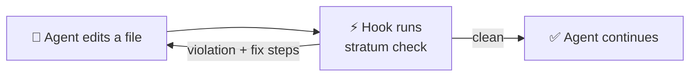

---
hide:
  - navigation
---

# :material-layers-triple: Stratum

**Architecture rules for Python, fast enough to run after every edit an AI agent makes.**

You declare your layers in `pyproject.toml`. `stratum check` fails when an import points the wrong way, and it tells the agent exactly how to fix it. The run below is real, from the scaffold's example app with one bad import added.

<figure markdown="span">
  { loading=lazy }
  <figcaption>Real run on the example app with one bad import added. Exit code 1 means violations.</figcaption>
</figure>

??? example "Same run as plain text"

    ```console
    $ stratum check clean-app/shop/domain/order.py
    clean-app/shop/domain/order.py:14:44: STR001 Layer "domain" imports "shop.infrastructure.sql_orders.SqlOrderRepository" from outer layer "infrastructure". Allowed direction: domain <- application <- infrastructure <- interface.
      fix: Depend on an abstraction owned by "domain" instead of "shop.infrastructure.sql_orders.SqlOrderRepository".
        1. Delete `from shop.infrastructure.sql_orders import SqlOrderRepository`. Do not move the import into a function or behind TYPE_CHECKING; Stratum checks those too.
        2. Declare a typing.Protocol in `shop.domain` (for example `shop.domain.ports`) that describes only what this module needs from `SqlOrderRepository`.
        3. Type this module against that Protocol and receive the implementation through a constructor or function parameter.
        4. Make the class in "infrastructure" satisfy the Protocol, and wire it in the outermost layer (the composition root).
      docs: https://stratum-docs.workers.dev/rules/STR001

    Found 1 violation in 1 file (23.8 ms).
    ```



## Start here

<div class="grid cards" markdown>

-   :material-book-open-page-variant:{ .lg .middle } __[Introduction](01-Introduction.md)__

    ---

    The problem, what Stratum does about it, and what it deliberately doesn't do.

-   :material-chart-timeline-variant:{ .lg .middle } __[Business context](02-Business-Context.md)__

    ---

    Ruff, ty, Biome, React Doctor, import-linter and friends, the gap between them, and the hypothesis we're testing.

-   :material-sitemap-outline:{ .lg .middle } __[Architecture (C4)](03-Architecture-C4.md)__

    ---

    Context, containers, components, the check sequence and the rule catalogue.

-   :material-robot-happy-outline:{ .lg .middle } __[AI integration](04-AI-Integration.md)__

    ---

    Hooks for Claude Code, Aider, Copilot and others, and how Stratum stops agents from gaming the check.

-   :material-scale-balance:{ .lg .middle } __[Decisions (ADR)](05-ADR.md)__

    ---

    Ten decisions, from "why TypeScript" to "why check imports inside functions".

-   :material-speedometer:{ .lg .middle } __[Constraints and quality](06-Constraints-and-Quality.md)__

    ---

    Budgets, measured numbers, and the risks we're watching.

</div>

The [glossary](07-Glossary.md) defines every term from "port" to "import skeleton".

!!! info "Project status"
    Pre-alpha. The engine, the CLI and a VS Code language server work end to end for one rule (STR001). The monorepo, CI, release pipeline and these docs are in place. Items marked :material-progress-clock: are planned.
