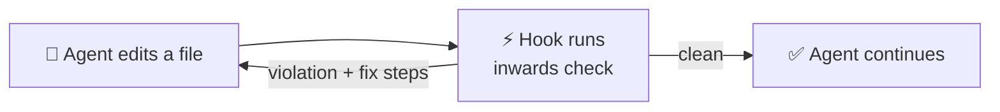

---
hide:
  - navigation
---

# :material-layers-triple: Inwards

**Architecture rules for Python, fast enough to run after every edit an AI agent makes.**

You declare your layers in `pyproject.toml`. `inwards check` fails when an import points the wrong way, and it tells the agent exactly how to fix it. The run below is real, from the scaffold's example app with one bad import added.

<figure markdown="span">
  { loading=lazy }
  <figcaption>Real run on the example app with one bad import added. Exit code 1 means violations.</figcaption>
</figure>

??? example "Same run as plain text"

    ```console
    $ inwards check clean-app/shop/domain/order.py
    clean-app/shop/domain/order.py:14:44: INW001 Layer "domain" imports "shop.infrastructure.sql_orders.SqlOrderRepository" from outer layer "infrastructure". Allowed direction: domain <- application <- infrastructure <- interface.
      fix: Depend on an abstraction owned by "domain" instead of "shop.infrastructure.sql_orders.SqlOrderRepository".
        1. Delete `from shop.infrastructure.sql_orders import SqlOrderRepository`. Do not move the import into a function or behind TYPE_CHECKING; Inwards checks those too.
        2. Declare a typing.Protocol in `shop.domain` (for example `shop.domain.ports`) that describes only what this module needs from `SqlOrderRepository`.
        3. Type this module against that Protocol and receive the implementation through a constructor or function parameter.
        4. Make the class in "infrastructure" satisfy the Protocol, and wire it in the outermost layer (the composition root).
      docs: https://sircypkowskyy.github.io/inwards/03-Architecture-C4/#rule-catalogue

    Found 1 violation in 1 file (16.8 ms).
    ```



## Start here

<div class="grid cards" markdown>

-   :material-book-open-page-variant:{ .lg .middle } __[Introduction](01-Introduction.md)__

    ---

    The problem, what Inwards does about it, and what it deliberately doesn't do.

-   :material-chart-timeline-variant:{ .lg .middle } __[Business context](02-Business-Context.md)__

    ---

    Ruff, ty, Biome, React Doctor, import-linter and friends, the gap between them, and the hypothesis we're testing.

-   :material-sitemap-outline:{ .lg .middle } __[Architecture (C4)](03-Architecture-C4.md)__

    ---

    Context, containers, components, the check sequence and the rule catalogue.

-   :material-robot-happy-outline:{ .lg .middle } __[AI integration](04-AI-Integration.md)__

    ---

    Hooks for Claude Code, Aider, Copilot and others, and how Inwards stops agents from gaming the check.

-   :material-scale-balance:{ .lg .middle } __[Decisions (ADR)](05-ADR.md)__

    ---

    Twelve decisions, from "why TypeScript" to "why check imports inside functions".

-   :material-speedometer:{ .lg .middle } __[Constraints and quality](06-Constraints-and-Quality.md)__

    ---

    Budgets, measured numbers, and the risks we're watching.

</div>

The [glossary](07-Glossary.md) defines every term from "port" to "import skeleton".

!!! info "Project status"
    Pre-alpha (0.1.0). Four rules work end to end in the CLI, the engine and the VS Code server: INW001 (layer direction), INW011 (literal dynamic imports), INW006 (code outside every layer, dead prefixes) and INW000 (a declared source encoding that could hide imports). `inwards hook claude-code` wires them into Claude Code, with a Stop gate that checks what the session changed, and each `v*` tag drafts a GitHub Release with binaries for six platforms. CI runs on Linux, macOS and Windows. Items marked :material-progress-clock: are planned.
