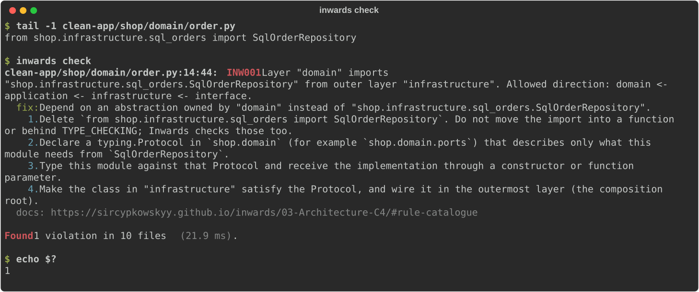

---
hide:
  - navigation
---

# :material-layers-triple: Inwards

**Architecture rules for Python, fast enough to run after every edit an AI agent makes.**

You declare your layers in `pyproject.toml`. `inwards check` fails when an import points the wrong way, and it tells the agent exactly how to fix it. The run below is real, from the scaffold's example app with one bad import added.

<figure markdown="span">
  { loading=lazy }
  <figcaption>Real run on the example app with one bad import added. Exit code 1 means violations.</figcaption>
</figure>

??? example "Same run as plain text"

    ```console
    $ inwards check clean-app/shop/domain/order.py
    clean-app/shop/domain/order.py:14:44: INW001 Layer "domain" imports "shop.infrastructure.sql_orders.SqlOrderRepository" from outer layer "infrastructure". Allowed direction: domain <- application <- infrastructure <- interface.
      fix: Depend on an abstraction owned by "domain" instead of "shop.infrastructure.sql_orders.SqlOrderRepository".
        1. Delete `from shop.infrastructure.sql_orders import SqlOrderRepository`. Do not move the import into a function or behind TYPE_CHECKING; Inwards checks those too.
        2. Declare a typing.Protocol in `shop.domain` (for example `shop.domain.ports`) that describes only what this module needs from `SqlOrderRepository`.
        3. Type this module against that Protocol and receive the implementation through a constructor or function parameter.
        4. Make the class in "infrastructure" satisfy the Protocol, and wire it in the outermost layer (the composition root).
      docs: https://sircypkowskyy.github.io/inwards/rules/INW001/

    Found 1 violation in 1 file (16.8 ms).
    ```

<div class="homepage-loop-wrap">
<svg id="homepage-loop" viewBox="0 0 820 160" role="img"
     aria-label="Agent edits a file, then the hook runs inwards check. On a violation, the agent gets fix steps and loops back. When clean, the agent continues.">
  <defs>
    <marker id="hl-arrow" viewBox="0 0 10 10" refX="9" refY="5"
            markerWidth="6" markerHeight="6" orient="auto-start-reverse">
      <path d="M0,0 L10,5 L0,10 z" class="hl-arrowhead" />
    </marker>
  </defs>

  <path id="hl-edge-to-hook" class="hl-edge" marker-end="url(#hl-arrow)"
        d="M170,50 H330" />
  <path id="hl-edge-violation" class="hl-edge hl-edge-dashed" marker-end="url(#hl-arrow)"
        d="M400,70 C400,110 250,110 170,70" />
  <text class="hl-edge-label" x="285" y="122">violation + fix steps</text>
  <path id="hl-edge-clean" class="hl-edge" marker-end="url(#hl-arrow)"
        d="M480,50 H610" />
  <text class="hl-edge-label" x="545" y="40">clean</text>

  <g id="hl-agent" class="hl-node" tabindex="0">
    <rect x="20" y="20" width="150" height="60" rx="10" />
    <text x="95" y="55">🤖 Agent edits a file</text>
  </g>

  <g id="hl-hook" class="hl-node" tabindex="0">
    <rect x="340" y="20" width="140" height="60" rx="10" />
    <text x="410" y="45">⚡ Hook runs</text>
    <text x="410" y="62">inwards check</text>
  </g>

  <g id="hl-outcomes" class="hl-node">
    <rect x="620" y="20" width="180" height="60" rx="10" />
    <text x="710" y="55">✅ Agent continues</text>
  </g>
</svg>
</div>

## Start here

<div class="grid cards" markdown>

-   :material-rocket-launch-outline:{ .lg .middle } __[Getting started](guides/install.md)__

    ---

    Install the binary or the wheel, then wire Inwards into Claude Code, Aider or any agent that reads `AGENTS.md`.

-   :material-book-open-page-variant:{ .lg .middle } __[Introduction](01-Introduction.md)__

    ---

    The problem, what Inwards does about it, and what it deliberately doesn't do.

-   :material-chart-timeline-variant:{ .lg .middle } __[Business context](02-Business-Context.md)__

    ---

    Ruff, ty, Biome, React Doctor, import-linter and friends, the gap between them, and the hypothesis we're testing.

-   :material-sitemap-outline:{ .lg .middle } __[Architecture (C4)](03-Architecture-C4.md)__

    ---

    Context, containers, components, the check sequence and the rule catalogue.

-   :material-robot-happy-outline:{ .lg .middle } __[AI integration](04-AI-Integration.md)__

    ---

    Hooks for Claude Code, Aider, Copilot and others, and how Inwards stops agents from gaming the check.

-   :material-scale-balance:{ .lg .middle } __[Decisions (ADR)](05-ADR.md)__

    ---

    Every architecture decision, among them "why TypeScript", "how a release is cut" and "how packages are selected".

-   :material-speedometer:{ .lg .middle } __[Constraints and quality](06-Constraints-and-Quality.md)__

    ---

    Budgets, measured numbers, and the risks we're watching.

</div>

The [glossary](07-Glossary.md) defines every term from "port" to "import skeleton".

!!! info "Project status"
    Pre-alpha.
    Twelve rules work end to end in the CLI and the engine, and all but INW004 in the VS Code server too: INW001 (layer direction), INW011 (dynamic imports), INW002 (dependencies between [bounded contexts](guides/configuration.md#contexts) only as declared), INW003 (other code imports only a context's public modules), INW004 (import cycles, on whole-project runs), INW005 ([libraries per layer](guides/libraries.md): no frameworks or I/O in the domain by default), INW006 (code outside every layer, dead prefixes), INW010 (imports of first-party modules that don't exist), INW007 and INW008 ([package shape](guides/package-shape.md): allowed, forbidden and required members), INW000 (a declared source encoding that could hide imports) and INW009 (inline suppressions, `# inwards: ignore[CODE] reason="..."`, that are invalid or unused).
    `inwards init --agent claude` installs the Claude Code hooks: a check after each edit, a Stop gate over what the session changed, a config guard, and escalation to the user; `--agent opencode` writes a plugin that does the same in OpenCode. For Aider, `init` prints the `lint-cmd` line to add; for other agents it writes an `AGENTS.md` section. On a new project, `inwards init --style layered|clean|hexagonal|vertical-slices|bounded-contexts|django` writes the layers, and `--scaffold` adds an example package that passes the check.
    Each release is a GitHub Release with binaries for six platforms, five platform wheels for `uv add` and a `.vsix`. The only one so far is the pre-release v0.1.0-rc.1.
    CI tests every pull request on Linux, and macOS and Windows before each release. Items marked :material-progress-clock: are planned.
