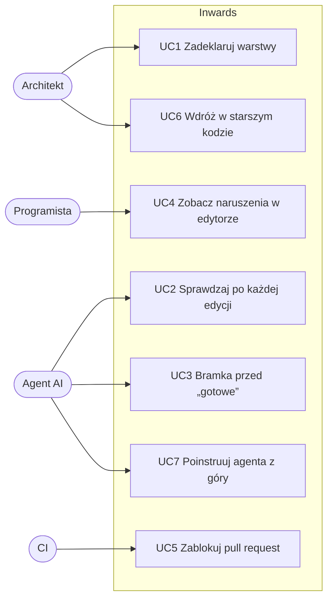

# :material-chart-timeline-variant: Kontekst biznesowy { #business-context }

Ten rozdział przygląda się temu, kto jeszcze działa w tym obszarze, czego uczą nas ich projekty i gdzie jest luka. Kończy się hipotezą, którą Inwards musi udowodnić, oraz aktorami i przypadkami użycia, które z niej wynikają.

Wszystkie fakty o innych narzędziach sprawdziliśmy w ich dokumentacji, changelogach i rejestrach 2026-09-25. Linki są na dole strony.

## Inne narzędzia w tym obszarze { #other-tools-in-this-space }

Liczą się tu dwie grupy narzędzi. Szybkie lintery ogólnego przeznaczenia wyznaczają poprzeczkę wydajności i model dystrybucji, jakiego oczekują użytkownicy. Narzędzia do sprawdzania architektury to bezpośrednia konkurencja.

### Szybkie lintery i narzędzia sprawdzające { #fast-linters-and-checkers }

=== ":simple-ruff: Ruff"

    Linter i formatter od Astral, napisany w Ruście: ponad 900 reguł, z czego 413 jest domyślnie włączonych od v0.16. Od v0.4 używa ręcznie napisanego parsera zstępującego (recursive descent), ponad dwa razy szybszego niż parser LALRPOP, który zastąpił. Reszta szybkości bierze się z Rusta, pamięci podręcznej na poziomie pliku (`.ruff_cache`) i równoległego przetwarzania plików. Jest dystrybuowany jako wheele na PyPI zawierające plik binarny w Ruście, dlatego `uv add --dev ruff` po prostu działa.

    **Wsparcie dla architektury:** `flake8-tidy-imports` oferuje `banned-api` z własnymi komunikatami oraz `banned-module-level-imports`. `ruff analyze graph` wypisuje w JSON-ie mapę plików i ich zależności, zbudowaną na mechanizmie rozwiązywania modułów z ty, ale nic nie sprawdza reguł względem tego grafu.

    **Perspektywa AI:** żadnych funkcji specyficznych dla agentów. Obsługuje wiele formatów wyjścia, w tym SARIF, choć otwarte zgłoszenie (#19962) zauważa, że SARIF pomija dane autofixów. OpenAI ogłosiło 2026-03-19, że przejmie Astral, żeby zintegrować jego narzędzia z Codexem. Nie udało nam się potwierdzić, czy transakcja została sfinalizowana.

=== ":material-check-decagram: ty"

    Narzędzie do sprawdzania typów i serwer języka od Astral, w becie od 2025-12-16 i wciąż w wersji 0.0.x. Zbudowane z myślą o przyrostowych ponownych sprawdzeniach. Astral podaje 4,7 ms na ponowne sprawdzenie po edycji w PyTorchu wobec 386 ms Pyrighta oraz zimne uruchomienie na home-assistant w 2,19 s wobec 19,62 s Pyrighta.

    **Wsparcie dla architektury:** brak. Ale ty ma już dwa trudne składniki: mechanizm rozwiązywania modułów i przyrostowy graf zależności. To najbardziej prawdopodobne przyszłe miejsce na reguły architektury w ekosystemie Astral.

=== ":material-language-typescript: Biome"

    Zestaw narzędzi w Ruście dla JS, TS, CSS, GraphQL i HTML, z wewnętrzną architekturą zapożyczoną od rust-analyzera. Wersja 2 dodała skaner projektu dla reguł wieloplikowych, wnioskowanie typów bez `tsc` i wtyczki GritQL. Wersja 2.5 (2026-06) dodała poprawki kodu z wtyczek, `--watch` i reporter `concise`, reklamowany jako oszczędny w tokenach dla agentów kodujących.

    **Wsparcie dla architektury:** `noImportCycles`, `noPrivateImports` i `noRestrictedImports`. Jego własna dokumentacja nazywa `noImportCycles` „kosztownym obliczeniowo”. Nie ma modelu warstw.

    **Lekcja dla nas:** Biome to pierwszy popularny linter, który zaprojektował format wyjścia dla agentów. Jego argument o oszczędności tokenów stosuje się wprost do Inwards.

=== ":material-stethoscope: React Doctor"

    CLI w TypeScripcie od Million (`millionco/react-doctor`), około 14,9 tys. gwiazdek na GitHubie. Uruchamia ponad 100 reguł dla Reacta przez wtyczkę oxlinta i łączy wyniki lintowania, utrzymywalności i łańcucha dostaw w ocenę od 0 do 100. Jego hasło to „Your agent writes bad React. This catches it.”

    **Perspektywa AI:** najbardziej „agentowe” narzędzie na tej liście. `npx react-doctor install` wykrywa Claude Code, Cursora, Codexa i OpenCode i instaluje skill, który uczy reguł. Opcjonalna flaga `--agent-hooks` dodaje natywne hooki, które uruchamiają się po tym, jak agent edytuje pliki, więc agent poprawia się sam w trakcie sesji. Ma też tryb diff, hook pre-commit dla plików w staging area i wyjście JSON/JSONL.

    **Lekcja dla nas:** React Doctor to wzorzec wejścia na rynek, który warto skopiować: jedno polecenie instalacji, skill plus hook, tryb tylko dla diffu. Nie ma modelu zależności ani architektury.

### Narzędzia do sprawdzania architektury { #architecture-checkers }

=== ":material-link-lock: import-linter + grimp"

    Zasiedziały gracz w Pythonie. Kontrakty mają kilka typów: `forbidden`, `protected`, `layers`, `independence`, `acyclic-siblings` i własne. Jego biblioteka grafów, grimp, krok po kroku przeniosła gorące ścieżki do Rusta: graf (3.6), parsowanie importów (3.9) i wielowątkowe skanowanie z pamięcią podręczną na dysku (3.11). Wersja 2.14 (2026-08) dodała `broken_contract_guidance`, tekst „jak to naprawić” dla każdego kontraktu.

    **Luka:** to pakiet Pythona, który działa w środowisku twojego projektu. W informacjach o wydaniach nie ma wyjścia SARIF ani JSON, integracji z edytorem ani hooków dla agentów. Wskazówka naprawy to statyczny tekst na kontrakt, napisany przez człowieka, a nie generowany dla każdego naruszenia.

=== ":material-test-tube: pytest-archon"

    Płynne API w stylu ArchUnit używane wewnątrz pytest: `archrule("x").match("app.domain*").should_not_import("app.infra*").check("app")`. Sprawdzenia przechodnie są domyślnie włączone. Potrafi pomijać importy z `TYPE_CHECKING` albo patrzeć tylko na importy najwyższego poziomu.

    **Jak działa:** przeczytaliśmy źródła. Uruchamia czysto pythonowe `ast.parse` na `Path.glob("**/*.py")` w jednym wątku. Jedyna pamięć podręczna to `lru_cache` wewnątrz procesu, a pakiety lokalizuje przez `importlib.util.find_spec`, więc kod musi dać się zaimportować w środowisku testowym.

    **Luka:** wolny i sekwencyjny, wyjście to tekst asercji, brak edytora, brak SARIF. Mały projekt (około 91 gwiazdek, ostatnie wydanie 2025-09).

=== ":material-source-branch: Tach"

    Rdzeń w Ruście obejmujący granice modułów, publiczne interfejsy, warstwy, acykliczność i oznaczanie jako przestarzałe (deprecation). Gauge przestało go utrzymywać w 2025 roku. Repozytorium przeniesiono do `tach-org`, a wydania z 2026 roku są wyłącznie utrzymaniowe (0.35.1 było aktualizacją bezpieczeństwa GitPythona). `tach show` i `upload` zależą od zamkniętego API.

    **Luka:** udowodnił, że jest popyt, a potem stracił sponsora. Zespoły, które go wdrożyły, potrzebują miejsca, do którego mogą przejść.

=== ":material-graph-outline: Inne"

    dependency-cruiser (JS/TS), ArchUnit (Java) i eslint-plugin-boundaries pokazują, że „architektura jako reguły lintera” to w innych ekosystemach ugruntowany pomysł. ArchLint (`npx archlint-ai`) sprawdza granice importów w diffach gita dla agentów, ale tylko dla JS/TS. Znaleźliśmy też kilka skilli „czystej architektury” dla Claude Code, złożonych wyłącznie z prozy. To rady, których agent może, ale nie musi słuchać, i nic ich nie egzekwuje.

### Porównanie { #side-by-side }

| | Python | Model warstw | Wymaga środowiska Pythona twojego projektu | Wskazówki naprawy | Hooki agentów | SARIF | Edytor |
|---|:-:|:-:|:-:|---|:-:|:-:|:-:|
| Ruff | :material-check-circle: | :material-close-circle: | nie (plik binarny w wheelu) | autofix dla reguł kodu | :material-close-circle: | :material-check-circle: | :material-check-circle: |
| ty | :material-check-circle: | :material-close-circle: | nie (plik binarny w wheelu) | nie dotyczy | :material-close-circle: | :material-close-circle: | :material-check-circle: |
| Biome | :material-close-circle: | :material-close-circle: | nie (plik binarny) | autofix, poprawki z wtyczek | :material-close-circle: | :material-check-circle: | :material-check-circle: |
| React Doctor | :material-close-circle: | :material-close-circle: | Node przez `npx` | reguł uczy skill agenta | :material-check-circle: | :material-close-circle: | :material-close-circle: |
| import-linter | :material-check-circle: | :material-check-circle: | tak | statyczny tekst na kontrakt | :material-close-circle: | :material-close-circle: | :material-close-circle: |
| pytest-archon | :material-check-circle: | :material-check-circle: | tak (kod musi się importować) | :material-close-circle: | :material-close-circle: | :material-close-circle: | :material-close-circle: |
| Tach | :material-check-circle: | :material-check-circle: | tak (pakiet pip, rozszerzenie w Ruście) | :material-close-circle: | :material-close-circle: | :material-close-circle: | ? |
| **Inwards** (cel) | :material-check-circle: | :material-check-circle: | nie (plik binarny w wheelu albo pojedynczy plik binarny) | kroki generowane dla każdego naruszenia | :material-check-circle: | :material-check-circle: | :material-check-circle: |

`?` oznacza, że nie udało nam się tego sprawdzić. „Wskazówki naprawy” to mówienie czytelnikowi, co zmienić. Autofix, w którym narzędzie samo przepisuje kod, to ich mocniejsza forma.

## Czego uczy konkurencja { #what-the-competition-teaches }

1. Użytkownicy oczekują dziś, że linter będzie działał natychmiast. Ruff i ty ustawiły tę poprzeczkę, a nawet import-linter przeniósł swój rdzeń do Rusta, żeby nadążyć.
2. Sposób instalacji narzędzia liczy się tak samo jak to, co sprawdza. Plik binarny w wheelu (Ruff, ty) łatwiej wdrożyć niż pakiet, który musi żyć w venv twojego projektu (import-linter, pytest-archon). Nie powinno być potrzeby, by aplikacja dawała się zaimportować tylko po to, żeby ją zlintować.
3. W pętli agenta czas ponownego sprawdzenia liczy się bardziej niż czas zimnego uruchomienia. Tam liczy się 4,7 ms ponownego sprawdzenia w ty.
4. Integracja z agentami to osobna powierzchnia produktu. React Doctor dostarcza instalator, skill i hooki, a Biome oszczędny w tokenach reporter. Nic z tego nie jest regułą lintera. Chodzi wyłącznie o to, jak wynik dociera do modelu.
5. Zaczynają się pojawiać wskazówki naprawy. `broken_contract_guidance` w import-linterze pokazuje, że użytkownicy proszą „powiedz mi, jak to naprawić”, ale żadne narzędzie nie buduje wskazówek z konkretnego importu, który nie przeszedł.

## Pozycjonowanie { #positioning }

Współrzędne to nasza jakościowa interpretacja powyższych badań, a nie pomiar. Punkt Inwards pokazuje, dokąd celuje, a nie gdzie jest dziś.

<svg id="quadrant-chart" viewBox="0 0 660 500" role="img"
     aria-label="Gdzie są narzędzia: wykres 2x2 z osiami reguły ogólne kontra reguły architektury oraz dla ludzi kontra dla pętli agentów. Cel Inwards leży w ćwiartce reguł architektury i pętli agentów. Lista pod wykresem opisuje każde narzędzie.">
  <text class="qc-title" x="330" y="20">Gdzie są narzędzia</text>

  <rect class="qc-quadrant" x="70" y="40" width="270" height="210" />
  <rect class="qc-quadrant" x="340" y="40" width="270" height="210" />
  <rect class="qc-quadrant" x="70" y="250" width="270" height="210" />
  <rect class="qc-quadrant" x="340" y="250" width="270" height="210" />
  <line class="qc-divider" x1="340" y1="40" x2="340" y2="460" />
  <line class="qc-divider" x1="70" y1="250" x2="610" y2="250" />

  <text class="qc-quadrant-label" x="80" y="58">Lintery świadome agentów</text>
  <text class="qc-quadrant-label" x="350" y="58">Cel Inwards</text>
  <text class="qc-quadrant-label" x="80" y="268">Klasyczne lintery</text>
  <text class="qc-quadrant-label" x="350" y="268">Testy architektury</text>

  <text class="qc-axis-label" x="340" y="485" text-anchor="middle">Ogólne reguły kodu&#8194;&#8594;&#8194;Reguły architektury</text>
  <text class="qc-axis-label" x="0" y="0" transform="translate(20, 250) rotate(-90)" text-anchor="middle">Dla ludzi&#8194;&#8594;&#8194;Dla pętli agentów</text>

  <g class="qc-point">
    <circle cx="151" cy="376" r="6" />
    <title>Ruff: szybki, ale reguły są ogólne. Nie zna pojęcia warstw architektury.</title>
    <text x="151" y="392">Ruff</text>
  </g>
  <g class="qc-point">
    <circle cx="178" cy="355" r="6" />
    <title>ty: narzędzie Astral do sprawdzania typów. Poprawność typów, nie kierunek importów.</title>
    <text x="178" y="371">ty</text>
  </g>
  <g class="qc-point">
    <circle cx="205" cy="271" r="6" />
    <title>Biome: formatter i linter dla JS/TS. W ogóle nie obsługuje Pythona.</title>
    <text x="205" y="287">Biome</text>
  </g>
  <g class="qc-point">
    <circle cx="232" cy="103" r="6" />
    <title>React Doctor: świadomy agentów, ale ograniczony do konwencji Reacta, nie warstw w Pythonie.</title>
    <text x="232" y="119">React Doctor</text>
  </g>
  <g class="qc-point">
    <circle cx="448" cy="166" r="6" />
    <title>ArchLint: istniejące narzędzie najbliższe celowi Inwards, wciąż dojrzewa.</title>
    <text x="448" y="182">ArchLint</text>
  </g>
  <g class="qc-point">
    <circle cx="529" cy="334" r="6" />
    <title>import-linter: dojrzałe kontrakty warstw, ale bez kroków naprawy dla agentów i bez hooków.</title>
    <text x="529" y="350">import-linter</text>
  </g>
  <g class="qc-point">
    <circle cx="502" cy="418" r="6" />
    <title>pytest-archon: asercje architektury jako testy. Działa w CI, nie przy każdej edycji.</title>
    <text x="502" y="434">pytest-archon</text>
  </g>
  <g class="qc-point">
    <circle cx="475" cy="376" r="6" />
    <title>Tach: granice modułów z szybkim rdzeniem w Ruście. Mniej oparty na warstwach niż Inwards.</title>
    <text x="475" y="392">Tach</text>
  </g>
  <g class="qc-point qc-point-target">
    <circle cx="556" cy="82" r="7" />
    <title>Cel Inwards: szybkość pętli agenta, reguły oparte na warstwach, wbudowane kroki naprawy.</title>
    <text x="556" y="98">Cel Inwards</text>
  </g>
</svg>

??? info "Czym jest każde narzędzie na wykresie"
    Ruff
    :   Szybki, ale reguły są ogólne. Nie zna pojęcia warstw architektury.

    ty
    :   Narzędzie Astral do sprawdzania typów. Poprawność typów, nie kierunek importów.

    Biome
    :   Formatter i linter dla JS/TS. W ogóle nie obsługuje Pythona.

    React Doctor
    :   Świadomy agentów, ale ograniczony do konwencji Reacta, nie warstw w Pythonie.

    ArchLint
    :   Istniejące narzędzie najbliższe celowi Inwards, wciąż dojrzewa.

    import-linter
    :   Dojrzałe kontrakty warstw, ale bez kroków naprawy dla agentów i bez hooków.

    pytest-archon
    :   Asercje architektury jako testy. Działa w CI, nie przy każdej edycji.

    Tach
    :   Granice modułów z szybkim rdzeniem w Ruście. Mniej oparty na warstwach niż Inwards.

    Cel Inwards
    :   Szybkość pętli agenta, reguły oparte na warstwach, wbudowane kroki naprawy.

Pozycja Inwards w jednym zdaniu: **reguły import-lintera, integracja z agentami jak w React Doctorze, dystrybucja jak w Ruffie.**

### :material-target-account: Dla kogo najpierw { #who-its-for-first }

Przyczółkiem są zespoły backendowe w Pythonie (serwisy w FastAPI, Django i Flasku), które mają jawny projekt warstwowy, heksagonalny albo DDD i pozwalają agentom pisać dużą część swojego kodu. Druga, mniejsza grupa: zespoły używające Tacha, które potrzebują utrzymywanego zamiennika. Biblioteki, notatniki i repozytoria złożone z samych skryptów są poza zakresem, bo rzadko mają warstwy warte pilnowania.

## Hipoteza { #the-hypothesis }

Każda część poniżej ma przypisaną liczbę i warunek, przy którym z niej zrezygnujemy. Progi to wstępne zakłady, które skalibrujemy po pierwszym design partnerze.

### :material-briefcase-outline: Hipoteza biznesowa { #business-hypothesis }

> Zespoły, które pozwalają agentom AI pisać kod w Pythonie i dbają o architekturę warstwową, wdrożą deterministyczne zabezpieczenie architektury, jeśli instaluje się ono jednym poleceniem, nie dodaje zauważalnego opóźnienia do pętli agenta i daje instrukcje naprawy, z którymi agent radzi sobie sam.

| Wierzymy, że | Będziemy wiedzieć, że to prawda, gdy | Zrezygnujemy albo przemyślimy to, jeśli |
|---|---|---|
| Agenci łamią podział na warstwy na tyle często, że to boli | W 5 repozytoriach design partnerów Inwards znajdzie co najmniej jedno prawdziwe naruszenie na 1000 linii napisanych przez agenta | Po pierwszym sprzątaniu naruszenia są rzadkie |
| Kroki naprawy sprawdzają się u modeli | ≥ 80 % naruszeń agent naprawia w ramach jednej ponownej próby, bez człowieka | < 50 % naprawionych przy pierwszej ponownej próbie |
| Hooki to kanał, który ma znaczenie | ≥ 60 % aktywnych instalacji ma włączony hook agenta | Ludzie uruchamiają narzędzie tylko w CI, gdzie import-linter już ich obsługuje |
| Szybkość to fosa chroniąca przed import-linterem | Mediana uruchomienia hooka < 100 ms w repozytoriach design partnerów | Rdzeń grimp w Ruście zamyka lukę, a import-linter dodaje JSON i hooki |
| Obok Astral jest miejsce | Inwards jest wdrażany obok Ruffa i ty, a nie zamiast nich | ty albo Ruff dodaje kontrakty warstw. Ma już mechanizm rozwiązywania modułów i graf, a umowa z OpenAI daje mu kanał przez Codexa |

**Pierwsze dane.** Ewaluacja agentów (`eval/README.md`) instaluje teraz hooki tak, jak robi to `inwards init --agent claude`, i uruchomiła 11 fixture'ów po jednym razie na Sonnecie i Haiku (22 uruchomienia, 2,18 USD). `inwards stats` z tych uruchomień: 5 z 7 naruszeń zgłoszonych przez hook edycji zostało naprawionych w ramach jednej ponownej próby (71 %). Pozostałe 2 dotyczyły fixture'a, którego polecenie każe agentowi poluzować reguły; tam config guard wytrzymał, Stop gate eskalował, a obaj agenci zapytali użytkownika, co jest zamierzonym zakończeniem. Ten wynik dotyczy naruszenia, nie zadania: w 3 z 5 przypadków zadanie nie zostało wykonane (2 uruchomienia wycofały edycję i zapytały użytkownika, 1 zmieniło sygnaturę, o którą prosiło zadanie), więc tylko 2 były czystymi poprawkami z wykonanym zadaniem. Naruszeń na 1000 linii napisanych przez agenta wyszło 25,5, ale fixture'y są zbudowane tak, żeby kusiły do naruszenia, więc ta liczba pokazuje tylko, że liczenie działa. Hook PostToolUse trwał 21 ms w medianie i 28 ms w p95 w 48 uruchomieniach, na przykładowej aplikacji z ewaluacji liczącej około 10 plików; repozytoria design partnerów będą większe. Siedem zgłoszonych naruszeń to o wiele za mało, żeby rozstrzygnąć zakład o ≥ 80 %. Uruchomienia pokazały też koszt Stop gate: gdy agent edytuje plik, w którym już jest naruszenie, bramka trzyma turę otwartą, dopóki stare naruszenie nie zniknie, i we wszystkich 6 takich uruchomieniach agenci przepisali kod, którego nie mieli ruszać, dwa razy usuwając funkcję. Gdy naruszenie było zaakceptowane w baseline'ie (UC6, [#33](https://github.com/SirCypkowskyy/inwards/issues/33)) albo leżało w pliku, którego agent nie edytuje, nic nie blokowało.

**Jak będziemy mierzyć.** Przy włączonym [run logu](08-Run-Log.md) każde uruchomienie hooka i `inwards check --log` dopisuje jedną linię JSON do `.inwards/runs.jsonl`: sprawdzone pliki, linie dodane i usunięte w każdej edycji, fingerprint każdego naruszenia, kod wyjścia i czas trwania. Log zostaje lokalnie i jest domyślnie wyłączony. Design partnerzy udostępniają go z wyboru. „Naprawione w ramach jednej ponownej próby” oznacza, że fingerprint zgłoszony dla pliku znika w następnym uruchomieniu hooka dla tego pliku. „Linie napisane przez agenta” pochodzą z własnych zdarzeń edycji hooka, więc nigdy nie zgadujemy autorstwa na podstawie gita. `inwards stats` zamienia log w te liczby, każdą obok jej progu. Adopcji hooków (odsetka aktywnych instalacji z hookiem agenta) nie da się zmierzyć z wnętrza jednego projektu, więc pochodzi z deklaracji partnerów, a nie z pomiaru.

**Model biznesowy: kwestia otwarta.** CLI, silnik i rozszerzenie edytora mają być open source. Nie zdecydowano, czy cokolwiek będzie kiedyś płatne (hostowany panel dryfu architektury, wyselekcjonowane pakiety reguł dla popularnych architektur). Zależy to od powyższych liczb adopcji, więc na razie zostaje poza zakresem.

### :material-cog-outline: Hipoteza techniczna { #technical-hypothesis }

> Silnik w TypeScripcie na tree-sitterze w WASM, dostarczany jako pojedynczy plik binarny zbudowany Bunem, może zmieścić się w budżecie pętli agenta (< 100 ms p95 na edytowany plik, łącznie ze startem procesu) bez Rusta. Powód: reguły architektury potrzebują tylko **szkieletu importów** pliku, a nie jego pełnego drzewa składni.

Nasze własne pomiary (szczegóły w [rozdziale 6](06-Constraints-and-Quality.md#measurements)) już częściowo to potwierdzają:

- Parsowanie całych plików tree-sitterem w WASM kosztuje około 1,3 MB/s na jednym rdzeniu. Na syntetycznym repozytorium z 496 tys. linii naiwne pełne uruchomienie trwało **7,5 s**. To przekreśla naiwny projekt.
- Parsowanie samego szkieletu importów skróciło to samo uruchomienie do **0,63–1,17 s**, nadal na jednym rdzeniu.
- Sprawdzenie jednego pliku, czyli to, co uruchamia hook agenta, trwa **poniżej 50 ms** w medianie i 80 ms w p95, łącznie ze startem procesu. Około 20 ms z tego to silnik.

Hipoteza upada, jeśli prawdziwe repozytoria (nie syntetyczne) wypchną p95 dla jednego pliku powyżej 100 ms albo jeśli reguły międzyplikowe, których będziemy potrzebować później (cykle, niezależność kontekstów ograniczonych), nie będą mogły korzystać z grafu w pamięci podręcznej i wymuszą parsowanie całego repozytorium przy każdej edycji.

## Aktorzy { #actors }

| | Aktor | Czego chce od Inwards |
|---|---|---|
| :material-account-hard-hat: | **Architekt / tech lead** | Zapisać architekturę raz, jako konfigurację, i ufać, że się utrzyma |
| :material-account: | **Programista** | Dowiedzieć się o naruszeniu podczas pisania, a nie na code review |
| :material-robot: | **Agent kodujący AI** (Claude Code, Aider, Copilot, Codex, Cursor) | Szybkiego, jednoznacznego sygnału po każdej edycji, z krokami, które może wykonać |
| :material-account-eye: | **Recenzent** | Poświęcać czas przeglądu na logikę, a nie na wypatrywanie zabłąkanego importu |
| :material-cog-sync: | **System CI** (GitHub Actions) | Deterministycznego wyniku pozytywnego albo negatywnego i pliku SARIF dla code scanning |

## Przypadki użycia { #use-cases }

| ID | Przypadek użycia | Wyzwalacz | Wynik | Stan |
|---|---|---|---|---|
| UC1 | Zadeklaruj warstwy | Architekt edytuje `[tool.inwards]` | Konfiguracja przechodzi walidację, a błędy wskazują winny klucz | :material-check-circle: |
| UC2 | Sprawdzaj po każdej edycji | Agent zapisuje plik `.py`; hook PostToolUse zainstalowany przez `inwards init --agent claude` sprawdza ten plik | Naruszenia wracają do agenta z krokami naprawy w ciągu 100 ms | :material-check-circle: |
| UC3 | Bramka przed „gotowe” | Agent próbuje zakończyć; Stop gate sprawdza każdy plik zmieniony w sesji, niezależnie od tego, jak go zmieniono | Agent nie może ogłosić zwycięstwa z naruszeniem, które sam wprowadził, a stare naruszenia w starszym repozytorium go nie blokują | :material-check-circle: |
| UC4 | Zobacz naruszenia w edytorze | Programista pisze kod | Podkreślenie z tym samym komunikatem i kodem co w CLI | :material-check-circle: VSIX dla każdej platformy w każdym wydaniu, z plikiem binarnym w środku; :material-progress-clock: Marketplace i Open VSX, gdy właściciel opublikuje |
| UC5 | Zablokuj pull request | CI uruchamia `inwards check --format sarif` | Nieudane sprawdzenie oraz adnotacje w pull requeście i w GitHub code scanning | :material-check-circle: [szablon workflow](guides/ci.md) i adnotacje w pull requestach, sprawdzone w praktyce (dogfooding) na `examples/broken-app`; :material-progress-clock: code scanning, gdy repozytorium stanie się publiczne |
| UC6 | Wdróż w starszym kodzie | Architekt uruchamia `inwards baseline` | Istniejące naruszenia zostają zapisane, a sprawdzenie oblewają tylko nowe | :material-check-circle: |
| UC7 | Poinstruuj agenta z góry | `inwards context --write` albo `inwards init --brief` zapisuje podsumowanie do `AGENTS.md` (który `CLAUDE.md` może zaimportować) | Agent zna warstwy, zanim napisze pierwszy import | :material-check-circle: opcjonalnie, [#58](https://github.com/SirCypkowskyy/inwards/issues/58) |

## Źródła { #sources }

- Ruff: [dokumentacja](https://docs.astral.sh/ruff/), [wpis o parserze w v0.4](https://astral.sh/blog/ruff-v0.4.0), [wydanie v0.16](https://astral.sh/blog/ruff-v0.16.0), [PR z `analyze graph`](https://github.com/astral-sh/ruff/pull/13402), [ogłoszenie OpenAI](https://openai.com/index/openai-to-acquire-astral/)
- ty: [ogłoszenie](https://astral.sh/blog/ty), [wydania](https://github.com/astral-sh/ty/releases)
- Biome: [v2](https://biomejs.dev/blog/biome-v2/), [v2.5](https://biomejs.dev/blog/biome-v2-5/), [noImportCycles](https://biomejs.dev/linter/rules/no-import-cycles/), [reportery](https://biomejs.dev/reference/reporters/)
- React Doctor: [repozytorium](https://github.com/millionco/react-doctor), [dokumentacja instalacji dla agentów](https://www.react.doctor/docs/getting-started/install-for-coding-agents)
- import-linter: [informacje o wydaniach](https://import-linter.readthedocs.io/en/stable/release_notes/), [changelog](https://grimp.readthedocs.io/en/stable/changelog.html) grimp
- pytest-archon: [repozytorium](https://github.com/jwbargsten/pytest-archon)
- Tach: [repozytorium](https://github.com/tach-org/tach), [zgłoszenie o utrzymaniu](https://github.com/tach-org/tach/issues/850)
- ArchLint: [repozytorium](https://github.com/errrt/archlint); Factory.ai, [Using linters to direct agents](https://factory.ai/news/using-linters-to-direct-agents)
