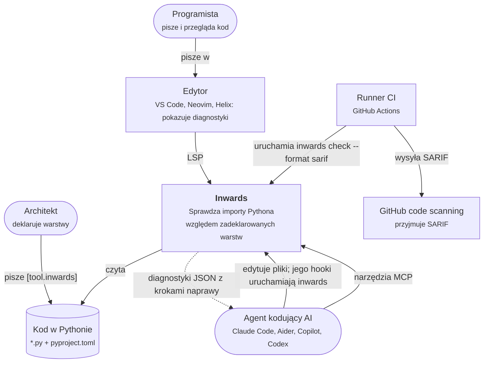
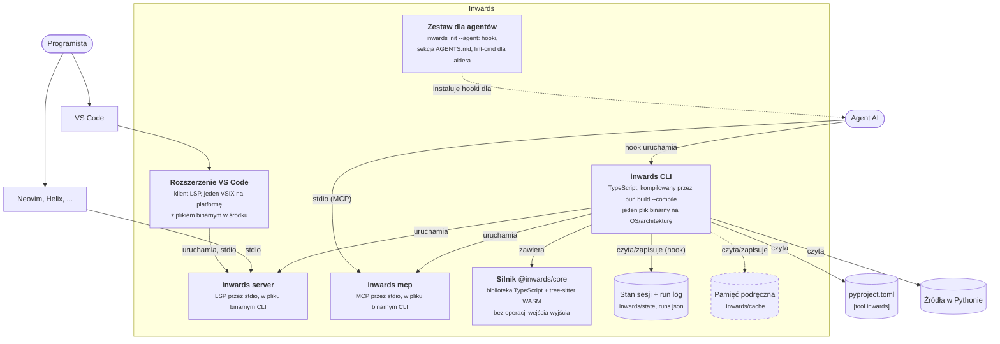
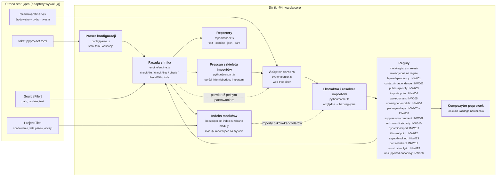
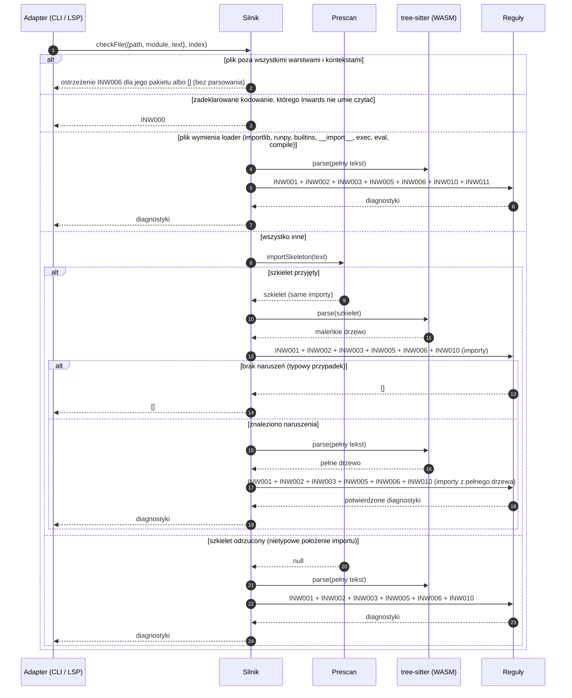
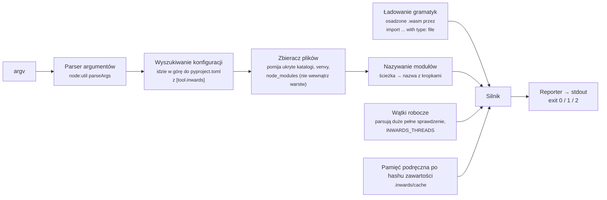
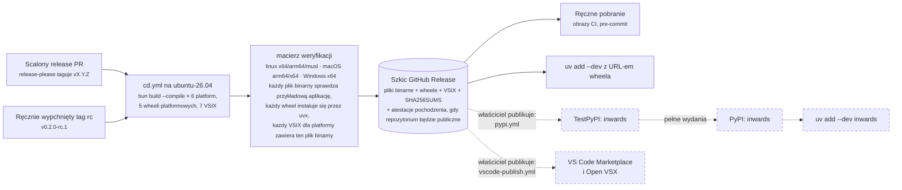

# :material-sitemap-outline: Architektura (C4) { #architecture-c4 }

Ten rozdział opisuje Inwards za pomocą [modelu C4](https://c4model.com): kontekst systemu (C1), kontenery (C2) i komponenty (C3). Diagramy to schematy blokowe Mermaid w notacji C4, bo natywna składnia C4 w Mermaid jest wciąż eksperymentalna i słabo się renderuje.

!!! tip "Legenda wspólna dla wszystkich diagramów"
    :material-account: zaokrąglone węzły to ludzie · walce to przechowywane dane · przerywane ramki są zaplanowane.

## C1: kontekst systemu { #c1-system-context }

Kto używa Inwards i z czym Inwards się komunikuje?



Do kilku rzeczy ten obraz nas zobowiązuje:

- Inwards tylko **czyta** kod. Nigdy go nie edytuje. Automatyczne poprawki zostawia agentowi, który ma kontekst, żeby zrobić to dobrze.
- Nie potrzebuje sieci, interpretera Pythona ani importowania kodu użytkownika. To wyklucza podejście z `find_spec`, którego używa pytest-archon, i sprawia, że uruchomienia są deterministyczne.
- Agent to pełnoprawny użytkownik, na równi z programistą. Format wyjścia jest projektowany przede wszystkim dla niego (zobacz [rozdział 4](04-AI-Integration.md)).

## C2: kontenery { #c2-containers }

Co jest wdrażane albo instalowane i gdzie działa każdy element?



| Kontener | Technologia | Gdzie leży | Stan |
|---|---|---|---|
| **Silnik** | TypeScript, `web-tree-sitter` 0.27 + `tree-sitter-python` 0.25 (WASM) | `src/core` | :material-check-circle: INW000, INW001, INW002, INW003, INW004, INW005, INW006, INW007, INW008, INW010, INW011, INW012, INW013, INW014, INW015 |
| **CLI** | Jednoplikowy program wykonywalny Bun 1.4, 6 platform docelowych, opakowany też w 5 wheeli platformowych | `src/cli` | :material-check-circle: `check` (text/concise/json/sarif), `init` (agenci, presety stylów, scaffold), `hook claude-code`, `daemon`, `server`, `mcp` |
| **`inwards server`** | `vscode-languageserver` 10 na Bunie, w pliku binarnym CLI | `src/cli/src/lsp/`, `src/cli/src/adapters/lsp-connection.ts` | :material-check-circle: to, co `inwards check` zgłasza w każdym folderze obszaru roboczego, z niezapisanym tekstem, na starcie, po zapisie, przy zmianie folderów i zdarzeniach plików; naciśnięcie klawisza sprawdza tylko swój dokument ([ADR-041](05-ADR.md#adr-041-inwards-server-runs-inwards-checks-own-code-the-extensions-node-server-stays-until-it-switches)) |
| **`inwards mcp`** | MCP TypeScript SDK 2 na Bunie, w pliku binarnym CLI | `src/cli/src/mcp/`, `src/cli/src/adapters/mcp-connection.ts` | :material-check-circle: `check_files`, `explain_rule` i `where_should_this_go` dla agentów z klientem MCP ([poradnik](guides/mcp.md), [ADR-042](05-ADR.md#adr-042-inwards-mcp-answers-with-inwards-checks-own-check-on-texts-laid-over-the-disk)) |
| **Rozszerzenie VS Code** | `vscode-languageclient` 10, cienki klient | `src/vscode-extension/src/client/` | :material-check-circle: uruchamia `inwards server` z pliku binarnego w swoim VSIX dla platformy, z `inwards.path` albo z `PATH` ([ADR-043](05-ADR.md#adr-043-the-vs-code-extension-bundles-the-binary-one-vsix-per-platform)); VSIX dla każdej platformy w każdym wydaniu; :material-progress-clock: Marketplace i Open VSX, gdy właściciel opublikuje ([#64](https://github.com/SirCypkowskyy/inwards/issues/64)) |
| **Zestaw dla agentów** | Generowana konfiguracja hooków i Markdown | `src/cli/src/init/` | :material-check-circle: `init --agent` dla `claude`, `aider` i `agents-md` |
| **Stan sesji i run log** | Pliki JSON i JSON Lines, tylko lokalnie | `.inwards/state/`, `.inwards/runs.jsonl` | :material-check-circle: (run log opcjonalny, [rozdział 8](08-Run-Log.md)) |
| **Pamięć podręczna** | Listy importów kluczowane hashem zawartości | `.inwards/cache` | :material-progress-clock: [#56](https://github.com/SirCypkowskyy/inwards/issues/56) |

Silnik to jedyne miejsce, w którym żyją reguły. CLI jest jego adapterem: znajduje pliki, czyta je, ładuje gramatyki i wybiera format wyjścia, a `inwards server` uruchamia to samo sprawdzenie dla edytorów. Dzięki temu podkreślenie w edytorze i błąd w CI nie mogą się rozjechać. Uruchamiają tę samą funkcję na tym samym tekście.

!!! note "Jedno środowisko uruchomieniowe, trzymane z dala od silnika"
    Silnik działa na Bunie, w pliku binarnym; od [ADR-043](05-ADR.md#adr-043-the-vs-code-extension-bundles-the-binary-one-vsix-per-platform) rozszerzenie VS Code uruchamia ten plik binarny, zamiast uruchamiać silnik na Node. Silnik nadal dostaje wszystko z zewnątrz przez porty, a lint tego pilnuje: `biome.jsonc` włącza `noRestrictedGlobals` dla `src/core/src/**` i odrzuca `Bun` oraz `Deno` z komunikatem wskazującym port `GrammarBinaries`. CI przy każdym pushu buduje paczkę klienta rozszerzenia dla platformy `node`, bo VS Code uruchamia go na Node.

## C3: komponenty silnika { #c3-components-of-the-engine }

Silnik to heksagon w miniaturze. Dostaje bajty i tekst, zwraca zwykłe dane i nigdy nie dotyka dysku. Gramatyki wchodzą przez port (`GrammarBinaries`), więc plik binarny Buna może przekazać osadzone bloby, a serwer VS Code czyta je z katalogu instalacji.



| Komponent | Odpowiedzialność | Uwagi |
|---|---|---|
| Parser konfiguracji | Czyta `[tool.inwards]`, waliduje je i podaje dokładnie ten klucz, który jest błędny | Rzuca `ConfigError`. CLI zamienia go na kod wyjścia 2. Te same klucze opisuje dla edytorów [JSON Schema](guides/configuration.md#editor-completion), a testy pilnują zgodności obu |
| Prescan szkieletu importów | Zostawia tylko linie importów, usuwa im wcięcie, a resztę czyści, żeby numery linii się nie przesunęły | Odmawia przetworzenia pliku, gdy `import` pojawia się w miejscu, którego nie umie wyjaśnić, co wymusza pełne parsowanie. Zobacz [ADR-004](05-ADR.md#adr-004-parse-the-import-skeleton-confirm-with-a-full-parse) |
| Adapter parsera | Inicjalizuje web-tree-sitter z bajtów i parsuje | Jawnie zwalnia każde drzewo, bo pamięć WASM nie jest odśmiecana |
| Ekstraktor importów | Znajduje węzły `import` / `from ... import` w dowolnym miejscu drzewa i rozwiązuje importy względne | `from shop import infrastructure` jest zapisywane jako `shop.infrastructure`, więc nie prześlizgnie się |
| Reguły | Czyste funkcje z `(file, imports, config)` do `Diagnostic[]`. Kod, nazwa, domyślny poziom, podsumowanie i link do dokumentacji każdej reguły żyją w jednym rejestrze (`meta/registry.ts`); z niego budowane jest `rules[]` w SARIF | INW001, INW005 dla bibliotek, które warstwa może importować, INW006 dla kodu poza wszystkimi warstwami, INW010 dla własnych modułów, które nie istnieją, INW007/INW008 dla kształtu pakietu, INW011 dla importów dynamicznych (dosłownych celów i niesprawdzalnych celów w warstwach wewnętrznych) i INW000 dla plików, których kodowanie mogłoby ukryć importy. Zaplanowane reguły są wymienione niżej |
| Kompozytor poprawek | Buduje ponumerowane kroki naprawy z faktycznych nazw importu i warstw | Kroki podają prawdziwe moduły, a nie symbole zastępcze |
| Reportery | Tekst dla ludzi, JSON `inwards/diagnostics@1` dla agentów, SARIF 2.1.0 dla GitHuba | Pola JSON można dodawać, ale nigdy nie usuwać ani nie zmieniać ich nazw |
| Fasada silnika | Koordynuje prescan, reguły i potwierdzające pełne parsowanie | Jedyne, co wywołują adaptery. Kształt pakietu (INW007) jest sprawdzany najpierw, na podstawie samej ścieżki. Plik poza wszystkimi warstwami nie jest parsowany (dostaje najwyżej ostrzeżenie INW006). Plik w warstwie, którego tekst wymienia loader modułów, pomija prescan (zobacz niżej). `checkWith` najpierw przekazuje parsowanie do `ExtractionBatch`, czyli wątków roboczych CLI, a potem sprawdza tak jak `check` ([ADR-040](05-ADR.md#adr-040-worker-threads-parse-a-large-full-check-the-main-thread-keeps-every-decision)) |
| Indeks modułów | `Engine.index(files)` opakowuje port `ProjectFiles` adaptera: `ownerOf` znajduje własny moduł, do którego trafia import, sondując po jednej ścieżce naraz, każdą tylko raz; `modules` wypisuje każdy własny moduł; `importersOf` odpowiada na pytanie „kto importuje moduł X”, parsując tylko pliki, których tekst zawiera ostatni segment nazwy X | Wejście projektu dla silnika ([#44](https://github.com/SirCypkowskyy/inwards/issues/44)): każdy adapter buduje je i przekazuje do `checkFile` i `checkFiles`. Zbudowanie go niczego nie dotyka; każde pytanie wykonuje tylko własne operacje wejścia-wyjścia, więc hook nie płaci za pytania, których nie zadaje żadna reguła. INW006 pyta `ownerOf`; INW010 pyta `ownerOf`, czy moduł istnieje, a `listDir`, co zawiera pakiet, w którym by się znajdował (skompilowane moduły rozszerzeń, najbliższe nazwy); wykrywanie cykli skorzysta z `importersOf`. Długo działający adapter buduje go od nowa, gdy plik lub katalog powstaje, znika albo zmienia nazwę |

### Przebieg jednego sprawdzenia { #how-one-check-flows }



Prescan może zgłaszać fałszywe alarmy, na przykład linię wyglądającą jak import wewnątrz docstringa, ale nigdy nie ukryje prawdziwego importu, bo odmawia przetworzenia każdego pliku, którego nie umie w pełni wyjaśnić. Źródłem prawdy jest pełne parsowanie, a uruchamia się ono tylko wtedy, gdy naruszenie wymaga potwierdzenia.

Szkielet zachowuje wyłącznie instrukcje importu, więc plik, którego jedyną zależnością na zewnątrz jest `importlib.import_module("shop.infrastructure.db")`, by go przeszedł. Zanim uruchomi się prescan, sprawdzenie tekstu szuka nazw, które każde wywołanie ładujące musi zapisać (`importlib`, `runpy`, `builtins`, `__import__` albo samo `exec`, `eval` lub `compile`, po normalizacji NFKC). Plik w warstwie, który pasuje, trafia prosto do pełnego parsowania, które szuka też importów dynamicznych. `re.compile` nie pasuje. W bibliotece standardowej CPythona 3.14 pasuje 209 z 1921 plików. Zobacz [ADR-015](05-ADR.md#adr-015-check-literal-dynamic-imports-as-inw011).

Model kosztów ma jeden zły przypadek: starszy kod, w którym większość plików już narusza reguły. Bez baseline'u prawie każdy plik płaci za parsowanie szkieletu, a potem za pełne parsowanie, co jest wolniejsze niż sparsowanie wszystkiego raz. Z baseline'em CLI przekazuje silnikowi jego klucze i liczniki (reguła, moduł, komunikat bez zdania „Allowed direction”) jako dane. Silnik najpierw skanuje każdy plik. Moduł pomija parsowanie potwierdzające, gdy każdy z jego plików przeszedł przez szkielet, każdy wynik ze szkieletu jest błędem, a dla każdego klucza wyniki ze wszystkich plików modułu (`order.py` i `order.pyi` to jeden moduł) nie przekraczają liczby zaakceptowanych kopii. Szkielet nigdy nie pomija importu, a wynik zależy tylko od celu importu, który oba parsowania odczytują tak samo. Prawdziwych wyników nie jest więc więcej niż wyników ze szkieletu, a baseline ukryłby je wszystkie także po pełnym parsowaniu. Błędy zgłaszane przez sprawdzenie są takie same z pominięciem i bez niego; test porównuje oba warianty dla każdej pary zapisów (prawdziwy import, kopia w docstringu albo w napisie) w pliku `.py` i jego `.pyi`. Liczniki mogą się różnić: fałszywe alarmy pominiętego modułu (linia wyglądająca jak import w docstringu) są ukrywane razem z jego prawdziwymi wynikami, więc `baselined` może być wyższe, a `resolved` niższe niż po pełnym parsowaniu, na przykład gdy import naprawionego naruszenia wciąż siedzi w napisie. Na syntetycznym repozytorium w trybie starszego kodu (`bench/generate.py --legacy`: 2101 plików, każdy z 2000 modułów z jednym naruszeniem, wszystkie w baseline'ie) zimne `inwards check` trwało w medianie 3,05 s przed tą zmianą i 0,55 s po niej. Samo pełne parsowanie każdego pliku trwało od 2,0 do 3,1 s, a czyste repozytorium 0,47 s (jeden rdzeń).

## C3: komponenty CLI { #c3-components-of-the-cli }



Kody wyjścia są takie jak w Ruffie: `0` czysto (ostrzeżenia dozwolone), `1` znaleziono błędy, `2` błąd użycia albo konfiguracji. Agenci i skrypty CI mogą rozgałęziać się na tej podstawie bez parsowania wyjścia. W raporcie JSON `summary.violations` liczy błędy, a `summary.warnings` ostrzeżenia. Uruchomienie dla całego projektu (bez argumentów ścieżek) sprawdza też każdy prefiks warstwy i selektor kształtu względem znalezionych modułów (INW006, INW007) oraz wymagane elementy każdego pakietu z kształtem (INW008).

Pozostałe polecenia korzystają z tych samych elementów:

- `inwards hook claude-code` czyta ze stdin dane hooka Claude Code i rozdziela je według zdarzenia: SessionStart zapisuje stan sesji, PreToolUse uruchamia shape guard i config guard, PostToolUse sprawdza edytowany plik, a Stop uruchamia Stop gate dla tego, co zmieniła sesja. [Rozdział 4](04-AI-Integration.md) opisuje każde z nich.
- `inwards daemon` trzyma silnik w gotowości dla PostToolUse ([ADR-039](05-ADR.md#adr-039-a-hook-daemon-per-project-separate-from-the-language-server)). Hook wysyła mu przez lokalne gniazdo dane hooka, katalog roboczy i środowisko, po jednej linii JSON w każdą stronę; daemon uruchamia ten sam kod `hook claude-code` ze środowiskiem zbudowanym z tych danych i strumieniami, które zbierają wyjście, a hook wypisuje to wyjście i kończy się z jego kodem. Daemon trzyma tylko to, co identyfikuje treść: ekstrakcje według skrótu tekstu i odpowiedzi gita według identyfikatora commita. Bez odpowiedzi hook uruchamia się jednorazowo.
- `inwards mcp` udostępnia trzy narzędzia klientowi MCP agenta przez stdio ([ADR-042](05-ADR.md#adr-042-inwards-mcp-answers-with-inwards-checks-own-check-on-texts-laid-over-the-disk)). `check_files` uruchamia routing i sprawdzenie `inwards check` z niezapisanym jeszcze kodem Pythona od agenta nałożonym na dysk, `explain_rule` zwraca strony reguł wbudowane w plik binarny, a `where_should_this_go` sprawdza w każdej warstwie moduł zawierający tylko planowane importy. SDK i strony ładują się z osobnych chunków, tylko dla tego polecenia.
- `inwards init --agent claude|opencode|aider|agents-md` najpierw wylicza każdą zmianę plików, więc `--dry-run` może wypisać ją jako diff, a drugie uruchomienie niczego nie zmienia.
- `inwards init --style layered|clean|hexagonal|vertical-slices|bounded-contexts|django|fastapi [--scaffold]` zapisuje `[tool.inwards]` z presetu (i przykładowy pakiet z pasującymi do niego kształtami pakietów) tylko tam, gdzie jeszcze nic nie ma, a potem uruchamia sprawdzenie w tym samym procesie i wypisuje pakiet jako drzewo z opisami. W terminalu bez flag zamiast tego pyta kreator zbudowany na `@clack/prompts`; jest ładowany importem dynamicznym, który build umieszcza w osobnym fragmencie ([ADR-020](05-ADR.md#adr-020-the-init-picker-uses-clackprompts-loaded-from-a-split-chunk)).

## Wdrożenie i dystrybucja { #deployment-and-distribution }



Wydania przebiegają według [ADR-016](05-ADR.md#adr-016-versions-and-releases-come-from-commit-types-via-a-release-pr): release-please utrzymuje otwarty release PR, jego scalenie taguje wersję i uruchamia `cd.yml`, a właściciel ręcznie publikuje szkic. Opublikowanie szkicu uruchamia `pypi.yml` i `vscode-publish.yml`, gdy każdy z nich zostanie włączony (niżej).

Kompilacja skrośna z jednego runnera linuksowego jest możliwa, bo gramatyki są w WASM i nie ma natywnego dodatku do budowania dla każdej platformy (zobacz [ADR-002](05-ADR.md#adr-002-web-tree-sitter-wasm-not-native-bindings)). Macierz weryfikacji uruchamia potem każdy plik binarny na jego prawdziwym systemie, bo skompilowany skrośnie wynik, którego nigdy nie uruchomiono, nie został przetestowany.

### Publikowanie na PyPI { #publishing-to-pypi }

`.github/workflows/pypi.yml` wysyła wheele opublikowanego wydania przez trusted publishing ([ADR-021](05-ADR.md#adr-021-publish-the-release-wheels-to-pypi-from-their-own-workflow-with-trusted-publishing)). Niczego nie buduje: pobiera pięć wheeli, które `cd.yml` zbudował, uruchomił na każdej platformie i dołączył do wydania, sprawdza je względem `SHA256SUMS` wydania (i ich pochodzenie buildu, gdy repozytorium będzie publiczne) i je wysyła. PyPI ufa temu jednemu plikowi workflow w jednym środowisku GitHuba na indeks, więc nigdzie nie jest przechowywany żaden token, a token OIDC mogą wygenerować tylko dwa zadania wysyłające.

| Co uruchamia | TestPyPI | PyPI |
|---|---|---|
| Opublikowanie wersji przedpremierowej (przez jej pole wyboru albo tag z przyrostkiem, takim jak `-rc.1`), przy ustawionym `PYPI_PUBLISH` | tak | nie |
| Opublikowanie pełnego wydania, przy ustawionym `PYPI_PUBLISH` | tak | tak, po nim |
| Ręczne uruchomienie, `index: testpypi` | tak | nie |
| Ręczne uruchomienie z tagu wydania (`--ref vX.Y.Z`, czego wymaga środowisko `pypi`), `index: pypi`, przy ustawionym `PYPI_PUBLISH` | tak | tak, po nim |

Szkic nigdy go nie uruchamia, ręczne uruchomienie odrzuca szkic, a pull requesty nigdy go nie uruchamiają. Na żadnym indeksie nie ma jeszcze niczego.

**Co naprawdę blokuje wysyłkę.** Każdy agent pracuje na koncie GitHub właściciela, więc wszystko po stronie GitHuba jest w zasięgu agenta: zmienna `PYPI_PUBLISH`, środowiska, tagi (żaden ruleset ich nie chroni) i ręczne uruchomienia. PyPI sprawdza repozytorium, plik workflow i środowisko uruchomienia, a nie jego ref ani commit. Jedyna bramka, do której agent nie sięgnie, to konto właściciela na pypi.org, więc publisher PyPI jest rejestrowany na końcu, przy uruchomieniu produkcyjnym, a usunięcie go tam od razu zatrzymuje każdą wysyłkę na PyPI. `PYPI_PUBLISH` i reguła tagów `v*` środowiska `pypi` chronią przed pomyłkami, a nie przed agentem.

**Jednorazowa konfiguracja, przez właściciela,** w tej kolejności, żeby żadne środowisko nie istniało bez swoich reguł w chwili, gdy uruchomienie po raz pierwszy się do niego odwoła:

1. **Utwórz dwa środowiska** (Settings → Environments → New environment):
    - `testpypi`: w „Deployment branches and tags” wybierz „Selected branches and tags”, a potem dodaj gałąź `develop` (dla ręcznych uruchomień) i wzorzec tagów `v*` (dla wydań).
    - `pypi`: tylko wzorzec tagów `v*`, żeby wdrażało się wyłącznie z tagu wydania. Dodaj siebie w „Required reviewers” i zostaw wyłączone „Prevent self-review”, bo sam publikujesz i zatwierdzasz. GitHub oferuje wymaganych recenzentów w prywatnym repozytorium tylko z GitHub Enterprise; jeśli tej opcji brakuje, dodaj ją w dniu, w którym repozytorium stanie się publiczne.

    To samo przez GitHub CLI (pomiń `reviewers` i `prevent_self_review`, jeśli GitHub je odrzuca, dopóki repozytorium jest prywatne):

    ```sh
    R=SirCypkowskyy/inwards
    gh api -X PUT repos/$R/environments/testpypi --input - <<'EOF'
    {"deployment_branch_policy": {"protected_branches": false, "custom_branch_policies": true}}
    EOF
    gh api repos/$R/environments/testpypi/deployment-branch-policies -f name=develop -f type=branch
    gh api repos/$R/environments/testpypi/deployment-branch-policies -f name='v*' -f type=tag
    gh api -X PUT repos/$R/environments/pypi --input - <<EOF
    {"reviewers": [{"type": "User", "id": $(gh api users/SirCypkowskyy -q .id)}], "prevent_self_review": false,
     "deployment_branch_policy": {"protected_branches": false, "custom_branch_policies": true}}
    EOF
    gh api repos/$R/environments/pypi/deployment-branch-policies -f name='v*' -f type=tag
    ```

2. **Zarejestruj oczekującego publishera na TestPyPI.** TestPyPI ma własne konta: zarejestruj się na [test.pypi.org](https://test.pypi.org/account/register/), potwierdź adres e-mail i włącz 2FA. Potem w [Your account → Publishing](https://test.pypi.org/manage/account/publishing/) dodaj oczekującego publishera GitHub:

    | Pole | Wartość |
    |---|---|
    | PyPI Project Name | `inwards` |
    | Owner | `SirCypkowskyy` |
    | Repository name | `inwards` |
    | Workflow name | `pypi.yml` |
    | Environment name | `testpypi` |

    Oczekujący publisher nie rezerwuje nazwy; projekt tworzy pierwsza wysyłka. Wykonaj krok 3 wkrótce potem.
3. **Próba na sucho na TestPyPI** z opublikowaną wersją przedpremierową v0.1.0-rc.1, gdy `pypi.yml` będzie na `develop`. Ten tag jest starszy niż workflow, więc uruchomienie startuje z `develop`, które akceptuje tylko środowisko `testpypi`:

    ```sh
    gh workflow run pypi.yml --repo SirCypkowskyy/inwards --ref develop -f tag=v0.1.0-rc.1 -f index=testpypi
    gh run watch --repo SirCypkowskyy/inwards \
      "$(gh run list --repo SirCypkowskyy/inwards --workflow pypi.yml -L 1 --json databaseId -q '.[0].databaseId')"
    ```

    [test.pypi.org/project/inwards/0.1.0rc1](https://test.pypi.org/project/inwards/0.1.0rc1/) powinno wtedy pokazywać pięć wheeli i wyrenderowane README. Zainstaluj pakiet w świeżym projekcie, na tylu platformach, na ilu możesz:

    ```sh
    cd "$(mktemp -d)" && uv init --bare --name testpypi-check
    uv add --dev "inwards==0.1.0rc1" --default-index https://test.pypi.org/simple/
    uv run inwards --version   # 0.1.0
    ```

    To zużywa nazwy plików 0.1.0rc1 tylko na TestPyPI; PyPI zostaje nietknięte.
4. **Uruchomienie produkcyjne,** gdy zbliża się pierwsze wydanie przeznaczone na PyPI:
    - Dodaj publishera do istniejącego projektu na PyPI. `inwards` już istnieje na pypi.org (rezerwacja w wersji 0.0.0), więc to nie jest oczekujący publisher: otwórz [Manage `inwards` → Publishing](https://pypi.org/manage/project/inwards/settings/publishing/) i dodaj publishera GitHub z właścicielem `SirCypkowskyy`, repozytorium `inwards`, workflow `pypi.yml` i środowiskiem `pypi`.
    - Włącz publikowanie: `gh variable set PYPI_PUBLISH --body true --repo SirCypkowskyy/inwards`. `gh variable delete PYPI_PUBLISH` znowu je wyłącza.

Opcjonalne utwardzenie: włącz niezmienne wydania (Settings → General → Releases → „Enable release immutability”; API zgłasza, że to ustawienie jest dostępne i wyłączone w tym repozytorium). Pliki i tag opublikowanego wydania nie mogą się wtedy już zmienić, więc późniejsze uruchomienie wysyła te bajty, które zostały opublikowane. Dotyczy to tylko wydań opublikowanych po włączeniu ustawienia i nie chroni szkicu.

**Przy każdym wydaniu** poczekaj, aż zadanie „Draft the GitHub Release” w `cd.yml` zakończy się sukcesem, a szkic będzie zawierał pięć plików `.whl` i `SHA256SUMS`. Dopiero wtedy opublikuj szkic (krok 4 wydania w `AGENTS.md`). `cd.yml` odmawia dołączania plików do opublikowanego wydania, więc zbyt wczesna publikacja zużywa wersję. Publikacja uruchamia `pypi.yml`: pełne wydanie trafia na TestPyPI, a potem czeka na twoje zatwierdzenie w „Review deployments” danego uruchomienia, zanim trafi na PyPI (gdy środowisko `pypi` ma recenzenta). Potem `uv add --dev inwards` w świeżym projekcie powinno je zainstalować. Po pierwszym wydaniu na PyPI wycofaj tam (yank) rezerwację 0.0.0 (Manage → Releases → 0.0.0 → Options → Yank).

Żeby umieścić na PyPI także wersję przedpremierową, uruchom workflow z jej tagu, czego wymaga środowisko `pypi`: `gh workflow run pypi.yml --repo SirCypkowskyy/inwards --ref v0.2.0-rc.1 -f tag=v0.2.0-rc.1 -f index=pypi`. PyPI nigdy nie przyjmuje tej samej nazwy pliku dwa razy, więc wysłana tam wersja jest ostateczna; ponowne uruchomienie tylko uzupełnia pliki, których zabrakło po nieudanym uruchomieniu.

### Publikacja rozszerzenia VS Code { #publishing-the-vs-code-extension }

`.github/workflows/vscode-publish.yml` wysyła siedem plików VSIX opublikowanego pełnego wydania do Visual Studio Marketplace (`vsce publish`) i Open VSX (`ovsx publish`) ([ADR-043](05-ADR.md#adr-043-the-vs-code-extension-bundles-the-binary-one-vsix-per-platform)). Tak jak `pypi.yml`, niczego nie buduje: pobiera pliki spakowane przez `cd.yml`, sprawdza je względem `SHA256SUMS` wydania i wersji z taga (a także ich pochodzenie, gdy repozytorium będzie publiczne) i wysyła je z `--skip-duplicate`, więc ponowne uruchomienie dokańcza przerwaną wysyłkę. Każde zadanie wysyłki czyta jeden token z własnego środowiska, `vscode-marketplace` albo `open-vsx`, i biegnie na runnerze hostowanym przez GitHub. Opublikowanie pełnego wydania uruchamia workflow, gdy `VSCODE_PUBLISH` ma wartość `true`; wersja przedpremierowa nigdy go nie uruchamia, bo oba rejestry przyjmują tylko `X.Y.Z`. Ręczne uruchomienie przyjmuje tag i `both`, `marketplace` albo `open-vsx`. Pull requesty nigdy go nie uruchamiają.

**Jednorazowa konfiguracja, po stronie właściciela:**

1. **Wydawca w Marketplace.** Zaloguj się na [stronie wydawców Marketplace](https://marketplace.visualstudio.com/manage) i utwórz wydawcę `inwards`, czyli `publisher` z `src/vscode-extension/package.json`. Jeśli ten identyfikator jest zajęty, wybierz inny i zmień tam `publisher` (oraz adres w `vscode-publish.yml`). Utwórz w Azure DevOps token PAT z zakresem **Marketplace (Manage)**, jak opisuje [przewodnik publikacji](https://code.visualstudio.com/api/working-with-extensions/publishing-extension). Azure DevOps wycofuje tokeny globalne 1 grudnia 2026; dopóki workflow nie przejdzie na Microsoft Entra ID, odnów token przed tą datą.
2. **Przestrzeń nazw w Open VSX.** Zaloguj się na [open-vsx.org](https://open-vsx.org) przez GitHuba, połącz konto eclipse.org i zaakceptuj umowę wydawcy Eclipse na stronie profilu, utwórz token dostępu, a potem przestrzeń nazw: `npx ovsx create-namespace inwards -p <token>`.
3. **Środowiska i sekrety.** Utwórz środowiska `vscode-marketplace` i `open-vsx` (Settings → Environments), każde ograniczone do wzorca tagów `v*` i gałęzi `develop`, z tobą jako wymaganym recenzentem, jeśli GitHub to oferuje. Potem zapisz każdy token w jego środowisku:

    ```sh
    R=SirCypkowskyy/inwards
    gh secret set VSCE_PAT --env vscode-marketplace --repo $R   # paste the Azure DevOps token
    gh secret set OVSX_PAT --env open-vsx --repo $R             # paste the Open VSX token
    ```

4. **Uruchomienie:** `gh variable set VSCODE_PUBLISH --body true --repo SirCypkowskyy/inwards`. Następne opublikowane pełne wydanie trafi do obu rejestrów. Żeby wysłać wydanie opublikowane wcześniej: `gh workflow run vscode-publish.yml --repo SirCypkowskyy/inwards --ref develop -f tag=vX.Y.Z -f registry=both`.

Po pierwszej wysyłce sprawdź instalację na Linuksie, macOS i Windows: `bun run src/vscode-extension/scripts/try-in-vscode.ts inwards.inwards-vscode` instaluje rozszerzenie z Marketplace w jednorazowym profilu VS Code, otwiera mały projekt i czeka na jego diagnostykę INW007.

## Znane ograniczenia { #known-limitations }

- Jeden `root` na konfigurację. W monorepo każdy pakiet Pythona ma własne `[tool.inwards]`. `inwards check` w katalogu głównym workspace'u uv sprawdza każdego członka jego własną konfiguracją, a wskazane ścieżki kieruje do najbliższej konfiguracji; hook i Stop gate wybierają najbliższą konfigurację dla każdego pliku ([ADR-035](05-ADR.md#adr-035-inwards-check-follows-uv-workspace-members-each-with-its-own-config)). Wykrywane są tylko workspace'y uv: inne układy monorepo potrzebują osobnego uruchomienia na konfigurację albo wskazanych ścieżek. Globy członków dopasowują `*` tylko wewnątrz jednego segmentu, a `inwards baseline` bierze jedną konfigurację na uruchomienie.
- `inwards server` pokazuje to, co zgłasza `inwards check`, gdy pliki są zapisane. Dopóki dokument ma niezapisane zmiany, pokazuje ten dokument sprawdzony osobno oraz to, co ostatni przebieg całego projektu znalazł w nim, a czego jeden plik nie pokaże (cykle, routery FastAPI, których nie dołącza żadna aplikacja); diagnostyki innych plików zależne od niezapisanego tekstu oraz niezapisane edycje `pyproject.toml` albo baseline'u liczą się od następnego zapisu. Dwa foldery obszaru roboczego, których konfiguracje obejmują ten sam plik, pokazują jego diagnostyki dwa razy. Każdy zapis kosztuje sprawdzenie całego projektu (154 ms dla 2100 plików po rozgrzaniu, [ADR-041](05-ADR.md#adr-041-inwards-server-runs-inwards-checks-own-code-the-extensions-node-server-stays-until-it-switches)).
- Niejawne pakiety przestrzeni nazw (bez `__init__.py`) są nazywane, a ich importy względne rozwiązywane tak jak w Pythonie. Moduł, którego brakuje pod takim pakietem, przechodzi INW010, gdy ma go inny członek workspace'u uv (w swoim `src/`, a bez niego w katalogu członka), gdy ma go site-packages katalogu `.venv` projektu albo gdy leży bezpośrednio w pakiecie wymienionym w `namespace-packages` ([#161](https://github.com/SirCypkowskyy/inwards/issues/161)). Środowisko wirtualne w innym miejscu nie jest widoczne.
- Przynależność do warstwy wynika tylko z prefiksu modułu. Wzorce glob (`shop.*.domain`) dla pionowych wycinków przyjdą ze schematem konfiguracji v2 ([#51](https://github.com/SirCypkowskyy/inwards/issues/51), [ADR-018](05-ADR.md#adr-018-package-selectors-take-globs-from-the-start-monorepos-follow-uv-workspaces)).
- Dowiązania symboliczne w warstwie, które wskazują poza katalog `root` albo do innej warstwy, zgłasza INW006 w miejscu dowiązania: robi to `inwards check` całego projektu, a dla dowiązań utworzonych w trakcie sesji także Stop gate ([ADR-013](05-ADR.md#adr-013-real-paths-for-the-boundary-import-paths-for-module-names)). `inwards check` ze ścieżkami jako argumentami ich nie zgłasza, a katalog z danymi dowiązany do pakietu warstwy spoza `root` też jest zgłaszany.
- INW011 rozwiązuje import dynamiczny tylko wtedy, gdy celem jest stały napis. Każdy inny cel jest zgłaszany jako niesprawdzalny, i to tylko w warstwach, które mają warstwę zewnętrzną ([ADR-026](05-ADR.md#adr-026-report-unreadable-dynamic-import-targets-in-inner-layers)). Znane luki:
    - stałe są zwijane tylko w granicach ([#79](https://github.com/SirCypkowskyy/inwards/issues/79)): nazwa na poziomie modułu liczy się tylko wtedy, gdy cały plik wiąże ją raz, a plik nie ma `exec`, `eval`, funkcji zapisującej przestrzeń nazw ani importu z gwiazdką, a zwijanie `%`, `format` i f-stringów zatrzymuje się na wszystkim poza `%s`, `!s` i tekstową specyfikacją formatu. Wszystko inne jest niesprawdzalne;
    - `compile` z niedosłownym kodem nie jest zgłaszane, bo uruchomienie jego obiektu kodu wymaga `exec` albo `eval`, które są zgłaszane; obiekt kodu uruchomiony inaczej (`types.FunctionType`) zostaje przeoczony;
    - w najbardziej zewnętrznej warstwie niesprawdzalne wywołanie nie jest zgłaszane, więc może niezauważenie sięgnąć do własnego kodu poza wszystkimi warstwami (INW006);
    - loader zapisany w kontenerze, osiągnięty przez `operator.attrgetter` albo przekazany jako argument zostaje przeoczony, podobnie jak `SourcelessFileLoader`, `ExtensionFileLoader` i `importlib.util.spec_from_loader`. Loader plików jest czytany tylko ze względnej ścieżki do pliku `.py`, a `functools.partial` tylko tam, gdzie wiąże argumenty;
    - fałszywy alarm luźnego traktowania zakresów: nazwa atrybutu, której gdziekolwiek w pliku przypisano loader (`self.load = importlib.import_module`), liczy się na każdym obiekcie w tym pliku;
    - fałszywy alarm, zaakceptowany zamiast przeoczenia: przy dosłownym kodzie `exec`, `eval`, `compile` i `__import__` zawsze są traktowane jak funkcje wbudowane, więc po `from re import compile` wywołanie `compile("from shop.infrastructure import x")` zostaje zgłoszone. Bajty, które CPython odrzuca przed wykonaniem (UTF-8 BOM z innym zadeklarowanym kodowaniem, deklaracja `utf-16` albo `rot13`), są nadal czytane albo zgłaszane jako niesprawdzone;
    - fałszywie negatywny wynik, zaakceptowany zamiast szumu: samo `exec` albo `eval` z wyliczanym kodem jest pomijane tylko wtedy, gdy kod na pewno ponownie wiąże tę nazwę przy wywołaniu. Wiązaniem musi być `def`, `class`, zwykłe przypisanie albo import umieszczone bezpośrednio w ciele modułu (przed instrukcją najwyższego poziomu, która zawiera wywołanie) lub w ciele funkcji otaczającej wywołanie, parametr funkcji albo lambdy, której ciało zawiera wywołanie, albo cel pętli `for` wewnątrz tej pętli. Wyjątek jest wyłączony dla całego pliku, gdy którekolwiek wiązanie tej nazwy może być funkcją wbudowaną: przypisanie, operator morsa, cel `for`, `with` albo `except` czy domyślna wartość parametru, które wspominają loader; `def` albo `class`, których dekoratory lub argumenty klasy (klasy bazowe, `metaclass=`) go wspominają; import z `builtins`, `importlib`, `runpy`, modułu względnego albo własnego modułu projektu (każdy z nich może ponownie eksportować funkcję wbudowaną). Jest wyłączony także wtedy, gdy nazwa ma `global`, `nonlocal` albo `del` albo gdy plik ma import z gwiazdką lub wspomina `globals`, `vars`, `locals`, `setattr`, `delattr`, `__dict__`, `__builtins__` albo `sys.modules`. Dlatego `def eval(model, loader)` w kodzie treningowym nie jest zgłaszane. Nadal przeoczona zostaje funkcja wbudowana przekazana jako argument (`def run(exec, c): return exec(c)` wywołane jako `run(exec, code)`) oraz funkcja wbudowana osiągnięta przez obiekt, który nie nazywa loadera, `__self__`, `__globals__` ani funkcji zapisującej przestrzeń nazw. To samo sprawdzenie chroni `exec(compile("<literal>", ...))`, któremu ufamy tylko, dopóki `compile` nie jest ponownie związane;
    - zaakceptowane fałszywe alarmy tego ostrożnego sprawdzenia: zmienna wyrażenia listowego (`[eval(m) for eval in evaluators]`), nazwa metody użyta w ciele jej własnej klasy i przechwycenie `match` o nazwie `eval` albo `exec` są nadal zgłaszane.
- INW010 sprawdza tylko tę część importu statycznego, która jest modułem ([ADR-025](05-ADR.md#adr-025-inw010-probes-the-disk-for-existence-and-checks-only-the-module-part-of-an-import)): `from shop.domain import pricing` przechodzi, gdy `shop/domain` jest pakietem, bo `pricing` może być nazwą zdefiniowaną w jego `__init__.py`, a importy dynamiczne nie są sprawdzane. Moduł generowany przy budowaniu przechodzi, gdy obejmuje go `generated`, a domyślnie obejmuje `*_pb2` i `*_pb2_grpc` z protoc oraz moduł `_version` ([ADR-029](05-ADR.md#adr-029-generated-modules-pass-inw010-protoc-and-version-modules-by-default)); każdy inny jest zgłaszany, dopóki nie pojawi się w checkoucie, podobnie jak opcjonalny import za `try/except ImportError`. Zmyślony import, którego nazwę obejmuje wzorzec z `generated`, też przechodzi. Pozostałe reguły nadal widzą moduł generowany, którego nie ma na dysku, jako brakujący: INW001 patrzy na nazwę i zgłasza import skierowany na zewnątrz tak czy inaczej, a INW006 ocenia import po najbliższym istniejącym pakiecie, więc moduł generowany leżący bezpośrednio w pakiecie nad warstwami (`shop._version`, importowany z warstwy) dostaje błąd INW006 o innej treści z plikiem i bez niego, a wpis baseline'u zrobiony w jednym checkoucie nie pasuje w drugim. Generowany pakiet najwyższego poziomu bez zacommitowanego `__init__.py` wygląda dla każdej reguły jak kod zewnętrzny.
- Moduły, które nie należą do żadnej warstwy, nie podlegają żadnej regule warstw. INW006 to uwidacznia (ostrzeżenie na pakiet, błąd dla importu do takiego pakietu z warstwy i martwe prefiksy), ale importy wewnątrz nieprzypisanego pakietu nie są sprawdzane względem warstw, dopóki użytkownik go nie przypisze. Gdy zadeklarowano [konteksty](guides/configuration.md#contexts), importy każdego modułu są z nimi porównywane (INW002, INW003), a INW000 dotyczy każdego pliku. Moduły bez źródeł, głębokość `ignore`, przemianowane pakiety najwyższego poziomu i sprawdzanie prefiksów w zakresie ścieżek są otwarte w [#86](https://github.com/SirCypkowskyy/inwards/issues/86).

## Katalog reguł { #rule-catalogue }

Każda wdrożona reguła ma własną stronę w sekcji [Reguły](rules/index.md), z przykładami, poprawkami i konfiguracją; diagnostyki linkują do niej.

| Kod | Nazwa | Co wyłapuje | Stan |
|---|---|---|---|
| INW000 | `unsupported-encoding` | Plik w warstwie deklaruje kodowanie (PEP 263), takie jak `unicode_escape` albo `utf-7`, przy którym tekst, który Inwards czyta jako komentarz, może być dla CPythona prawdziwym importem. Plik jest zgłaszany, a nie pomijany | :material-check-circle: |
| INW001 | `layer-dependency` | Warstwa wewnętrzna importująca zewnętrzną | :material-check-circle: |
| INW002 | `context-independence` | Kontekst ograniczony albo pionowy wycinek importujący inny kontekst, którego jego `depends-on` nie deklaruje, statycznie albo dynamicznie, niezależnie od tego, czy plik należy do warstwy. Koniec poza wszystkimi kontekstami jest pomijany, a kontekst zagnieżdżony jest osobnym kontekstem. Zobacz [konteksty](guides/configuration.md#contexts) | :material-check-circle: |
| INW003 | `public-api-only` | Import, spoza kontekstu (z innego kontekstu albo z żadnego), jednego z jego modułów, który nie leży na prefiksach `public` ani pod nimi, statyczny albo dynamiczny. Import zgłoszony już przez INW002 nie dostaje INW003. Poprawka wskazuje moduł publiczny, który udostępnia importowaną nazwę, jeśli taki istnieje | :material-check-circle: |
| INW004 | `import-cycles` | Moduły (`cycles = ["modules"]`) albo konteksty (domyślnie, `["contexts"]`), które importują się nawzajem w cyklu, zgłaszane raz na silnie spójną grupę, z pełną ścieżką i rozmiarem grupy. Tylko przy sprawdzaniu całego projektu, z importów, które sprawdzenie i tak czyta; plik w cyklicznej grupie, którego szkielet mógł źle odczytać import, jest potwierdzany pełnym parsowaniem. Nie da się go wyciszyć w linii; istniejące cykle przyjmuje baseline. Zobacz [ADR-032](05-ADR.md#adr-032-import-cycles-on-whole-project-runs-from-the-imports-the-check-already-reads) | :material-check-circle: |
| INW005 | `pure-domain` | Warstwa importująca moduł zewnętrzny albo z biblioteki standardowej, na który nie pozwalają jej `allow-libraries` / `deny-libraries` / `extend-deny-libraries`, statycznie albo dynamicznie, także w funkcjach i pod `TYPE_CHECKING`. Najbardziej wewnętrzna z dwóch lub więcej warstw domyślnie zabrania frameworków, klientów baz danych i sieci oraz operacji wejścia-wyjścia z biblioteki standardowej (`sqlalchemy`, `fastapi`, `requests`, `subprocess`...); `extend-deny-libraries` dopisuje wpisy do tej listy, `deny-libraries` ją zastępuje, a `[tool.inwards.rules.pure-domain].deny` zakazuje bibliotek prefiksom modułów, które nie są całymi warstwami. Własny kod zostaje dla INW001 i INW006. Zobacz [Biblioteki w warstwach](guides/libraries.md) | :material-check-circle: |
| INW006 | `unassigned-module` | Import z warstwy do własnego kodu, który nie należy do żadnej warstwy, w tym do pakietu nad warstwami (`from shop import x` uruchamia `shop/__init__.py`, który nie należy do żadnej warstwy), statyczny albo dynamiczny (błąd); kod warstwy przeniesiony w trakcie sesji poza wszystkie warstwy (błąd); pakiet poza wszystkimi warstwami i poza `ignore` (ostrzeżenie); prefiks warstwy, który nie pasuje do żadnego modułu (ostrzeżenie), warstwa bez żywego prefiksu albo prefiks opróżniony w trakcie sesji (błąd). Nieznane klucze i nakładające się prefiksy to błędy konfiguracji | :material-check-circle: |
| INW007 | `package-shape` | Element pakietu, na który `[[tool.inwards.shape]]` nie pozwala (błąd albo ostrzeżenie przy `extra = "warning"`) albo którego zabrania, taki jak nowy `helpers.py` obok `service.py`; nazwa elementu poza jej pakietami `only-in` z `[[tool.inwards.names]]`, taka jak `test_x.py` w aplikacji (błąd); selektor kształtu, który nie pasuje do żadnego pakietu (ostrzeżenie, w pyproject.toml). Komunikat nigdy nie wypisuje dozwolonych elementów; poprawka podaje prawdopodobny cel. Zobacz [Kształt pakietu](guides/package-shape.md) | :material-check-circle: |
| INW008 | `missing-member` | Brakuje elementu, którego wymaga kształt pakietu; zgłaszane w jego `__init__.py`. Uruchomienia dla całego projektu zgłaszają każdy taki brak; Stop gate blokuje tylko te, które pojawiły się od początku sesji | :material-check-circle: |
| INW009 | `suppression-comment` | Wyciszenie w linii, `# inwards: ignore[INW001] reason="..."`, które niczego nie ukrywa: w złej postaci, bez powodu albo z kodem nieznanym lub takim, którego nie da się wyciszyć (INW000, INW004, INW007, INW008, INW009) (błąd); wyciszenie z kodem, który nie pasuje do żadnej diagnostyki w jego linii (ostrzeżenie). Zobacz [ADR-028](05-ADR.md#adr-028-inline-suppressions-need-a-reason-and-an-agent-cant-add-one-by-default) | :material-check-circle: |
| INW010 | `unknown-first-party` | Import statyczny w warstwie, który wskazuje własny moduł, który nie istnieje, typowa halucynacja agenta (`from shop.domain.pricing import X` bez żadnego `pricing`), oraz import względny, który wychodzi ponad pakiet najwyższego poziomu, czego Python nigdy nie przyjmuje. Sprawdzana jest część będąca modułem: `X` w `from X import name`, a w pozostałych przypadkach cała nazwa. Istnienie jest sondowane na dysku, więc liczą się pakiety przestrzeni nazw, zaślepki i skompilowane moduły rozszerzeń (`.so`, `.pyd`, `.pyx`); poprawka wymienia trzy najbliższe moduły z tego samego pakietu. Taki import nie dostaje dodatkowo INW006, a import skierowany na zewnątrz, który zgłasza INW001, nie dostaje INW010. Pakiety, które rozszerzają swój `__path__`, są pomijane, podobnie jak moduły zapisywane przez krok budowania (`generated`, domyślnie `*_pb2`, `*_pb2_grpc` i `_version`, [ADR-029](05-ADR.md#adr-029-generated-modules-pass-inw010-protoc-and-version-modules-by-default)). Zobacz [ADR-025](05-ADR.md#adr-025-inw010-probes-the-disk-for-existence-and-checks-only-the-module-part-of-an-import) | :material-check-circle: |
| INW011 | `dynamic-import` | Import dynamiczny z celem w postaci literału napisowego, który sięga do warstwy zewnętrznej: `importlib.import_module`, `__import__` (także `builtins.` i `importlib.`), `runpy.run_module` oraz instrukcje importu wewnątrz dosłownego kodu dla `exec` / `eval` / `compile` (bajty, których zadeklarowanego kodowania Inwards nie umie czytać, są zgłaszane jako niesprawdzone). Śledzone są aliasy importów, przypisania `name = loader`, `getattr(m, "name")`, `m.__dict__["name"]` i `vars(m)["name"]`; `+` między literałami i f-stringi z dosłownymi polami są składane. W każdej warstwie poza najbardziej zewnętrzną cel, którego Inwards nie umie odczytać, jest zgłaszany jako niesprawdzalny: zmienna, pole f-stringa, sekwencja `\N{...}`, argument ukryty za `*args` albo `**kwargs`, względne `import_module` z nieznanym `package`, `exec` albo `eval` z niedosłownym kodem ([ADR-026](05-ADR.md#adr-026-report-unreadable-dynamic-import-targets-in-inner-layers)). Popularny sposób obejścia INW001. Znane luki są wymienione wyżej | :material-check-circle: |
| INW012 | `thin-endpoint` | Opt-in, domyślnie ostrzeżenie. Endpoint HTTP (operacja ścieżki FastAPI, trasa Flaska, handler Litestara, widok albo akcja ViewSet Django lub DRF, handler rejestrowany przez `add_api_route`, `add_url_rule`, `Route` albo `path`, albo funkcja oznaczona skonfigurowanym dekoratorem lub metoda skonfigurowanej klasy bazowej), który sam wykonuje pracę, wliczając funkcje pomocnicze z tego samego modułu, które wywołuje: więcej instrukcji, gałęzi albo zagnieżdżeń niż jego limity (warunki ochronne, które rzucają błąd HTTP albo wywołują `abort` z Flaska, się nie liczą), pętle po danych, wywołania wskazane w `deny-calls` (`httpx.*`, `sqlalchemy.*`...), wywołania metod na parametrze otypowanym jako sesja bazy danych albo, z `delegate-to`, brak wywołania wskazanej warstwy. Jedno zgłoszenie na endpoint, na linii jego `def` (na rejestracji, gdy handler pochodzi z innego modułu), z każdym przekroczonym sygnałem i wliczonymi funkcjami pomocniczymi; poprawka nazywa warstwę docelową. Jedno parsowanie na plik, który wspomina rozpoznawany framework (albo te, które wymienia `frameworks`), skonfigurowany dekorator albo klasę bazową, bez względu na warstwę, plus moduł handlera, gdy wskazuje go rejestracja, i moduł klasy bazowej widoku, gdy klasa po niej dziedziczy | :material-check-circle: |
| INW013 | `async-blocking` | Opt-in, błąd, gdy jest włączona. Wewnątrz `async def` (bez ciał zagnieżdżonych `def`, `lambda` i `class`) wywołanie metody na blokującym odbiorcy (parametrze z adnotacją albo nazwie przypisanej z wywołania synchronicznego `Session` lub `Engine` SQLAlchemy, `redis.Redis`, klienta boto3 albo połączenia DB-API, plus `extend-blocking-types`) albo wywołanie, które samo blokuje (`connect` sterownika, plus `extend-blocking-calls`). Jedno zgłoszenie na wywołanie; poprawka podaje klienta asynchronicznego, wariant z `def` i wątek roboczy. Jedno parsowanie na plik, który ma `async def` i wymienia blokującą bibliotekę albo skonfigurowany wzorzec, niezależnie od warstwy | :material-check-circle: |
| INW014 | `ports-abstract` | Opt-in, błąd, gdy jest włączona. W module portu (takim, który ma segment `ports`, albo w modułach wybranych przez `modules`) klasa najwyższego poziomu, która nie jest ani ABC (`abc.ABC`, `metaclass=ABCMeta`), ani `typing.Protocol`, i nie rozszerza klasy z modułu portu; metoda ABC albo Protocol, której ciało zawiera coś więcej niż docstring, `...`, `pass` albo `raise NotImplementedError`; oraz podklasa portu, która go implementuje. Wyjątki, modele Pydantic, named tuple, typed dict, enumy i dataclassy są zwolnione (`allow-bases`, `extend-allow-bases`, `allow-decorators`). Poprawka wskazuje warstwę adapterów. Jedno parsowanie na moduł portu, który zawiera `class` | :material-check-circle: |
| INW015 | `construct-only-in` | Opt-in, błąd, gdy jest włączona. W module, który należy do warstwy, a nie do `role` ani `allowed-in`: import modułu z `role`, który się wykonuje (bez ciał `if TYPE_CHECKING:`), na importowanej nazwie, oraz wywołanie budujące klasę zdefiniowaną w roli, osiągniętą przez moduł spoza niej (reeksport albo atrybut modułu), na wywołaniu. Import, który INW001 zgłasza jako skierowany na zewnątrz, dostaje tylko INW001. Jedno parsowanie na taki plik z importem, plus moduły roli, `allowed-in` i pakiety nad rolą, gdy prowadzi tam wywołanie nazwy pisanej wielką literą | :material-check-circle: |
| FAPI001 | `endpoint-metadata` | Opt-in. Operacja ścieżki FastAPI w schemacie bez metadanych OpenAPI, których wymaga projekt: podsumowania albo docstringu, modelu odpowiedzi, jawnego kodu statusu dla `POST` i `DELETE`, pola `description` w każdym wpisie `responses=`, a opcjonalnie tagów i `operation_id`. Jedna diagnostyka na endpoint, na dekoratorze | :material-check-circle: |
| FAPI002 | `undocumented-error-response` | Opt-in. Operacja ścieżki FastAPI, która może zwrócić kod błędu niezadeklarowany w jej wpisie OpenAPI: rzucony albo zwrócony w endpoincie, w funkcjach pomocniczych i zależnościach z tego samego pliku albo importowanych, do `max-depth` wywołań, albo z własnego wyjątku, który handler aplikacji zamienia na kod. Liczą się deklaracje na dekoratorze, routerze, dołączeniach nad nim i aplikacji; wszystko, czego Inwards nie umie odczytać, ucisza regułę | :material-check-circle: |
| FAPI003 | `router-wiring` | Opt-in. `APIRouter` z trasami, do którego żadna aplikacja nie dochodzi przez `include_router` ani `mount` (ostrzeżenie, gdy któregoś `include_router` nie da się rozwiązać), routery dołączające się nawzajem w cyklu oraz `include_router` nad trasami dołączanego routera w jednym pliku. Nazwy są rozwiązywane między plikami przez model; graf aplikacji i routerów (`rules/fastapi/graph.ts`) powstaje tylko wtedy, gdy sprawdzany plik zawiera router albo dołączenie. Hook edycji zgłasza tylko przypadki z jednego pliku; Stop gate zgłasza niepodpięte routery, które sesja utworzyła lub zmieniła | :material-check-circle: |
| FAPI005 | `route-shadowing` | Opt-in. Operacja ścieżki, na którą wcześniejsza z tą samą metodą już odpowiada: `/users/{id}` nad `/users/me` albo ta sama metoda i ścieżka dwa razy, na jednym routerze albo między routerami, które aplikacja dołącza z literalnymi prefiksami (pełne ścieżki, w kolejności, w jakiej FastAPI trzyma trasy). Wszystko, co nie jest literałem (ścieżka, lista metod, prefiks), jest pomijane. Hook edycji zgłasza tylko przypadki z jednego routera; te między routerami czekają na Stop gate | :material-check-circle: |
| FAPI006 | `lifespan-events` | Opt-in. Przestarzałe zdarzenie startu lub zamknięcia: `@app.on_event(...)`, `add_event_handler` albo `on_startup=` / `on_shutdown=` (ostrzeżenie) oraz to samo na aplikacji, albo na routerze dołączanym przez aplikację, która ustawia `lifespan=`, gdzie FastAPI nigdy nie uruchomi handlera (błąd). Odbiorca jest rozwiązywany między plikami przez model. Hook edycji nie wchodzi w górę grafu routerów, więc handler routera zostaje tam ostrzeżeniem | :material-check-circle: |
| FAPI007 | `yield-dependency-swallows` | Opt-in. Funkcja generatora z kodu projektu, w której `yield` stoi w `try` z klauzulą `except` niezgłaszającą wyjątku na każdej ścieżce, więc błąd z endpointu jest ukryty przed serwerem. Jedna funkcja naraz, bez modelu i bez grafu wywołań; menedżery kontekstu i fixtures są pomijane. Zgłoszenie stoi na linii `except` | :material-check-circle: |
| FAPI008 | `duplicate-operation-id` | Opt-in. Operacja ścieżki, której literalne `operation_id=` ma już wcześniejsza operacja tej samej aplikacji, także między routerami, które aplikacja dołącza (te same listy tras czyta FAPI005). To samo id w dwóch aplikacjach jest w porządku; id, które nie są literałami, są pomijane. Hook edycji zgłasza tylko przypadki z jednego routera | :material-check-circle: |
| FAPI009 | `depends-called` | Opt-in. `Depends(f(...))` albo `Security(f(...))`, w wartości domyślnej albo w `Annotated[...]`, gdzie `f` jest generatorem z kodu projektu, funkcją `async def` albo funkcją zwracającą wyłącznie zwykłe wartości; fabryka zwracająca funkcję przechodzi. Wywoływana funkcja jest rozwiązywana w tym samym pliku albo o jeden skok przez indeks | :material-check-circle: |

Reguły FAPI ([ADR-037](05-ADR.md#adr-037-framework-rule-families-opt-in-with-their-own-prefix)) czytają jeden wspólny model, `rules/fastapi/model.ts`: aplikacje i routery, operacje ścieżek, krawędzie `include_router` i `mount` oraz handlery wyjątków, z jednego parsowania każdego pliku, który wspomina FastAPI, z nazwami rozwiązywanymi między plikami przez `ProjectIndex`. FAPI004 jest nieużywany: spike [#185](https://github.com/SirCypkowskyy/inwards/issues/185) wypadł na nie ([indeks reguł](rules/index.md#fastapi)).

## Mapa kodu { #code-map }

```text
src/
├── core/                  # engine, no I/O; src/core/AGENTS.md explains the rules
│   ├── src/
│   │   ├── index.ts       # the public API adapters import (pinned by test/api.test.ts)
│   │   ├── contracts/     # records.ts: SourceFile, ImportRef, Diagnostic, Fix, Span, Suppressed
│   │   ├── meta/          # product.ts (VERSION, DOCS_BASE), registry.ts (every rule's code,
│   │   │                  #   name, severity, docs link; diagnostic())
│   │   ├── config/        # [tool.inwards]: parse.ts, rule-settings.ts ([tool.inwards.rules]),
│   │   │                  #   shape.ts (shapes and names), generated.ts, glob.ts (fnmatch),
│   │   │                  #   source-span.ts (where a value sits in pyproject.toml), toml.ts
│   │   ├── python/        # parser.ts (tree-sitter, import extraction), module-names.ts,
│   │   │                  #   prescan.ts (import skeleton), encoding.ts (PEP 263),
│   │   │                  #   literals.ts, stdlib.ts, qualify.ts (names through imports)
│   │   ├── lookup/        # project-index.ts (the engine's project input), module-lookup.ts,
│   │   │                  #   directory-listing.ts (the ListDir and ListMembers ports)
│   │   ├── rules/         # one module or folder per rule, named after it; they share only shared/
│   │   │   ├── shared/    # layer-ownership.ts (owning layer, outward imports, port steps),
│   │   │   │              #   edit-distance.ts, words.ts (English lists), annotations.ts
│   │   │   │              #   (parameter types), name-patterns.ts (fnmatch-style names)
│   │   │   ├── unsupported-encoding.ts  # INW000
│   │   │   ├── layer-dependency.ts      # INW001 + fix composer
│   │   │   ├── context-independence.ts  # INW002: depends-on between contexts
│   │   │   ├── public-api-only.ts       # INW003: a context's public modules
│   │   │   ├── import-cycles/           # INW004: graph.ts (Tarjan, shortest cycle), cycles.ts
│   │   │   ├── pure-domain.ts           # INW005: libraries per layer, default deny list
│   │   │   ├── unassigned-module/       # INW006: imports.ts (code outside every layer),
│   │   │   │                            #   layout.ts (dead prefixes, layer code moved away)
│   │   │   ├── package-shape/           # INW007 + INW008: shape.ts, fix.ts (wording, likely target)
│   │   │   ├── suppression-comment.ts   # INW009: inline suppressions, what they hide
│   │   │   ├── unknown-first-party.ts   # INW010: first-party modules that don't exist
│   │   │   ├── dynamic-import/          # INW011: imports.ts, callees.ts (loaders through aliases),
│   │   │   │                            #   loader-targets.ts, computed-source.ts
│   │   │   ├── thin-endpoint/           # INW012: endpoints.ts (decorators, registrations),
│   │   │   │                            #   frameworks.ts, classes.ts (view classes), view.ts,
│   │   │   │                            #   helpers.ts (same-module helpers), remote.ts (handlers
│   │   │   │                            #   and view bases in other modules), metrics.ts,
│   │   │   │                            #   signals.ts, wording.ts, check.ts
│   │   │   ├── async-blocking/          # INW013: catalog.ts (blocking families), receivers.ts,
│   │   │   │                            #   check.ts
│   │   │   ├── construct-only-in/       # INW015: check.ts (imports), calls.ts (constructions
│   │   │   │                            #   through re-exports), wording.ts
│   │   │   ├── ports-abstract/          # INW014: classes.ts (class kinds, method bodies),
│   │   │   │                            #   wording.ts, check.ts
│   │   │   └── fastapi/                 # FAPI family: model.ts (apps, routers, operations, wiring,
│   │   │                                #   handlers, events, dependencies, resolved across files),
│   │   │                                #   graph.ts (app and router graph), route-list.ts (routes in
│   │   │                                #   FastAPI's order) with path-match.ts, router-wiring.ts
│   │   │                                #   (FAPI003), endpoint-metadata.ts (FAPI001),
│   │   │                                #   undocumented-error-response.ts with error-codes.ts and
│   │   │                                #   placement.ts (FAPI002), route-shadowing.ts (FAPI005),
│   │   │                                #   lifespan-events.ts (FAPI006), yield-dependency-swallows.ts
│   │   │                                #   (FAPI007), duplicate-operation-id.ts (FAPI008),
│   │   │                                #   depends-called.ts (FAPI009), function-body.ts (a
│   │   │                                #   function's own yield, return and try statements)
│   │   ├── baseline/      # accepted.ts: baseline keys, which findings a baseline accepts
│   │   ├── engine/        # engine.ts: the facade, rule precedence, the baseline shortcut;
│   │   │                  #   fastapi.ts runs the FAPI rules that are on, thin-endpoint.ts INW012,
│   │   │                  #   content-rules.ts INW013 to INW015
│   │   └── report/        # render.ts: text / concise / json / sarif
│   ├── scripts/           # prescan-diff.ts: the differential test
│   └── test/              # mirrors src/, plus api.test.ts and architecture.test.ts
├── cli/
│   ├── src/               # one folder per concern (#176); src/cli/AGENTS.md explains the rules
│   │   ├── main.ts        # composition root: argv, then a command with the wired adapters
│   │   ├── commands/      # check, baseline, stats, hook, daemon, server, mcp: thin, handed AppDeps
│   │   ├── claude-code/   # the hook adapter: dispatch, SessionStart, the PreToolUse config
│   │   │                  #   guard (Bash reader, edit simulation) and shape guard, PostToolUse, the Stop gate
│   │   │                  #   and its changed-file checks, escalation, settings
│   │   ├── session/       # the session record, start identity and content, old errors,
│   │   │                  #   agent suppressions, layout changes against the session start
│   │   ├── project/       # running a check, the baseline, config discovery, project snapshots,
│   │   │                  #   texts laid over the disk (overlay.ts)
│   │   ├── runlog/        # the opt-in run log, reading it back, stats, --export
│   │   ├── daemon/        # inwards daemon: wire format, the hook's side, request handling,
│   │   │                  #   the in-memory caches
│   │   ├── lsp/           # inwards server: when to check what (session.ts), the whole pass
│   │   │                  #   and the one-document check (checks.ts), what each file shows
│   │   ├── mcp/           # inwards mcp: the three tools (check-files.ts, explain-rule.ts,
│   │   │                  #   where.ts), queued one at a time (tools.ts)
│   │   ├── init/          # inwards init: agents, --style, the scaffold plan, the report, presets
│   │   ├── paths/         # lexical path text, the physical meaning of `..`, display paths
│   │   ├── platform/      # the contracts for everything outside the process, and print()
│   │   ├── json/          # type guards for parsed JSON and TOML
│   │   └── adapters/      # node:fs, git, the environment, stdio, state and baseline files,
│   │                      #   the grammars, the picker, the daemon's socket and files,
│   │                      #   the LSP connection over stdio (lsp-connection.ts), the MCP one
│   │                      #   (mcp-connection.ts) and the embedded rule pages (rule-pages.ts);
│   │                      #   compose.ts wires them into AppDeps
│   └── test/              # mirrors src/, plus integration/ (E2E, docs) and support/
└── vscode-extension/
    ├── src/client/        # extension.ts (settings, starts inwards server), binary.ts (which
    │                      #   binary), selector.ts
    ├── scripts/           # package-target.ts (a VSIX per platform), try-in-vscode.ts
    └── test/              # the binary lookup, boundaries, packaged.test.ts on the built VSIX
```

Poza `src/`: `scripts/` buduje pliki binarne i wheele oraz sprawdza wersje i nawigację dokumentacji, `packaging/` zawiera README wheela i rezerwacje nazw, `eval/` to środowisko ewaluacji agentów, `bench/` generuje syntetyczne repozytorium do benchmarków i porównuje na nim dwa buildy dla bramki regresji w PR-ach, a `examples/clean-app` to aplikacja, którą sprawdza CI.
