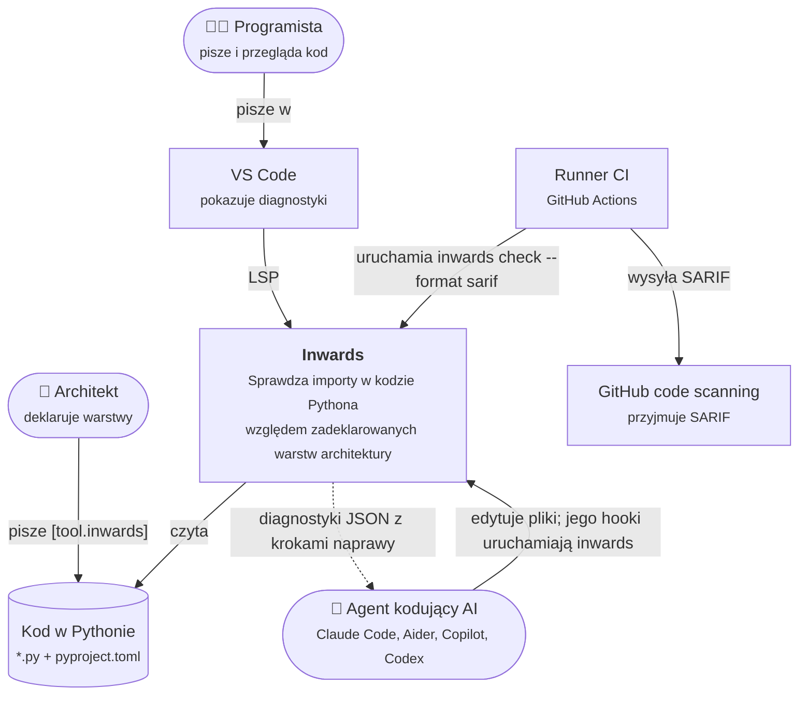
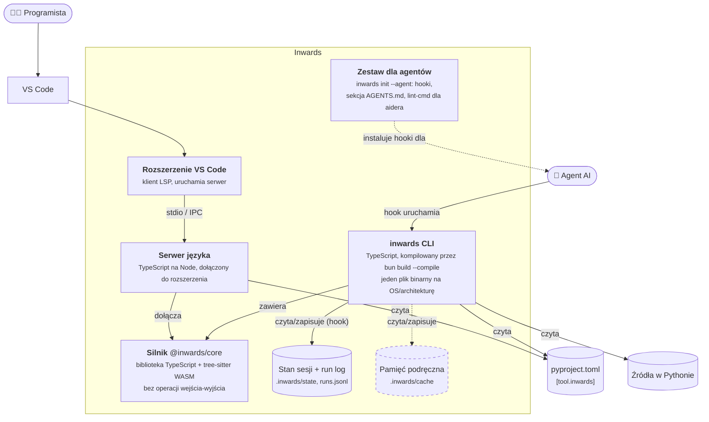
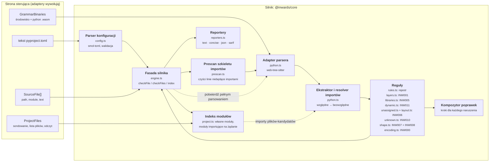
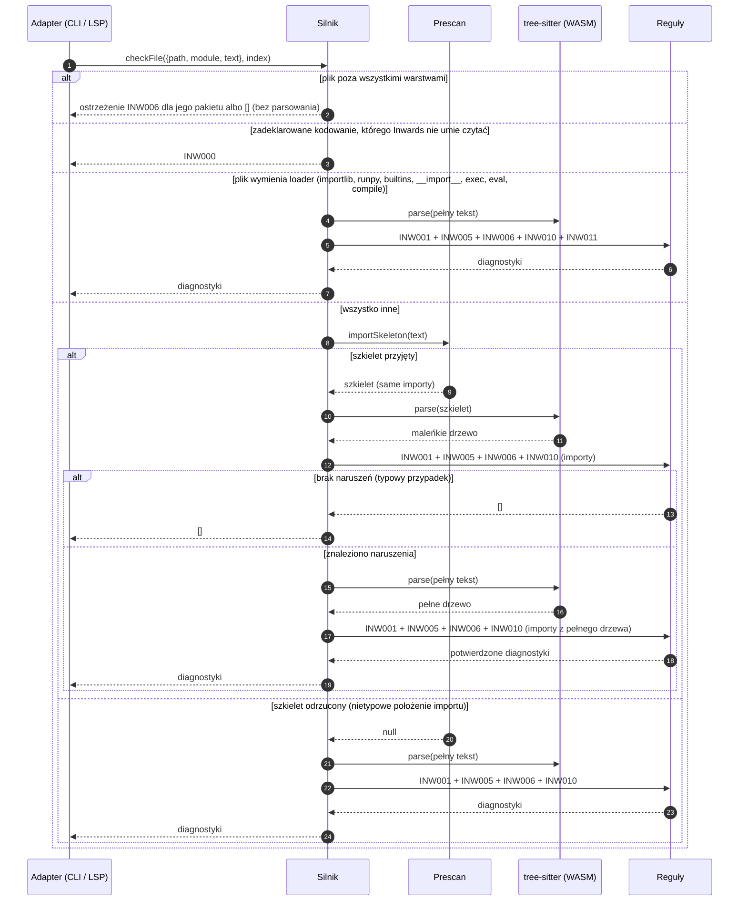
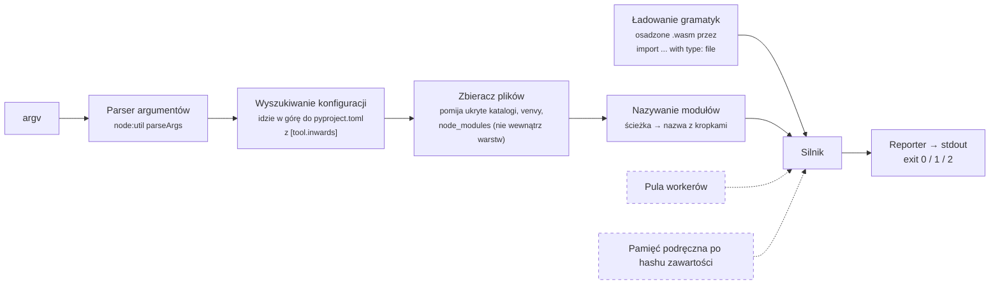
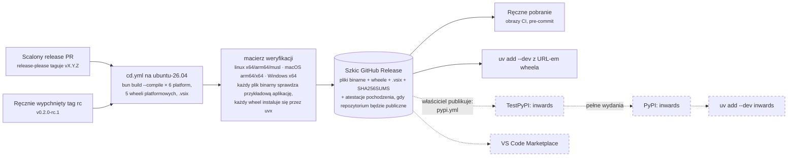

# :material-sitemap-outline: Architektura (C4) { #architecture-c4 }

Ten rozdział opisuje Inwards za pomocą [modelu C4](https://c4model.com): kontekst systemu (C1), kontenery (C2) i komponenty (C3). Diagramy to schematy blokowe Mermaid w notacji C4, bo natywna składnia C4 w Mermaid jest wciąż eksperymentalna i słabo się renderuje.

!!! tip "Legenda wspólna dla wszystkich diagramów"
    :material-account: zaokrąglone węzły to ludzie · walce to przechowywane dane · przerywane ramki są zaplanowane.

## C1: kontekst systemu { #c1-system-context }

Kto używa Inwards i z czym Inwards się komunikuje?



Do kilku rzeczy ten obraz nas zobowiązuje:

- Inwards tylko **czyta** kod. Nigdy go nie edytuje. Automatyczne poprawki zostawia agentowi, który ma kontekst, żeby zrobić to dobrze.
- Nie potrzebuje sieci, interpretera Pythona ani importowania kodu użytkownika. To wyklucza podejście z `find_spec`, którego używa pytest-archon, i sprawia, że uruchomienia są deterministyczne.
- Agent to pełnoprawny użytkownik, na równi z programistą. Format wyjścia jest projektowany przede wszystkim dla niego (zobacz [rozdział 4](04-AI-Integration.md)).

## C2: kontenery { #c2-containers }

Co jest wdrażane albo instalowane i gdzie działa każdy element?



| Kontener | Technologia | Gdzie leży | Stan |
|---|---|---|---|
| **Silnik** | TypeScript, `web-tree-sitter` 0.27 + `tree-sitter-python` 0.25 (WASM) | `src/core` | :white_check_mark: INW000, INW001, INW005, INW006, INW007, INW008, INW010, INW011 |
| **CLI** | Jednoplikowy program wykonywalny Bun 1.4, 6 platform docelowych, opakowany też w 5 wheeli platformowych | `src/cli` | :white_check_mark: `check` (text/concise/json/sarif), `init` (agenci, presety stylów, scaffold), `hook claude-code` |
| **Serwer języka** | `vscode-languageserver` 10 na Node | `src/vscode-extension/src/server.ts` | :white_check_mark: każda reguła jednoplikowa, przy każdej zmianie otwartego pliku oraz gdy powstaje albo znika plik lub katalog, który może być modułem; z nowym silnikiem, gdy zmienia się `pyproject.toml`; INW007 i INW008 dla całego obszaru roboczego na podstawie zawartości katalogów |
| **Rozszerzenie VS Code** | `vscode-languageclient` 10 | `src/vscode-extension/src/extension.ts` | :white_check_mark: `.vsix` w każdym wydaniu, :material-progress-clock: Marketplace ([#64](https://github.com/SirCypkowskyy/inwards/issues/64)) |
| **Zestaw dla agentów** | Generowana konfiguracja hooków i Markdown | `src/cli/src/init.ts` | :white_check_mark: `init --agent` dla `claude`, `aider` i `agents-md` |
| **Stan sesji i run log** | Pliki JSON i JSON Lines, tylko lokalnie | `.inwards/state/`, `.inwards/runs.jsonl` | :white_check_mark: (run log opcjonalny, [rozdział 8](08-Run-Log.md)) |
| **Pamięć podręczna** | Listy importów kluczowane hashem zawartości | `.inwards/cache` | :material-progress-clock: [#56](https://github.com/SirCypkowskyy/inwards/issues/56) |

Silnik to jedyne miejsce, w którym żyją reguły. CLI i serwer języka to adaptery: znajdują pliki, czytają je, ładują gramatyki i wybierają format wyjścia. Dzięki temu podziałowi podkreślenie w edytorze i błąd w CI nie mogą się rozjechać. Uruchamiają tę samą funkcję na tym samym tekście.

!!! warning "Jeden silnik, dwa środowiska uruchomieniowe"
    CLI uruchamia silnik na Bunie. Serwer języka uruchamia go na Node, wewnątrz procesu rozszerzeń VS Code. Jedno wywołanie API dostępnego tylko w Bunie wewnątrz `src/core/src` przeszłoby wszystkie testy (testy działają na Bunie), a potem zepsułoby rozszerzenie w czasie działania. Tej zasady pilnuje lint, a nie pamięć: `biome.jsonc` włącza `noRestrictedGlobals` dla `src/core/src/**` i odrzuca `Bun` oraz `Deno` z komunikatem wskazującym port `GrammarBinaries`. CI przy każdym pushu dodatkowo buduje paczkę rozszerzenia dla platformy `node`.

## C3: komponenty silnika { #c3-components-of-the-engine }

Silnik to heksagon w miniaturze. Dostaje bajty i tekst, zwraca zwykłe dane i nigdy nie dotyka dysku. Gramatyki wchodzą przez port (`GrammarBinaries`), więc plik binarny Buna może przekazać osadzone bloby, a serwer VS Code czyta je z katalogu instalacji.



| Komponent | Odpowiedzialność | Uwagi |
|---|---|---|
| Parser konfiguracji | Czyta `[tool.inwards]`, waliduje je i podaje dokładnie ten klucz, który jest błędny | Rzuca `ConfigError`. CLI zamienia go na kod wyjścia 2 |
| Prescan szkieletu importów | Zostawia tylko linie importów, usuwa im wcięcie, a resztę czyści, żeby numery linii się nie przesunęły | Odmawia przetworzenia pliku, gdy `import` pojawia się w miejscu, którego nie umie wyjaśnić, co wymusza pełne parsowanie. Zobacz [ADR-004](05-ADR.md#adr-004-parse-the-import-skeleton-confirm-with-a-full-parse) |
| Adapter parsera | Inicjalizuje web-tree-sitter z bajtów i parsuje | Jawnie zwalnia każde drzewo, bo pamięć WASM nie jest odśmiecana |
| Ekstraktor importów | Znajduje węzły `import` / `from ... import` w dowolnym miejscu drzewa i rozwiązuje importy względne | `from shop import infrastructure` jest zapisywane jako `shop.infrastructure`, więc nie prześlizgnie się |
| Reguły | Czyste funkcje z `(file, imports, config)` do `Diagnostic[]`. Kod, nazwa, domyślny poziom, podsumowanie i link do dokumentacji każdej reguły żyją w jednym rejestrze (`rules.ts`); z niego budowane jest `rules[]` w SARIF | INW001, INW005 dla bibliotek, które warstwa może importować, INW006 dla kodu poza wszystkimi warstwami, INW010 dla własnych modułów, które nie istnieją, INW007/INW008 dla kształtu pakietu, INW011 dla importów dynamicznych (dosłownych celów i niesprawdzalnych celów w warstwach wewnętrznych) i INW000 dla plików, których kodowanie mogłoby ukryć importy. Zaplanowane reguły są wymienione niżej |
| Kompozytor poprawek | Buduje ponumerowane kroki naprawy z faktycznych nazw importu i warstw | Kroki podają prawdziwe moduły, a nie symbole zastępcze |
| Reportery | Tekst dla ludzi, JSON `inwards/diagnostics@1` dla agentów, SARIF 2.1.0 dla GitHuba | Pola JSON można dodawać, ale nigdy nie usuwać ani nie zmieniać ich nazw |
| Fasada silnika | Koordynuje prescan, reguły i potwierdzające pełne parsowanie | Jedyne, co wywołują adaptery. Kształt pakietu (INW007) jest sprawdzany najpierw, na podstawie samej ścieżki. Plik poza wszystkimi warstwami nie jest parsowany (dostaje najwyżej ostrzeżenie INW006). Plik w warstwie, którego tekst wymienia loader modułów, pomija prescan (zobacz niżej) |
| Indeks modułów | `Engine.index(files)` opakowuje port `ProjectFiles` adaptera: `ownerOf` znajduje własny moduł, do którego trafia import, sondując po jednej ścieżce naraz, każdą tylko raz; `modules` wypisuje każdy własny moduł; `importersOf` odpowiada na pytanie „kto importuje moduł X”, parsując tylko pliki, których tekst zawiera ostatni segment nazwy X | Wejście projektu dla silnika ([#44](https://github.com/SirCypkowskyy/inwards/issues/44)): każdy adapter buduje je i przekazuje do `checkFile` i `checkFiles`. Zbudowanie go niczego nie dotyka; każde pytanie wykonuje tylko własne operacje wejścia-wyjścia, więc hook nie płaci za pytania, których nie zadaje żadna reguła. INW006 pyta `ownerOf`; INW010 pyta `ownerOf`, czy moduł istnieje, a `listDir`, co zawiera pakiet, w którym by się znajdował (skompilowane moduły rozszerzeń, najbliższe nazwy); wykrywanie cykli skorzysta z `importersOf`. Długo działający adapter buduje go od nowa, gdy plik lub katalog powstaje, znika albo zmienia nazwę |

### Przebieg jednego sprawdzenia { #how-one-check-flows }



Prescan może zgłaszać fałszywe alarmy, na przykład linię wyglądającą jak import wewnątrz docstringa, ale nigdy nie ukryje prawdziwego importu, bo odmawia przetworzenia każdego pliku, którego nie umie w pełni wyjaśnić. Źródłem prawdy jest pełne parsowanie, a uruchamia się ono tylko wtedy, gdy naruszenie wymaga potwierdzenia.

Szkielet zachowuje wyłącznie instrukcje importu, więc plik, którego jedyną zależnością na zewnątrz jest `importlib.import_module("shop.infrastructure.db")`, by go przeszedł. Zanim uruchomi się prescan, sprawdzenie tekstu szuka nazw, które każde wywołanie ładujące musi zapisać (`importlib`, `runpy`, `builtins`, `__import__` albo samo `exec`, `eval` lub `compile`, po normalizacji NFKC). Plik w warstwie, który pasuje, trafia prosto do pełnego parsowania, które szuka też importów dynamicznych. `re.compile` nie pasuje. W bibliotece standardowej CPythona 3.14 pasuje 209 z 1921 plików. Zobacz [ADR-015](05-ADR.md#adr-015-check-literal-dynamic-imports-as-inw011).

Model kosztów ma jeden zły przypadek: starszy kod, w którym większość plików już narusza reguły. Bez baseline'u prawie każdy plik płaci za parsowanie szkieletu, a potem za pełne parsowanie, co jest wolniejsze niż sparsowanie wszystkiego raz. Z baseline'em CLI przekazuje silnikowi jego klucze i liczniki (reguła, moduł, komunikat bez zdania „Allowed direction”) jako dane. Silnik najpierw skanuje każdy plik. Moduł pomija parsowanie potwierdzające, gdy każdy z jego plików przeszedł przez szkielet, każdy wynik ze szkieletu jest błędem, a dla każdego klucza wyniki ze wszystkich plików modułu (`order.py` i `order.pyi` to jeden moduł) nie przekraczają liczby zaakceptowanych kopii. Szkielet nigdy nie pomija importu, a wynik zależy tylko od celu importu, który oba parsowania odczytują tak samo. Prawdziwych wyników nie jest więc więcej niż wyników ze szkieletu, a baseline ukryłby je wszystkie także po pełnym parsowaniu. Błędy zgłaszane przez sprawdzenie są takie same z pominięciem i bez niego; test porównuje oba warianty dla każdej pary zapisów (prawdziwy import, kopia w docstringu albo w napisie) w pliku `.py` i jego `.pyi`. Liczniki mogą się różnić: fałszywe alarmy pominiętego modułu (linia wyglądająca jak import w docstringu) są ukrywane razem z jego prawdziwymi wynikami, więc `baselined` może być wyższe, a `resolved` niższe niż po pełnym parsowaniu, na przykład gdy import naprawionego naruszenia wciąż siedzi w napisie. Na syntetycznym repozytorium w trybie starszego kodu (`bench/generate.py --legacy`: 2101 plików, każdy z 2000 modułów z jednym naruszeniem, wszystkie w baseline'ie) zimne `inwards check` trwało w medianie 3,05 s przed tą zmianą i 0,55 s po niej. Samo pełne parsowanie każdego pliku trwało od 2,0 do 3,1 s, a czyste repozytorium 0,47 s (Intel Core Ultra 7 155H, jeden rdzeń).

## C3: komponenty CLI { #c3-components-of-the-cli }



Kody wyjścia są takie jak w Ruffie: `0` czysto (ostrzeżenia dozwolone), `1` znaleziono błędy, `2` błąd użycia albo konfiguracji. Agenci i skrypty CI mogą rozgałęziać się na tej podstawie bez parsowania wyjścia. W raporcie JSON `summary.violations` liczy błędy, a `summary.warnings` ostrzeżenia. Uruchomienie dla całego projektu (bez argumentów ścieżek) sprawdza też każdy prefiks warstwy i selektor kształtu względem znalezionych modułów (INW006, INW007) oraz wymagane elementy każdego pakietu z kształtem (INW008).

Pozostałe polecenia korzystają z tych samych elementów:

- `inwards hook claude-code` czyta ze stdin dane hooka Claude Code i rozdziela je według zdarzenia: SessionStart zapisuje stan sesji, PreToolUse uruchamia config guard, PostToolUse sprawdza edytowany plik, a Stop uruchamia Stop gate dla tego, co zmieniła sesja. [Rozdział 4](04-AI-Integration.md) opisuje każde z nich.
- `inwards init --agent claude|aider|agents-md` najpierw wylicza każdą zmianę plików, więc `--dry-run` może wypisać ją jako diff, a drugie uruchomienie niczego nie zmienia.
- `inwards init --style layered|clean|hexagonal [--scaffold]` zapisuje `[tool.inwards]` z presetu (i przykładowy pakiet) tylko tam, gdzie jeszcze nic nie ma, a potem uruchamia sprawdzenie w tym samym procesie i wypisuje pakiet jako drzewo z opisami. W terminalu bez flag zamiast tego pyta kreator zbudowany na `@clack/prompts`; jest ładowany importem dynamicznym, który build umieszcza w osobnym fragmencie ([ADR-020](05-ADR.md#adr-020-the-init-picker-uses-clackprompts-loaded-from-a-split-chunk)).

## Wdrożenie i dystrybucja { #deployment-and-distribution }



Wydania przebiegają według [ADR-016](05-ADR.md#adr-016-versions-and-releases-come-from-commit-types-via-a-release-pr): release-please utrzymuje otwarty release PR, jego scalenie taguje wersję i uruchamia `cd.yml`, a właściciel ręcznie publikuje szkic. Opublikowanie szkicu uruchamia `pypi.yml`, gdy zostanie on włączony (niżej). Marketplace to [#64](https://github.com/SirCypkowskyy/inwards/issues/64).

Kompilacja skrośna z jednego runnera linuksowego jest możliwa, bo gramatyki są w WASM i nie ma natywnego dodatku do budowania dla każdej platformy (zobacz [ADR-002](05-ADR.md#adr-002-web-tree-sitter-wasm-not-native-bindings)). Macierz weryfikacji uruchamia potem każdy plik binarny na jego prawdziwym systemie, bo skompilowany skrośnie wynik, którego nigdy nie uruchomiono, nie został przetestowany.

### Publikowanie na PyPI { #publishing-to-pypi }

`.github/workflows/pypi.yml` wysyła wheele opublikowanego wydania przez trusted publishing ([ADR-021](05-ADR.md#adr-021-publish-the-release-wheels-to-pypi-from-their-own-workflow-with-trusted-publishing)). Niczego nie buduje: pobiera pięć wheeli, które `cd.yml` zbudował, uruchomił na każdej platformie i dołączył do wydania, sprawdza je względem `SHA256SUMS` wydania (i ich pochodzenie buildu, gdy repozytorium będzie publiczne) i je wysyła. PyPI ufa temu jednemu plikowi workflow w jednym środowisku GitHuba na indeks, więc nigdzie nie jest przechowywany żaden token, a token OIDC mogą wygenerować tylko dwa zadania wysyłające.

| Co uruchamia | TestPyPI | PyPI |
|---|---|---|
| Opublikowanie wersji przedpremierowej (przez jej pole wyboru albo tag z przyrostkiem, takim jak `-rc.1`), przy ustawionym `PYPI_PUBLISH` | tak | nie |
| Opublikowanie pełnego wydania, przy ustawionym `PYPI_PUBLISH` | tak | tak, po nim |
| Ręczne uruchomienie, `index: testpypi` | tak | nie |
| Ręczne uruchomienie z tagu wydania (`--ref vX.Y.Z`, czego wymaga środowisko `pypi`), `index: pypi`, przy ustawionym `PYPI_PUBLISH` | tak | tak, po nim |

Szkic nigdy go nie uruchamia, ręczne uruchomienie odrzuca szkic, a pull requesty nigdy go nie uruchamiają. Na żadnym indeksie nie ma jeszcze niczego.

**Co naprawdę blokuje wysyłkę.** Każdy agent pracuje na koncie GitHub właściciela, więc wszystko po stronie GitHuba jest w zasięgu agenta: zmienna `PYPI_PUBLISH`, środowiska, tagi (żaden ruleset ich nie chroni) i ręczne uruchomienia. PyPI sprawdza repozytorium, plik workflow i środowisko uruchomienia, a nie jego ref ani commit. Jedyna bramka, do której agent nie sięgnie, to konto właściciela na pypi.org, więc publisher PyPI jest rejestrowany na końcu, przy uruchomieniu produkcyjnym, a usunięcie go tam od razu zatrzymuje każdą wysyłkę na PyPI. `PYPI_PUBLISH` i reguła tagów `v*` środowiska `pypi` chronią przed pomyłkami, a nie przed agentem.

**Jednorazowa konfiguracja, przez właściciela,** w tej kolejności, żeby żadne środowisko nie istniało bez swoich reguł w chwili, gdy uruchomienie po raz pierwszy się do niego odwoła:

1. **Utwórz dwa środowiska** (Settings → Environments → New environment):
    - `testpypi`: w „Deployment branches and tags” wybierz „Selected branches and tags”, a potem dodaj gałąź `develop` (dla ręcznych uruchomień) i wzorzec tagów `v*` (dla wydań).
    - `pypi`: tylko wzorzec tagów `v*`, żeby wdrażało się wyłącznie z tagu wydania. Dodaj siebie w „Required reviewers” i zostaw wyłączone „Prevent self-review”, bo sam publikujesz i zatwierdzasz. GitHub oferuje wymaganych recenzentów w prywatnym repozytorium tylko z GitHub Enterprise; jeśli tej opcji brakuje, dodaj ją w dniu, w którym repozytorium stanie się publiczne.

    To samo przez GitHub CLI (pomiń `reviewers` i `prevent_self_review`, jeśli GitHub je odrzuca, dopóki repozytorium jest prywatne):

    ```sh
    R=SirCypkowskyy/inwards
    gh api -X PUT repos/$R/environments/testpypi --input - <<'EOF'
    {"deployment_branch_policy": {"protected_branches": false, "custom_branch_policies": true}}
    EOF
    gh api repos/$R/environments/testpypi/deployment-branch-policies -f name=develop -f type=branch
    gh api repos/$R/environments/testpypi/deployment-branch-policies -f name='v*' -f type=tag
    gh api -X PUT repos/$R/environments/pypi --input - <<EOF
    {"reviewers": [{"type": "User", "id": $(gh api users/SirCypkowskyy -q .id)}], "prevent_self_review": false,
     "deployment_branch_policy": {"protected_branches": false, "custom_branch_policies": true}}
    EOF
    gh api repos/$R/environments/pypi/deployment-branch-policies -f name='v*' -f type=tag
    ```

2. **Zarejestruj oczekującego publishera na TestPyPI.** TestPyPI ma własne konta: zarejestruj się na [test.pypi.org](https://test.pypi.org/account/register/), potwierdź adres e-mail i włącz 2FA. Potem w [Your account → Publishing](https://test.pypi.org/manage/account/publishing/) dodaj oczekującego publishera GitHub:

    | Pole | Wartość |
    |---|---|
    | PyPI Project Name | `inwards` |
    | Owner | `SirCypkowskyy` |
    | Repository name | `inwards` |
    | Workflow name | `pypi.yml` |
    | Environment name | `testpypi` |

    Oczekujący publisher nie rezerwuje nazwy; projekt tworzy pierwsza wysyłka. Wykonaj krok 3 wkrótce potem.
3. **Próba na sucho na TestPyPI** z opublikowaną wersją przedpremierową v0.1.0-rc.1, gdy `pypi.yml` będzie na `develop`. Ten tag jest starszy niż workflow, więc uruchomienie startuje z `develop`, które akceptuje tylko środowisko `testpypi`:

    ```sh
    gh workflow run pypi.yml --repo SirCypkowskyy/inwards --ref develop -f tag=v0.1.0-rc.1 -f index=testpypi
    gh run watch --repo SirCypkowskyy/inwards \
      "$(gh run list --repo SirCypkowskyy/inwards --workflow pypi.yml -L 1 --json databaseId -q '.[0].databaseId')"
    ```

    [test.pypi.org/project/inwards/0.1.0rc1](https://test.pypi.org/project/inwards/0.1.0rc1/) powinno wtedy pokazywać pięć wheeli i wyrenderowane README. Zainstaluj pakiet w świeżym projekcie, na tylu platformach, na ilu możesz:

    ```sh
    cd "$(mktemp -d)" && uv init --bare --name testpypi-check
    uv add --dev "inwards==0.1.0rc1" --default-index https://test.pypi.org/simple/
    uv run inwards --version   # 0.1.0
    ```

    To zużywa nazwy plików 0.1.0rc1 tylko na TestPyPI; PyPI zostaje nietknięte.
4. **Uruchomienie produkcyjne,** gdy zbliża się pierwsze wydanie przeznaczone na PyPI:
    - Dodaj publishera do istniejącego projektu na PyPI. `inwards` już istnieje na pypi.org (rezerwacja w wersji 0.0.0), więc to nie jest oczekujący publisher: otwórz [Manage `inwards` → Publishing](https://pypi.org/manage/project/inwards/settings/publishing/) i dodaj publishera GitHub z właścicielem `SirCypkowskyy`, repozytorium `inwards`, workflow `pypi.yml` i środowiskiem `pypi`.
    - Włącz publikowanie: `gh variable set PYPI_PUBLISH --body true --repo SirCypkowskyy/inwards`. `gh variable delete PYPI_PUBLISH` znowu je wyłącza.

Opcjonalne utwardzenie: włącz niezmienne wydania (Settings → General → Releases → „Enable release immutability”; API zgłasza, że to ustawienie jest dostępne i wyłączone w tym repozytorium). Pliki i tag opublikowanego wydania nie mogą się wtedy już zmienić, więc późniejsze uruchomienie wysyła te bajty, które zostały opublikowane. Dotyczy to tylko wydań opublikowanych po włączeniu ustawienia i nie chroni szkicu.

**Przy każdym wydaniu** poczekaj, aż zadanie „Draft the GitHub Release” w `cd.yml` zakończy się sukcesem, a szkic będzie zawierał pięć plików `.whl` i `SHA256SUMS`. Dopiero wtedy opublikuj szkic (krok 4 wydania w `AGENTS.md`). `cd.yml` odmawia dołączania plików do opublikowanego wydania, więc zbyt wczesna publikacja zużywa wersję. Publikacja uruchamia `pypi.yml`: pełne wydanie trafia na TestPyPI, a potem czeka na twoje zatwierdzenie w „Review deployments” danego uruchomienia, zanim trafi na PyPI (gdy środowisko `pypi` ma recenzenta). Potem `uv add --dev inwards` w świeżym projekcie powinno je zainstalować. Po pierwszym wydaniu na PyPI wycofaj tam (yank) rezerwację 0.0.0 (Manage → Releases → 0.0.0 → Options → Yank).

Żeby umieścić na PyPI także wersję przedpremierową, uruchom workflow z jej tagu, czego wymaga środowisko `pypi`: `gh workflow run pypi.yml --repo SirCypkowskyy/inwards --ref v0.2.0-rc.1 -f tag=v0.2.0-rc.1 -f index=pypi`. PyPI nigdy nie przyjmuje tej samej nazwy pliku dwa razy, więc wysłana tam wersja jest ostateczna; ponowne uruchomienie tylko uzupełnia pliki, których zabrakło po nieudanym uruchomieniu.

## Znane ograniczenia { #known-limitations }

- Jeden `root` na konfigurację. Monorepo z kilkoma pakietami Pythona potrzebuje osobnego `pyproject.toml` i osobnego uruchomienia dla każdego; hook i Stop gate wybierają najbliższą konfigurację dla każdego pliku. Obsługa workspace'ów uv to [#57](https://github.com/SirCypkowskyy/inwards/issues/57) ([ADR-018](05-ADR.md#adr-018-package-selectors-take-globs-from-the-start-monorepos-follow-uv-workspaces)).
- Serwer języka czyta tylko `pyproject.toml` z katalogu głównego pierwszego folderu obszaru roboczego i sprawdza jeden otwarty plik naraz, więc nie zgłasza martwych prefiksów warstw. Nie robi tego też `inwards check` z argumentami ścieżek; robi to tylko uruchomienie dla całego projektu. Konfigurację czyta ponownie, gdy zmienia się `pyproject.toml` ([#163](https://github.com/SirCypkowskyy/inwards/issues/163)); klient, który nie potrafi obserwować plików, czyta ją ponownie dopiero wtedy, gdy sam zapisze `pyproject.toml`. Błąd konfiguracji wyskakuje raz jako komunikat i zostaje na `pyproject.toml`, dopóki go nie poprawisz, a do tego czasu sprawdzanie jest wyłączone. Ta diagnostyka trafia na właściwy wiersz tylko przy niepoprawnym TOML-u; przy każdym innym błędzie (na przykład nieznanym kodzie reguły) stoi w pierwszym wierszu, bo sprawdzenia konfiguracji wskazują klucz, a nie jego wiersz.
- Niejawne pakiety przestrzeni nazw (bez `__init__.py`) działają przy nazywaniu, ale importy względne wewnątrz nich są rozwiązywane tak, jakby katalog był zwykłym pakietem.
- Przynależność do warstwy wynika tylko z prefiksu modułu. Wzorce glob (`shop.*.domain`) dla pionowych wycinków przyjdą ze schematem konfiguracji v2 ([#51](https://github.com/SirCypkowskyy/inwards/issues/51), [ADR-018](05-ADR.md#adr-018-package-selectors-take-globs-from-the-start-monorepos-follow-uv-workspaces)).
- Dowiązania symboliczne: katalog-dowiązanie wewnątrz warstwy, który wskazuje poza projekt, nie jest sprawdzany ([#83](https://github.com/SirCypkowskyy/inwards/issues/83)), a dowiązanie-alias wewnątrz jednej warstwy, które wskazuje do innej, może ukryć import na zewnątrz ([#84](https://github.com/SirCypkowskyy/inwards/issues/84)).
- INW011 rozwiązuje import dynamiczny tylko wtedy, gdy celem jest stały napis. Każdy inny cel jest zgłaszany jako niesprawdzalny, i to tylko w warstwach, które mają warstwę zewnętrzną ([ADR-026](05-ADR.md#adr-026-report-unreadable-dynamic-import-targets-in-inner-layers)). Znane luki:
    - stałe cele, które nie są literałami (stała na poziomie modułu `TARGET = "..."`, `str.format`, `%`, konwersje w f-stringach), są zgłaszane jako niesprawdzalne zamiast być odczytane: [#79](https://github.com/SirCypkowskyy/inwards/issues/79);
    - `compile` z niedosłownym kodem nie jest zgłaszane, bo uruchomienie jego obiektu kodu wymaga `exec` albo `eval`, które są zgłaszane; obiekt kodu uruchomiony inaczej (`types.FunctionType`) zostaje przeoczony;
    - w najbardziej zewnętrznej warstwie niesprawdzalne wywołanie nie jest zgłaszane, więc może niezauważenie sięgnąć do własnego kodu poza wszystkimi warstwami (INW006);
    - loadery osiągane przez operator morsa, przypisanie krotek, atrybuty klasy albo instancji, `functools.partial`, nazwę związaną wewnątrz `exec` albo przez obiekt (`print.__self__.exec`): [#79](https://github.com/SirCypkowskyy/inwards/issues/79);
    - inne API ładujące: `pkgutil.resolve_name`, `importlib.util.find_spec` z `exec_module` oraz `SourceFileLoader(...).load_module()`: [#79](https://github.com/SirCypkowskyy/inwards/issues/79);
    - fałszywy alarm, zaakceptowany zamiast przeoczenia: przy dosłownym kodzie `exec`, `eval`, `compile` i `__import__` zawsze są traktowane jak funkcje wbudowane, więc po `from re import compile` wywołanie `compile("from shop.infrastructure import x")` zostaje zgłoszone;
    - fałszywie negatywny wynik, zaakceptowany zamiast szumu: samo `exec` albo `eval` z wyliczanym kodem jest pomijane tylko wtedy, gdy kod na pewno ponownie wiąże tę nazwę przy wywołaniu. Wiązaniem musi być `def`, `class`, zwykłe przypisanie albo import umieszczone bezpośrednio w ciele modułu (przed instrukcją najwyższego poziomu, która zawiera wywołanie) lub w ciele funkcji otaczającej wywołanie, parametr funkcji albo lambdy, której ciało zawiera wywołanie, albo cel pętli `for` wewnątrz tej pętli. Wyjątek jest wyłączony dla całego pliku, gdy którekolwiek wiązanie tej nazwy może być funkcją wbudowaną: przypisanie, operator morsa, cel `for`, `with` albo `except` czy domyślna wartość parametru, które wspominają loader; `def` albo `class`, których dekoratory lub argumenty klasy (klasy bazowe, `metaclass=`) go wspominają; import z `builtins`, `importlib`, `runpy`, modułu względnego albo własnego modułu projektu (każdy z nich może ponownie eksportować funkcję wbudowaną). Jest wyłączony także wtedy, gdy nazwa ma `global`, `nonlocal` albo `del` albo gdy plik ma import z gwiazdką lub wspomina `globals`, `vars`, `locals`, `setattr`, `delattr`, `__dict__`, `__builtins__` albo `sys.modules`. Dlatego `def eval(model, loader)` w kodzie treningowym nie jest zgłaszane. Nadal przeoczona zostaje funkcja wbudowana przekazana jako argument (`def run(exec, c): return exec(c)` wywołane jako `run(exec, code)`) oraz funkcja wbudowana osiągnięta przez obiekt bez nazwania loadera ani funkcji zapisującej przestrzeń nazw, na przykład `exec = operator.attrgetter("exec")(print.__self__)` ([#79](https://github.com/SirCypkowskyy/inwards/issues/79)). To samo sprawdzenie chroni `exec(compile("<literal>", ...))`, któremu ufamy tylko, dopóki `compile` nie jest ponownie związane;
    - zaakceptowane fałszywe alarmy tego ostrożnego sprawdzenia: zmienna wyrażenia listowego (`[eval(m) for eval in evaluators]`), nazwa metody użyta w ciele jej własnej klasy i przechwycenie `match` o nazwie `eval` albo `exec` są nadal zgłaszane.
- INW010 sprawdza tylko tę część importu statycznego, która jest modułem ([ADR-025](05-ADR.md#adr-025-inw010-probes-the-disk-for-existence-and-checks-only-the-module-part-of-an-import)): `from shop.domain import pricing` przechodzi, gdy `shop/domain` jest pakietem, bo `pricing` może być nazwą zdefiniowaną w jego `__init__.py`, a importy dynamiczne nie są sprawdzane. Moduł generowany przy budowaniu (`_version.py`, `*_pb2.py`) jest zgłaszany, dopóki nie pojawi się w checkoucie ([#160](https://github.com/SirCypkowskyy/inwards/issues/160)), podobnie jak opcjonalny import za `try/except ImportError`. Pakiet przestrzeni nazw współdzielony z zainstalowaną dystrybucją jest zgłaszany jako brakujący ([#161](https://github.com/SirCypkowskyy/inwards/issues/161)). Serwer języka nie zauważa, że `__init__.py` zaczął rozszerzać swój `__path__`, dopóki jakiś plik nie powstanie albo nie zniknie.
- Moduły, które nie należą do żadnej warstwy, nie są same sprawdzane. INW006 to uwidacznia (ostrzeżenie na pakiet, błąd dla importu do takiego pakietu z warstwy i martwe prefiksy), ale importy wewnątrz nieprzypisanego pakietu pozostają niesprawdzone, dopóki użytkownik go nie przypisze. Moduły bez źródeł, głębokość `ignore`, przemianowane pakiety najwyższego poziomu i sprawdzanie prefiksów w zakresie ścieżek są otwarte w [#86](https://github.com/SirCypkowskyy/inwards/issues/86).

## Katalog reguł { #rule-catalogue }

| Kod | Nazwa | Co wyłapuje | Stan |
|---|---|---|---|
| INW000 | `unsupported-encoding` | Plik w warstwie deklaruje kodowanie (PEP 263), takie jak `unicode_escape` albo `utf-7`, przy którym tekst, który Inwards czyta jako komentarz, może być dla CPythona prawdziwym importem. Plik jest zgłaszany, a nie pomijany | :white_check_mark: |
| INW001 | `layer-dependency` | Warstwa wewnętrzna importująca zewnętrzną | :white_check_mark: |
| INW002 | `context-independence` | Jeden kontekst ograniczony albo pionowy wycinek importujący wewnętrzne moduły innego | :material-progress-clock: [#52](https://github.com/SirCypkowskyy/inwards/issues/52) |
| INW003 | `public-api-only` | Import z pominięciem publicznego modułu kontekstu (`__init__` albo `api.py`) | :material-progress-clock: [#53](https://github.com/SirCypkowskyy/inwards/issues/53) |
| INW004 | `no-cycles` | Cykle importów między modułami albo kontekstami | :material-progress-clock: wymaga grafu, [#54](https://github.com/SirCypkowskyy/inwards/issues/54) |
| INW005 | `pure-domain` | Warstwa importująca moduł zewnętrzny albo z biblioteki standardowej, na który nie pozwalają jej `allow-libraries` / `deny-libraries` / `extend-deny-libraries`, statycznie albo dynamicznie, także w funkcjach i pod `TYPE_CHECKING`. Najbardziej wewnętrzna z dwóch lub więcej warstw domyślnie zabrania frameworków, klientów baz danych i sieci oraz operacji wejścia-wyjścia z biblioteki standardowej (`sqlalchemy`, `fastapi`, `requests`, `subprocess`...); `extend-deny-libraries` dopisuje wpisy do tej listy, a `deny-libraries` ją zastępuje. Własny kod zostaje dla INW001 i INW006. Zobacz [Biblioteki w warstwach](guides/libraries.md) | :white_check_mark: |
| INW006 | `unassigned-module` | Import z warstwy do własnego kodu, który nie należy do żadnej warstwy, w tym do pakietu nad warstwami (`from shop import x` uruchamia `shop/__init__.py`, który nie należy do żadnej warstwy), statyczny albo dynamiczny (błąd); kod warstwy przeniesiony w trakcie sesji poza wszystkie warstwy (błąd); pakiet poza wszystkimi warstwami i poza `ignore` (ostrzeżenie); prefiks warstwy, który nie pasuje do żadnego modułu (ostrzeżenie), warstwa bez żywego prefiksu albo prefiks opróżniony w trakcie sesji (błąd). Nieznane klucze i nakładające się prefiksy to błędy konfiguracji | :white_check_mark: |
| INW007 | `package-shape` | Element pakietu, na który `[[tool.inwards.shape]]` nie pozwala (błąd albo ostrzeżenie przy `extra = "warning"`) albo którego zabrania, taki jak nowy `helpers.py` obok `service.py`; nazwa elementu poza jej pakietami `only-in` z `[[tool.inwards.names]]`, taka jak `test_x.py` w aplikacji (błąd); selektor kształtu, który nie pasuje do żadnego pakietu (ostrzeżenie, w pyproject.toml). Komunikat nigdy nie wypisuje dozwolonych elementów; poprawka podaje prawdopodobny cel. Zobacz [Kształt pakietu](guides/package-shape.md) | :white_check_mark: |
| INW008 | `missing-member` | Brakuje elementu, którego wymaga kształt pakietu; zgłaszane w jego `__init__.py`. Uruchomienia dla całego projektu zgłaszają każdy taki brak; Stop gate blokuje tylko te, które pojawiły się od początku sesji | :white_check_mark: |
| INW010 | `unknown-first-party` | Import statyczny w warstwie, który wskazuje własny moduł, który nie istnieje, typowa halucynacja agenta (`from shop.domain.pricing import X` bez żadnego `pricing`), oraz import względny, który wychodzi ponad pakiet najwyższego poziomu, czego Python nigdy nie przyjmuje. Sprawdzana jest część będąca modułem: `X` w `from X import name`, a w pozostałych przypadkach cała nazwa. Istnienie jest sondowane na dysku, więc liczą się pakiety przestrzeni nazw, zaślepki i skompilowane moduły rozszerzeń (`.so`, `.pyd`, `.pyx`); poprawka wymienia trzy najbliższe moduły z tego samego pakietu. Taki import nie dostaje dodatkowo INW006, a import skierowany na zewnątrz, który zgłasza INW001, nie dostaje INW010. Pakiety, które rozszerzają swój `__path__`, są pomijane. Zobacz [ADR-025](05-ADR.md#adr-025-inw010-probes-the-disk-for-existence-and-checks-only-the-module-part-of-an-import) | :white_check_mark: |
| INW011 | `dynamic-import` | Import dynamiczny z celem w postaci literału napisowego, który sięga do warstwy zewnętrznej: `importlib.import_module`, `__import__` (także `builtins.` i `importlib.`), `runpy.run_module` oraz instrukcje importu wewnątrz dosłownego kodu dla `exec` / `eval` / `compile` (bajty, których zadeklarowanego kodowania Inwards nie umie czytać, są zgłaszane jako niesprawdzone). Śledzone są aliasy importów, przypisania `name = loader`, `getattr(m, "name")`, `m.__dict__["name"]` i `vars(m)["name"]`; `+` między literałami i f-stringi z dosłownymi polami są składane. W każdej warstwie poza najbardziej zewnętrzną cel, którego Inwards nie umie odczytać, jest zgłaszany jako niesprawdzalny: zmienna, pole f-stringa, sekwencja `\N{...}`, argument ukryty za `*args` albo `**kwargs`, względne `import_module` z nieznanym `package`, `exec` albo `eval` z niedosłownym kodem ([ADR-026](05-ADR.md#adr-026-report-unreadable-dynamic-import-targets-in-inner-layers)). Popularny sposób obejścia INW001. Znane luki są wymienione wyżej | :white_check_mark: |

## Mapa kodu { #code-map }

```text
src/
├── core/                  # engine, no I/O
│   ├── src/
│   │   ├── config.ts      # [tool.inwards] parsing and validation
│   │   ├── toml.ts        # ConfigError and the checks shared by the config parsers
│   │   ├── prescan.ts     # import skeleton fast path
│   │   ├── python.ts      # tree-sitter adapter, import extraction, module names
│   │   ├── rules.ts       # rule registry: code, name, severity, docs
│   │   ├── rule-config.ts # [tool.inwards.rules]: select, ignore, severity
│   │   ├── layers.ts      # INW001 + fix composer
│   │   ├── libraries.ts   # INW005: libraries per layer, default deny list
│   │   ├── stdlib.ts      # standard-library module names (INW005)
│   │   ├── dynamic.ts     # INW011: dynamic imports, loader hint for the engine
│   │   ├── loader-targets.ts  # what import_module, __import__ and run_module load
│   │   ├── computed-source.ts  # which exec / eval calls with a computed source count
│   │   ├── unassigned.ts  # INW006: code outside every layer, first-party probe
│   │   ├── unknown.ts     # INW010: first-party modules that don't exist, closest names
│   │   ├── layout.ts      # INW006: dead prefixes, layer code moved out of every layer
│   │   ├── shape.ts       # INW007 + INW008: package shape, ListMembers port
│   │   ├── shape-config.ts  # [[tool.inwards.shape]] / [[tool.inwards.names]], selectors, patterns
│   │   ├── shape-fix.ts   # INW007/INW008 wording, likely target
│   │   ├── callees.ts     # which calls are loaders, through aliases
│   │   ├── literals.ts    # string literals and call arguments, as Python reads them
│   │   ├── encoding.ts    # INW000: declared encodings that can hide imports
│   │   ├── reporters.ts   # text / concise / json / sarif
│   │   ├── engine.ts      # facade
│   │   ├── baseline.ts    # baseline keys, which findings a baseline accepts
│   │   ├── project.ts     # module index (the engine's project input), importers on demand
│   │   ├── types.ts       # SourceFile, Diagnostic, Fix, Span
│   │   ├── index.ts       # the public API adapters import
│   │   └── meta.ts        # VERSION, DOCS_BASE
│   ├── scripts/           # prescan-diff.ts: the differential test
│   └── test/              # bun test
├── cli/
│   ├── src/
│   │   ├── main.ts        # commands: check, baseline, stats, init, hook claude-code
│   │   ├── project.ts     # load the config and sources, run a check
│   │   ├── baseline.ts    # inwards-baseline.json: write, apply, hash for the Stop gate
│   │   ├── files.ts       # file walk: skips, symlinks, layer packages walked in full
│   │   ├── paths.ts       # real paths, containment, config discovery (ADR-013)
│   │   ├── grammars.ts    # .wasm files embedded in the binary
│   │   ├── output.ts      # stdout / stderr without console.*
│   │   ├── hook.ts        # hook entry: SessionStart, PostToolUse, dispatch
│   │   ├── guard.ts       # PreToolUse config guard
│   │   ├── shell.ts       # reads Bash commands for `inwards hook` / `inwards baseline`
│   │   ├── edit-sim.ts    # applies an Edit/Write/MultiEdit in memory for the guard
│   │   ├── stop.ts        # Stop gate
│   │   ├── prefixes.ts    # INW006 and INW008 layout checks against the session start
│   │   ├── escalation.ts  # escalate-after, unresolved records
│   │   ├── session.ts     # session state: start record, edits, fingerprints
│   │   ├── snapshot.ts    # configs, content hashes and HEAD of the project now
│   │   ├── state-files.ts # .inwards/state writes, symlink checks, pruning
│   │   ├── runlog.ts      # opt-in .inwards/runs.jsonl
│   │   ├── runs.ts        # reads the run logs back for stats
│   │   ├── stats.ts       # the hypothesis numbers from the run log
│   │   ├── stats-command.ts  # inwards stats: finds the logs, prints the report
│   │   ├── log-export.ts  # stats --export [--redact]: one shareable log file
│   │   ├── init.ts        # inwards init --agent
│   │   ├── init-style.ts  # inwards init --style / --scaffold, the entry for every init
│   │   ├── init-report.ts # the annotated tree and check after init --style
│   │   ├── init-target.ts # the pyproject.toml, package and src layout init --style uses
│   │   ├── init-write.ts  # scaffold writes: no symlinks, nothing outside, all or nothing
│   │   ├── styles.ts      # the presets and the scaffold's Python templates
│   │   ├── picker.ts      # the interactive init (@clack/prompts, loaded lazily)
│   │   ├── claude-settings.ts  # finds the Inwards hooks in Claude Code settings
│   │   └── diff.ts        # line diff for init --dry-run
│   └── test/              # CLI, hook, Stop gate and E2E tests, snapshots
└── vscode-extension/src/  # extension.ts (client), server.ts (LSP), workspace.ts (INW007/INW008 pass)
```

Poza `src/`: `scripts/` buduje pliki binarne i wheele oraz sprawdza wersje i nawigację dokumentacji, `packaging/` zawiera README wheela i rezerwacje nazw, `eval/` to środowisko ewaluacji agentów, `bench/` generuje syntetyczne repozytorium do benchmarków i porównuje na nim dwa buildy dla bramki regresji w PR-ach, a `examples/clean-app` to aplikacja, którą sprawdza CI.
