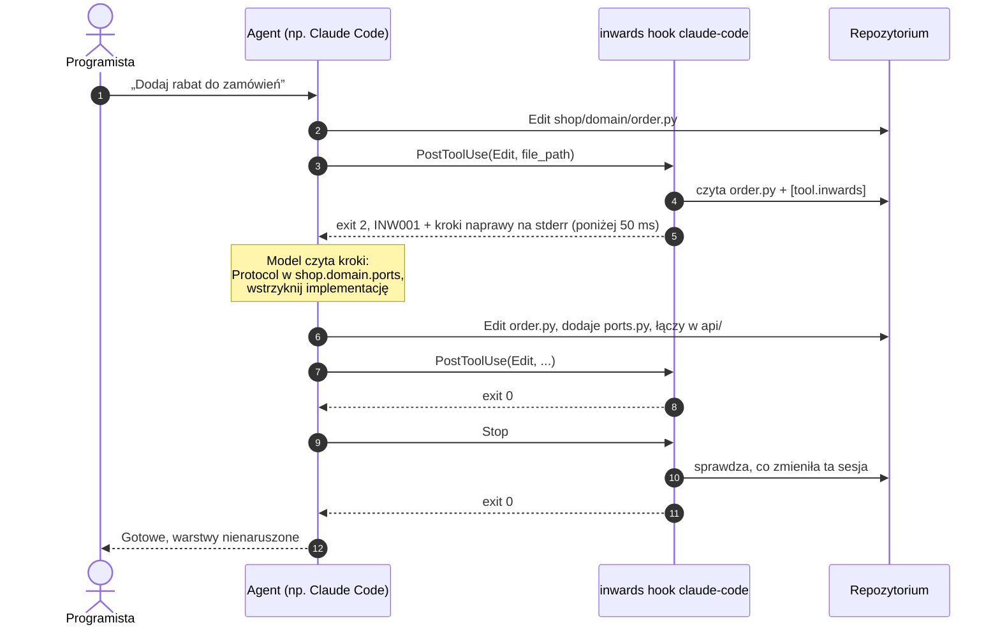
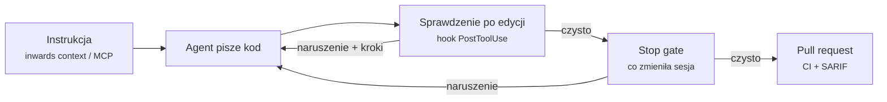

# :material-robot-happy-outline: Integracja z AI { #ai-integration }

Głównym użytkownikiem Inwards jest agent kodujący AI. Ten rozdział wyjaśnia, jak Inwards dociera do agentów, co im mówi i jak radzi sobie z agentem, który wolałby uciszyć sprawdzenie, niż naprawić kod.

## Gdzie Inwards siedzi w pętli agenta { #where-inwards-sits-in-the-agent-loop }

Agent pracuje w pętli: czyta, planuje, edytuje, sprawdza i tak od nowa. Reguły architektury zwykle wchodzą do tej pętli dopiero na samym końcu, gdy człowiek przegląda pull request. Inwards przenosi je do kroku „sprawdź” i uruchamia przy każdej edycji.



Sprawdzaniem zajmują się dwa hooki. **Hook dla każdej edycji** daje szybką informację zwrotną o pliku, który właśnie się zmienił. **Stop gate** sprawdza wszystko, co zmieniła sesja, zanim agent może zgłosić sukces, łącznie z edycjami, których hook edycji nigdy nie widział (Bash, commity). Sprawdza tylko to, co się zmieniło, a w zmienionym pliku tylko to, co jest nowe od początku sesji, więc stare naruszenia w starszym repozytorium nigdy nie blokują czystej tury. Sam hook edycji nie widzi takich edycji, a sama bramka daje informację zwrotną zbyt późno na tanie poprawki, więc używamy obu. Dwa kolejne pilnują, żeby były uczciwe: hook `SessionStart` zapisuje, od czego zaczęła się sesja, a hook `PreToolUse`, czyli config guard, odrzuca edycje reguł. Ten sam hook `PreToolUse` uruchamia też shape guard, który odrzuca `Write` tworzący plik Pythona zabroniony przez kształt pakietu ([INW007](rules/INW007.md)).

## Integracje według agenta { #integrations-by-agent }

=== ":simple-anthropic: Claude Code"

    Skonfiguruj to jednym poleceniem, uruchomionym w projekcie:

    ```sh
    inwards init --agent claude            # --dry-run shows the diff first
    ```

    W projekcie, który nie ma jeszcze `[tool.inwards]`, `inwards init --style hexagonal --agent claude` zapisuje warstwy z presetu i hooki w jednym uruchomieniu (zobacz [Instalacja](guides/install.md#a-new-project-start-from-a-preset)).

    Polecenie zapisuje hooki w `.claude/settings.local.json`, który przechowuje ustawienia tylko dla tej maszyny (`init` dodaje go do `.gitignore`), i zachowuje wszystkie hooki i ustawienia, które już tam są. Każdy hook używa formy exec (`"command"`: bezwzględna ścieżka do pliku binarnego, `"args"`: `["hook", "claude-code"]`), więc Claude Code uruchamia go bez powłoki: `PATH`, aktywowany virtualenv, spacje ani `$` w ścieżce, ani Git Bash kontra PowerShell na Windows nie mają znaczenia. Z `--launcher "uv run"` (dla Inwards jako zależności deweloperskiej uv) każdy hook jest zamiast tego poleceniem powłoki `cd "$CLAUDE_PROJECT_DIR" && uv run inwards hook claude-code`, które nie zawiera żadnej ścieżki, a `init` ostrzega, gdy ścieżka, którą by zapisał, leży w pamięci podręcznej uv albo bunx. `init` dodaje też `.inwards/` do `.gitignore`, przypina `required-version` i domyślną listę `ignore` (`tests`, `scripts`, `migrations`, `conftest`) w `[tool.inwards]` i dodaje trzy reguły `permissions.deny`, `Edit(/.claude/settings*.json)`, `Edit(/.inwards/**)` i `Edit(/**/inwards-baseline.json)`, więc sam Claude Code odrzuca te edycje, nawet gdy hooka zabraknie. Ponowne uruchomienie niczego nie zmienia. Instaluje każde zdarzenie hooka, które implementuje Inwards: SessionStart, PreToolUse (config guard i shape guard), PostToolUse i Stop.

    Claude Code uruchamia [hooki](https://code.claude.com/docs/en/hooks) wokół wywołań narzędzi. Dla `PostToolUse` kod wyjścia 2 nie cofa edycji (ona już się wydarzyła), ale Claude widzi stderr hooka i na nie reaguje. Dla `Stop` kod wyjścia 2 każe Claude'owi dalej pracować zamiast kończyć turę. Dane wejściowe hooka zawierają `stop_hook_active`, a Claude Code i tak kończy turę po kilku kolejnych blokadach, więc zepsuty hook Stop nie może uwięzić sesji.

    Żeby zamiast tego udostępnić konfigurację przez commitowany `.claude/settings.json`, napisz go ręcznie. Ta wersja zakłada, że `inwards` jest w `PATH`:

    ```json title=".claude/settings.json"
    {
      "hooks": {
        "SessionStart": [
          { "hooks": [{ "type": "command", "command": "inwards hook claude-code" }] }
        ],
        "PreToolUse": [
          {
            "matcher": "Edit|Write|MultiEdit|Bash",
            "hooks": [{ "type": "command", "command": "inwards hook claude-code" }]
          }
        ],
        "PostToolUse": [
          {
            "matcher": "Edit|Write|MultiEdit",
            "hooks": [
              {
                "type": "command",
                "command": "inwards hook claude-code"
              }
            ]
          }
        ],
        "Stop": [
          { "hooks": [{ "type": "command", "command": "inwards hook claude-code" }] }
        ]
      }
    }
    ```

    `inwards hook claude-code` czyta JSON hooka ze stdin, więc nie potrzebuje `jq` ani powłoki POSIX i działa tak samo na Windows. Po `PostToolUse` sprawdza ten jeden plik Pythona, który agent właśnie zapisał:

    - **Naruszenie:** zwięzłe diagnostyki JSON na stderr, kod wyjścia 2.
    - **Naruszenie, które plik miał już na początku sesji:** kontekst, a nie blokada (kod wyjścia 0, notatka, która wymienia je jako już istniejące i każe agentowi zostawić je w spokoju, chyba że zadanie wymaga tego kodu). Naruszenie dodane przez edycję nadal blokuje, łącznie z drugą kopią starego importu. To, skąd bramka wie, co już było, opisuje niżej część o Stop gate.
    - **Same ostrzeżenia** (INW006: plik nie należy do żadnej warstwy): kod wyjścia 0, a ten sam JSON wraca do modelu jako `additionalContext`, więc edycja zostaje, ale agent się o tym dowiaduje.
    - **Kształt pakietu** ([przewodnik](guides/package-shape.md)): INW007 blokuje, gdy plik jest nowy w tej sesji, a dla pliku, który istniał na początku sesji pod tą samą ścieżką, bez dowiązania symbolicznego na tej ścieżce (tożsamość startowa z [ADR-028](05-ADR.md#adr-028-inline-suppressions-need-a-reason-and-an-agent-cant-add-one-by-default)), jest tylko kontekstem. Alias utworzony przez agenta albo plik z początku sesji podmieniony na dowiązanie nadal blokuje, tu i w Stop gate. INW008 dla pakietu edytowanego pliku (wciąż brakuje wymaganego elementu) jest zawsze kontekstem; egzekwuje go Stop gate.
    - **Czysty plik, plik spoza Pythona albo każde inne zdarzenie hooka:** kod wyjścia 0, brak wyjścia.
    - **Zepsute `[tool.inwards]`:** komunikat trafia na stderr z kodem wyjścia 2, więc agent, który zepsuł konfigurację, się o tym dowiaduje. Gdy `[tool.inwards]` w ogóle nie ma, hook milczy, bo może być zainstalowany dla każdego projektu; config guard nie pozwala agentowi usunąć tabeli.
    - **Nieczytelne dane wejściowe albo błąd wewnętrzny:** kod wyjścia 1. Claude Code pokazuje to użytkownikowi, a nie modelowi.
    - **Plik spoza projektu** (`CLAUDE_PROJECT_DIR` albo katalog, w którym Claude Code uruchamia hook; nigdy `cwd` z samych danych wejściowych): pomijany, nawet gdy ścieżka sięga do niego przez `..` albo dowiązanie symboliczne. Dane wejściowe pochodzą od agenta, więc Inwards nie pozwala im decydować, co zostanie sprawdzone.
    - **Monorepo:** obowiązuje najbliższy `pyproject.toml` z `[tool.inwards]` nad edytowanym plikiem, o ile leży wewnątrz projektu. Konfiguracja powyżej `CLAUDE_PROJECT_DIR` jest ignorowana, więc otwieraj sesję w katalogu, który zawiera konfigurację.
    - **Dowiązania symboliczne:** plik osiągnięty przez alias-dowiązanie jest sprawdzany pod każdą nazwą, pod którą Python mógłby go zaimportować, więc alias nie może wyprowadzić go z jego warstwy.

    Hook przechowuje też stan dla każdej sesji w `.inwards/state/`, zawsze włączony i nigdy nigdzie niewysyłany. Przy `SessionStart` (start albo `/clear`) zapisuje `<session_id>.start.json`: commit HEAD, każdą tabelę `[tool.inwards]` w projekcie, hash każdego pliku Pythona, hash każdego `inwards-baseline.json` oraz dowiązania symboliczne w pakietach warstw z ich rzeczywistymi celami. Obok trafia `<session_id>.content.json`, kopie plików Pythona, których zawartości ze startu git nie potrafi oddać (patrz Stop gate niżej). Każdy z nich zapisuje do pliku tymczasowego i zmienia jego nazwę, więc żaden nigdy nie jest zapisany w połowie. Po każdej edycji dopisuje jedną linię do `<session_id>.jsonl`: plik i fingerprint każdego zgłoszonego naruszenia (reguła, moduł, komunikat). Hooki działają równolegle, więc do logu tylko się dopisuje. Stop gate i eskalacja opisane niżej czytają ten stan, żeby odróżnić naruszenia wprowadzone w sesji od tych, które już były. Sesja bez pliku startowego liczy się jako nieznana, a Stop gate traktuje nieznaną sesję jako nieczystą. Ani wznowienie, ani kompaktowanie nie zapisuje nowego startu, więc usunięcia `.inwards/` w trakcie sesji nie cofnie następny `SessionStart`. Hook nie podąża za dowiązaniem symbolicznym `.inwards` ani `state`, więc stanu nie da się zapisać poza projektem. Inne sesje starsze niż tydzień albo spoza 50 najnowszych są usuwane przy starcie sesji.

    <figure markdown="span">
      { loading=lazy }
      <figcaption>Kod wyjścia 2 każe Claude Code pokazać modelowi stderr hooka. <code>seen-by-claude.json</code> to dokładnie to, co czyta Claude.</figcaption>
    </figure>

    Przy `Stop` to samo polecenie uruchamia **Stop gate**. Sprawdza każdy plik Pythona zmieniony w sesji: edycje, które widział hook edycji, oraz każdy plik, którego hash zawartości różni się od stanu z początku sesji. Porównanie hashy nie zależy od gita, więc commit zrobiony w trakcie sesji, `git update-index --assume-unchanged`, pliki ignorowane przez gita i nieśledzone liczą się jako zmiany. Wewnątrz pakietu najwyższego poziomu, który zawiera warstwę (`shop/` dla `shop.domain`), nic nie jest pomijane, więc `pyvenv.cfg`, katalog `node_modules` ani dowiązanie do niego nie ukryją tam modułu (`inwards check` przegląda pliki tak samo). Moduł warstwy, który znika, gdy moduł o tej samej nazwie albo zawartości pojawia się poza wszystkimi warstwami, liczy się jako wyprowadzony z warstwy i oblewa bramkę. Tak samo dowiązanie symboliczne utworzone w warstwie w trakcie sesji, które wskazuje poza katalog `root` albo do innej warstwy ([INW006](rules/INW006.md)): hashe nie widzą dowiązania poza projekt, więc zapis startu sesji wymienia dowiązania. Inne pliki nie są sprawdzane. Werdykt INW001 zależy tylko od nazw modułów, więc edycja pliku nie może sprawić, że plik, który go importuje, zacznie naruszać reguły. Wyjątkiem jest INW006: moduł utworzony poza wszystkimi warstwami sprawia, że nietknięty plik, który już importował tę nazwę, nie przechodzi. Nowy pakiet najwyższego poziomu bramka obsługuje sama: zapis startu sesji wymienia moduły najwyższego poziomu pod każdym `root` (także skompilowane i pakiety, które pomija przeszukiwanie drzewa), a bramka sprawdza też każdy plik pod `root`, który zapisuje nową nazwę jako nazwę najwyższego poziomu, a ich wersję ze startu sesji sprawdza bez tego pakietu (plik, którego sesja nie zmieniła, sam jest swoją wersją ze startu, więc jego stare naruszenia pozostają stare także ponad limitami kopii), więc `requests/__init__.py` dodany pod starym `import requests` w warstwie blokuje ([#86](https://github.com/SirCypkowskyy/inwards/issues/86)). Wymaga to przeczytania każdego pliku pod `root`, ale tylko w sesji, która dodała nazwę najwyższego poziomu. Na moduł utworzony głębiej, albo dla ostrzejszej bramki, ustaw `stop-gate = "project"` w `[tool.inwards]`: bramka sprawdza wtedy przy każdym Stop cały projekt względem jego baseline'u, więc każde naruszenie, którego baseline nie akceptuje, blokuje, gdziekolwiek jest. Kosztuje to sprawdzenie całego projektu przy każdym Stop, około 0,5 s na syntetycznym repozytorium z 2100 plikami, w którym każde naruszenie jest w baseline'ie, a bez baseline'u blokuje każde stare naruszenie. Tryb jest odczytywany z migawki z początku sesji, więc wyłączenie go w trakcie sesji powoduje tylko niezgodność przy porównaniu konfiguracji. Jeśli baseline zmienił się w trakcie sesji, bramka nie może mu ufać i wraca do zmienionych plików, więc nie zasypuje agenta wszystkimi starymi naruszeniami. Dowiązany symbolicznie `pyproject.toml` jest sprawdzany dla drzewa, w którym leży, a nie dla drzewa swojego celu.

    W zmienionym pliku blokują tylko naruszenia, których plik nie miał na początku sesji. Agent poproszony o dodanie właściwości do pliku ze starym naruszeniem był wcześniej trzymany przy pracy, dopóki to naruszenie nie zniknęło, i w ewaluacji z 2026-09-26 usuwał albo zmieniał funkcje, żeby do tego doprowadzić ([#134](https://github.com/SirCypkowskyy/inwards/issues/134)). Teraz stare naruszenia trafiają do agenta jako kontekst, gdy bramka blokuje z innego powodu, a czysta tura się kończy. Żeby wiedzieć, co plik zawierał, bramka czyta surowy blob pliku z gita na commicie, od którego zaczęła się sesja (`git cat-file blob`), używa go (albo tego samego tekstu z końcami linii CRLF, na potrzeby `core.autocrlf`) tylko wtedy, gdy jego SHA-256 zgadza się z manifestem startowym, i go sprawdza. Nigdy nie stosuje filtrów: sterownik filtra pochodzi z `.gitattributes` i `.git/config`, które agent może zapisać, więc uruchomienie go oznaczałoby uruchomienie polecenia agenta poza uprawnieniami Claude Code. Z tego samego powodu przekazuje `--no-lazy-fetch`: w repozytorium, które agent zamienił w częściowy klon (partial clone), brakujący blob zostałby inaczej pobrany przez zdalne repozytorium, którego URL `ext::` albo `core.sshCommand` wybrał agent. Git starszy niż 2.44 odrzuca tę flagę, więc bramka nie czyta tam żadnego bloba, a zawartość startowa każdego pliku pochodzi z kopii opisanych niżej. Stare naruszenia nie trafiają też do run logu, więc `inwards stats` nie liczy ich jako wprowadzonych. Błędy są dopasowywane po regule, module i komunikacie, a nie po linii, i liczone tak jak w baseline'ie: jeden stary import, przeniesiony czy nie, pozostaje stary, a jego druga kopia jest nowa. To sprawdzenie działa tylko dla zmienionego pliku z błędami, raz na Stop i raz na edycję w hooku PostToolUse; na przykładowej aplikacji z ewaluacji dodaje około 20 ms do uruchomienia hooka, które znajduje stare naruszenie. Plik, który na początku sesji był zmieniony, nieśledzony albo poza gitem, nie ma bloba do przeczytania, więc `SessionStart` zachowuje jego kopię w `.inwards/state/<session_id>.content.json` ([#157](https://github.com/SirCypkowskyy/inwards/issues/157)). Takie pliki znajduje przez `git ls-tree` na commicie startowym, który też nie uruchamia filtrów: plik, którego bajty są bajtami bloba albo bloba z końcami linii CRLF, nie dostaje kopii. Bramka ufa kopii tak samo jak blobowi, tylko jeśli jej SHA-256 zgadza się z manifestem startowym, więc kopia zmieniona przez Bash jest pomijana. Kopię dostaje tylko plik, który jest swoją własną tożsamością startową, więc alias przez dowiązanie symboliczne nie może jej pożyczyć. Kopie mają limit 512 KiB na plik i 4 MiB na sesję; plik ponad limitem nie ma zawartości startowej, której da się dowieść, więc każde naruszenie w nim liczy się jako nowe i blokuje, a ten przypadek obejmuje baseline. Kopie są zapisywane jak rekord startowy, atomowo i bez podążania za dowiązaniem symbolicznym, i usuwane razem z nim. Na syntetycznym repozytorium z 2100 plikami dodają około 30 ms do `SessionStart` przy czystym albo lekko zmienionym drzewie (wywołanie `ls-tree` i hashowanie każdego pliku jako bloba gita) i około 50 ms przy 500 zmienionych plikach albo na gicie starszym niż 2.44, który kopiuje każdy plik aż do limitu. Odrzucono dwie alternatywy: sprawdzanie każdego pliku przy `SessionStart` kosztuje sprawdzenie całego projektu na sesję, a pierwszy raport PostToolUse dla pliku zawiera już pierwszą edycję agenta. `stop-gate = "project"` z tego nie korzysta: tam blokuje każde naruszenie, którego nie akceptuje baseline, gdziekolwiek jest.

    Bramka nie pozwala też zakończyć tury, gdy nie może ufać sesji:

    - **Brak zapisu startu**, bo usunięto `.inwards/` albo hooki zainstalowano w trakcie sesji. Gdy Claude Code ustawi `stop_hook_active` po blokadzie, bramka pozwala tej turze się zakończyć.
    - **`[tool.inwards]` różni się od migawki z początku sesji**, na przykład po `sed -i` przez Bash, albo **zmieniony plik podlega `pyproject.toml`, który na początku nie miał poprawnego `[tool.inwards]`** (nowa, pobłażliwa konfiguracja zagnieżdżona w warstwie). Po zmianie `[tool.inwards]` bramka sprawdza zmienione pliki według migawki z początku sesji, więc blokada pokazuje też to, co zmiana by ukryła: gdy przez Bash dodano `ignore = ["INW001"]` albo `severity = { INW001 = "warning" }`, naruszenie INW001 nadal pojawia się jako błąd ([#164](https://github.com/SirCypkowskyy/inwards/issues/164)).
    - **Hook `SessionStart`, `PreToolUse` albo `PostToolUse` Inwards zniknął ze wszystkich warstw ustawień** (użytkownika, projektu, lokalnej), łącznie z matcherem, który nie obejmuje już narzędzi, które musi widzieć, albo ustawiono **`disableAllHooks`**. Sprawdzenie czyta ustawienia, a nie programy, które one uruchamiają, więc dowodzi konfiguracji, a nie tego, że działa prawdziwy Inwards. Claude Code przeładowuje hooki, gdy ustawienia się zmieniają, więc usunięcie samego hooka Stop od razu wyłącza bramkę; te edycje blokuje config guard (niżej).

    Bramka blokuje turę najwyżej `escalate-after` razy (domyślnie 3). Stop po ostatniej blokadzie pozwala zakończyć turę i pokazuje użytkownikowi, co wciąż jest nierozwiązane, a eskalacja (niżej) zamienia powtarzającą się porażkę w pytanie do użytkownika. Licznik zaczyna się od nowa z każdą nową turą. Jeśli sama bramka zawiedzie (na przykład nieczytelny plik), blokuje raz z błędem i pozwala zakończyć turę przy następnej próbie, więc zepsuta bramka nie może ciągnąć sesji w nieskończoność.

=== ":material-code-braces: OpenCode"

    `inwards init --agent opencode` zapisuje plugin projektu `.opencode/plugins/inwards.js` (dodany też do `.gitignore`, bo zawiera bezwzględną ścieżkę do pliku binarnego). Plugin zamienia zdarzenia OpenCode na powyższe ładunki i uruchamia `inwards hook claude-code`, więc sprawdzenie po edycji, strażnik konfiguracji, bramka Stop i eskalacja to ten sam kod. OpenCode nie może odmówić zakończenia tury: gdy sesja przechodzi w bezczynność, blokująca bramka Stop odsyła swoje powody jako nową wiadomość, która zaczyna kolejną turę. Strażnik nie przeczyta `apply_patch`, więc plugin odmawia łatek dotykających `pyproject.toml` albo plików Inwards. [Przewodnik po OpenCode](guides/opencode.md#what-holds-on-opencode) wymienia każdą różnicę, a [ADR-033](05-ADR.md#adr-033-opencode-through-a-plugin-that-runs-the-claude-code-hook) opisuje projekt.

=== ":material-console: Aider"

    Aider lintuje pliki, które edytuje, a gdy linter zgłasza błąd, pokazuje wyjście modelowi i prosi go o naprawienie problemów. Inwards podłącza się jako polecenie lintujące dla Pythona. `inwards init --agent aider` wypisuje dokładną linię, z bezwzględną ścieżką do pliku binarnego, do `.aider.conf.yml`:

    ```yaml title=".aider.conf.yml"
    lint-cmd: "python: '/home/you/.local/bin/inwards' check --format text"
    ```

    Aider uruchamia polecenie z katalogu głównego repozytorium git, raz na każdy edytowany plik, z dopisaną ścieżką tego pliku. Wystarczy tu wyjście tekstowe, bo Aider przekazuje je modelowi bez zmian. Aider nie ma hooka Stop ani config guarda; [przewodnik po Aiderze](guides/aider.md) opisuje, co zrobić zamiast tego.

=== ":material-microsoft-visual-studio-code: Copilot (VS Code)"

    Copilot nie ma hooka, z którego Inwards mógłby skorzystać. W VS Code rozszerzenie umieszcza każde naruszenie w panelu Problems, a agent widzi je, gdy czyta ten panel (narzędzie `#read/problems`) albo uruchamia sprawdzenie, o które prosi `AGENTS.md`. `inwards mcp` daje mu [narzędzia MCP](guides/mcp.md).

    Agent Copilota w chmurze (cloud agent), który pracuje na GitHubie i otwiera pull requesty, czyta ten sam `AGENTS.md`, dostaje Inwards z `.github/workflows/copilot-setup-steps.yml`, a warstw pilnuje sprawdzenie w CI na jego pull requeście. [Poradnik GitHub Copilot](guides/copilot.md) opisuje konfigurację obu.

=== ":material-file-document-edit-outline: Codex, Cursor i inni"

    Każdemu agentowi, który czyta `AGENTS.md`, można kazać uruchomić sprawdzenie. `inwards init --agent agents-md` dodaje (albo aktualizuje) tę sekcję między znacznikami `<!-- inwards:begin -->` i `<!-- inwards:end -->`:

    ```markdown title="AGENTS.md"
    ## Architecture check (Inwards)

    The layers in `[tool.inwards]` (pyproject.toml) are enforced. Before you finish a task, run:

        inwards check --format json

    Exit code 1 means an import breaks a layer: follow the numbered `fix.steps` in the output.
    Don't edit `[tool.inwards]` to make the check pass; ask the user instead.
    ```

    Instrukcja jest słabsza niż hook, bo agent może ją pominąć. Tam, gdzie agent ma system hooków, zainstaluj również hook (`inwards init --agent claude`).

    Agent z klientem MCP (między innymi Codex CLI, Cursor i Claude Code) może też pytać Inwards bezpośrednio przez `inwards mcp`: gdzie należy nowy kod, czy kod przejdzie sprawdzenie, zanim zostanie zapisany, i co znaczy reguła. [Poradnik MCP](guides/mcp.md) opisuje konfigurację każdego klienta.

## Co mówi Inwards i dlaczego w takiej formie { #what-inwards-says-and-why-its-shaped-that-way }

### Formaty { #formats }

| Format | Dla kogo | Postać |
|---|---|---|
| `text` | Ludzie, Aider | `file:line:col: CODE message`, potem ponumerowane kroki naprawy |
| `json` | Agenci, skrypty | `inwards/diagnostics@1`: `summary` + `diagnostics[]`, każda z `fix.summary` i `fix.steps[]` |
| `sarif` | GitHub code scanning ([workflow](guides/ci.md)), przeglądarki SARIF w IDE | SARIF 2.1.0. Kroki naprawy trafiają do `message.text` i `properties.fix` |
| `concise` | Agenci z budżetem tokenów | Jedna linia na diagnostykę: położenie, kod, komunikat (podaje import, jeśli reguła go ma) i pierwszy krok naprawy. Podziały linii, na przykład w zawiniętym `from x import (…)` cytowanym w poprawce, są zamieniane na spacje. Potem linia podsumowania. Nigdy nie jest kolorowany |

<figure markdown="span">
  { loading=lazy }
  <figcaption>JSON, który dostaje agent: wersjonowane podsumowanie i uporządkowane kroki naprawy. Wyjście przekierowane do potoku jest zwięzłe; tutaj <code>jq</code> tylko je ładnie formatuje.</figcaption>
</figure>

`--max-diagnostics N` wypisuje najwyżej N diagnostyk, błędy przed ostrzeżeniami, i informuje, co pominięto. Tekst i `concise` dodają linię taką jak `Not shown: 3 violations, 1 warning.`; JSON dodaje `summary.omitted`. Liczniki w podsumowaniu i kod wyjścia wciąż obejmują każdą diagnostykę. SARIF odrzuca tę flagę, bo code scanning powinien widzieć każdy wynik.

`inwards check PATHS...` sprawdza tylko pliki Pythona pod `root`, każdy osobno. Pomija sprawdzenia, które potrzebują całego projektu: martwe prefiksy i selektory warstw, zagnieżdżone projekty i dowiązania symboliczne w warstwach (INW006), selektory kształtów (INW007), wymagane elementy pakietów z kształtem (INW008) i cykle importów (INW004). Do nich uruchom `inwards check` bez ścieżek; `--help` mówi to samo. Podana ścieżka, która nie daje żadnego pliku do sprawdzenia, bo leży poza `root` albo nie zawiera pliku Pythona, dostaje linię taką jak `warning: tools/x.py is outside root "src" and was not checked.` JSON wymienia takie ścieżki w tablicy `notChecked` najwyższego poziomu, z polami `path` i `message`, a SARIF umieszcza je w `invocations[0].toolExecutionNotifications` z poziomem `warning`. Pozostałe ścieżki są sprawdzane normalnie. Jeśli żadna z podanych ścieżek nie dała pliku, linia podsumowania brzmi `Nothing checked: 0 files` zamiast `All clear`, a kod wyjścia to 2.

### Pisanie diagnostyk dla modelu { #writing-diagnostics-for-a-model }

Każda diagnostyka przestrzega tych samych pięciu zasad. To założenia projektowe o tym, co sprawia, że agent naprawia problem, zamiast go ukrywać, a metryka „naprawione w ramach jednej ponownej próby” z [rozdziału 2](02-Business-Context.md#business-hypothesis) pokaże, czy się sprawdzają.

1. Poprawka nazywa prawdziwe rzeczy: `shop.domain.ports` i `SqlOrderRepository`, nigdy „odpowiednią warstwę”. Konkretny cel zostawia agentowi mniej miejsca na improwizację.
2. Podaje kroki po kolei: usuń import, zadeklaruj Protocol, typuj względem niego, połącz implementację w korzeniu kompozycji. Gdy agent dostaje tylko zasadę, najłatwiejszym ruchem jest cokolwiek, co sprawi, że błąd zniknie.
3. Z góry zamyka furtki. Krok 1 w INW001 (i w INW005) mówi *don't move the import into a function or behind `TYPE_CHECKING`; Inwards checks those too*, bo przeniesienie importu to najtańszy sposób, żeby uciszyć naiwne narzędzie sprawdzające importy.
4. Wyjście jest stabilne. To samo wejście daje te same diagnostyki w tej samej kolejności, a pola JSON są tylko dodawane, więc agenci i skrypty mogą na nim polegać.
5. Wyjście jest krótkie. Gdy stdout nie jest terminalem, CLI wypisuje zwięzły JSON, bo wcięcia to dla modelu zmarnowane tokeny. `--format concise` i `--max-diagnostics` nie pozwalają, by starsze repozytorium z setkami wyników zalało kontekst agenta. Tabela poniżej podaje liczbę tokenów na diagnostykę dla każdego formatu.

    | Format | INW001 | Średnia z 6 w przykładowym projekcie (3 × INW001, 1 × INW011, 2 × INW006) |
    |---|---|---|
    | `json` (zwięzły) | 1005 znaków, 223 tokeny | 923 znaki, 214 tokenów |
    | `text` | 838 znaków, 192 tokeny | 759 znaków, 182 tokeny |
    | `concise` | 304 znaki, 66 tokenów | 301 znaków, 69 tokenów |

    Policzone tokenizerem `o200k_base` z `js-tiktoken` 1.0.21. `cl100k_base` mieści się w granicach 5 tokenów od niego na diagnostykę, a liczba znaków podzielona przez 4 daje średnie zawyżone o 4 do 9%. Tokenizer Claude'a nie jest publiczny, więc jego liczby będą się nieco różnić. Każda liczba dotyczy jednej diagnostyki: obiektu JSON w `diagnostics[]`, bloku tekstu albo linii w formacie concise, bez podsumowania. `concise` kosztuje mniej niż jedną trzecią JSON-a, bo pomija link do dokumentacji, `fix.summary` i kroki naprawy od 2 do 4. Hooki wciąż wysyłają pełny JSON: sprawdzają jeden plik na edycję, więc diagnostyk jest tylko kilka, a kroki od 2 do 4 to ta część, która mówi agentowi, jak naprawić import, zamiast go ukryć (zasada 2).

### Kody wyjścia { #exit-codes }

`0` czysto · `1` naruszenia · `2` błąd użycia albo konfiguracji. Dla `inwards check PATHS...` błędem użycia jest ścieżka, która nie istnieje, albo ścieżki, które wszystkie leżą poza `root`. W Claude Code hook zamienia naruszenia na kod 2, sygnał „proszę napraw”, a kodu 1 używa dla tego, co powinien zobaczyć tylko użytkownik: nieczytelnych danych wejściowych, błędu wewnętrznego albo Stop gate, który zawodzi ponownie po jednorazowym zablokowaniu z własnym błędem. Błąd konfiguracji też trafia do modelu z kodem 2, bo agent, który zepsuł konfigurację, musi się o tym dowiedzieć.

### Gdy agent nie umie tego naprawić { #when-the-agent-cant-fix-it }

Czasem właściwa poprawka wymaga decyzji, której agent nie powinien podejmować sam, na przykład nowego portu, który zmienia publiczne API. Bez limitu hooki blokowałyby, dopóki host sam się nie podda, a agent, który jest tylko blokowany, uczy się oszukiwać sprawdzenie. Dlatego Inwards eskaluje po `escalate-after` próbach (domyślnie 3, ustawiane w `[tool.inwards]`):

- **Przy każdej edycji:** stan sesji liczy, ile razy każde naruszenie (ta sama reguła, moduł i komunikat) zostało zgłoszone, raz na edycję. Limit pochodzi z konfiguracji z początku sesji, więc jej edycja w trakcie sesji niczego nie zmienia. Gdy każdy błąd w edycji właśnie osiągnął limit, edycja kończy się kodem 0, a jej raport trafia do modelu jako `additionalContext` z nagłówkiem *stop editing, summarise the violation, and ask the user how to proceed*. Jeśli edycja ma też naruszenie poniżej limitu, nadal blokuje, z dodaną tą samą instrukcją. Eskalacja nie jest trwała: następna edycja z tym samym naruszeniem znowu blokuje.
- **Przy Stop:** bramka blokuje turę do limitu z konfiguracji, którym podlegają zmienione pliki. Ostatnia blokada, albo pierwsza, jeśli naruszenie już wcześniej eskalowało, dodaje tę samą instrukcję. Stop po niej (z ustawionym `stop_hook_active`) pozwala zakończyć turę i umieszcza nierozwiązane problemy w `systemMessage`, który widzi użytkownik. Zapisuje je też w `.inwards/state/<session>.unresolved.json`. `SessionStart` następnej sesji przekazuje tę listę modelowi jeden raz, chyba że każdy plik z listy od tego czasu się zmienił, co oznacza, że ktoś nad nim pracował. Stare zapisy są usuwane razem z resztą stanu sesji.

## Jak nie pozwolić agentowi oszukać sprawdzenia { #stopping-the-agent-from-gaming-the-check }

Model pod presją zakończenia zadania spróbuje najtańszej rzeczy, która zmieni wynik sprawdzenia na zielony. Inwards traktuje to jako część modelu zagrożeń.

| Obejście | Przykład | Odpowiedź Inwards | Stan |
|---|---|---|---|
| Schowanie importu w funkcji | `def save(): from shop.infrastructure import db` | Importy są znajdowane w dowolnym miejscu drzewa | :material-check-circle: |
| Schowanie go pod `TYPE_CHECKING` | `if TYPE_CHECKING: from shop.infrastructure...` | Też jest sprawdzany. Jeśli sygnatura w domenie zawiera typ z infrastruktury, domeny nie da się zrozumieć ani ponownie użyć bez niego, niezależnie od tego, czy import się wykonuje | :material-check-circle: |
| Import pakietu zamiast modułu | `from shop import infrastructure` | Rozwiązywany do `shop.infrastructure` | :material-check-circle: |
| Import względny | `from ..infrastructure import db` | Rozwiązywany względem pakietu pliku | :material-check-circle: |
| Nowy kod poza wszystkimi warstwami | Utworzenie `shop/persistence/` i import z domeny | INW006: import jest błędem; nowy pakiet dostaje ostrzeżenie | :material-check-circle: |
| Przeniesienie warstwy | `git mv shop/domain shop/core`, więc prefiks do niczego nie pasuje | INW006: prefiks, który na początku sesji pasował do modułów, a teraz nie pasuje do żadnego, oblewa Stop gate | :material-check-circle: |
| Kod tam, gdzie nie należy | Nowy `helpers.py` obok `service.py`, pakiet `services/`, `test_x.py` w aplikacji albo `rm service.py` przez Bash | `Write`, który utworzyłby plik, jest odrzucany, zanim plik powstanie, a plik utworzony w inny sposób INW007 blokuje; INW008 nowe od początku sesji oblewa Stop gate ([Kształt pakietu](guides/package-shape.md)) | :material-check-circle: |
| Biblioteka zamiast warstwy | `from sqlalchemy.orm import Session` w domenie zamiast importu `shop.infrastructure` | INW005: najbardziej wewnętrzna warstwa domyślnie nie może importować frameworków, klientów baz danych ani sieci, ani operacji wejścia-wyjścia z biblioteki standardowej, a każda warstwa może dopuszczać albo zabraniać bibliotek ([Biblioteki w warstwach](guides/libraries.md)) | :material-check-circle: |
| Import dynamiczny | `importlib.import_module("shop.infrastructure.db")`, `exec("from shop.infrastructure import db")` | INW011 zgłasza dosłowny cel, który sięga do warstwy zewnętrznej, także przez aliasy takie jak `from importlib import import_module as im`. Wyliczany cel (`import_module(f"shop.{name}.db")`, `exec(code)`) jest zgłaszany jako niesprawdzalny w każdej warstwie poza najbardziej zewnętrzną; poprawka każe użyć literału albo przenieść loader do najbardziej zewnętrznej warstwy | :material-check-circle: |
| Wyciszenie | `# inwards: ignore[INW001] reason="legacy"` przy imporcie | Wyciszenie wymaga kodu i powodu (inaczej INW009) i jest liczone w każdym raporcie. Przy `agent-suppressions = "deny"`, domyślnym, hooki pomijają wyciszenie, którego nie było w pliku na starcie sesji, więc jego naruszenie nadal blokuje edycję i Stop gate; skopiowanie, przeniesienie albo rozszerzenie istniejącego wyciszenia też liczy się jako nowe ([ADR-028](05-ADR.md#adr-028-inline-suppressions-need-a-reason-and-an-agent-cant-add-one-by-default)) | :material-check-circle: |
| Poluzowanie konfiguracji | Przeniesienie `shop.infrastructure` do warstwy domeny | Config guard w `PreToolUse` odrzuca edycję; `sed -i` przez Bash oblewa Stop gate; ludzi obejmuje CODEOWNERS | :material-check-circle: |
| Wyłączenie reguły | `ignore = ["INW001"]` albo `severity = { INW001 = "warning" }` w `[tool.inwards.rules]` | To część `[tool.inwards]`, więc działa ten sam config guard i Stop gate. INW000 i sprawdzenie sesji pod kątem przeniesienia warstwy pomijają tabelę, więc nawet `ignore = ["INW006"]` ustawione przez użytkownika nie otwiera tej drogi | :material-check-circle: |
| Uznanie brakującego modułu za generowany | `generated = ["*"]` albo wzorzec, który obejmuje zmyśloną nazwę, w `[tool.inwards]` | To część `[tool.inwards]`, więc działa ten sam config guard i Stop gate, a wzorzec złożony z samych symboli wieloznacznych to błąd konfiguracji. Domyślna lista (`*_pb2`, `*_pb2_grpc`, `_version`) przepuszcza jednak przez INW010 zmyśloną nazwę tej postaci ([ADR-029](05-ADR.md#adr-029-generated-modules-pass-inw010-protoc-and-version-modules-by-default)) | :material-check-circle: |
| Dopisanie naruszenia do baseline'u | Dodanie własnego naruszenia do `inwards-baseline.json` albo uruchomienie `inwards baseline` | Config guard odrzuca edycje pliku i to polecenie, także za `uvx` albo `env`; baseline zmieniony przez Bash oblewa Stop gate, który wtedy nie stosuje żadnego baseline'u | :material-check-circle: |
| Wyłączenie Inwards | Usunięcie `.inwards/`, usunięcie hooków, ustawienie `disableAllHooks` | Config guard odrzuca edycje `.inwards/` i plików ustawień, które zawierają hooki albo by je wyłączyły; `permissions.deny` go wspiera | :material-check-circle: |
| Skopiowanie kodu | Wklejenie klasy SQL do `shop/domain/` | Poza zakresem. Duplikacja to sprawa przeglądu kodu i innych narzędzi | :material-close-circle: |

Najważniejszy jest config guard. Agent, który może edytować reguły, nie jest przez nie ograniczony. Przy `PreToolUse` `inwards hook claude-code` przygląda się wywołaniu narzędzia, zanim się ono wykona:

- **Edit, Write albo MultiEdit pliku `pyproject.toml`** (albo pliku, na który wskazuje dowiązanie) w projekcie, który używa Inwards: edycja jest stosowana w pamięci, dopasowywana tak, jak dopasowuje ją Claude Code (BOM pominięty, CRLF czytane jako LF), i odrzucana, gdy sparsowana tabela `[tool.inwards]` by się zmieniła, pojawiła, zniknęła albo przestała się parsować. Podbicie zależności albo zmiana kolejności kluczy przechodzą. Edycja, której Inwards nie umie dokładnie odtworzyć, na przykład `old_string`, które Claude Code znalazłby dopiero po wyprostowaniu cudzysłowów drukarskich, jest odrzucana z prośbą o użycie dokładnego tekstu pliku.
- **Dowolne narzędzie plikowe na `.inwards/` albo `inwards-baseline.json`** albo na pliku ustawień Claude Code (użytkownika, projektu, lokalnym), który zawiera hooki Inwards, w formie exec albo powłokowej, albo dostałby `disableAllHooks`. Ścieżki są sprawdzane tak, jak je zapisano, i przez dowiązania symboliczne, także wiszące.
- **Bash**, który wymienia `.inwards` (albo `.inw*`), `inwards-baseline.json` albo pliki ustawień Claude Code, chyba że tylko je czyta, albo który uruchamia `inwards hook` lub `inwards baseline`. Polecenie tylko czyta, gdy każde polecenie w jego łańcuchu albo potoku (`&&`, `||`, `;`, `|`) to `cat`, `head`, `tail`, `grep`, `rg`, `wc`, `ls`, `stat`, `file`, `diff`, `find` albo `git status|diff|log|show`, bez żadnej z ich opcji zapisujących (`find -delete`, `-exec`, `-ok`, `-fprint`; `rg --pre`; `file -C`; `git --output`), a linia nie zawiera przekierowania (także `2>/dev/null`), podstawienia polecenia ani procesu, podpowłoki ani grupy `{ }`. Dlatego `ls -la .inwards && find . -path ./.inwards -prune -o -type f -print` przechodzi, a `rm`, `mv`, `cp`, `sed -i`, `tee` albo `xargs` na tych plikach jest odrzucane. Polecenie jest czytane słowo po słowie, tak jak dzieli je bash, w czasie liniowym względem jego długości.

Odmowa dociera do modelu jako powód odrzucenia wywołania i każe mu zapytać użytkownika. Bash może sięgnąć do tych samych plików na sposoby, których żaden wzorzec nie widzi (`python -c ...`, zmienna ze ścieżką), więc te reguły to tylko próg zwalniający. Konfigurację i baseline zabezpiecza dodatkowo Stop gate: `[tool.inwards]` albo `inwards-baseline.json` zmienione przez Bash nadal go oblewają. Zabezpieczony jest też zapis sesji ([#88](https://github.com/SirCypkowskyy/inwards/issues/88)): SessionStart trzyma kopię zapisu startu każdej sesji poza projektem, w `$XDG_STATE_HOME/inwards/sessions/` (domyślnie `~/.local/state/inwards/sessions/`). Agent, który poluzuje `[tool.inwards]`, usunie `.inwards/state` i przekaże zmyślony `SessionStart` do `inwards hook`, dostaje z powrotem oryginalny start zamiast świeżego punktu odniesienia, a Stop gate zgłasza odtworzenie startu i zmienioną konfigurację. Zapis startu usunięty albo przepisany bez odtwarzania jest wykrywany tak samo, a zapisowi bez kopii poza projektem Inwards ufa tylko wtedy, gdy jego konfiguracja jest tą zatwierdzoną w commicie, od którego sesja się zaczęła. Twoja własna niezatwierdzona zmiana konfiguracji sprzed sesji nigdy jej więc nie blokuje.

Co zostaje otwarte i dlaczego. Kopia poza projektem leży tam, gdzie Bash agenta wciąż może pisać, więc to próg zwalniający, a nie gwarancja: agent, który przed odtworzeniem startu usunie albo podrobi też kopię w `~/.local/state`, dostaje świeży punkt odniesienia. Agent, który edytuje ustawienia przez Bash (`cd .claude && python -c ...`), może usunąć hook Stop, a Claude Code od razu przeładowuje hooki, więc Stop gate tej sesji w ogóle się nie uruchamia; nic wewnątrz sesji nie zgłosi braku własnego hooka. Następny SessionStart, który jeszcze się uruchomi, ostrzega cię komunikatem, gdy hooka Stop nie ma, a pozostałe hooki Inwards są. Przeciw obu tym obejściom kolejnymi warstwami są reguły `permissions.deny` dodawane przez `init` (rozszerz je o reguły `Bash` pasujące do zespołu, na przykład zakaz poleceń, które wymieniają `.claude/` albo `.local/state/inwards`), CODEOWNERS na `pyproject.toml` i `.claude/settings.json` oraz `inwards check` w CI, który w ogóle nie potrzebuje zapisu sesji.

Po aktualizacji Inwards uruchom ponownie `inwards init --agent claude`: Stop gate oczekuje hooka PreToolUse. Wyszukiwanie konfiguracji też jest przypięte: gdy sesja już się zaczęła, `pyproject.toml`, którego nie było w migawce startowej, jest pomijany, gdy hook edycji wybiera konfigurację, więc pobłażliwa tabela utworzona przez Bash nie może przejąć plików pod nią. CODEOWNERS na `pyproject.toml` wciąż obejmuje ludzi.

## Wyłapywanie zmyślonych modułów { #catching-hallucinated-modules }

Agenci wymyślają wiarygodnie wyglądające moduły: `from shop.domain.pricing import DiscountPolicy`, gdzie `pricing` nie istnieje. Bez sprawdzenia wychodzi to na jaw jako `ImportError` w czasie testów, o ile jakiś test obejmuje ten plik. INW010 oznacza taki import w tym samym uruchomieniu hooka, zanim powstanie jakikolwiek test: silnik pyta system plików, czy `shop.domain.pricing` istnieje, a kroki naprawy wymieniają trzy najbliższe nazwą moduły z `shop.domain`, więc chybiona nazwa, taka jak `shop.domain.prices`, jest o jedną edycję od poprawnej. `from shop.domain import pricing` przechodzi, bo `pricing` może być nazwą zdefiniowaną w `shop/domain/__init__.py` ([ADR-025](05-ADR.md#adr-025-inw010-probes-the-disk-for-existence-and-checks-only-the-module-part-of-an-import)). Na korpusie prawdziwych repozytoriów reguła znalazła w saleor cztery zepsute importy, wśród nich import `saleor.translation.models` pod `TYPE_CHECKING`, który nie istnieje (klasa jest w `saleor.core.utils.translations`), oraz dwa importy względne, które wychodzą ponad pakiet najwyższego poziomu.

## Instruowanie agenta, zanim zacznie pisać { #briefing-the-agent-before-it-writes }

Naprawa naruszenia kosztuje ponowną próbę. Uniknięcie go nic nie kosztuje. Dwie funkcje przesuwają Inwards wcześniej w pętli:

- **`inwards context`** ([#58](https://github.com/SirCypkowskyy/inwards/issues/58)) wypisuje mapę warstw, tego, co każda z nich może importować, tego, gdzie leżą porty, oraz reguły bibliotek i kontekstów, w mniej niż 300 tokenach. `inwards context --write` albo `inwards init --brief` utrzymuje ją w oznaczonej sekcji `AGENTS.md`. Jest opcjonalna, żeby design partnerzy mogli porównać przebiegi z nią i bez niej ([opis architektury](guides/agents-md.md#the-architecture-brief-opt-in)).
- **`inwards mcp`** ([poradnik](guides/mcp.md), [ADR-042](05-ADR.md#adr-042-inwards-mcp-answers-with-inwards-checks-own-check-on-texts-laid-over-the-disk)) to serwer MCP z trzema narzędziami. `where_should_this_go` przyjmuje opis („SQL repository for orders”) i importy, których kod będzie potrzebował, i odpowiada warstwą oraz ścieżką modułu, po sprawdzeniu tych importów w każdej warstwie. `check_files` sprawdza kod, zanim zostanie zapisany, a `explain_rule` zwraca stronę dokumentacji reguły. Agent bez MCP dostaje tę samą stronę z `inwards rule CODE`, a `inwards rules` wypisuje reguły, które projekt włącza.



Każdy etap wyłapuje to, co przepuścił poprzedni, i każdy kosztuje więcej niż poprzedni.
