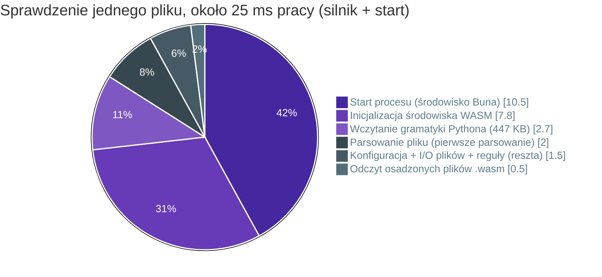

# :material-speedometer: Ograniczenia i jakość { #constraints-and-quality }

Ten rozdział opisuje reguły, w których projekt musi się zmieścić, cele jakościowe, według których jest oceniany, to, co do tej pory zmierzyliśmy, i znane nam ryzyka.

## Ograniczenia { #constraints }

| # | Ograniczenie | Dlaczego | Gdzie uwiera |
|---|---|---|---|
| C1 | Silnik w TypeScripcie | Współdzielony przez CLI, serwer języka i rozszerzenie ([ADR-001](05-ADR.md#adr-001-typescript-for-the-engine)) | Surowa szybkość parsowania, rozmiar pliku binarnego |
| C2 | Python parsowany tree-sitterem w wersji WASM | Przenośny między Bunem, Node i każdą platformą docelową ([ADR-002](05-ADR.md#adr-002-web-tree-sitter-wasm-not-native-bindings)) | Około 12 ms startu WASM na proces |
| C3 | Dystrybucja jako jednoplikowy program wykonywalny Buna | Bez wymagań co do środowiska; instaluje się jako zależność deweloperska ([ADR-003](05-ADR.md#adr-003-ship-a-bun-single-file-executable)) | Od 66 do 90 MB na plik binarny w zależności od platformy (85 MB dla Linuksa x64), prawie w całości środowisko Buna |
| C4 | Nigdy nie importuj ani nie wykonuj kodu użytkownika | Deterministyczne, bezpieczne w niezaufanych repozytoriach, bez potrzeby venv | Sprawdzić da się tylko importy dynamiczne z dosłownym celem (INW011); wyliczany cel jest w warstwach wewnętrznych zgłaszany jako niesprawdzalny, a nie rozwiązywany |
| C5 | Brak dostępu do sieci w czasie sprawdzenia | Działa offline, w piaskownicach i w zamkniętym CI | Pakiety reguł muszą być dostarczane wewnątrz pliku binarnego albo repozytorium |
| C6 | Konfiguracja w `pyproject.toml` pod `[tool.inwards]` | Konwencja Pythona ([ADR-005](05-ADR.md#adr-005-configuration-lives-in-pyprojecttoml)) | Ochrona konfiguracji wymaga hooków albo CODEOWNERS |
| C7 | Kontrakt wyjścia `inwards/diagnostics@1` jest tylko rozszerzany | Zależą od niego agenci i skrypty ([ADR-007](05-ADR.md#adr-007-a-versioned-output-contract-with-fix-steps-as-data)) | Zmiany nazw wymagają nowej głównej wersji schematu |
| C8 | Linux, macOS i Windows na x64 i arm64 | Tam działają agenci i CI | Obsługa ścieżek, CRLF, macierz weryfikacji wydań |

## Cele jakościowe { #quality-goals }

Uszeregowane. Gdy dwa cele są w konflikcie, wygrywa wyższy.

| Pozycja | Cel | Scenariusz | Miara |
|---|---|---|---|
| 1 | :material-shield-check: **Żadnych fałszywie negatywnych wyników** | Agent chowa zabroniony import w funkcji, pod `TYPE_CHECKING`, przez ścieżkę względną albo import pakietu | Każda forma jest zgłaszana, w tym `shop . infrastructure` ze spacjami, ukośnik wsteczny w nazwie, identyfikatory NFKC i aliasy warstwy przez dowiązania symboliczne. Importy dynamiczne ze stałymi celami (`importlib.import_module`, `__import__`, `exec`) są zgłaszane jako INW011, a wyliczane cele w warstwach wewnętrznych jako niesprawdzalne INW011. Loadery są śledzone przez aliasy, przypisania, atrybuty, `functools.partial` i nazwy związane wewnątrz `exec`, a stałe cele są zwijane; znane luki wymienia rozdział 3. Testy jednostkowe i test różnicowy prescanu (0 przeoczeń na 92 448 wygenerowanych plikach i 1921 plikach biblioteki standardowej, łącznie z importami dynamicznymi, a co noc na 6543 plikach z pięciu serwisów open source) |
| 2 | :material-lightning-bolt: **Opóźnienie w pętli agenta** | Hook sprawdza jeden edytowany plik | p95 < 100 ms czasu rzeczywistego, łącznie ze startem procesu |
| 3 | :material-robot-outline: **Wyniki, na podstawie których agent może działać** | Agent dostaje INW001 | Naprawia naruszenie w ramach jednej ponownej próby w ≥ 80 % przypadków (mierzone z design partnerami, zobacz [rozdział 2](02-Business-Context.md#the-hypothesis)) |
| 4 | :material-repeat: **Deterministyczność** | To samo repozytorium, ta sama konfiguracja, dwa uruchomienia | Identyczne diagnostyki w identycznej kolejności. Zmieniają się tylko pola czasu w podsumowaniu (`durationMs`) |
| 5 | :material-timer-sand: **Przepustowość dla całego repozytorium** | CI sprawdza na zimno repozytorium z 500 tys. linii | Dziś około 1 s na jednym rdzeniu. Cel < 300 ms z workerami i pamięcią podręczną |
| 6 | :material-package-variant: **Łatwość wdrożenia** | Nowy zespół, istniejący kod | Jedno polecenie podłącza agenta (`inwards init`). Stop gate sprawdza tylko to, co zmieniła sesja, a w zmienionym pliku tylko to, co jest nowe od początku sesji, więc stare naruszenia nie blokują; resztę obejmie baseline (UC6, [#33](https://github.com/SirCypkowskyy/inwards/issues/33)) |

Poprawność celowo stoi wyżej niż szybkość. Zabezpieczenie, które czasem milczy, uczy agenta, że zły ruch jest w porządku, a to gorsze niż brak zabezpieczenia.

## Pomiary { #measurements }

Wszystkie liczby pochodzą ze scaffoldu w tym repozytorium. Nic tu nie jest prognozą. Zmierzono je w M0; wyrywkowe sprawdzenie niżej pokazuje, jak się od tego czasu zmieniły.

**Środowisko.** Laptop, Bun 1.4.2, `inwards-linux-x64` zbudowany przez `scripts/build-binaries.ts`. Wszystko działa w jednym wątku, bo silnik nie ma jeszcze puli workerów. Laptop był w zwykłym użyciu desktopowym (średnie obciążenie około 2–3), więc to liczby realistyczne, a nie najlepszy możliwy przypadek.

**Syntetyczne repozytorium.** 2100 plików Pythona, 496 000 linii, 8,0 MB, cztery warstwy z ośmioma importami własnego kodu i czterdziestoma małymi funkcjami na moduł. `bench/generate.py` odtwarza je dokładnie (stałe ziarno losowości). Z `--legacy` dodaje zewnętrzną warstwę `legacy`, którą importuje każdy moduł, więc każdy z 2000 modułów ma jedno naruszenie: to starszy kod, dla którego model kosztów z [rozdziału 3](03-Architecture-C4.md) mierzy czas z pełnym baseline'em.

**Bramka regresji.** Każdy pull request uruchamia `.github/workflows/bench.yml`. Buduje gałąź bazową i PR, uruchamia oba buildy na syntetycznym repozytorium na przemian (40 uruchomień hooka na jednym pliku, 12 pełnych sprawdzeń) i kończy się błędem, gdy PR jest o ponad 20% wolniejszy w którejkolwiek metryce albo gdy którykolwiek build zawiedzie w uruchomieniu (syntetyczne repozytorium jest czyste, więc każde uruchomienie musi skończyć się kodem 0). Każda strona jest budowana z własnym `.bun-version`, więc mierzona jest też aktualizacja Buna. Zmiana to mediana stosunków w parach, więc obciążenie, które zmienia się w trakcie zadania, znosi się w obrębie pary. Pełne sprawdzenia działają z `INWARDS_NO_CACHE=1`, więc bramka mierzy samą pracę, a nie [pamięć podręczną ekstrakcji](05-ADR.md#adr-031-a-content-keyed-extraction-cache-that-the-hooks-never-read). Druga tabela, tylko dla PR i bez bramki, mierzy pełne sprawdzenie bez pamięci podręcznej, z pustą (odsuniętą przed każdym uruchomieniem) i z ciepłą. Bramka obejmuje tylko czas hooka i pełnego sprawdzenia, nie pamięć, start ani rozmiar pliku binarnego. Podsumowanie zadania pokazuje p50/p95 dla obu buildów (przy 12 pełnych uruchomieniach p95 to najwolniejsze z nich) i runner, na którym działało, a surowe próbki są zachowywane jako artefakt. Lokalnie build spowolniony o 30% nie przechodzi bramki, a dziesięć uruchomień identycznych buildów ani razu jej nie oblało (`bench/compare.ts`, `bench/test/compare.test.ts`).

**Korpus prawdziwych repozytoriów.** Biblioteka standardowa i kod syntetyczny nie wyglądają jak serwis we FastAPI albo Django, więc `.github/workflows/corpus.yml` uruchamia się co noc (i przy każdym PR, który zmienia korpus albo `prescan-diff.ts`) na pięciu repozytoriach open source przypiętych do commitów w `bench/corpus.json`. `bench/corpus.ts` pobiera każde z nich płytko, tylko przypięty commit, a w trzech przypadkach tylko katalog serwisu (`backend/`, `server/`, `saleor/`; tryb sparse cone przynosi też pliki z najwyższego poziomu repozytorium), łącznie około 40 MB. Uruchamia test różnicowy prescanu na każdym pliku `.py` w checkoucie i mierzy czas skompilowanego pliku binarnego: 5 pełnych sprawdzeń i 20 uruchomień `inwards check <file>` na jednym pliku w każdym repozytorium, po jednym rozgrzewkowym przebiegu. Żadne z tych repozytoriów nie ma tabeli `[tool.inwards]`, więc manifest nadaje każdemu nasz własny podział na warstwy (zapisany do `inwards-corpus.toml` w checkoucie i przekazywany przez `--config`). Liczby naruszeń wynikają z tego podziału i nic nie mówią o samych projektach. Zadanie kończy się błędem, gdy prescan pominie import, gdy liczba plików `.py` w checkoucie różni się od manifestu (zepsute pobieranie inaczej zmniejszyłoby korpus) albo gdy `inwards check` zakończy się kodem innym niż 0 lub 1. Repozytorium, którego nie da się pobrać po trzech próbach albo którego uruchomienie zawiedzie, jest odnotowywane w wynikach i oblewa zadanie; pozostałe repozytoria nadal się uruchamiają. Tabela trafia do podsumowania zadania, a surowe próbki do artefaktu `corpus-result`.

| Repozytorium | Licencja | Dlaczego jest w korpusie | Sprawdzane z warstwami |
|---|---|---|---|
| [fastapi/full-stack-fastapi-template](https://github.com/fastapi/full-stack-fastapi-template) `cb740b6`, `backend/` | MIT | Oficjalny szablon FastAPI, układ, od którego zaczyna wiele małych serwisów | core, services, api |
| [ivan-borovets/fastapi-clean-example](https://github.com/ivan-borovets/fastapi-clean-example) `9271723` | MIT | Czysta architektura na FastAPI | core, outbound, inbound, main |
| [pgorecki/python-ddd](https://github.com/pgorecki/python-ddd) `429cd4b` | MIT | Modularny monolit DDD, trzy konteksty ograniczone | domain, application, infrastructure, interface |
| [polarsource/polar](https://github.com/polarsource/polar) `cfae1ba`, `server/` | Apache-2.0 | Duży serwis FastAPI na produkcji, około 70 pakietów funkcjonalnych | kit, models, features, entrypoints |
| [saleor/saleor](https://github.com/saleor/saleor) `5ff5648`, `saleor/` | BSD-3-Clause | Duży serwis w Django, większy niż syntetyczne repozytorium | core, apps, api |

Pierwsze uruchomienie, na laptopie opisanym w sekcji Środowisko (średnie obciążenie 3–4), `inwards` 0.1.0:

| Repozytorium | Pliki `.py` | Linie | Odmowy prescanu | Przeoczenia prescanu | Pełne sprawdzenie p50 / max | Jeden plik p50 / p95 | Naruszenia |
|---|--:|--:|--:|--:|--:|--:|--:|
| full-stack-fastapi-template | 40 | 2685 | 0 | 0 | 59 / 60 ms | 46 / 51 ms | 8 |
| fastapi-clean-example | 209 | 6764 | 0 | 0 | 80 / 87 ms | 46 / 49 ms | 2 |
| python-ddd | 139 | 5852 | 0 | 0 | 82 / 87 ms | 43 / 45 ms | 10 |
| polar | 1831 | 435 688 | 22 (1,2 %) | 0 | 1,16 / 1,37 s | 124 / 142 ms | 494 |
| saleor | 4324 | 847 875 | 13 (0,3 %) | 0 | 1,84 / 1,89 s | 59 / 62 ms | 758 |

Kolumna Naruszenia pochodzi z późniejszego uruchomienia (przegląd INW010 w [#45](https://github.com/SirCypkowskyy/inwards/issues/45)), już po dodaniu INW005 i INW010; liczba dla saleor obejmuje cztery zepsute importy znalezione przez INW010.

Dwie rzeczy, których syntetyczne repozytorium nie pokazało. `inwards check` na pliku `subscription/service.py` z polara (4482 linie, 175 KB, dwa naruszenia) trwa tu około 125 ms, a na runnerze GitHuba (AMD EPYC 7763, 2 rdzenie) 280 ms, powyżej budżetu 100 ms; mały plik z tego samego repozytorium trwa około 55 ms. Budżet dotyczy hooka Claude Code, który uruchamia to samo sprawdzenie jednego pliku (`runCheck` na edytowanym pliku) po odczytaniu danych wejściowych, więc hook może być tylko wolniejszy. Śledzone w [#122](https://github.com/SirCypkowskyy/inwards/issues/122). Ponowne lokalne uruchomienie po kompilacji do bajtkodu ([#118](https://github.com/SirCypkowskyy/inwards/pull/118)) skróciło każde sprawdzenie jednego pliku o 20 do 40 ms: plik z polara trwa teraz 83 / 90 ms (p50 / p95), plik z saleora 27 / 30 ms. Do tego zimne pełne sprawdzenie 848 000 linii saleora trwa 1,8 s na jednym rdzeniu (2,5 s na runnerze GitHuba), podczas gdy syntetyczne repozytorium z 496 000 linii zajmuje 0,4 s.

### Wyniki { #results }

| Scenariusz | Wynik | Budżet | Stan |
|---|---|---|---|
| Zimne pełne uruchomienie, naiwne pełne parsowanie (pierwsze podejście) | 7,5 s | < 1 s | :x: odrzucone, doprowadziło do ADR-004 |
| Zimne pełne uruchomienie, szkielet importów | 0,63–1,17 s (uruchomienia z dwóch sesji) | < 1 s | :material-alert: na granicy |
| Ciepłe pełne uruchomienie, pamięć podręczna ekstrakcji ([#56](https://github.com/SirCypkowskyy/inwards/issues/56)) | p50 0,46 s, wobec 1,25 s bez pamięci podręcznej w tym samym przebiegu (3,0 raza szybciej, maszyna pod obciążeniem) | nie dotyczy | |
| Zimne sprawdzenie całego projektu z szukaniem cykli importów ([#54](https://github.com/SirCypkowskyy/inwards/issues/54), `cycles = ["modules"]`), po 8 naprzemiennych uruchomień z `INWARDS_NO_CACHE=1`, średnie obciążenie około 1,1 | mediana 1,51 s wobec 1,35 s dla tego samego sprawdzenia bez niego; większość modułów leży w cyklicznych grupach, a każdy plik w nich jest potwierdzany (pełne parsowanie każdego trwałoby około 7 s) | < 1 s | :material-alert: ponad budżetem na tej maszynie, z szukaniem i bez niego; sprawdzenie punktowe poniżej, 0,40 do 0,44 s, było na nieobciążonej maszynie |
| Jeden plik, czas rzeczywisty ze startem procesu (30 uruchomień) | p50 48,6 ms, p95 80,4 ms | p95 < 100 ms | :white_check_mark: z niewielkim zapasem |
| Jeden plik, czas silnika zgłaszany przez CLI | 16 do 30 ms | nie dotyczy | |
| `inwards --version` (sam start procesu) | około 10 ms | nie dotyczy | |
| Indeks modułów + moduły importujące jeden moduł, na zimno, jeden rdzeń (2100 plików, świeży proces) | 0,1 s indeks + 0,65 do 0,74 s na moduły importujące (684 pliki wspominają `m0`: syntetyczne nazwy to najgorszy przypadek dla filtra tekstowego). Od #44 indeks niczego nie czyta z góry: jego zbudowanie trwa od 17 do 21 ms, wypisanie 2100 modułów od 25 do 32 ms, a moduły importujące czytają potrzebne im pliki, łącznie od 0,53 do 0,71 s (od 0,58 do 0,66 s dla zachłannego indeksu, który zastąpił) | < 1 s | :white_check_mark: |
| Odmowy prescanu na bibliotece standardowej CPythona 3.14 | 8,3 % z 1921 plików | im mniej, tym szybciej | :white_check_mark: |
| Importy pominięte przez prescan na tym samym korpusie | 0 | 0 | :white_check_mark: |
| Importy pominięte przez prescan na korpusie prawdziwych repozytoriów (6543 pliki, pięć serwisów) | 0 | 0 | :white_check_mark: |
| Szczytowe zużycie pamięci, pełne uruchomienie syntetyczne | około 120 MB RSS | nie dotyczy | |
| Rozmiar pliku binarnego, Linux x64 | 82 MB | nie dotyczy | :material-alert: duży |

<figure markdown="span">
  { loading=lazy }
  <figcaption>Jedno zimne uruchomienie na syntetycznym repozytorium, jeden rdzeń. Rozrzut między uruchomieniami jest w tabeli powyżej.</figcaption>
</figure>

!!! note "Wyrywkowe sprawdzenie na 0.1.0 (2026-09-26)"
    Ten sam laptop, świeży build `inwards-linux-x64`, średnie obciążenie około 1, zmierzone dwa razy niezależnie z tym samym wynikiem. Sprawdzenie jednego pliku w przykładowej aplikacji, 30 uruchomień: p50 37 ms, p95 40 ms czasu rzeczywistego, 14 ms czasu silnika. `inwards --version`: około 19 ms, wcześniej około 10 ms. Zimne pełne uruchomienie na syntetycznym repozytorium, 5 uruchomień: 0,40 do 0,44 s. Szczytowe RSS około 207 MB, wcześniej około 120 MB. Rozmiar pliku binarnego bez zmian, 82 MB (79 MiB). Opisany niżej eksperyment z bajtkodem skrócił start o połowę już po tym sprawdzeniu, a rozkład czasu startu przeliczono z jego użyciem. Benchmark w CI ([#29](https://github.com/SirCypkowskyy/inwards/issues/29)) oblewa teraz każdy PR, który spowalnia hook albo pełne sprawdzenie o ponad 20%; nie śledzi pamięci, startu ani rozmiaru pliku binarnego.

### Eksperyment: bajtkod i minifikacja { #spike-bytecode-and-minification }

[#39](https://github.com/SirCypkowskyy/inwards/issues/39) pytało, czy flagi `bun build --compile` skracają start albo zmniejszają plik binarny. Od tego czasu `scripts/build-binaries.ts` buduje z `--bytecode --format=esm` oprócz `--minify --sourcemap=linked`.

**Metoda.** Sześć wariantów `inwards-linux-x64` z jednego commitu, Bun 1.4.2, ten sam laptop co wyżej. Start: 200 rund `inwards --version`, każdy wariant raz na rundę w rotującej kolejności. Hook i pełne sprawdzenie: `bench/compare.ts` z obecnym buildem jako bazą, 100 uruchomień hooka i 20 pełnych sprawdzeń na stronę, zmiana jako mediana stosunków w parach. Szczytowe RSS: `/usr/bin/time -f %M`, mediana z 5 uruchomień. MB oznacza wszędzie 10^6 bajtów. Średnie obciążenie wynosiło 2 do 6 w trakcie uruchomień, więc bardziej ufaj stosunkom niż bezwzględnym milisekundom; porównanie bazy z bazą dało różnicę 0,2% (hook) i 0,6% (pełne).

| Wariant | Rozmiar (Linux x64) | `inwards --version` p50 / p95 | Hook, jeden plik | Pełne sprawdzenie | Szczytowe RSS, pełne / hook |
|---|---|---|---|---|---|
| Przedtem: `--minify --sourcemap=linked` | 82,4 MB (37,1 MB po gzip) | 22,3 / 30,9 ms | baza | baza | 202 / 54 MB |
| Bez `--minify` | 82,6 MB | +3,0% | +3,7% | +1,5% | 203 MB pełne |
| Bez sourcemapy | 82,2 MB | -0,7% | nie uruchomiono | nie uruchomiono | |
| Bez automatycznego wczytywania `.env` i `bunfig.toml` | 82,4 MB | -0,8% | -3,0% | +0,6% | 205 MB pełne |
| `--bytecode` (CJS, domyślny w Bunie z tą flagą) | 85,0 MB | 10,0 / 14,6 ms (-56%) | -45,6% | -5,6% | 205 / 55 MB |
| **`--bytecode --format=esm` (przyjęty)** | 84,9 MB (38,4 MB po gzip) | 10,5 / 14,3 ms (-53%) | -45,4% | -7,0% | 205 / 56 MB |

Powtórka z zacommitowanym buildem i domyślnymi ustawieniami `bench/compare.ts` (40 uruchomień hooka, 12 pełnych sprawdzeń) dała dla hooka p50 / p95 64,4 / 73,6 ms przedtem i 32,6 / 37,4 ms potem (-48,0%), a dla pełnego sprawdzenia -9,9%. Drugie uruchomienie pomiaru startu dało 25,0 ms przedtem i 10,8 ms potem. Na przykładowej aplikacji, 60 naprzemiennych sprawdzeń jednego pliku: p50 58,7 → 30,3 ms i p95 77,7 → 39,5 ms czasu rzeczywistego, a własny czas silnika spadł z 21,7 do 14,5 ms, bo silnik i klej JS web-tree-sittera też nie są już parsowane przy pierwszym wywołaniu.

- **Wygrywa bajtkod.** Przenosi parsowanie JS z każdego startu na czas budowania. Kosztuje 2,5 MB na plik binarny (1,3 MB po gzip) i od 1 do 3 MB RSS.
- **Rozmiaru nie da się naprawić flagami.** Wszystko, co dodaje Inwards, to mniej niż 1 MB (176 KB zminifikowanego JS, 0,67 MB WASM); reszta to środowisko Buna. Minifikacja była już włączona i oszczędza 0,1 MB; sourcemapa kosztuje 0,26 MB i sprawia, że stosy wywołań wskazują źródło w TypeScripcie, więc zostaje.
- **ESM, nie CJS.** W bezpośrednim porównaniu oba buildy z bajtkodem różnią się o +2,9% (hook) i +2,2% (pełne), w granicach szumu. ESM zachowuje semantykę modułów, którą plik binarny miał wcześniej.
- **Sprawdzone.** 350 testów przechodzi na skompilowanym pliku binarnym (`INWARDS_BIN=dist/inwards-linux-x64 bun test`), podobnie `--version` i oba osadzone pliki `.wasm` (każde sprawdzenie parsuje). Program testowy zbudowany w ten sam sposób wciąż podaje linię w TypeScripcie dla rzuconego błędu przez dołączoną sourcemapę. Wszystkie sześć platform docelowych kompiluje się skrośnie, a build musl sprawdza syntetyczne repozytorium wewnątrz Alpine. Macierz testów w CI buduje i testuje pliki binarne dla macOS i Windows natywnie.
- **Niewypróbowane.** Aktualna dokumentacja Buna wymienia `--compile-jit-policy` i `--bytecode-order` (układ bajtkodu sterowany profilem); `bun build` w Bunie 1.4.2 nie ma żadnej z nich. `--bytecode-depth`, które 1.4.2 ma, nie zostało zmierzone. Warto do tego wrócić po aktualizacji Buna.

### Na co idzie czas przy sprawdzeniu jednego pliku { #where-a-single-file-check-spends-its-time }

Przeliczone w eksperymencie z bajtkodem, na buildzie z bajtkodem. Start procesu to `inwards --version`. Liczby dla gramatyki i parsowania pochodzą ze skryptu skompilowanego w ten sam sposób, który mierzy czas odczytu osadzonych plików `.wasm`, `Parser.init`, `Language.load` i jednego parsowania `shop/domain/order.py` z przykładowej aplikacji, mediana z 30 uruchomień. „Konfiguracja + I/O + reguły” to czas silnika zgłaszany przez CLI (14,5 ms) minus powyższe, a nie pomiar.



W M0 to samo sprawdzenie oznaczało około 30 ms pracy: 10 ms startu procesu, 12 ms inicjalizacji WASM, 3,5 ms wczytywania gramatyki, 1 ms parsowania i 3,5 ms reszty, wszystko bez bajtkodu. Parsowanie pliku to wciąż mały kawałek. Około 85% kosztu to płacenie tej samej ceny za start przy każdym wywołaniu hooka. Mediana czasu rzeczywistego, 30 ms, jest wyższa niż te 25 ms pracy, bo narzędzie pomiarowe uruchamia proces, a mechanizm uruchamiający hooki agenta też za to płaci.

To zmienia plan poprawy wydajności. W pętli agenta szybkość parsowania nie ma dużego znaczenia. Liczy się start.

### Plan poprawy wydajności { #performance-roadmap }

| Krok | Oczekiwany efekt | Na co wpływa |
|---|---|---|
| Stały proces, z którego hooki korzystają przez lokalne gniazdo, z powrotem do jednorazowego uruchomienia (model procesu i nazwa polecenia do ustalenia w ADR, bo może go współdzielić serwer LSP; [#59](https://github.com/SirCypkowskyy/inwards/issues/59), [#60](https://github.com/SirCypkowskyy/inwards/issues/60)) | Usuwa ~20 ms startu WASM i środowiska z każdego wywołania hooka | p95 dla jednego pliku |
| :white_check_mark: `bun build --bytecode` ([#39](https://github.com/SirCypkowskyy/inwards/issues/39)), zrobione | Zmierzone: start 22 → 10 ms, wywołanie hooka około 45% szybsze, 2,5 MB więcej na plik binarny (zobacz eksperyment wyżej) | p95 dla jednego pliku |
| Pula workerów, jeden parser na rdzeń ([#61](https://github.com/SirCypkowskyy/inwards/issues/61)) | Niemal liniowe przyspieszenie zimnego pełnego uruchomienia na maszynie wielordzeniowej | Zimne pełne uruchomienie |
| :white_check_mark: Pamięć podręczna list importów po hashu zawartości (`.inwards/cache`, [#56](https://github.com/SirCypkowskyy/inwards/issues/56)), zrobione dla `inwards check` i `inwards baseline` | Zmierzone: ciepłe pełne sprawdzenie 3,0 raza szybsze (0,46 s wobec 1,25 s p50, po 12 uruchomień na tym laptopie pod obciążeniem), o 27% wolniejsze, gdy pamięć podręczna się wypełnia. Hooki z niej nie korzystają ([ADR-031](05-ADR.md#adr-031-a-content-keyed-extraction-cache-that-the-hooks-never-read)) | Ciepłe pełne uruchomienie |
| Zastąpienie `descendantsOfType` przejściem kursorem po drzewie na ścieżce pełnego parsowania ([#62](https://github.com/SirCypkowskyy/inwards/issues/62)) | Profilowanie pokazało, że w naiwnym podejściu szło na to 1,2 s | Odrzucone pliki i potwierdzenia |

### Odtworzenie { #reproduce }

```sh
bun install
bun test                                                    # 607 tests: unit, CLI, hook, Stop gate, baseline, stats, E2E snapshots, doc snippets, bench
bun run scripts/build-binaries.ts bun-linux-x64
python3 bench/generate.py /tmp/inwards-bench
(cd /tmp/inwards-bench && "$OLDPWD/dist/inwards-linux-x64" check)  # 2100 files, 0 violations, ms
bun run src/core/scripts/prescan-diff.ts "$(python3 -c 'import sysconfig; print(sysconfig.get_paths()["stdlib"])')"
bun run bench/corpus.ts --bin dist/inwards-linux-x64 --dir ~/.cache/inwards-corpus  # real-repo corpus, about 90 s
```

`bench/corpus.ts` ponownie używa checkoutu, który jest już na przypiętym commicie, więc kolejne uruchomienia niczego nie pobierają. Żeby dodać repozytorium, dopisz je do `bench/corpus.json` z pełnym SHA commitu, liczbą plików `.py` i podziałem na warstwy; PR uruchomi workflow korpusu.

<figure markdown="span">
  { loading=lazy }
  <figcaption>Testy jednostkowe silnika, w tym przypadki prescanu i kolorowego wyjścia.</figcaption>
</figure>

Dwa sprawdzenia pilnują, żeby testy dotyczące agentów były wiarygodne. Blok kodu w `docs/chapters/guides` albo `docs/chapters/rules`, który następuje po linii `<!-- e2e -->` i jednej pustej linii (bez niej komentarz psuje element listy), uruchamia się jako przypadek E2E w świeżym projekcie, w CI na skompilowanym pliku binarnym (`src/cli/test/integration/docs.test.ts`); nieoznaczone bloki nigdy się nie uruchamiają. Bloki działają w systemowym bashu, który na macOS jest w wersji 3.2, więc test nigdy nie umieszcza heredoca wewnątrz `$(...)`: bash 3.2 dopasowuje przez niego cudzysłowy i jeden apostrof w udokumentowanym komunikacie psuje skrypt. Co noc `.github/workflows/nightly-e2e.yml` nagrywa ponownie dane wejściowe hooków Claude Code w nieinteraktywnej sesji (headless) `claude -p` i otwiera zgłoszenie, gdy jakieś pole zostanie dodane, usunięte albo zmieni typ względem nagranych fixture'ów.

Zrzuty ekranu w tej dokumentacji pochodzą ze `scripts/screenshots.py`, który naprawdę uruchamia każde polecenie i renderuje wyjście terminala za pomocą Rich.

## Ryzyka { #risks }

| Ryzyko | Prawdopodobieństwo | Wpływ | Środki zaradcze |
|---|:-:|:-:|---|
| Astral dodaje kontrakty warstw do ty albo Ruffa | Średnie | Wysoki | Konkurować integracją z agentami i jakością poprawek, na których Astral się nie skupia. Utrzymywać format reguł na tyle prosty, żeby dało się go wyeksportować |
| import-linter dodaje wyjście JSON i hooki dla agentów | Średnie | Średni | Utrzymać przewagę w opóźnieniu, samodzielnym pliku binarnym i poprawkach dla każdego naruszenia. Zaoferować import kontraktów z `.importlinter` |
| Prawdziwe repozytoria przekraczają 100 ms p95 | Wydarzyło się: plik z polara z 4482 liniami i naruszeniami trwał 125 do 280 ms przed kompilacją do bajtkodu, a lokalnie 90 ms p95 po niej ([#122](https://github.com/SirCypkowskyy/inwards/issues/122)) | Wysoki | Najpierw stały proces, potem prescan w WASM napisany w Ruście albo Zigu (plan awaryjny z ADR-001) |
| Prescan pomija import w jakimś nietypowym pliku | Niskie | Wysoki | Test różnicowy w CI na bibliotece standardowej, co noc na pięciu prawdziwych serwisach; poszerzać ten korpus o repozytoria design partnerów |
| Agenci edytują `[tool.inwards]`, żeby przejść sprawdzenie | Wysokie bez zabezpieczenia | Wysoki | Config guard w PreToolUse, porównanie konfiguracji w Stop gate, reguły `permissions.deny` z `init`, CODEOWNERS ([rozdział 4](04-AI-Integration.md#stopping-the-agent-from-gaming-the-check)). Bash wciąż może ominąć config guard i zapis sesji ([#88](https://github.com/SirCypkowskyy/inwards/issues/88)) |
| Regresje albo niekompatybilne zmiany w `--compile` Buna | Niskie | Średni | Wersja przypięta przez `.bun-version`; macierz weryfikacji w CD uruchamia każdy plik binarny |
| Plik binarny po cichu ignoruje swój bajtkod (Bun wraca do parsowania źródła) i start wydłuża się dwukrotnie | Niskie | Niski | Testy w takim przypadku nadal przechodzą; benchmark w PR wyłapuje to tylko na Linuksie. Bajtkod jest związany z wersją Buna, która go zbudowała, a każdy plik binarny osadza tę samą wersję |
| Część CI działająca na infrastrukturze self-hosted jest niedostępna, a zadania PR, które tam trafiają, czekają w kolejce | Średnie | Średni | Dla oszczędności limitów i kosztów GitHub Actions część automatycznych zadań CI działa na infrastrukturze self-hosted; gdy jest niedostępna, te zadania mogą działać na runnerach GitHuba |
| Zensical (0.0.x) zmienia format konfiguracji | Średnie | Niski | Build dokumentacji działa w CI przy każdym PR; konfiguracja jest mała |
| Kroki naprawy są błędne dla nietypowych układów (brak oczywistego miejsca na port) | Średnie | Średni | Mierzyć naprawę w ramach jednej ponownej próby dla każdej reguły; pozwolić konfiguracji wskazać moduł portów |
