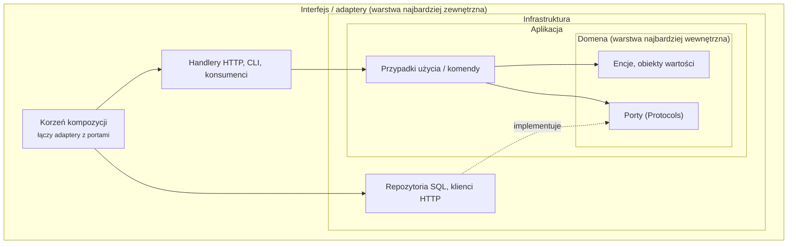

# :material-book-alphabet: Słownik { #glossary }

Słownictwo używane w tej dokumentacji. Terminy architektoniczne znaczą to, co zwykle znaczą w literaturze o DDD i czystej architekturze. Tam, gdzie Inwards używa słowa w węższym sensie, hasło o tym mówi. Hasła są w kolejności alfabetycznej oryginału angielskiego, a angielski termin podano w nawiasie.

## Jak łączą się terminy architektoniczne { #how-the-architecture-terms-fit-together }

Strzałki wskazują kierunek importów. Każda ciągła strzałka wskazuje do środka i to jest reguła, której pilnuje INW001. Przerywana strzałka to „implementuje”: klasa z infrastruktury spełnia Protocol, który należy do domeny.

## Terminy architektoniczne { #architecture-terms }

Adapter
:   Kod, który łączy port z prawdziwą technologią: repozytorium SQL, klient HTTP, konsument wiadomości. Adaptery żyją w warstwach zewnętrznych.

Kontekst ograniczony (bounded context)
:   Część systemu z własnym modelem i własnym językiem (DDD). W kodzie Pythona zwykle pakiet najwyższego poziomu, taki jak `billing` albo `shipping`. [Konteksty](guides/configuration.md#contexts) deklaruje się w `[[tool.inwards.contexts]]`; [INW002](rules/INW002.md) pozwala jednemu importować inny tylko wtedy, gdy deklaruje go jego `depends-on`.

Czysta architektura (Clean Architecture)
:   Podział na warstwy według Roberta C. Martina: encje w centrum, potem przypadki użycia, potem adaptery interfejsu, potem frameworki. Jej reguła zależności mówi, że zależności w kodzie źródłowym wskazują tylko do środka.

Korzeń kompozycji (composition root)
:   Jedyne miejsce, w najbardziej zewnętrznej warstwie, gdzie tworzy się konkretne adaptery i przekazuje je kodowi, który ich potrzebuje. Kroki naprawy Inwards kierują tu łączenie zależności.

Reguła zależności (dependency rule)
:   Warstwy wewnętrzne nie mogą wiedzieć o zewnętrznych. INW001 to ta reguła zastosowana do importów.

Warstwa domeny (domain layer)
:   Reguły biznesowe i słownictwo problemu, wolne od frameworków i operacji wejścia-wyjścia. W konfiguracjach Inwards zwykle wymieniana jako pierwsza.

Architektura heksagonalna / porty i adaptery (hexagonal architecture / ports and adapters)
:   Styl Alistaira Cockburna: rdzeń aplikacji rozmawia ze światem tylko przez porty, a adaptery się do nich podłączają. Inwards traktuje go jako konfigurację warstwową, w której warstwa wewnętrzna jest właścicielem portów.

Warstwa (layer)
:   W Inwards nazwany zbiór prefiksów modułów w `[tool.inwards].layers`. Kolejność na liście to kolejność od środka na zewnątrz.

Port
:   Interfejs, którego właścicielem jest kod wewnętrzny, a który implementuje kod zewnętrzny. W Pythonie zwykle `typing.Protocol`.

Pionowy wycinek (vertical slice)
:   Organizowanie kodu według funkcji (`orders/`, `invoices/`), a nie według warstwy technicznej, przy czym każdy wycinek ma własne handlery i dostęp do danych. Wycinki nie powinny sięgać do siebie nawzajem. Każdy wycinek można zadeklarować jako [kontekst](guides/configuration.md#contexts), a [INW002](rules/INW002.md) trzyma wycinki osobno, chyba że `depends-on` mówi inaczej; selektory glob, dzięki którym dwadzieścia wycinków nie wymaga dwudziestu wpisów, to [#191](https://github.com/SirCypkowskyy/inwards/issues/191).

## Terminy Inwards { #inwards-terms }

Hook agenta (agent hook)
:   Polecenie, które narzędzie AI do kodowania uruchamia automatycznie wokół własnych działań, na przykład hooki `PostToolUse` i `Stop` w Claude Code. Główny punkt integracji Inwards. `inwards init --agent claude` instaluje cztery takie hooki. Zobacz [rozdział 4](04-AI-Integration.md).

Baseline
:   Naruszenia, które projekt już miał, gdy wdrożył Inwards, zapisane przez `inwards baseline` w `inwards-baseline.json` obok `pyproject.toml`. Nie oblewają sprawdzenia; nowe naruszenia oblewają (UC6). Wpisy są dopasowywane po regule, module i komunikacie, a nie po linii.

Config guard
:   Hook `PreToolUse`, który z góry odrzuca edycje agenta w `[tool.inwards]`, w `.inwards/`, w `inwards-baseline.json` i w ustawieniach Claude Code zawierających hooki Inwards. Zobacz [rozdział 4](04-AI-Integration.md#stopping-the-agent-from-gaming-the-check).

Parsowanie potwierdzające (confirming parse)
:   Pełne parsowanie tree-sitterem, które silnik uruchamia, gdy szkielet importów zgłasza naruszenie, żeby zgłaszane były wyłącznie prawdziwe importy. Zobacz [ADR-004](05-ADR.md#adr-004-parse-the-import-skeleton-confirm-with-a-full-parse).

Diagnostyka (diagnostic)
:   Jedno zgłoszone naruszenie: kod, położenie, komunikat, poprawka i link do dokumentacji. Serializowana jako część `inwards/diagnostics@1`.

Test różnicowy (differential test)
:   `src/core/scripts/prescan-diff.ts`. Porównuje importy znalezione przez szkielet z importami znalezionymi przez pełne parsowanie na korpusie i kończy się błędem, jeśli szkielet któryś pominie.

Silnik (engine)
:   `@inwards/core`. Czysty TypeScript, który zamienia tekst źródłowy, konfigurację i gramatyki w diagnostyki. Nie wykonuje żadnych operacji wejścia-wyjścia ([ADR-006](05-ADR.md#adr-006-the-engine-does-no-io)).

Eskalacja (escalation)
:   To, co robią hooki, gdy to samo naruszenie przetrwa `escalate-after` prób (domyślnie 3): edycja, która osiąga limit, nie jest blokowana, Stop gate pozwala zakończyć turę po swojej ostatniej blokadzie, agent dostaje polecenie, żeby zapytać użytkownika, a to, co nierozwiązane, trafia do użytkownika i do następnej sesji. Eskalacja nie jest trwała: następna edycja z tym naruszeniem znowu jest blokowana. Zobacz [rozdział 4](04-AI-Integration.md#when-the-agent-cant-fix-it).

Obejście (evasion)
:   Zmiana kodu przez agenta, po której sprawdzenie milknie, choć projekt nie został naprawiony, na przykład przeniesienie importu do funkcji. Rozdział 4 wymienia obejścia, z którymi radzi sobie Inwards.

Pamięć podręczna ekstrakcji (extraction cache)
:   `.inwards/cache`: to, co `inwards check` i `inwards baseline` odczytują z każdego pliku (szkielet importów, importy statyczne i komentarze wyciszające), pod kluczem z hasha jego treści, nazwy modułu i reguł ekstrakcji. Hooki nigdy jej nie czytają; serwer języka trzyma własną w pamięci. `--no-cache` albo `INWARDS_NO_CACHE=1` ją wyłącza. Zobacz [ADR-031](05-ADR.md#adr-031-a-content-keyed-extraction-cache-that-the-hooks-never-read).

Fingerprint
:   16-cyfrowy szesnastkowy hash kodu reguły, modułu i komunikatu naruszenia. Stan sesji i run log używają go, żeby rozpoznać to samo naruszenie w kolejnych edycjach, niezależnie od numeru linii.

Kroki naprawy (fix steps)
:   Uporządkowane, konkretne instrukcje naprawy dołączone do każdej diagnostyki, zbudowane z faktycznych nazw modułów i warstw.

GrammarBinaries
:   Port, przez który adaptery przekazują silnikowi środowisko uruchomieniowe tree-sittera i gramatykę Pythona jako bajty.

Zmyślony moduł (hallucinated module)
:   Import własnego modułu, który nie istnieje, taki jak `shop.domain.pricing`, gdy nie ma żadnego `pricing`. Agenci tworzą takie importy, bo nazwa wygląda wiarygodnie. INW010 wyłapuje je na podstawie indeksu modułów, zanim uruchomi się jakikolwiek test.

Szkielet importów (import skeleton)
:   Kopia pliku, w której każda linia niebędąca importem jest pusta, a linie importów mają usunięte wcięcie. Numery linii są zachowane, a parsuje się ją dużo szybciej niż cały plik.

Indeks modułów (module index)
:   To, jak silnik widzi własne moduły projektu (`Engine.index`); każdy adapter przekazuje go do każdego sprawdzenia: właściciel importu, lista modułów oraz moduły importujące dowolny moduł, każde z nich wyliczane na żądanie. INW006 korzysta z właściciela; INW010 korzysta z właściciela, żeby ustalić, czy moduł istnieje, a z zawartości pakietu, w którym by się znajdował, żeby podpowiedzieć najbliższe prawdziwe moduły.

Odmowa prescanu (prescan refusal)
:   Prescan rezygnuje z pliku, bo `import` pojawia się w miejscu, którego nie umie wyjaśnić. Plik dostaje wtedy pełne parsowanie. Odmowę dostaje 8,3 % plików biblioteki standardowej CPythona.

Kod reguły (rule code)
:   `INW` i trzy cyfry. Kody nigdy nie są używane ponownie, a wycofana reguła zachowuje swój numer.

Release PR
:   Pull request, który release-please utrzymuje otwarty z następną wersją i jej changelogiem. Scalenie go tworzy wydanie ([ADR-016](05-ADR.md#adr-016-versions-and-releases-come-from-commit-types-via-a-release-pr)).

Run log
:   `.inwards/runs.jsonl`: przy włączonym logu jedna linia na każde uruchomienie hooka albo `inwards check`; `inwards check --log` dopisuje linię nawet wtedy, gdy log jest wyłączony. Każda linia zawiera czas, zdarzenie, pliki, dodane i usunięte linie, fingerprinty naruszeń, kod wyjścia i czas trwania. Lokalny i domyślnie wyłączony. Zasila metryki design partnerów. Zobacz [rozdział 8](08-Run-Log.md).

Stan sesji (session state)
:   To, co hooki Claude Code zapisują dla każdej sesji w `.inwards/state/`: migawkę stanu początkowego (HEAD, każdą tabelę `[tool.inwards]`, hash każdego pliku Pythona) i jedną linię na edycję. Zawsze włączony i lokalny. Czytają go Stop gate i eskalacja.

Stop gate
:   Sprawdzenie uruchamiane z hooka `Stop` agenta. Sprawdza każdy plik Pythona zmieniony w sesji oraz to, czy konfiguracja i hooki są wciąż nienaruszone, i nie pozwala agentowi zakończyć tury, dopóki tak nie jest.

Wyciszenie (suppression)
:   Komentarz w linii, na którą wskazuje diagnostyka, `# inwards: ignore[INW001] reason="why"`, który ukrywa tę diagnostykę. Powód jest obowiązkowy, każdy raport liczy wyciszenia, a hooki Claude Code domyślnie pomijają wyciszenie dodane przez agenta w trakcie sesji. Zobacz [ADR-028](05-ADR.md#adr-028-inline-suppressions-need-a-reason-and-an-agent-cant-add-one-by-default).

## Terminy narzędziowe { #tooling-terms }

Model C4 (C4 model)
:   Cztery poziomy diagramów architektury według Simona Browna: kontekst, kontenery, komponenty, kod. Ta dokumentacja używa pierwszych trzech.

LSP
:   Language Server Protocol. Przez niego rozszerzenie VS Code dostaje diagnostyki z serwera języka Inwards.

MCP
:   Model Context Protocol. Pozwala agentowi AI wywoływać zewnętrzne narzędzia. `inwards mcp` jest planowane ([#65](https://github.com/SirCypkowskyy/inwards/issues/65)).

SARIF
:   Static Analysis Results Interchange Format 2.1.0, format JSON dla wyników analizy. Przyjmuje go GitHub code scanning.

tree-sitter
:   Generator parserów przyrostowych z gramatykami dla wielu języków. Inwards używa jego wersji WASM (`web-tree-sitter`) z `tree-sitter-python`.

Zensical
:   Generator stron statycznych, który buduje tę dokumentację, od zespołu stojącego za Material for MkDocs.

*[ADR]: Architecture Decision Record (zapis decyzji architektonicznej)
*[DDD]: Domain-Driven Design (projektowanie sterowane domeną)
*[LSP]: Language Server Protocol
*[MCP]: Model Context Protocol
*[SARIF]: Static Analysis Results Interchange Format
*[WASM]: WebAssembly
