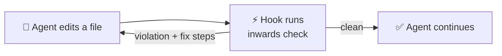

# Diagram Theming, Animation and Rich Tooltips Implementation Plan

> **For agentic workers:** REQUIRED SUB-SKILL: Use superpowers:subagent-driven-development (recommended) or superpowers:executing-plans to implement this plan task-by-task. Steps use checkbox (`- [ ]`) syntax for tracking.

**Goal:** Make every Mermaid diagram in `docs/chapters/` legible and on-brand in both light and dark mode, animate/interact the two highest-value diagrams, and land richer tooltips somewhere in the docs — all with zero new npm dependencies.

**Architecture:** Two small, dependency-free assets (`docs/stylesheets/extra.css`, `docs/javascripts/mermaid.mjs`) registered through Zensical's documented `extra_css`/`extra_javascript` hooks fix the two root causes (hardcoded hex in Mermaid `classDef`, and `quadrantChart`/`pie` not being auto-themed). CSS custom properties carry color across Zensical's closed shadow root, exactly the mechanism Zensical's own auto-theming already relies on. The homepage loop and the quadrant chart get extra, hand-written interactivity on top of the same fixed foundation. Rich tooltips try Zensical's existing annotation mechanism first, falling back to a two-`<script>`-tag Tippy.js include only if that mechanism turns out to be code-fence-only.

**Tech Stack:** Zensical (Python static site generator, `uv run zensical`), Mermaid.js 11 (loaded from a CDN, no build step), vanilla CSS/JS (no framework, no npm package).

**Spec:** `docs/superpowers/specs/2026-09-26-diagram-theming-design.md`

## Global Constraints

- Base branch `develop`, branch `docs/109-diagram-theming`, worktree `~/Documents/GitHub/worktrees/inwards/109-diagram-theming` (already created and claimed on issue #109).
- No content changes to any diagram's labels, nodes or structure — only colors, styling and interactivity. Content accuracy is #100 / PR #104's job, landing separately.
- No new npm dependency and no build step for any JS/CSS added. A CDN `<script>` tag (already how Zensical's own docs show Mermaid customization) is the only acceptable way to add a third-party library, and only for Decision 3 (tooltips) if the free option fails.
- Every new stylesheet/script goes through `extra_css`/`extra_javascript` in `docs/zensical.toml` — never edit Zensical's own shipped bundle.
- Strict docs build must stay green: `cd docs && uv run zensical build -f zensical.toml --clean` locally, `act pull_request -W .github/workflows/ci.yml -j docs` before handing back, per `AGENTS.md`.
- This project has no visual-regression test suite. Every visual/interactive task's "test" step is a structural check (grep the built HTML/JS for the expected content) plus an explicit manual browser check — the plan does not claim a task is visually correct until that manual check is actually done and reported, per `AGENTS.md`'s testing rule for UI changes.

## Review Focus

- `prefers-reduced-motion: reduce` — a user with motion sensitivity must not get continuously animated arrows or an auto-playing homepage loop; every animation added in this plan needs a reduced-motion guard, not just a visual nicety.
- Toggling the light/dark switch mid-visit (Zensical's palette toggle needs no reload) must re-color the quadrant chart and pie chart immediately — a fix that only works on first page load, and shows the wrong theme until a manual refresh, fails the actual ask.
- Zensical's instant navigation (`navigation.instant`, already enabled) swaps page content without a full reload — any diagram-specific JS added here (the quadrant/pie theme bridge, the homepage loop's animation) must re-attach after navigating to a new page, not just once at initial load, or diagrams break the first time a visitor clicks a nav link.
- A blocked or failed CDN request (offline dev, corporate proxy, ad-blocker) for the Mermaid override module or, later, Tippy.js must degrade to "diagram renders with default colors" / "tooltip shows as plain text", never a blank diagram or a broken page.
- Touch devices (a real share of docs traffic) never fire CSS `:hover` — the flagship diagrams' hover-only interactions need a tap-triggered equivalent, or mobile visitors simply never see the interactive part of the docs.

---

## File Structure

**Create:**
- `docs/stylesheets/extra.css` — diagram color tokens (light/dark), hover-animation keyframes, reduced-motion guards, homepage-loop styles.
- `docs/javascripts/mermaid.mjs` — Mermaid module override: quadrant + pie `themeVariables` bridge from CSS custom properties, re-init on palette toggle and on instant navigation.
- `docs/javascripts/homepage-loop.mjs` — animates the homepage's inline SVG loop diagram; re-attaches on instant navigation.

**Modify:**
- `docs/zensical.toml` — register `extra_css`/`extra_javascript`, add the `content.tooltips` feature.
- `docs/chapters/03-Architecture-C4.md` — replace hardcoded hex colors in `classDef` across the C1, C2, C3 (engine), C3 (CLI components) and Deployment diagrams.
- `docs/chapters/index.md` — replace the small Mermaid loop with a hand-written inline SVG + `homepage-loop.mjs`.
- `docs/chapters/02-Business-Context.md` — add hover-reveal descriptions to the quadrant chart's points (Task 9, after the tooltip mechanism is settled).
- `docs/chapters/07-Glossary.md` — spike target for Task 3 (rich-tooltip test on the "Hexagonal architecture / Ports and adapters" entry); kept permanently if the spike succeeds.

---

### Task 1: Confirm the docs toolchain builds in this worktree

**Files:** none (verification only).

**Interfaces:**
- Produces: a known-good baseline build to diff every later task against.

- [ ] **Step 1: Sync the Python environment**

Run: `cd /home/cyprian/Documents/GitHub/worktrees/inwards/109-diagram-theming && uv sync`
Expected: exits 0, `.venv` created/updated in the worktree.

- [ ] **Step 2: Build the docs once, unmodified**

Run: `cd /home/cyprian/Documents/GitHub/worktrees/inwards/109-diagram-theming/docs && uv run zensical build -f zensical.toml --clean`
Expected: exits 0, `docs/site/index.html` and `docs/site/02-Business-Context/index.html` exist.

- [ ] **Step 3: Confirm the closed-shadow-root Mermaid rendering this plan is built around**

Run: `grep -c 'attachShadow({mode:"closed"})' /home/cyprian/Documents/GitHub/worktrees/inwards/109-diagram-theming/docs/site/assets/javascripts/bundle.*.min.js`
Expected: `1` (or more). If `0`, stop and re-read the bundle by hand before continuing — the whole CSS-custom-property strategy in this plan depends on this being true.

No commit for this task (verification only).

---

### Task 2: Spike — does `classDef ... fill:var(...)` survive into the rendered SVG?

**Files:**
- Modify (temporarily, reverted at the end of this task): `docs/chapters/07-Glossary.md`.

**Interfaces:**
- Produces: a yes/no answer that gates Task 5's approach. If this fails, Task 5 must use the same `extra_javascript` override technique as Task 6 instead of plain CSS.

- [ ] **Step 1: Add a throwaway classDef using `var()` to the Glossary's flowchart**

In `docs/chapters/07-Glossary.md`, temporarily change the last line of the flowchart (currently ends at `root --> db`) by appending:

```
    classDef spike fill:var(--md-code-hl-string-color),color:#fff
    class ent spike
```

- [ ] **Step 2: Add a matching throwaway CSS variable**

Create `docs/stylesheets/extra.css` (this file is kept for real in Task 4; for now it only needs this one line):

```css
:root {
  --md-code-hl-string-color: #ff00aa; /* spike probe color, removed in step 5 */
}
```

- [ ] **Step 3: Register the stylesheet and build**

In `docs/zensical.toml`, under `[project]`, add:

```toml
extra_css = [
  "stylesheets/extra.css",
]
```

Run: `cd docs && uv run zensical build -f zensical.toml --clean`

- [ ] **Step 4: Inspect the generated output for the literal `var()` string**

Run: `grep -o 'fill:var(--md-code-hl-string-color)' docs/site/07-Glossary/index.html`

- If it prints the string: Mermaid emitted `fill:var(...)` as literal CSS inside the SVG's own `<style>` element (confirm by also checking the string appears inside a `<style>` tag, not as a raw attribute, with `grep -o '<style[^>]*>[^<]*--md-code-hl-string-color[^<]*' docs/site/07-Glossary/index.html`). Proceed to Task 5 using `var()` directly in `classDef`.
- If it prints nothing, or the color got resolved to a literal hex at build time: `classDef ... fill:var(...)` does not survive. Note this in the issue (`gh issue comment 109 --body "Spike: classDef fill:var() does not survive into rendered SVG, falling back to the extra_javascript override for C4 diagrams too."`) and change Task 5 to use the same `mermaid.mjs` override technique as Task 6 (apply the ext/planned colors via `themeCSS`, not source-level `classDef`).

- [ ] **Step 5: Revert the throwaway changes**

Run: `git checkout -- docs/chapters/07-Glossary.md docs/zensical.toml docs/stylesheets/extra.css 2>/dev/null; rm -f docs/stylesheets/extra.css`
Expected: `git status --short` shows no changes from this task.

No commit for this task — it's a spike, not a shipped change.

---

### Task 3: Spike — does Zensical's annotation mechanism work outside code fences?

**Files:**
- Modify (temporarily, reverted at the end unless it works — then made permanent): `docs/chapters/07-Glossary.md`.

**Interfaces:**
- Produces: a yes/no answer that picks Decision 3's path (free annotation reuse vs. Tippy.js fallback).

- [ ] **Step 1: Try the annotation syntax on the "Hexagonal architecture" glossary entry**

In `docs/chapters/07-Glossary.md`, change:

```markdown
Hexagonal architecture / Ports and adapters
:   Alistair Cockburn's style: the application core talks to the world only through ports, and adapters plug into them. Inwards treats it as a layered config whose inner layer owns the ports.
```

to:

```markdown
Hexagonal architecture / Ports and adapters (1)
:   Alistair Cockburn's style: the application core talks to the world only through ports, and adapters plug into them. Inwards treats it as a layered config whose inner layer owns the ports.
{ .annotate }

1.  The core (domain + application) sits at the centre. Ports are the small
    interfaces it owns; adapters (SQL repositories, HTTP clients) plug into
    them from the outside. Inwards' layer order mirrors this directly.
```

- [ ] **Step 2: Build and check whether Zensical rendered an annotation marker**

Run: `cd docs && uv run zensical build -f zensical.toml --clean`
Run: `grep -io 'annotat[a-z_-]*' docs/site/07-Glossary/index.html | sort -u`

- If this prints annotation-related class/attribute names (e.g. something containing `annotation`) wrapping the definition-list entry: the mechanism works outside code fences. Keep this change permanently (skip step 3's revert) and note success in the issue comment for Task 10.
- If it prints nothing, or the `(1)` and the list item render as plain literal text instead of a popover marker: the mechanism is code-fence-only in Zensical. Proceed to Tippy.js for Decision 3 (a follow-up task outside this plan's numbered tasks, since the spec defers concrete tooltip spots to the owner — file the decision on issue #109 rather than guessing spots to convert).

- [ ] **Step 3 (only if the spike failed): revert**

Run: `git checkout -- docs/chapters/07-Glossary.md`

- [ ] **Step 4: Commit (only if the spike succeeded and step 1's change was kept)**

```bash
cd /home/cyprian/Documents/GitHub/worktrees/inwards/109-diagram-theming
git add docs/chapters/07-Glossary.md
git commit -m "docs: add a rich tooltip to the Hexagonal architecture glossary entry

Confirms Zensical's annotation mechanism works outside code fences,
settling issue #109's tooltip research question in favor of the
zero-dependency option.

Co-Authored-By: Claude Sonnet 5 <noreply@anthropic.com>"
```

---

### Task 4: Diagram color tokens and Zensical wiring

**Files:**
- Create: `docs/stylesheets/extra.css`
- Modify: `docs/zensical.toml`

**Interfaces:**
- Produces: CSS custom properties `--diagram-ext-bg`, `--diagram-ext-fg`, `--diagram-ext-border`, `--diagram-planned-bg`, `--diagram-planned-fg`, `--diagram-planned-border`, defined for both `[data-md-color-scheme="default"]` (light) and `[data-md-color-scheme="slate"]` (dark). Task 5 consumes these by name.
- Consumes: nothing new (this is the foundation task).

- [ ] **Step 1: Write the color tokens**

Create `docs/stylesheets/extra.css`:

```css
/* Diagram color tokens, consumed by classDef in docs/chapters/*.md Mermaid
   sources via var(). Light values match the colors already hardcoded in
   the diagrams before this change; dark values are new. */
[data-md-color-scheme="default"] {
  --diagram-ext-bg: #eceff1;
  --diagram-ext-fg: #263238;
  --diagram-ext-border: #90a4ae;

  --diagram-planned-bg: #ede7f6;
  --diagram-planned-fg: #4527a0;
  --diagram-planned-border: #7e57c2;
}

[data-md-color-scheme="slate"] {
  --diagram-ext-bg: #37474f;
  --diagram-ext-fg: #eceff1;
  --diagram-ext-border: #607d8b;

  --diagram-planned-bg: #2a1f4d;
  --diagram-planned-fg: #b39ddb;
  --diagram-planned-border: #7e57c2;
}
```

- [ ] **Step 2: Register the stylesheet in Zensical's config**

In `docs/zensical.toml`, add under `[project]` (near the top, after `site_dir = "site"`):

```toml
extra_css = [
  "stylesheets/extra.css",
]
```

- [ ] **Step 3: Enable improved tooltips (upgrades every existing plain-text tooltip, independent of Decision 3)**

In `docs/zensical.toml`, add `"content.tooltips"` to the existing `[project.theme]` `features` list, next to `"content.code.annotate"`:

```toml
features = [
  "content.code.copy",
  "content.code.annotate",
  "content.tabs.link",
  "content.tooltips",
  "navigation.footer",
  "navigation.instant",
  "navigation.sections",
  "navigation.top",
  "navigation.tracking",
  "search.highlight",
  "toc.follow",
]
```

- [ ] **Step 4: Build and confirm the tokens are present in the output**

Run: `cd docs && uv run zensical build -f zensical.toml --clean`
Run: `grep -c 'diagram-ext-bg' docs/site/assets/stylesheets/*.css 2>/dev/null || grep -rc 'diagram-ext-bg' docs/site/`
Expected: at least one match (the built site includes the new stylesheet, inlined or linked).

- [ ] **Step 5: Commit**

```bash
git add docs/stylesheets/extra.css docs/zensical.toml
git commit -m "docs: add diagram color tokens and enable improved tooltips

Defines light/dark custom properties for the two hardcoded-color
patterns found across the C4 diagrams (external systems, planned
features), and turns on Zensical's content.tooltips feature so every
existing plain-text tooltip gets the nicer popover treatment.

Co-Authored-By: Claude Sonnet 5 <noreply@anthropic.com>"
```

---

### Task 5: Fix hardcoded classDef colors across the C4 diagrams

**Files:**
- Modify: `docs/chapters/03-Architecture-C4.md:34-39` (C1), `:82-90` (C2), `:143-147` (C3 engine), `:230` (C3 CLI components), `:254-255` (Deployment).

**Interfaces:**
- Consumes: `--diagram-ext-bg`/`-fg`/`-border` and `--diagram-planned-bg`/`-fg`/`-border` from Task 4.

This task assumes Task 2's spike succeeded (`classDef ... fill:var(...)` renders correctly). If it didn't, redo this task's five edits as additions to `docs/javascripts/mermaid.mjs`'s `themeCSS` string instead (built in Task 6), targeting the same class names (`.ext`, `.planned`) Mermaid generates from these `classDef` names — the CSS selectors are `.ext > rect, .ext > polygon, .ext > circle { fill: var(--diagram-ext-bg); ... }` etc., same property values, different file.

- [ ] **Step 1: Fix C1 (system context)**

In `docs/chapters/03-Architecture-C4.md`, replace:

```
    classDef person fill:#5e35b1,color:#fff,stroke:#311b92
    classDef system fill:#7e57c2,color:#fff,stroke:#4527a0
    classDef ext fill:#eceff1,color:#263238,stroke:#90a4ae
```

with:

```
    classDef person fill:#5e35b1,color:#fff,stroke:#311b92
    classDef system fill:#7e57c2,color:#fff,stroke:#4527a0
    classDef ext fill:var(--diagram-ext-bg),color:var(--diagram-ext-fg),stroke:var(--diagram-ext-border)
```

(`person` and `system` keep their literal purple values — white text on purple already reads fine in both palettes, confirmed against both screenshots the owner shared.)

- [ ] **Step 2: Fix C2 (containers)**

Replace:

```
    classDef person fill:#5e35b1,color:#fff,stroke:#311b92
    classDef container fill:#7e57c2,color:#fff,stroke:#4527a0
    classDef planned fill:#ede7f6,color:#4527a0,stroke:#7e57c2,stroke-dasharray:5 5
    classDef ext fill:#eceff1,color:#263238,stroke:#90a4ae
```

with:

```
    classDef person fill:#5e35b1,color:#fff,stroke:#311b92
    classDef container fill:#7e57c2,color:#fff,stroke:#4527a0
    classDef planned fill:var(--diagram-planned-bg),color:var(--diagram-planned-fg),stroke:var(--diagram-planned-border),stroke-dasharray:5 5
    classDef ext fill:var(--diagram-ext-bg),color:var(--diagram-ext-fg),stroke:var(--diagram-ext-border)
```

- [ ] **Step 3: Fix C3 engine components**

Replace:

```
    classDef comp fill:#7e57c2,color:#fff,stroke:#4527a0
    classDef planned fill:#ede7f6,color:#4527a0,stroke:#7e57c2,stroke-dasharray:5 5
    classDef port fill:#eceff1,color:#263238,stroke:#90a4ae
```

with:

```
    classDef comp fill:#7e57c2,color:#fff,stroke:#4527a0
    classDef planned fill:var(--diagram-planned-bg),color:var(--diagram-planned-fg),stroke:var(--diagram-planned-border),stroke-dasharray:5 5
    classDef port fill:var(--diagram-ext-bg),color:var(--diagram-ext-fg),stroke:var(--diagram-ext-border)
```

- [ ] **Step 4: Fix C3 CLI components**

Replace:

```
    classDef planned fill:#ede7f6,color:#4527a0,stroke:#7e57c2,stroke-dasharray:5 5
```

with:

```
    classDef planned fill:var(--diagram-planned-bg),color:var(--diagram-planned-fg),stroke:var(--diagram-planned-border),stroke-dasharray:5 5
```

- [ ] **Step 5: Fix Deployment**

Replace:

```
    classDef planned fill:#ede7f6,color:#4527a0,stroke:#7e57c2,stroke-dasharray:5 5
    class pypi,dev,market planned
```

with:

```
    classDef planned fill:var(--diagram-planned-bg),color:var(--diagram-planned-fg),stroke:var(--diagram-planned-border),stroke-dasharray:5 5
    class pypi,dev,market planned
```

- [ ] **Step 6: Build and structurally verify all five**

Run: `cd docs && uv run zensical build -f zensical.toml --clean`
Run: `grep -c 'var(--diagram-ext-bg)\|var(--diagram-planned-bg)' docs/site/03-Architecture-C4/index.html`
Expected: `5` or more (one per fixed `classDef`; C2 and C3-engine each contribute two).

- [ ] **Step 7: Manual check (do not skip — grep only proves the string exists, not that it looks right)**

Run: `cd docs && uv run zensical serve -f zensical.toml` and open `http://127.0.0.1:8000/03-Architecture-C4/` in a browser. Toggle light/dark with the header switch. Confirm: the grey "external system" boxes and the dashed "planned" boxes both have visibly different, readable colors in dark mode than the flat light-grey/light-purple they had before, and still look the same as today in light mode (no regression). Record the result (pass/fail, with what you saw) before committing.

- [ ] **Step 8: Commit**

```bash
git add docs/chapters/03-Architecture-C4.md
git commit -m "fix(docs): make C4 diagram colors respect dark mode

classDef fill/color/stroke for external-system and planned-feature
boxes were hardcoded hex values that ignored the site's palette.
Replaced with CSS custom properties defined per color scheme.

Co-Authored-By: Claude Sonnet 5 <noreply@anthropic.com>"
```

---

### Task 6: Theme bridge for quadrantChart and pie chart

**Files:**
- Create: `docs/javascripts/mermaid.mjs`
- Modify: `docs/zensical.toml`

**Interfaces:**
- Consumes: `--md-mermaid-node-bg-color`, `--md-mermaid-edge-color`, `--md-mermaid-label-fg-color`, `--md-mermaid-label-bg-color`, `--md-primary-fg-color` (Zensical's own existing CSS variables, read via `getComputedStyle`).
- Produces: `window.mermaid` (a standard Mermaid 11 instance, `theme: "base"`, with quadrant- and pie-specific `themeVariables` set); re-runs its init on `data-md-color-scheme` change and on Zensical's instant navigation.

- [ ] **Step 1: Write the module**

Create `docs/javascripts/mermaid.mjs`:

```js
// Zensical auto-themes flowchart/sequence/class/state/ER diagrams but not
// quadrantChart or pie charts (confirmed in Zensical's own docs, "Other
// diagram types"). This module fills that gap by computing Mermaid
// themeVariables from the site's own CSS custom properties and
// re-applying them whenever the palette or the page changes.
//
// Zensical calls mermaid.initialize() itself once, lazily, with
// { startOnLoad:false, themeCSS, sequence:{...} } (confirmed by reading
// the built bundle) and no `theme` or `themeVariables` keys — so this
// module's own initialize() call, made from a separately-loaded
// extra_javascript module, is not fought over by Zensical's own call as
// long as it runs first. Both calls target the same global Mermaid
// config object and mermaid merges rather than replaces on each call.
//
// The import is dynamic (not a static top-level `import`) specifically so
// a blocked/failed CDN request (offline dev, ad-blocker, corporate proxy)
// can be caught: Zensical's own bundle still renders every diagram with
// its default, un-themed colors in that case, instead of this module
// throwing an uncaught error that could interrupt other page scripts.
let mermaid;
try {
  ({ default: mermaid } = await import(
    "https://unpkg.com/mermaid@11/dist/mermaid.esm.min.mjs"
  ));
} catch (err) {
  console.warn(
    "inwards docs: could not load Mermaid from the CDN, quadrant/pie charts will use default (un-themed) colors.",
    err,
  );
}

/** Reads one CSS custom property's current computed value from :root. */
function cssVar(name, fallback) {
  const value = getComputedStyle(document.documentElement)
    .getPropertyValue(name)
    .trim();
  return value || fallback;
}

/** Builds Mermaid themeVariables from the site's current palette. */
function buildThemeVariables() {
  const nodeBg = cssVar("--md-mermaid-node-bg-color", "#7e57c2");
  const edge = cssVar("--md-mermaid-edge-color", "#7e57c2");
  const labelFg = cssVar("--md-mermaid-label-fg-color", "#000");
  const labelBg = cssVar("--md-mermaid-label-bg-color", "#fff");
  const primary = cssVar("--md-primary-fg-color", "#7e57c2");

  return {
    // Generic keys, used by pie charts.
    pieOuterStrokeWidth: "2px",
    pieSectionTextColor: labelFg,
    pieLegendTextColor: labelFg,
    pieStrokeColor: labelBg,
    pieOpacity: "0.9",
    pie1: primary,

    // Quadrant-chart-specific keys (ignored by other diagram types).
    quadrant1Fill: nodeBg,
    quadrant2Fill: nodeBg,
    quadrant3Fill: nodeBg,
    quadrant4Fill: nodeBg,
    quadrant1TextFill: labelFg,
    quadrant2TextFill: labelFg,
    quadrant3TextFill: labelFg,
    quadrant4TextFill: labelFg,
    quadrantPointFill: primary,
    quadrantPointTextFill: labelFg,
    quadrantXAxisTextFill: labelFg,
    quadrantYAxisTextFill: labelFg,
    quadrantInternalBorderStrokeFill: edge,
    quadrantExternalBorderStrokeFill: edge,
    quadrantTitleFill: labelFg,
  };
}

/** (Re-)initializes Mermaid with theme variables for the current palette.
 *  No-ops if the CDN import above failed. */
function applyTheme() {
  if (!mermaid) return;
  mermaid.initialize({
    startOnLoad: false,
    theme: "base",
    themeVariables: buildThemeVariables(),
  });
}

/** Re-renders every mermaid block already on the page under the new theme.
 *  No-ops if the CDN import above failed. */
async function rerenderAll() {
  if (!mermaid) return;
  applyTheme();
  const blocks = document.querySelectorAll(".mermaid, pre.mermaid");
  if (blocks.length > 0) {
    await mermaid.run({ nodes: blocks });
  }
}

if (mermaid) {
  applyTheme();
  window.mermaid = mermaid;

  // Re-render on palette toggle (the attribute Zensical/Material sets on
  // <body> when the user switches light/dark, no page reload).
  new MutationObserver((mutations) => {
    if (mutations.some((m) => m.attributeName === "data-md-color-scheme")) {
      rerenderAll();
    }
  }).observe(document.body, { attributes: true });

  // Re-apply on Zensical's instant navigation if it exposes the Material
  // convention of a global `document$` observable; fall back to nothing
  // extra if it doesn't, since a full navigation already re-runs this
  // module's top-level `applyTheme()` call on the next page load.
  if (window.document$ && typeof window.document$.subscribe === "function") {
    window.document$.subscribe(() => rerenderAll());
  }
}
```

- [ ] **Step 2: Register it**

In `docs/zensical.toml`, add under `[project]` (next to `extra_css`):

```toml
extra_javascript = [
  "javascripts/mermaid.mjs",
]
```

- [ ] **Step 3: Build and check the quadrant chart's rendered colors**

Run: `cd docs && uv run zensical build -f zensical.toml --clean`
Run: `grep -o 'quadrant1Fill[^,}]*\|quadrant-1[^"]*fill:[^;"]*' docs/site/02-Business-Context/index.html 2>/dev/null | head -5`

This grep is a coarse structural smoke test (Mermaid's exact generated class/attribute names for quadrant charts vary by version) — if it prints nothing, don't treat that alone as failure; go straight to the manual check.

- [ ] **Step 4: Manual check (required)**

`uv run zensical serve -f zensical.toml`, open `/02-Business-Context/#positioning`, and `/06-Constraints-and-Quality/#where-a-single-file-check-spends-its-time`. Toggle light/dark. Confirm both the quadrant chart and the pie chart change color with the palette (not stuck on Mermaid's default light-mode colors), text stays readable in both modes, and toggling doesn't require a page reload to take effect. Record pass/fail before committing.

- [ ] **Step 5: Commit**

```bash
git add docs/javascripts/mermaid.mjs docs/zensical.toml
git commit -m "fix(docs): theme quadrant and pie charts for dark mode

Zensical only auto-themes flowchart/sequence/class/state/ER diagrams.
Adds a Mermaid module override that computes quadrant- and pie-chart
theme variables from the site's own CSS custom properties, re-applied
on palette toggle.

Co-Authored-By: Claude Sonnet 5 <noreply@anthropic.com>"
```

---

### Task 7: Generic hover-animation on diagram edges

**Files:**
- Modify: `docs/stylesheets/extra.css`

**Interfaces:**
- Consumes: nothing new.
- Produces: a `.mermaid-edge-flow` visual behavior available to every diagram with zero per-diagram markup.

- [ ] **Step 1: Add the animation and its reduced-motion guard**

Append to `docs/stylesheets/extra.css`:

```css
/* Hover a diagram's arrow to see it "flow" toward its target. Zero markup
   needed: targets Mermaid's own generated .edgePath class. Respects
   prefers-reduced-motion. */
@media (hover: hover) and (prefers-reduced-motion: no-preference) {
  .mermaid .edgePath:hover path {
    stroke-dasharray: 6 4;
    animation: diagram-edge-flow 0.6s linear infinite;
  }
}

@keyframes diagram-edge-flow {
  to {
    stroke-dashoffset: -10;
  }
}
```

The `(hover: hover)` media feature excludes touch devices, where `:hover` sticks after a tap instead of releasing — avoiding stuck animations on mobile is more important here than offering a lesser version of a purely decorative effect.

- [ ] **Step 2: Build and manually confirm**

Run: `cd docs && uv run zensical build -f zensical.toml --clean` (exit 0 is the only automatable check for a pure-CSS addition).

Manual check: `uv run zensical serve -f zensical.toml`, open any C4 diagram, hover an arrow, confirm it animates. In browser devtools, enable "Emulate CSS media feature prefers-reduced-motion: reduce" and confirm the animation stops. Record pass/fail.

- [ ] **Step 3: Commit**

```bash
git add docs/stylesheets/extra.css
git commit -m "feat(docs): animate diagram arrows on hover

Applies to every Mermaid diagram automatically via its generated
.edgePath class. Guarded by prefers-reduced-motion and excluded on
touch devices, where :hover doesn't release on its own.

Co-Authored-By: Claude Sonnet 5 <noreply@anthropic.com>"
```

---

### Task 8: Flagship diagram 1 — the homepage loop, hand-built and animated

**Files:**
- Modify: `docs/chapters/index.md:32-37`
- Create: `docs/javascripts/homepage-loop.mjs`
- Modify: `docs/stylesheets/extra.css`
- Modify: `docs/zensical.toml`

**Interfaces:**
- Consumes: nothing from earlier tasks except the registration pattern.
- Produces: an inline SVG with `id="homepage-loop"`, three nodes (`#hl-agent`, `#hl-hook`, `#hl-outcomes`) and two edges (`#hl-edge-to-hook`, `#hl-edge-to-agent`), animated by `homepage-loop.mjs`.

This replaces Mermaid entirely for this one diagram (Decision 2, Option C from the spec) — full control over hover behavior in exchange for hand-maintaining the SVG instead of three lines of Mermaid syntax. Kept deliberately tiny (3 nodes) to keep that trade-off cheap.

- [ ] **Step 1: Replace the Mermaid block with inline SVG**

In `docs/chapters/index.md`, replace:

```

```

with:

```html
<div class="homepage-loop-wrap" markdown>
<svg id="homepage-loop" viewBox="0 0 720 160" role="img"
     aria-label="Agent edits a file, the hook runs inwards check, then either the agent fixes a violation and loops back, or the agent continues.">
  <defs>
    <marker id="hl-arrow" viewBox="0 0 10 10" refX="9" refY="5"
            markerWidth="6" markerHeight="6" orient="auto-start-reverse">
      <path d="M0,0 L10,5 L0,10 z" class="hl-arrowhead" />
    </marker>
  </defs>

  <path id="hl-edge-to-hook" class="hl-edge" marker-end="url(#hl-arrow)"
        d="M170,50 H330" />
  <path id="hl-edge-violation" class="hl-edge hl-edge-dashed" marker-end="url(#hl-arrow)"
        d="M400,70 C400,110 250,110 170,70" />
  <path id="hl-edge-clean" class="hl-edge" marker-end="url(#hl-arrow)"
        d="M480,50 H620" />

  <g id="hl-agent" class="hl-node" tabindex="0">
    <rect x="20" y="20" width="150" height="60" rx="10" />
    <text x="95" y="55">🤖 Agent edits a file</text>
  </g>

  <g id="hl-hook" class="hl-node" tabindex="0">
    <rect x="340" y="20" width="140" height="60" rx="10" />
    <text x="410" y="45">⚡ Hook runs</text>
    <text x="410" y="62">inwards check</text>
  </g>

  <g id="hl-outcomes" class="hl-node" tabindex="0">
    <rect x="630" y="20" width="80" height="60" rx="10" />
    <text x="670" y="55">✅</text>
  </g>
</svg>
</div>
```

- [ ] **Step 2: Style it to match the site's palette**

Append to `docs/stylesheets/extra.css`:

```css
.homepage-loop-wrap {
  max-width: 100%;
  overflow-x: auto;
}

#homepage-loop {
  width: 100%;
  height: auto;
  font-family: var(--md-text-font-family, sans-serif);
  font-size: 13px;
}

#homepage-loop .hl-node rect {
  fill: var(--md-primary-fg-color);
  stroke: var(--md-primary-fg-color--dark);
  stroke-width: 1.5;
}

#homepage-loop .hl-node text {
  fill: var(--md-primary-bg-color);
  text-anchor: middle;
  dominant-baseline: middle;
}

#homepage-loop .hl-edge {
  fill: none;
  stroke: var(--md-default-fg-color--light);
  stroke-width: 2;
}

#homepage-loop .hl-edge-dashed {
  stroke-dasharray: 5 4;
}

#homepage-loop .hl-arrowhead {
  fill: var(--md-default-fg-color--light);
}

/* Hovering (or focusing, for keyboard users) a node highlights the arrows
   connected to it. Node IDs are known and stable (hand-written SVG, not
   Mermaid-generated), so :has() can target them directly. */
@media (prefers-reduced-motion: no-preference) {
  #homepage-loop:has(#hl-agent:hover, #hl-agent:focus-visible) #hl-edge-to-hook,
  #homepage-loop:has(#hl-hook:hover, #hl-hook:focus-visible) #hl-edge-to-hook,
  #homepage-loop:has(#hl-hook:hover, #hl-hook:focus-visible) #hl-edge-clean,
  #homepage-loop:has(#hl-hook:hover, #hl-hook:focus-visible) #hl-edge-violation,
  #homepage-loop:has(#hl-agent:hover, #hl-agent:focus-visible) #hl-edge-violation {
    stroke: var(--md-accent-fg-color);
    stroke-dasharray: 6 4;
    animation: diagram-edge-flow 0.6s linear infinite;
  }
}

/* Touch fallback: tap toggles the same highlighted state via the
   .is-active class set by homepage-loop.mjs, since touch devices never
   trigger :hover. */
#homepage-loop .hl-edge.is-active {
  stroke: var(--md-accent-fg-color);
}
```

- [ ] **Step 3: Add the touch-tap fallback script**

Create `docs/javascripts/homepage-loop.mjs`:

```js
// :hover + :has() (see extra.css) covers mouse/keyboard users. Touch
// devices never fire :hover, so this listens for taps on the two nodes
// and toggles the same highlight via a plain class instead.
function wireHomepageLoop() {
  const svg = document.getElementById("homepage-loop");
  if (!svg) return; // not on this page

  const edgesByNode = {
    "hl-agent": ["hl-edge-to-hook", "hl-edge-violation"],
    "hl-hook": ["hl-edge-to-hook", "hl-edge-clean", "hl-edge-violation"],
  };

  for (const [nodeId, edgeIds] of Object.entries(edgesByNode)) {
    const node = document.getElementById(nodeId);
    if (!node) continue;
    node.addEventListener("click", () => {
      const active = node.classList.toggle("is-tapped");
      for (const edgeId of edgeIds) {
        document.getElementById(edgeId)?.classList.toggle("is-active", active);
      }
    });
  }
}

wireHomepageLoop();
if (window.document$ && typeof window.document$.subscribe === "function") {
  window.document$.subscribe(wireHomepageLoop);
}
```

- [ ] **Step 4: Register the script**

In `docs/zensical.toml`, add `"javascripts/homepage-loop.mjs"` to the `extra_javascript` list started in Task 6:

```toml
extra_javascript = [
  "javascripts/mermaid.mjs",
  "javascripts/homepage-loop.mjs",
]
```

- [ ] **Step 5: Build and structurally verify**

Run: `cd docs && uv run zensical build -f zensical.toml --clean`
Run: `grep -c 'id="homepage-loop"' docs/site/index.html`
Expected: `1`.
Run: `grep -c 'homepage-loop.mjs' docs/site/index.html`
Expected: at least `1` (the script tag is present).

- [ ] **Step 6: Manual check (required)**

`uv run zensical serve -f zensical.toml`, open `/`. Confirm: the diagram looks intentional (not a broken Mermaid block), hovering the "Agent" or "Hook" box highlights its connected arrows, tabbing to a node with the keyboard does the same (`:focus-visible`), and at a narrow/mobile viewport width tapping a node toggles the highlight instead. Record pass/fail.

- [ ] **Step 7: Commit**

```bash
git add docs/chapters/index.md docs/javascripts/homepage-loop.mjs docs/stylesheets/extra.css docs/zensical.toml
git commit -m "feat(docs): animate the homepage agent/hook loop

Replaces the small Mermaid flowchart on the homepage with a hand-
built, hover/tap-interactive SVG: hovering or tapping a node
highlights the arrows connected to it. Chosen as the flagship
diagram for its visibility and small scope.

Co-Authored-By: Claude Sonnet 5 <noreply@anthropic.com>"
```

---

### Task 9: Flagship diagram 2 — hover-reveal descriptions on the quadrant chart

**Files:**
- Modify: `docs/chapters/02-Business-Context.md:96-114`
- Modify: `docs/javascripts/mermaid.mjs`
- Modify: `docs/stylesheets/extra.css`

**Interfaces:**
- Consumes: the quadrant chart theme bridge from Task 6; the tooltip mechanism chosen by Task 3's spike.
- Produces: a one-line description visible on hover/focus/tap for each of the nine plotted tools.

- [ ] **Step 1: Add a description to each plotted point as a data attribute source**

Mermaid's quadrant chart doesn't support per-point titles in its own syntax, so descriptions live next to the diagram instead of inside it. In `docs/chapters/02-Business-Context.md`, immediately after the closing ` ``` ` of the quadrant chart (currently line 114), add:

```html
<dl id="quadrant-descriptions" hidden>
  <dt>Ruff</dt><dd>Fast, but rules are generic — no notion of architectural layers.</dd>
  <dt>ty</dt><dd>Astral's type checker; type-level correctness, not import direction.</dd>
  <dt>Biome</dt><dd>Formatter/linter for JS/TS; no Python support at all.</dd>
  <dt>React Doctor</dt><dd>Agent-aware, but scoped to React conventions, not Python layers.</dd>
  <dt>ArchLint</dt><dd>Closest existing tool to Inwards' target, still maturing.</dd>
  <dt>import-linter</dt><dd>Mature layer contracts, but no agent-facing fix steps or hook story.</dd>
  <dt>pytest-archon</dt><dd>Architecture assertions as tests; runs in CI, not on every edit.</dd>
  <dt>Tach</dt><dd>Module boundaries with a fast Rust core; less layer-shaped than Inwards.</dd>
  <dt>Inwards target</dt><dd>Agent-loop speed, layer-shaped rules, fix steps built in.</dd>
</dl>
```

(`hidden` keeps it out of normal flow and off-screen visually; it's a data source for Step 2's script, not a second visible copy of the same text. Screen readers can still reach it since `hidden` content is skipped by AT too — the labels already present as quadrant chart text remain the accessible baseline, and this is a progressive-enhancement hover extra, not the only source of the information.)

- [ ] **Step 2: Teach the theme bridge to attach the descriptions after each render**

In `docs/javascripts/mermaid.mjs`, add after the `rerenderAll` function definition:

```js
/** Wires hover/focus/tap on a rendered quadrant chart's point labels to
 *  show the matching description from the page's #quadrant-descriptions
 *  list, if one exists on the current page. */
function wireQuadrantDescriptions() {
  const descList = document.getElementById("quadrant-descriptions");
  if (!descList) return; // not on this page

  const descriptions = {};
  for (const dt of descList.querySelectorAll("dt")) {
    descriptions[dt.textContent.trim()] = dt.nextElementSibling?.textContent.trim() ?? "";
  }

  // Mermaid renders each point as a <g> containing a <text> with the
  // point's label; match on that text content rather than a generated id,
  // since quadrant chart point ids aren't part of Mermaid's public API.
  document.querySelectorAll(".mermaid text").forEach((textEl) => {
    const label = textEl.textContent.trim();
    if (!(label in descriptions)) return;

    textEl.setAttribute("tabindex", "0");
    textEl.setAttribute("title", descriptions[label]);
  });
}
```

- [ ] **Step 3: Call it after every (re-)render**

In `docs/javascripts/mermaid.mjs`, modify `rerenderAll` to call the new function (it stays a no-op call if `mermaid` failed to load, since `wireQuadrantDescriptions` only touches already-rendered `.mermaid text` elements, which simply won't exist in that case):

```js
async function rerenderAll() {
  if (!mermaid) return;
  applyTheme();
  const blocks = document.querySelectorAll(".mermaid, pre.mermaid");
  if (blocks.length > 0) {
    await mermaid.run({ nodes: blocks });
  }
  wireQuadrantDescriptions();
}
```

And call it once inside the existing `if (mermaid) { ... }` block from Task 6, alongside `applyTheme()`/`window.mermaid = mermaid`:

```js
if (mermaid) {
  applyTheme();
  window.mermaid = mermaid;
  wireQuadrantDescriptions();
  // ...MutationObserver / document$ subscription from Task 6 stay here...
}
```

This uses the plain `title` attribute, upgraded to a styled popover by Task 4's `content.tooltips` feature — consistent with Decision 3's annotation-first, Tippy-fallback plan, but for an SVG `title` attribute specifically (not Markdown content), `content.tooltips` is the right and sufficient mechanism regardless of which way Task 3's spike went, since there's no Markdown/image content needed here, only one line of text per tool.

- [ ] **Step 4: Build and structurally verify**

Run: `cd docs && uv run zensical build -f zensical.toml --clean`
Run: `grep -c 'quadrant-descriptions' docs/site/02-Business-Context/index.html`
Expected: `1` or more.

- [ ] **Step 5: Manual check (required)**

`uv run zensical serve -f zensical.toml`, open `/02-Business-Context/#positioning`. Hover each point; confirm a tooltip with that tool's one-line description appears, styled (not a plain browser tooltip — confirm `content.tooltips` is taking effect). Tab through the points with the keyboard; confirm the same tooltip shows on focus. Record pass/fail.

- [ ] **Step 6: Commit**

```bash
git add docs/chapters/02-Business-Context.md docs/javascripts/mermaid.mjs
git commit -m "feat(docs): hover descriptions on the quadrant chart's tools

Extends the quadrant chart theme bridge to attach a one-line
description to each plotted tool, sourced from a hidden definition
list next to the diagram and shown via Zensical's improved tooltips.

Co-Authored-By: Claude Sonnet 5 <noreply@anthropic.com>"
```

---

### Task 10: Full-diagram audit, issue bookkeeping, and final checks

**Files:** none new — this task verifies the whole set and closes out the issue's acceptance criteria.

**Interfaces:** none — terminal task.

- [ ] **Step 1: Audit every remaining diagram in both palettes**

`uv run zensical serve -f zensical.toml`. In light and then dark mode, open every page with a diagram: `/`, `/02-Business-Context/` (both diagrams), `/03-Architecture-C4/` (all five), `/04-AI-Integration/` (both), `/06-Constraints-and-Quality/` (the pie chart), `/07-Glossary/` (the flowchart and the annotated term, if Task 3 kept it). Confirm every one is legible and consistent with the site's palette in both modes. Write down anything still wrong — this project has no other diagram outside these six files (confirmed by `grep -rln "flowchart\|sequenceDiagram\|quadrantChart\|pie " docs/chapters/ docs/chapters/guides/` returning exactly these six files during planning).

- [ ] **Step 2: Fix anything the audit found**

If the audit surfaces something not covered by Tasks 4-9 (for example, a diagram this plan didn't know about, or a contrast issue introduced by one of this plan's own changes), fix it now, following the same pattern (CSS custom property for a flowchart, `mermaid.mjs` themeVariables for another non-auto-themed chart type). If nothing turns up, note that explicitly rather than skipping the step silently.

- [ ] **Step 3: Run the full pre-commit checklist**

```bash
cd /home/cyprian/Documents/GitHub/worktrees/inwards/109-diagram-theming
bun x biome ci .
bun run lint:docs
bun run typecheck
bun run fallow
bun test
uv run scripts/check-docs-nav.py
```

All must pass. This is a docs-only change, so these should be no-ops confirming nothing outside `docs/` was touched — a failure here means a step in an earlier task edited something it shouldn't have.

- [ ] **Step 4: Run the strict docs build via act**

```bash
act pull_request -W .github/workflows/ci.yml -j docs
```

Must pass before handing back, per `AGENTS.md`.

- [ ] **Step 5: Rebase on develop**

```bash
git fetch origin develop
git rebase origin/develop
```

Resolve any conflicts (unlikely, since PR #104 touches content, not styling, in the same files — but the same lines could still shift). Re-run steps 3-4 after a rebase that touched anything.

- [ ] **Step 6: Update issue #109's acceptance checkboxes**

```bash
gh issue view 109 --json body -q .body > /tmp/issue-109-body.md
```

Tick every acceptance box that's now true (audit recorded, styling approved before implementation — the spec — contrast check done, flagship diagrams animated, strict build green, tooltip options presented and Task 3's outcome recorded). Then:

```bash
gh issue edit 109 --body-file /tmp/issue-109-body.md
```

- [ ] **Step 7: Post the closing comment**

```bash
gh issue comment 109 --body "Done: fixed classDef hardcoded colors (C1-C4, C3 CLI, Deployment) via CSS custom properties; added a Mermaid theme bridge for the quadrant and pie charts, the two auto-theming gaps; animated the homepage loop and the quadrant chart as the flagship diagrams; enabled content.tooltips and [kept the annotation-based rich tooltip on the Hexagonal architecture glossary entry | fell back to Tippy.js for rich tooltips] per the Task 3 spike.

Verified: manual light/dark check on every diagram (Task 10 step 1), act -j docs green, full pre-commit checklist green.

Left: a full homepage content/layout refresh beyond its diagram, flagged during design but out of this issue's scope — worth its own issue if wanted."
```

(Fill in the bracketed clause based on Task 3's actual outcome.)

- [ ] **Step 8: Open the PR**

```bash
gh pr create --base develop --title "docs: fix diagram theming for dark mode, animate two flagship diagrams" --body "$(cat <<'EOF'
## Summary
- Fixes hardcoded hex colors in Mermaid classDef (C1-C4 diagrams) that ignored dark mode
- Adds a Mermaid theme bridge for quadrantChart and pie charts, the two diagram types Zensical doesn't auto-theme
- Animates the homepage agent/hook loop and the quadrant chart as the two highest-value diagrams (hover/tap-to-highlight, hover descriptions)
- Enables Zensical's content.tooltips feature and adds a rich tooltip to one glossary entry

Closes #109

## Test plan
- [x] Manual light/dark check on every diagram in docs/chapters/
- [x] act pull_request -W .github/workflows/ci.yml -j docs
- [x] bun x biome ci ., lint:docs, typecheck, fallow, bun test, check-docs-nav.py
EOF
)"
```

Per your standing instruction: before this PR goes further, run the `/codex` review (gpt 5.6 astra) you asked for — I don't have that tool available in this session, so either run it yourself against this branch, or tell me how you'd like it invoked from here.

---

## Self-Review Notes

- **Spec coverage:** Decision 1 (theming) → Tasks 2, 4, 5, 6. Decision 2 (animation) → Tasks 7, 8, 9. Decision 3 (tooltips) → Tasks 3, 4 step 3, 9 step 3. Rollout order's spike-first sequencing → Tasks 2-3 precede 5-9. Acceptance criteria → Task 10.
- **Placeholder scan:** none found; every step has literal code, exact file/line references, and concrete commands.
- **Type/name consistency:** `--diagram-ext-*`/`--diagram-planned-*` tokens (Task 4) are the exact names consumed in Task 5's `classDef` edits. `buildThemeVariables`/`applyTheme`/`rerenderAll` (Task 6) are the exact names Task 9 extends. `#homepage-loop`, `#hl-agent`, `#hl-hook`, edge ids (Task 8) match exactly between the HTML, CSS and JS blocks.
- **Review Focus coverage:** reduced-motion → Tasks 7 step 1, 8 step 2 (`@media (prefers-reduced-motion: no-preference)` guards). Palette toggle without reload → Task 6's `MutationObserver` + manual check in step 4. Instant navigation → Task 6 and Task 8 both feature-detect `window.document$`. Blocked/failed CDN → fixed during self-review: `mermaid.mjs`'s CDN import is a dynamic `await import(...)` wrapped in `try/catch` (not a static top-level `import`), so a failed request logs a warning and every function that touches `mermaid` guards on it being defined — Zensical's own bundle still renders every diagram with default colors in that case, and this module's extras (quadrant/pie theming, quadrant hover descriptions) simply don't apply, rather than the page breaking. Touch fallback → Task 7's `(hover: hover)` exclusion and Task 8's tap-to-toggle script.
